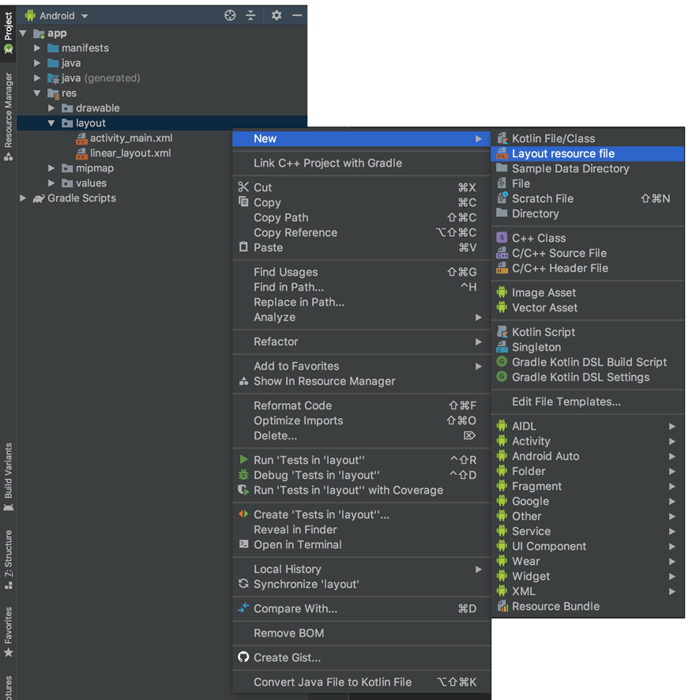

# Android

## 1. adb

### 1.1. 在 zsh 中添加环境变量

参考：[ADB 操作命令详解及用法大全](https://juejin.im/post/5b5683bcf265da0f9b4dea96)

```shell
echo 'export PATH="/Users/forwardNow/Library/Android/sdk/platform-tools/adb:$PATH"' >> ~/.zshrc

source ~/.zshrc
```

### 1.2. 基本命令

```shell
$ adb start-server
$ adb stop-server

# 安装/卸载 apk
$ adb install /.../hello/app/build/outputs/apk/debug/app-debug.apk
$ adb uninstall fn.cn.hello

# 开启手机的终端，可执行 shell 命令
$ adb shell

$ echo 'hello' > 1.txt

# 将文件推到终端
$ adb push 1.txt /mnt/sdcard

# 将文件从终端拉取出来，并重命名
$ adb pull /mnt/sdcard/1.txt 2.txt

$ rm 1.txt 2.txt
```

## 2. R 文件

位置：`app/build/generated/not_namespaced_r_class_sources/debug/r/fn/cn/phonedail/R.java`


## 3. 拨号

### 3.1. 权限设置

`AndroidManifest.xml`：

```xml
<?xml version="1.0" encoding="utf-8"?>
<manifest ...>

    <uses-permission android:name="android.permission.CALL_PHONE" />

    <application> ... </application>
</manifest>
```

### 3.2. 检查并请求权限

```java
public class MainActivity extends AppCompatActivity {

    private static final int MY_PERMISSIONS_REQUEST_CALL_PHONE = 1;

    @Override
    public void onRequestPermissionsResult( int requestCode, @NonNull String[] permissions, @NonNull int[] grantResults ) {
        switch ( requestCode ) {
            case MY_PERMISSIONS_REQUEST_CALL_PHONE: {

                // 已授权
                if ( grantResults[ 0 ] == PackageManager.PERMISSION_GRANTED ) {
                    Toast.makeText( this, "已授予拨号的权限", Toast.LENGTH_SHORT ).show();
                } else { // 未授权
                    Toast.makeText( this, "未授予拨号的权限", Toast.LENGTH_SHORT ).show();
                }

                return;
            }
        }


        super.onRequestPermissionsResult( requestCode, permissions, grantResults );
    }

    private void checkPermission() {
        if ( ActivityCompat.checkSelfPermission( this, Manifest.permission.CALL_PHONE ) != PackageManager.PERMISSION_GRANTED ) {
            ActivityCompat.requestPermissions( this, new String[] { Manifest.permission.CALL_PHONE }, MY_PERMISSIONS_REQUEST_CALL_PHONE );
        }
    }

}
```

### 3.3. 意图

```java
public class MainActivity extends AppCompatActivity {
    private void callPhone( String num ) {
        // 创建一个意图对象
        Intent dialIntent = new Intent();

        dialIntent.setAction( Intent.ACTION_CALL ); // 动作

        dialIntent.setData( Uri.parse( "tel:" + num ) ); // 数据

        // 开启意图
        startActivity( dialIntent );
    }
}
```

## 4. 按钮点击事件

### 4.1. 匿名内部类

```java
public class MainActivity extends AppCompatActivity {

    @Override
    protected void onCreate( Bundle savedInstanceState ) {

        Button buttonView = findViewById( R.id.button );

        buttonView.setOnClickListener( new View.OnClickListener() {
            @Override
            public void onClick( View v ) {
                // ...
            }
        } );
    }
}
```

### 4.2. 让当前类实现 `View.OnClickListener` 接口类型

>用于多个按钮的点击事件处理

```java
public class MainActivity extends AppCompatActivity implements View.OnClickListener  {
    @Override
    protected void onCreate( Bundle savedInstanceState ) {

        EditText phoneNumView = findViewById( R.id.editText );
        Button buttonView = findViewById( R.id.button );

        buttonView.setOnClickListener( this );
        phoneNumView.setOnClickListener( this );
    }

    @Override
    public void onClick( View v ) {
        switch ( v.getId() ) {
            case R.id.button: {
                Toast.makeText( this, "点击了按钮", Toast.LENGTH_SHORT ).show();
                break;
            }
            case R.id.editText: {
                Toast.makeText( this, "点击了可编辑的文本框", Toast.LENGTH_SHORT ).show();
                break;
            }
        }
    }
}
```

### 4.3. 使用控件的 `android:onClick` 属性

>用于 demo

```xml
<Button
    android:layout_width="wrap_content"
    android:layout_height="wrap_content"
    android:layout_marginTop="100dp"
    android:onClick="clickMe"
    android:text="拨号" />
```

```java
public class MainActivity extends AppCompatActivity {
  public void clickMe( View view ) {
        Toast.makeText( this, "点击了我", Toast.LENGTH_SHORT ).show();
    }
}
```

## 5. 常用布局

* 线性布局
* 相对布局
* 帧布局
* 表格布局
* 绝对布局

### 5.1. 线性布局

按照指定的（水平或垂直）顺序挨个排列。

类比 CSS 中 flex 布局中：

```scss
.container {
  display: flex;
  flex-direction: row; // 项目将水平显示，正如一个行一样。
  flex-direction: column; // 项目将垂直显示，正如一个列一样。
}
```


#### 5.1.1. 创建布局文件



#### 5.1.2. 示例

```xml
<?xml version="1.0" encoding="utf-8"?>
<LinearLayout
    xmlns:android="http://schemas.android.com/apk/res/android"
    android:layout_width="match_parent"
    android:layout_height="match_parent"
    android:orientation="vertical"
    >

    <TextView
        android:id="@+id/tv_label"
        android:layout_width="match_parent"
        android:layout_height="wrap_content"
        android:layout_margin="10dp"
        android:text="请输入电话号码" />

    <EditText
        android:layout_width="match_parent"
        android:layout_height="wrap_content"
        android:hint="电话号码"
        />

    <Button
        android:layout_width="wrap_content"
        android:layout_height="wrap_content"
        android:text="拨打"
        />

</LinearLayout>
```

### 5.2. 相对布局

默认都堆叠在左上角。类比 CSS 中的绝对布局，但相对的是相邻的元素。

示例：

```xml
<?xml version="1.0" encoding="utf-8"?>
<RelativeLayout
    xmlns:android="http://schemas.android.com/apk/res/android"
    android:layout_width="match_parent"
    android:layout_height="match_parent">

    <Button
        android:id="@+id/btn_1"
        android:layout_width="match_parent"
        android:layout_height="wrap_content"
        android:text="btn_1"
        />

    <Button
        android:id="@+id/btn_2"
        android:layout_width="100dp"
        android:layout_height="200dp"
        android:text="btn_2"
        android:layout_below="@id/btn_1"
        />

    <Button
        android:layout_width="200dp"
        android:layout_height="100dp"
        android:text="btn_3"
        android:layout_below="@id/btn_1"
        android:layout_toRightOf="@id/btn_2"
        />

</RelativeLayout>
```
