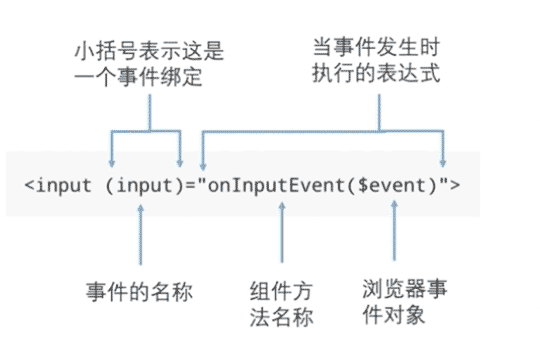

 # 数据绑定

默认单向绑定，双向绑定变为可选。

## 1. 事件绑定

语法：`(事件名)="模板语句"`

## 2. DOM属性绑定

插值表达式（`{{ }}`）会被转换成属性绑定，即

    # 两者等价：
    
    

HTML特性与DOM属性：

    <input value="a" (input)="doInput($event)">

    $event.target.value : DOM属性
    $event.target.getAttribute( "value" ) : HTML特性

    Angular 与 DOM属性 做绑定，不关心HTML特性。

## 3. HTML特性绑定

### 3.1. 基本

    [attr.特性名称]="表达式"

    <td [attr.colspan]="tableColspan">

### 3.2. CSS类绑定

    # 绑定类名列表。表达式的值为字符串（类名列表）
    

    # 绑定单个类名。表达式的值为布尔值
    

    # 绑定多个类。表达式的值为一个对象
    

### 3.3. 样式绑定

    # 绑定单个。表达式的值为字符串（样式属性的值）
    

    # 绑定多个。表达式的值一个对象
    

## 4. 双向绑定

主要用于表单控件。

    <input [(ngModel)]="name">

    <input [value]="name" (input)="onInput($event)">

    @Component({})
    export class xxComponent {
        name;
        onInput($event) {
            this.name = $event.target.value;
        }
    }