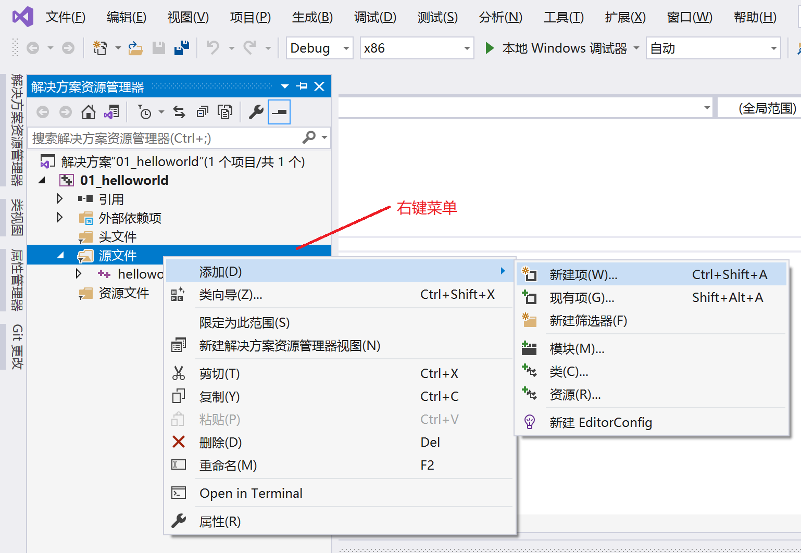

# C++ 基础入门

## 1. C++ 初识

### 1.1. 第一个 C++ 程序

编写一个 C++ 程序总共分为 4 个步骤
* 创建项目
* 创建文件
* 编写代码
* 运行程序

#### 1.1.1. 创建项目

使用 Visual Studio 编写 C++ 程序
* 文件（菜单） -> 创建 “空项目” （01_helloworld）

环境相关的问题：
* [关于Visual Studio 2019安装时VS installer无法下载文件，进度条为0，显示网络有问题的解决办法](https://blog.csdn.net/qq_43085848/article/details/109901050) 
* [windows开发笔记——VS 2019遇到windows SDK找不到](https://blog.csdn.net/chengxu_kuangrexintu/article/details/102980348)

#### 1.1.2. 创建文件



#### 1.1.3. 编写文件

```c++
#include <iostream>
using namespace std;

int main()
{
	cout << "hello world" << endl;
	system("pause");

	return 0;
}
```

界面设置：
* [VS2017如何更改字体大小](https://blog.csdn.net/fadbgfnbxb/article/details/89788194)

#### 1.1.4. 运行程序


### 1.2. 注释

单行注释： `// 注释的内容`

多行注释： `/* 注释的内容 */`

### 1.3. 变量

作用： 给一段指定的内存空间起名，方便操作这段内存。方便我们管理内存空间

语法： `数据类型 变量名 = 初始值;`

### 1.4. 常量

作用： 用于记录程序中不可更改的数据

定义常量的两种方式：
1. #define 宏常量： `#define 常量名 常量值`
	 * 通常在文件上方定义，表示一个常量
	 * 示例 `#define Day 7`
2. const 修饰的变量： `const 数据类型 常量名 = 常量值;`
	 * 通常在变量定义前加关键字 const，修饰该变量为常量，不可修改
	 * 示例 `const int day = 7;`