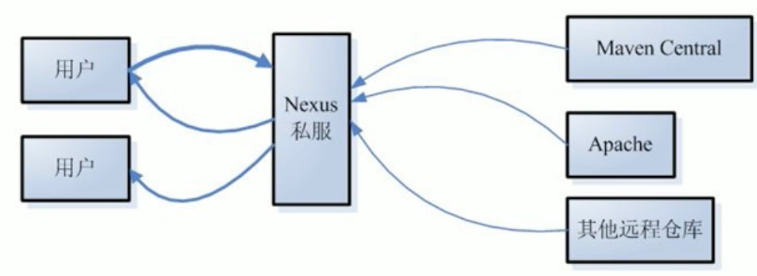

# Maven

[构建工具 Maven 视频教程全集（35P）| 5 小时从入门到精通](https://www.bilibili.com/video/av59640042/)

## 1. 目前掌握的技术


## 2. 目前的技术在开发中存在的问题（why）

* 一个项目就是一个工程
  * 如果项目非常庞大，就不适合继续使用 package 来划分模块
  * 最好是每一个模块对应一个工程，利于分工协作
  * 借助 Maven 就可以将一个项目拆分成多个工程
* 项目中需要的 jar 包必须手动“复制”、“粘贴”到 `WEB-INF/lib` 目录下
  * 带来的问题是：同样的 jar 包文件重复出现在不同的项目工程中，既浪费存储空间，又让工程比较臃肿
  * 借助 Maven，可以将 jar 包仅仅保存在“仓库”中，有需要使用 jar 的工程“引用”这个文件即可，并不需要真的把 jar 包复制过来。
* jar 包需要别人替我们准备好，或到官网下载
  * 不同技术的官网提供 jar 包下载的形式是五花八门的
  * 有些技术的官网就是通过 Maven 或 SVN 等专门的工具来提供下载的
  * 如果是来路不正的 jar 包，可能会引起莫名其妙的问题
  * 借助 Maven 可以以一种规范的方式下载 jar 包，因为所有知名框架或第三方工具的 jar 包按照统一的规范存放于 Maven 的中央仓库中
  * 以规范的方式下载的 jar 包，内容也是可靠的
* 一个 jar 包依赖的其他 jar 包需要自己手动加入到项目中
  * 如果所有 jar 包之间的依赖关系都需要程序员去管理，会增加额外的成本
  * Maven 会自动将依赖的 jar 包导入进来

## 3. Maven 是什么（what）

* Maven 是一款服务于 Java 平台的自动化构建工具
  * 构建工具历史：Make -> Ant -> Maven -> Gradle
* 构建
  * 概念：以“Java 源文件”、“配置文件”、“静态资源” 等作为“原材料”，去“生产”一个可以运行的项目的过程
    * 编译
    * 部署
    * 搭建
  * 编译
    * Java 源文件 ---编译---> class 字节码文件
    * 活蹦乱跳的鸡 ---处理---> 黄焖鸡
  * 部署：将“编译的结果”放到服务器指定的目录下之后启动服务器的过程
    * 运行时：项目中 jre、tomcat 都只是引用，而没有真正拷贝到项目中去
* 构建过程中的各个环节
  * 清理：将以前编译得到的旧的 class 字节码文件删除，为下一次编译做准备
  * 编译：将 Java 源程序编译成 class 字节码文件
  * 测试：自动测试，自动调用 Junit 程序
  * 报告：测试程序执行的结果
  * 打包：动态 Web 工程打 war 包，Java 工程打 jar 包
  * 安装：Maven 特定的概念 —— 将打包得到的文件复制到“仓库”中的指定位置
  * 部署：将动态 Web 工程生成的 war 包复制到 Web 容器的指定目录下，使其可以运行
* 自动化构建
  * 操作路径：操作步骤

## 4. 安装 Maven 核心程序

* 配置 JAVA_HOEM 环境变量
  * windows：需要配置
  * OSX：无需配置
* [下载](http://maven.apache.org/download.cgi)
* 解压到非中文无空格的路径
  * `/Users/forwardNow/develop/mvn/apache-maven-3.6.2`
* 配置 Maven 环境变量
  * M2_HOME 或 MAVEN_HOEM
  * 添加到 PATH

    ```shell
    sudo open ~/.zshrc

    # Maven
    export M2_HOME="/Users/forwardNow/develop/mvn/apache-maven-3.6.2"
    export PATH=$M2_HOME/bin:$PATH

    source ~/.zshrc
    ```

* 验证 Maven 是否安装成功

  ```shell
  mvn -v
  
  Apache Maven 3.6.2 (40f52333136460af0dc0d7232c0dc0bcf0d9e117; 2019-08-27T23:06:16+08:00)
  Maven home: /Users/forwardNow/develop/mvn/apache-maven-3.6.2
  Java version: 1.8.0_172, vendor: Oracle Corporation, runtime: /Library/Java/JavaVirtualMachines/jdk1.8.0_172.jdk/Contents/Home/jre
  
  Default locale: en_CN, platform encoding: UTF-8
  OS name: "mac os x", version: "10.13.6", arch: "x86_64", family: "mac"
  ```

## 5. Maven 的核心概念

* 约定的目录结构（*）
* POM（*）
* 坐标（*）
* 依赖（***）
* 仓库
* 生命周期/插件/目标
* 继承
* 聚合

## 6. 第一个 Maven 工程

* 创建约定的目录
  
  ```text
  ${root}/          # 工程名称
    src/              # 源码
      main/             # 存放主程序
        java/             # 存放 Java 源码
        resources/        # 存放框架或其他工具的配置文件
      test/           # 存放测试程序
        java/
        resources/
    pom.xml           # Maven 工程的核心配置文件
  ```

* 为什么要遵守约定的目录结果
  * 约定 > 配置 > 编码
    * 编码：编码解决问题，基本功
    * 配置：对框架有比较深的了解
    * 约定：对架构有比较深的了解
  * 以配置的方式明确告知框架，容易出错且可读写差。
  * 如果我们自己定义的东西想让框架或工具知道，有两种方法：
    * 以配置的方式明确告诉框架
    * 遵循框架内部已经存在的约定

## 7. 常用 Maven 命令

* 注意：与构建过程相关的 Maven 命令，必须进入 pom.xml 所在目录
* 常用命令
  * `mvn clean` ：清理
  * `mvn compile` ： 编译
  * `mvn test-compile` ： 编译测试
  * `mvn test` ： 执行测试
  * `mvn package` ： 打包
  * `mvn install` ： 安装到本地仓库，可被其他的项目作为依赖使用
  * `mvn site` ： 生成项目站点

## 8. 关于联网问题

* Maven 的核心程序中仅仅定义了抽象的生命周期，具体的工作必须由特定的插件来完成。而插件本身并不包含在 Maven 的核心程序中。
* 当我们执行 `mvn compile` 命令时需要用到一些插件，Maven 核心程序会首先到本地仓库中查找
  * 默认本地仓库：`${user.home}/.m2/repository`
  * 可在 `${M2_HOME}/conf/settings.xml` 的 `<localRepository>/path/to/local/repo</localRepository>` 中修改本地仓库路径

## 9. POM

* 含义：Project Object Model，项目对象模型
* `pom.xml` 对于 Maven 工程是核心配置文件，与构建过程相关的一切设置都在这个文件中进行配置

## 10. 坐标

* 在数学中的坐标
  * 平面中，通过 `(x,y)` 可以唯一定位任意一个点
* 在 Maven 中的坐标（`(g,a,v)`）
  * 通过 `<groupId>` 、`<artifactId>`、`<version>` 唯一定位一个 Maven 工程
  * `<groupId>` ：公司的域名的倒序 + 项目名
  * `<artifactId>` ：模块名
  * `<version>` ： 版本
* 坐标与仓库中路径的对应关系
  * 坐标
  
    ```xml
    <?xml version="1.0" encoding="UTF-8"?>
    <project ...>
        <!-- 使用下面三个标签可以唯一定位一个 Maven 工程 -->
        <groupId>com.it.fn</groupId>
        <artifactId>hello</artifactId>
        <version>1.0-SNAPSHOT</version>
    </project>
    ```

    * SNAPSHOT: 快照版，不稳定版
    * RELEASE: 发布版，稳定版
  * 仓库中路径

    ```text
    ${user.home}/.m2/repository/ com/it/fn/hello/1.0-SNAPSHOT
    ```

## 11. 仓库

* 仓库的分类
  * 本地仓库：`${user.home}/.m2/repository`
  * 远程仓库
    * 局域网（私服，Nexus）：搭建在局域网环境中的，为当前局域网范围内地所有 Maven 工程服务，替你去请求依赖
      * 
    * 中央仓库：假设在 Internet 上，为全世界所有的 Maven 工程服务
    * 中央仓库镜像：为了分担中央仓库的流量（负载），替身用户访问速度
* 仓库中保存的内容：Maven 工程
  * Maven 自身所需要的插件
  * 第三方框架或工具的 jar 包（也是通过 Maven 来打包的）
    * 第一方：JDK
    * 第二方：自己
    * 第三方：JDK 和 自己都难以解决的问题，就找第三方
  * 我们自己开发的 Maven 工程

## 12. 依赖

* Maven 解析依赖信息时，会到本地仓库中查找被依赖的 jar 包。
  * 对于我们自己开发的 Maven 工程，使用 install 命令后可安装到仓库。
* 依赖的范围
  * `<scope>compile</scope>` 对 main、test 都有效，参与打包
  * `<scope>test</scope>` 对 main 无效，对 test 有效，不参与打包，如 junit.jar
  * `<scope>provided</scope>` 对 main、test 都有效，不参与打包，如 servlet-api.jar
* 如果指定了错误的范围，可能会出现莫名其妙的问题，比如 provided 范围的指定成了 compile 范围

## 13. 生命周期

* 各个构建环节执行的顺序：不能打乱顺序，必须按照既定的正确顺序来执行。
* Maven 的核心程序中定义了抽象的生命周期，生命周期中各个阶段的具体任务是由插件来完成的
* Maven 有三套相互独立的生命周期，都有特定的阶段
  * clean：清理
    * pre-clean 阶段：清理之前完成的工作
    * clean 阶段：清理上次构建生成的文件
    * post-clean 阶段：清理之后完成的工作
  * default：核心部分，编译、测试、打包、安装、部署等
    * 太多了，不列举
  * site：生成项目报告、站点，发布站点
    * pre-site
    * site：生成项目的站点文档
    * post-site
    * site-deploy：部署到指定服务器
* Maven 核心程序为了更好地实现自动化构建，不论指定执行生命周期中的哪个阶段，都是从该生命周期的第一个阶段开始执行。
  * 也就是说，如果单独执行 default 生命周期中的 package 阶段，在 package 阶段之前的 compile 阶段会自动执行
* 插件和插件的目标
  * 生命周期的各个阶段仅仅定义了要执行的任务是什么
  * 各个阶段和插件的目标是对应的
  * 目标由特定的插件来完成

## 14. 在 IDE 中使用 Maven

* Maven 插件：一般都内置了
* Maven 插件的设置（idea）
  * Maven home directory：不建议 IDE 自带的 Maven，需单独指定 Maven 核心程序
  * User setting file：指定 `${M2_HOME}/conf/settings.xml` 的位置，进而获取本地仓库的位置
* 基本操作
  * 创建 Maven 版的 Java 工程
  * 创建 Maven 版的 Web 工程
  * 执行 Maven 命令
* 通过 Maven 配置文件（`${M2_HOME}/conf/settings.xml`） 设置 JDK 版本
  * 避免在 IDE 中对每个项目设置 jdk 版本

    ```xml
    <profiles>
        <profile>
        <id>jdk-1.8</id>

        <activation>
          <activeByDefault>true</activeByDefault>
          <jdk>1.8</jdk>
        </activation>

        <properties>
          <maven.compiler.source>1.8</maven.compiler.source>
          <maven.compiler.target>1.8</maven.compiler.target>
          <maven.compiler.compilerVersion>1.8</maven.compiler.compilerVersion>
        </properties>
      </profile>

    </profiles>
    ```

## 15. 在 idea 中创建基于 Maven 的 JavaWeb 项目

参考：

* [使用idea创建一个Maven java Web项目](https://blog.csdn.net/qq_37856300/article/details/85776785)

步骤：

1. File -> New -> Project...
2. New Project 弹框
   1. 左侧菜单栏：选择 “Maven”
   2. 勾选 “Create from archetype” （从原型中创建）
   3. 选择 “org.apache.maven.archetypes:maven-archetype-webapp”
3. 填写项目坐标
4. 配置 Maven，点击完成

待项目创建完成：

* 创建 `src/main/java` 目录，并在右键菜单中将其标志为源码根目录
* 创建 `src/main/resources` 目录，并在右键菜单中将其标志为资源根目录

## 16. 依赖（高级）

* 依赖的传递性
  * 直接的依赖，直接的依赖的依赖，直接的依赖的依赖的依赖，...
  * 好处：可以传递的依赖不必在每个模块工程中都重复声明，在“最下面”的工程中依赖一次即可
  * 注意：只有 compile 范围的依赖才可传递
* 依赖的排除
  * 依赖排除的设置

  ```xml
  <dependency>
    <groupId>com.fn.mvn</groupId>
    <artifactId>WebApp</artifactId>
    <version>1.0-SNAPSHOT</version>
    <scope>compile</scope>
    <exclusions>
      <exclusion>
        <groupId>javax.servlet.jsp</groupId>
        <artifactId>jsp-api</artifactId>
      </exclusion>
    </exclusions>
  </dependency>
  ```
