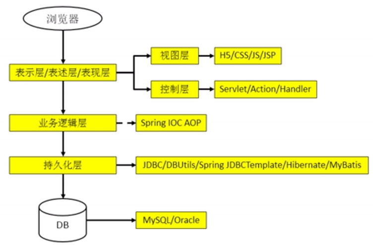

# Maven

[构建工具 Maven 视频教程全集（35P）| 5 小时从入门到精通](https://www.bilibili.com/video/av59640042/)

## 目前掌握的技术

## 目前的技术在开发中存在的问题（why）

* 一个项目就是一个工程
  * 如果项目非常庞大，就不适合继续使用 package 来划分模块
  * 最好是每一个模块对应一个工程，利于分工协作
  * 借助 Maven 就可以将一个项目拆分成多个工程
* 项目中需要的 jar 包必须手动“复制”、“粘贴”到 `WEB-INF/lib` 目录下
  * 带来的问题是：同样的 jar 包文件重复出现在不同的项目工程中，既浪费存储空间，又让工程比较臃肿
  * 借助 Maven，可以将 jar 包仅仅保存在“仓库”中，有需要使用 jar 的工程“引用”这个文件即可，并不需要真的把 jar 包复制过来。
* jar 包需要别人替我们准备好，或到官网下载
  * 不同技术的官网提供 jar 包下载的形式是五花八门的
  * 有些技术的官网就是通过 Maven 或 SVN 等专门的工具来提供下载的
  * 如果是来路不正的 jar 包，可能会引起莫名其妙的问题
  * 借助 Maven 可以以一种规范的方式下载 jar 包，因为所有知名框架或第三方工具的 jar 包按照统一的规范存放于 Maven 的中央仓库中
  * 以规范的方式下载的 jar 包，内容也是可靠的
* 一个 jar 包依赖的其他 jar 包需要自己手动加入到项目中
  * 如果所有 jar 包之间的依赖关系都需要程序员去管理，会增加额外的成本
  * Maven 会自动将依赖的 jar 包导入进来

## Maven 是什么（what）

* Maven 是一款服务于 Java 平台的自动化构建工具
  * 构建工具历史：Make -> Ant -> Maven -> Gradle
* 构建
  * 概念：以“Java 源文件”、“配置文件”、“静态资源” 等作为“原材料”，去“生产”一个可以运行的项目的过程
    * 编译
    * 部署
    * 搭建
  * 编译
    * Java 源文件 ---编译---> class 字节码文件
    * 活蹦乱跳的鸡 ---处理---> 黄焖鸡
  * 部署：运行“编译的结果”
    * 运行时：项目中 jre、tomcat 都只是引用，而没有真正拷贝到项目中去
 