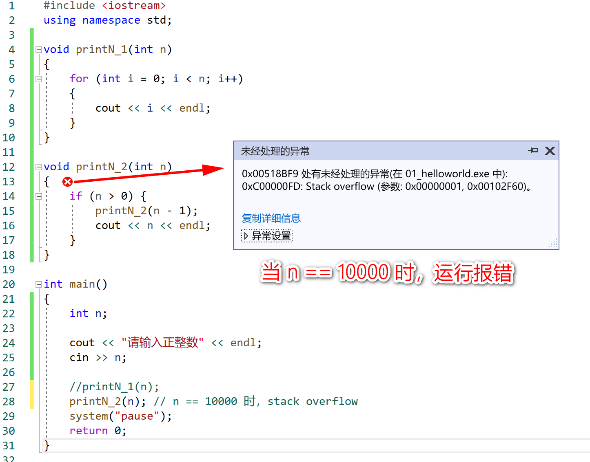

# 数据结构

>数据结构（浙江大学）- 中国大学MOOC（ https://www.icourse163.org/ ）

## 1. 基本概念

### 1.1. 什么是数据结构

#### 1.1.1. 关于数据组织 - 例：图书摆放

数据结构的定义：

>中文维基百科：“数据结构（data structure）”是计算机中存储、组织数据的方式。通常情况下，精心选择的数据结构可以带来最优效率的算法。

* 没有统一定义
* 如果要定义它，“数据结构” 和 “算法” 两个词通常会同时出现

提问：

```text
我给了你一些书架，然后又有一堆书进来，你要怎么把它们放到书架上去呢？

换言之，我给了你一堆数据，然后给了你一些存储空间，你要怎么把这些数据存起来呢？
```

回答：

```text
这个问题不科学。

因为没有告知你书架是怎样的（是小书架、中书架、大书架、超大书架）

数据怎么组织，跟这个数据的规模有关系

不一样规模的问题，它处理的难度不一样

难在放书和取书
```

图书的摆放要使得 2 个相关操作方便实现：

* 操作1： 新书怎么插入？
* 操作2： 怎么找到某本指定的书？

根据这2两个相关操作，能想出如下方法组织图书。

方法1，随便放：

```text
操作1： 新书怎么插入？

  哪里有空放哪里，一步到位

操作2： 怎么找到某本指定的书？

  累死
```

方法2，按照书名的拼音字母顺序排序：

```text
操作1： 新书怎么插入？

  移出空位。新增一本要排在第一位的书，则要挪动后面所有的书

操作2： 怎么找到某本指定的书？

  二分查找
```

方法3，把书架划分为几块区域，每块区域指定摆放某种类别的图书；在每种类别内，按照书名的拼音字母顺序排放。

```text
操作1： 新书怎么插入？

  先定类别，二分查找确定位置，移出空位

操作2： 怎么找到某本指定的书？

  先定类别，再二分查找

好处：

  在每个类别里做操作，操作的图书的规模都小了很多

问题：

  空间如何分配？ 
    即每个类别分配多少书架，书架给少了要不断加书架，给多了浪费空间。

  类别应该分多细？ 
    类别太粗，每个类别里书太多了就不好管理；类别太细，如何判断书籍是哪个类别？
```

这个故事想说明一个问题： 解决问题的方法的效率，跟数据的组织方式有关。

#### 1.1.2. 关于空间使用 - 例：PrintN函数实现

需求：

```text
写程序实现一个函数 printN，使得传入一个正整数为 N 的参数后，能顺序打印从 1 到 N 的全部整数
```

实现方式1：

```cpp
// 循环
void printN_1(int n)
{
	for (int i = 0; i < n; i++)
	{
		cout << i << endl;
	}
}
```

实现方式2：

```cpp
// 递归
void printN_2(int n)
{
	if (n > 0) {
		printN_2(n - 1);
		cout << n << endl;
	}
}
```

运行：

```cpp
int main()
{
	int n;

	cout << "请输入正整数" << endl;
	cin >> n;

	//printN_1(n);
	printN_2(n); // n == 10000 时，stack overflow
	system("pause");
	return 0;
}
```



这个例子想说明一个问题： 解决问题的方法的效率，跟空间的利用效率有关。

#### 1.1.3. 关于算法效率 - 例：求和

求： 1, 2, 3, ... , (n - 1), n 的和

方式1：sum = 1 + 2 + 3 + ... + (n - 1) + n

方式2：sum = ( 1 + n ) * n / 2

解决问题的方法的效率，跟算法的巧妙程度有关。

#### 1.1.4. 抽象数据类型

**数据对象**在计算机中的组织方式：

* 逻辑结构： 线性结构（一个接一个）， 树（一对多）， 图（多对多）
* 物理存储结构： 在机器的内存中存放方式，数组？链表？

数据对象必定与一系列加在其上的**操作**相关联

完成这些操作所用的方法就是**算法**


**抽象数据类型（Abstract Data Type）**

数据类型：

* 数据对象集
* 数据集合相关联的操作集

在 C 中，数据集和操作集是分开的；
在 C++/Java 中，把数据集和相关的操作集封装在一个类里面。


抽象： 描述数据类型的方法不依赖于具体实现。

* 与存放数据的机器无关
* 与数据存储的物理结构无关
* 与实现操作的算法和编程语言均无关

只描述数据对象集合相关操作集 **“是什么”**，并不涉及 **“如何做到”** 的问题。

示例：

```text
类型名称： 矩阵（Matrix）

数据对象集： M × N 的矩阵，有三元组<a, i, j>构成， a 是第 i 行 j 列的元素的值。

操作集： 对于任意矩阵（Matrix） A、B、C，及整数 i、j、M、N

	Matrix Create( int M, int N ): 返回一个 M × N 的空矩阵
	
	int GetMaxRow( Matrix A ): 返回矩阵 A 的总行数

	int GetMaxCol( Matrix A ): 返回矩阵 A 的总列数

	ElementType GetEntry( Matrix A, int i, int j ): 返回矩阵 A 的第 i 行 j 列的元素

	Matrix Add( Matrix A, Matrix B ): 返回矩阵A和矩阵B的和

	Matrix Multiply( Matrix A, Matrix B ): 返回矩阵A和矩阵B的积
```