 # 形状

## 1. 自适应的椭圆

### 1.1. 难题

给任何正方形元素设置一个足够大的 `border-radius`，就可以把它变成一个圆形。


    .box1 {
        width: 200px;
        height: 200px;
        border-radius: 100px; /* >= 正方形边长的一半 */
    }

如果指定任何大于 100px 的半径，仍然可以得到一个圆形。规范特别指出了这其中的原因：

>“当任意两个相邻圆角的半径之和超过 border box 的尺寸时，用户代理必须按比例减小各个边框半径所使用的值，直到它们不会相互重叠为止。” <br>
>——CSS 背景与边框(第三版)(http://w3.org/TR/css3-background/#corner-overlap)

不过，我们往往不愿意对一个元素指定固定的宽度和高度，因为我们希望它能 **根据其内容自动调整并适应**

我们通常期望达到这个效果:**如果它的宽高相等，就显示为一个圆;如果宽高不等，就显示为一个椭圆**。

### 1.2. 小花絮

**为什么叫border-radius?**

可能有人会奇怪，border-radius 到底由何得名。这个属性并不需要边框来参与工作，似乎把它叫作 corner-radius 更贴切一些。这个名字乍听起来确实让人摸不着头脑，其实原因在于 border-radius 是对元素的 border box 进行切圆角处理的。当元素没有边框时，可能还看不出差异;当它有边框时，则以边框外侧的拐角作为切圆角的基准。边框内侧的圆角会稍小一些(严格来说内角半径将是 max(0, border-radius-border-width))。


### 1.3. 解决方案

`border-radius` 可以单独指定水平和垂直半径，只要用一个斜杠(`/`)分隔这两个值即可。

这个特性允许我们在拐角处创建椭圆圆角：

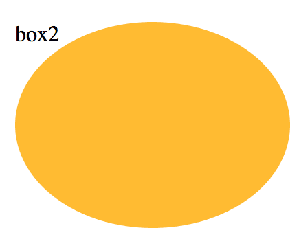

    .box2 {
        width: 200px;
        height: 150px;
        border-radius: 100px / 75px;
    }

这段代码存在一个很大的缺陷:只要元素的尺寸发生变化，`border-radius` 的值就得跟着改。

`border-radius` 这个属性还有另外一个鲜为人知的真相，它不仅可以接受长度值，还可以接受百分比值。

这个百分比值会基于元素的尺寸进行解析，即宽度用于水平半径的解析，而高度用于垂直半径的解析。这意味着相同的百分比可能会计算出不同的水平和垂直半径。因此，如果要创建一个自适应的椭圆，我们可以把这两个半径值都设置为 50%:

    border-radius: 50% / 50%;

由于斜杠前后的两个值现在是一致的(即使它们最终可能会被计算为不同的值)，我们可以把这行代码进一步简化为:

    border-radius: 50%;

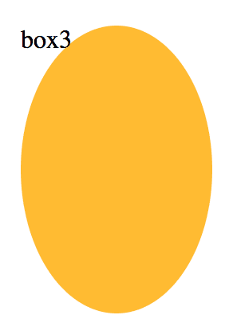

最终，只需要这一行代码，我们就可以得到一个自适应的椭圆了。

### 1.4. 半椭圆

半椭圆是沿纵轴对称，而不是沿横轴对称的，我们需要给每个角指定不同的半径。

border-radius 是一个简写属性，我们可以为元素的每个角指定不同的值

    border-top-left-radius
    border-top-right-radius
    border-bottom-right-radius
    border-bottom-left-radius

也可以仍旧使用 border-radius 这个简写属性：

    border-radius: 水平方向的半径 / 垂直方向的编辑;


在掌握了这个新发现的知识之后，现在让我们来重新审视半椭圆的问题。以这样的方式来指定 border-radius 真的可以生成我们想要的形状吗?试了才知道。让我们先来观察一些细节。

* 这个形状是垂直对称的，这意味着左上角和右上角的水平半径值应该是相同的;与此类似，左下角和右下角的水平半径值也应该是相同的。
* 顶部边缘并没有平直的部分(也就是说，整个顶边都是曲线)，这意味着左上角和右上角的水平半径之和应该等于整个形状的宽度。
* 基于前两条观察，我们可以推断出，左半径和右半径在水平方向上的值应该均为 50%。
* 再看看垂直方向，似乎顶部的两个圆角占据了整个元素的高度，而且底部完全没有任何圆角。因此，在垂直方向上 border-radius 的合理值似乎就是 100% 100% 0 0。
* 因为底部两个角的垂直圆角是零，那么它们的水平圆角是多少就完全不重要了，因为此时水平圆角总是会被计算为零。(你能想像一个 垂直半径为零而水平半径为正值的圆角吗?没错，连写规范的作者们都做不到。)

把所有这些结论综合起来，我们就可以很容易地写出 CSS 代码，来生成那样自适应的半椭圆:


    .box4 {
        width: 160px;
        height: 100px;
        border-radius: 50% / 100% 100% 0 0;
    }
    .box5 {
        width: 160px;
        height: 100px;
        border-radius: 50% / 0 0 100% 100%;
    }

### 1.5. 四分之一椭圆

要创建一个四分之一椭圆，其中一个角的水平和垂直半径值都需要是 100%，而其他三个角都不能设为圆角。


由于这四个角的半径在水平和垂直方向上都是相同的，我们甚至都不需要使用斜杠语法了。最终代码应该是这样的:

    .box6 {
        width: 160px;
        height: 100px;
        border-radius: 100% 0 0 0;
    }
    .box7 {
        width: 160px;
        height: 100px;
        border-radius: 0 100% 0 0;
    }

你不免还会顺着往下想，是不是还能用 border-radius 来生成椭圆的 其他切块(比如八分之一椭圆、三分之一椭圆)?很遗憾，你可能会失望了，因为 border-radius 属性是无法生成这些形状的。

### 1.6. 糖果按钮

http://simurai.com/archive/buttons/

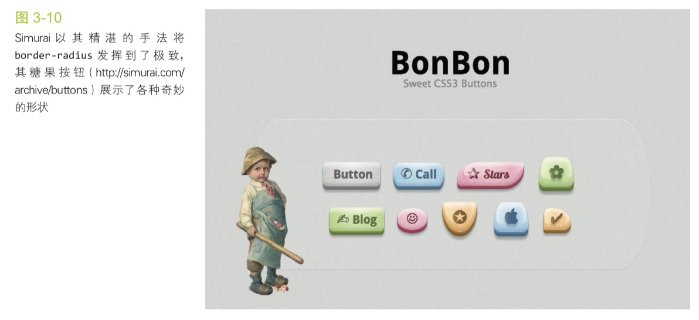

### 1.7. 相关规范

* [CSS 背景与边框](http://w3.org/TR/css-backgrounds)


## 2. 平行四边形

### 2.1. 难题

平行四边形其实是矩形的超集:它的各条边是两两平行的，但各个角则不一定都是直角。在视觉设计中，平行四边形往往可以传达出一种动感。

用 CSS 创建一个按钮状的平行四边形链接，可以通过 skew() 的变形属性来对这个矩形进行斜向拉伸：


```CSS
.box1 {
  background: #58a;
  transform: skewX(-45deg);
}
```

但是，这导致它的内容也发生了斜向变形，有没有办法只让容器的形状倾斜，而保持其内容不变呢?

### 2.2. 嵌套元素方案

对内容再应用一次反向的 skew() 变形，从而抵消容器的变形效果。
不幸的是，这意味着我们将不得不使用一层额外的 HTML 元素来包裹内容：


```html
<div class="box2">
    <span>box2</span>
</div>
```

```css
.box2 {
  background: #58a;
  transform: skewX(-45deg);
}

.box2 span {
  display: inline-block;
  transform: skewX(45deg);
}
```

如果你想把这个效果应用到一个默认显示为行内的元素，不要忘记把它的 display 属性设置为其他 值， 比如 inline-block 或 block，否则变形是不会生效的。这一点对它内层的元素也是适用的。

如果结构层的变更是不允许的，或者你希望严格保持结构层的纯净度，别担心，我们还有一个纯 CSS 的解决方案。

### 2.3. 伪元素方案

另一种思路是把所有样式(背景、边框等)应用到伪元素上，然后再对伪元素进行变形。因为我们的内容并不是包含在伪元素里的，所以内容并不会受到变形的影响。

我们希望伪元素保持良好的灵活性，可以自动继承其宿主元素的尺寸，甚至当宿主元素的尺寸是由其内容来决定时仍然如此。

一个简单的办法是 给宿主元素应用 `position: relative` 样式，并为伪元素设置 `position: absolute`，然后再把所有偏移量设置为零，以便让它在水平和垂直方向上都被拉伸至宿主元素的尺寸，并且给伪元素设置 `z-index: -1` 样式，这样它的堆叠层次就会被推到宿主元素之后。


```html
<div class="box3">box3</div>
```

```css
.box3 {
  position: relative;
}

.box3::before {
  position: absolute;
  top: 0;
  right: 0;
  bottom: 0;
  left: 0;
  z-index: -1;
  content: "";
  background: #58a;
  transform: skewX(-45deg);
}
```

这个技巧不仅对 `skew()` 变形来说很有用，还适用于其他任何变形样式，当我们想变形一个元素而不想变形它的内容时就可以用到它。

这个技巧的关键在于，我们利用伪元素以及定位属性产生了一个方块，然后对伪元素设置样式，并将其放置在其宿主元素的下层。这种思路同样可以运用在其他场景中，从而得到各种各样的效果。

### 2.4. 相关规范

* [CSS 变形](http://w3.org/TR/css-transforms)

## 3. 菱形图片

### 3.1. 难题

在视觉设计中，把图片裁切为菱形是一种常见的设计手法，但在 CSS 中还没有一种简单直观的方法来实现它。事实上，直到最近，这种效果才基本成为可能。当网页设计师想要实现这种设计风格时，他们通常不希望在图像处理软件中预先把图片裁好。显然不用说你也知道，这个方法的可维护性并不好。如果未来有人想修改图片风格，将很难增加其他效果，而且最终往往会搞得一团糟。

### 3.2. 基于变形的方案

需要把图片用一个 `<div>` 包裹起来，然后对其应用相反的 `rotate()` 变形样式:

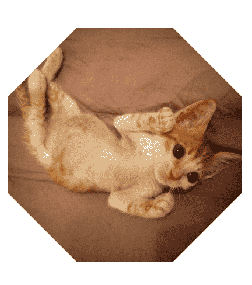

```html
<style>
    .picture1 {
      width: 200px;
      height: 200px;
      overflow: hidden;
      transform: rotate(45deg);
    }

    .picture1 > img {
      max-width: 100%;
      transform: rotate(-45deg);
    }
</style>

<div class="picture1">
    
</div>
```

它并没有一步到位地直接达到我们期望的效果，除非我们期望的效果是把它裁成一个八角形。

主要问题在于`max-width: 100%`这条声明。100%会被解析为容器 (.picture)的边长。
但是，我们想让图片的宽度与容器的对角线相等，而不是与边长相等。

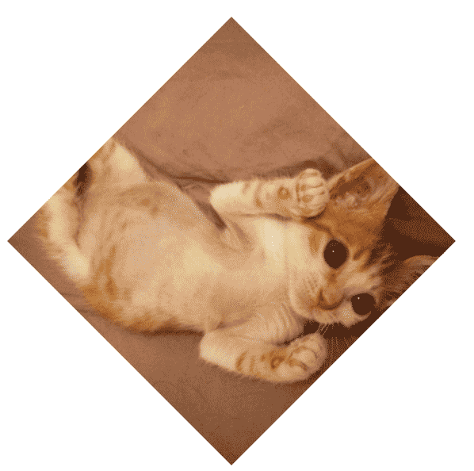

```html
<style>
    .picture2 {
      width: 200px;
      height: 200px;
      overflow: hidden;
      transform: rotate(45deg);
    }

    .picture2 > img {
      max-width: 100%;
      transform: rotate(-45deg) scale(1.42);
    }
</style>

<div class="picture2">
    
</div>
```

### 3.3. 裁切路径方案

上面的方法确实可以奏效，但它基本上是一个 hack。这个方法需要一层额外的 HTML 标签，这不够简洁；代码本身也不够直观；它甚至还不够健壮——如果我们碰巧要处理一张非正方形的图片，这个小把戏就会原形毕露。

事实上，我们还有一个更好的办法来完成这个任务。它的主要思路是使用 clip-path 属性。这个特性也是从 SVG 那里借鉴而来，已经可以应用在 HTML 元素上了(至少对于支持的浏览器来说是这样的)。

你可能比较熟悉图像处理软件(比如 Adobe Photoshop)中的裁切路径 功能。裁切路径允许我们把元素裁剪为我们想要的任何形状。在这个例子中，我们将会使用 polygon()(多边形)函数来指定一个菱形。实际上，它允许我们用一系列(以逗号分隔的)坐标点来指定任意的多边形。我们甚至可以使用百分比值，它们会解析为元素自身的尺寸。

clip-path 所能创造的奇迹还不止于此。这个属性甚至可以参与动画，只要我们的动画是在同一种形状函数(比如这里是 polygon())之间进行的，而且点的数量是相同的。因此，如果我们希望图片在鼠标悬停时平滑地扩展为完整的面积

```html
<style>
    img {
      width: 200px;
      clip-path: polygon(50% 0, 100% 50%, 50% 100%, 0 50%);
    }

    img:hover {
      clip-path: polygon(0 0, 100% 0, 100% 100%, 0 100%);
    }
</style>


```

### 3.4. 相关

规范：
* [CSS 变形](http://w3.org/TR/css-transforms)
* [CSS 遮罩](http://w3.org/TR/css-masking)
* [CSS 过渡](http://w3.org/TR/css-transitions)

## 4. 切角效果

### 4.1. 难题

把角切掉一种非常流行的设计风格，不论是在印刷媒介还是在网页设计中都是如此。它最常见的形态是把元素的一个或多个角切成 45°的缺口(也称作斜面切角)。

尤其是在最近，当扁平化设计的风头完全盖过拟物化之后，这种效果就愈发流行了。当切角效果只应用在元素的某一侧，且切角的尺寸刚好达到元素高度的 50% 时，就会得到一个箭头形状，这在按钮和面包屑导航中的应用非常普遍。


但是，目前的 CSS 仍然无法做到只用一行简单直观的代码就生成这样的效果。这导致绝大多数网页开发者倾向于使用背景图片来达到目的，比如使用三角形盖住元素的顶角来模拟切角效果(当网页背景是纯色时)，或者使用一张或多张已经切过角的图片来作为整个元素的背景。

### 4.2. 解决方案

第一种方案来自于无所不能的 CSS 渐变。假设我们只需要一个角被切掉的效果，以右下角为例。这其中最大的窍门在于充分利用渐变的一大特性:渐变可以接受一个角度(比如 45deg)作为方向，而且色标的位置信息也可以是绝对的长度值，这一点丝毫不受容器尺寸的影响。

综合以上这些想法，我们只需要一个线性渐变就可以达到目标。这个渐变需要把一个透明色标放在切角处，然后在相同位置设置另一个色标，并且把它的颜色设置为我们想要的背景色。CSS 代码如下所示(假设切角的深度是15px):

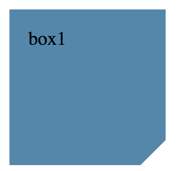

```html
<style>
    .box1 {
      background: #58a;
      background:
        linear-gradient(
          -45deg,
          transparent 15px,
          #58a 0
        );
    }
</style>
<div class="box1">box1</div>
```

事实上，第一行声明并不是必需的，加上它是将其作为回退机制:如果某些浏览器不支持 CSS 渐变，那第二行声明会被丢弃，而此时我们至少还能得到一个简单的实色背景。

现在，假设我们想要两个角被切掉的效果，以底部的两个角为例。

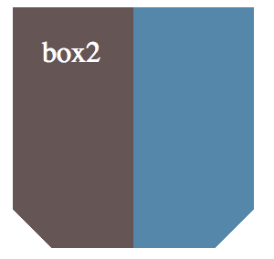

```html
<style>
    .box2 {
      background: #58a;
      background:
        linear-gradient(-45deg, transparent 15px, #58a 0) right,
        linear-gradient(45deg, transparent 15px, #655 0) left;

      /* 避免背景图片平铺 */
      background-repeat: no-repeat;

      /* 背景图片的尺寸都是 50%的宽和100%的高 */
      background-size: 50% 100%;
    }
</style>
<div class="box2">box2</div>
```

把四个角都做出切角效果：

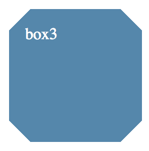

```html
<style>
  .box3 {
    background: #58a;
    background:
      linear-gradient(135deg, transparent 15px, #58a 0) top left,
      linear-gradient(-135deg, transparent 15px, #58a 0) top right,
      linear-gradient(-45deg, transparent 15px, #58a 0) bottom right,
      linear-gradient(45deg, transparent 15px, #58a 0) bottom left;
    background-repeat: no-repeat;
    background-size: 50% 50%;
  }
</style>
<div class="box3">box3</div>
```

我们在改变背景色时需要修改五处;而在改变切角尺寸时需要修改四处。使用预处理器的 mixin 可以帮助我们减少代码的重复度。

```scss
@mixin beveled-corners($bg,
$tl:0, $tr:$tl, $br:$tl, $bl:$tr) {
  background: $bg;
  background:
    linear-gradient(135deg, transparent $tl, $bg 0) top left,
    linear-gradient(225deg, transparent $tr, $bg 0) top right,
    linear-gradient(-45deg, transparent $br, $bg 0) bottom right,
    linear-gradient(45deg, transparent $bl, $bg 0) bottom left;
  background-repeat: no-repeat;
  background-size: 50% 50%;
}

// 调用
@include beveled-corners(#58a, 15px, 5px);
```

### 4.3. 弧形切角

上述渐变技巧还有一个变种，可以用来创建弧形切角(很多人也把这种效果称为“内凹圆角”，因为它看起来就像是圆角的反向版本)。唯一的区别在于，我们会用径向渐变来替代上述线性渐变:

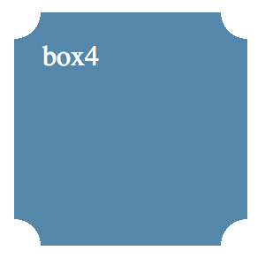

```html
<style>
    .box4 {
      background: #58a;
      background:
        radial-gradient(circle at top left, transparent 15px, #58a 0) top left,
        radial-gradient(circle at top right, transparent 15px, #58a 0) top right,
        radial-gradient(circle at bottom right, transparent 15px, #58a 0) bottom right,
        radial-gradient(circle at bottom left, transparent 15px, #58a 0) bottom left;
      background-repeat: no-repeat;
      background-size: 50% 50%;
    }
</style>
<div class="box4">box4</div>
```

### 4.4. 内联 SVG 与 border-image 方案

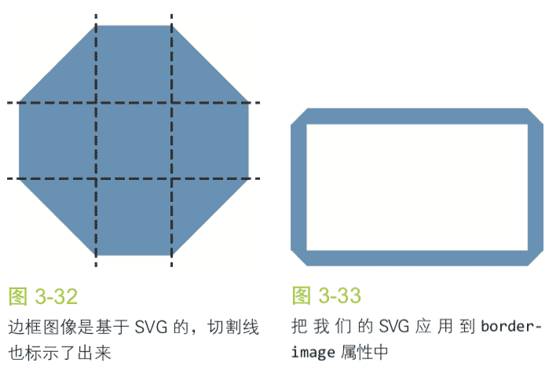

使用 border-image，并通过一个内联的 SVG 图像来产生切角效果。

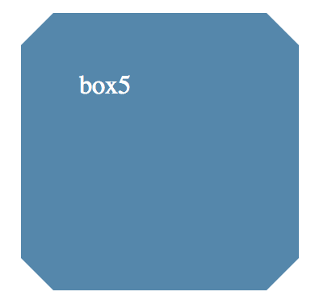

```html
<style>
    .box5 {
      background: #58a;
      background-clip: padding-box;
      border: 20px solid #58a;
      border-image:
        1 url(
          'data:image/svg+xml,<svg xmlns="http://www.w3.org/2000/svg" width="3" height="3" fill="%2358a"> <polygon points="0,1 1,0 2,0 3,1 3,2 2,3 1,3 0,2"/> </svg>'
        );
    }
</style>
<div class="box5">box5</div>
```

我们甚至可以给它加上动画，因为 border-width 属性是支持动画的!

### 4.5. 裁切路径方案

前面所述的 border-image 方案确实非常紧凑，也比较 DRY，但它还是存在一些局限。举个例子，我们要么指定某个实色的背景，要么指定一个边缘接近某个实色的背景图案。假如我们想设置其他类型的背景(比如纹理、平铺图案或一道线性渐变)，又该如何?

有另外一种方法不存在这种局限，但有着它自已独有的局限。还记得我们在“菱形图片”中用到的 clip-path 属性吗? CSS 裁切路径最神奇的地方在于我们可以同时使用百分比数值(它会以元素自身的宽高作为基数度进行换算)和绝对长度值，从而提供巨大的灵活性。

```css
background: #58a;
clip-path: polygon(20px 0, calc(100% - 20px) 0, 100% 20px, 100% calc(100% - 20px), calc(100% - 20px) 100%, 20px 100%, 0 calc(100% - 20px), 0 20px);
```

这个方法最大的好处在于，我们可以使用任意类型的背景，甚至可以对替换元素(比如图片)进行裁切。

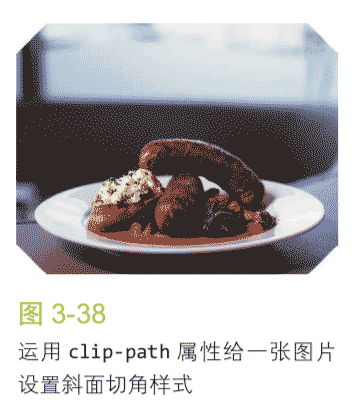

### 4.6. 关于未来的切角效果

未来，我们再也不需要费尽心机地动用 CSS 渐变、裁切或 SVG 来实现这个效果了。CSS 背景与边框(第四版)(http://dev.w3.org/csswg/css-backgrounds-4/)将引入一个全新的属性 `corner-shape`，可以彻底解决这个痛点。这个属性需要跟 `border-radius` 配合使用，从而产生各种不同形状的切角效果，而切角的尺寸正是 `border-radius` 的值。举例来说，为容器的四个角指定 15px 的斜面切角就是如此简单:

```css
border-radius: 15px; 
corner-shape: bevel;
```

### 4.7. 相关

规范：
* [CSS 背景与边框](http://w3.org/TR/css-backgrounds)
* [CSS 图像](http://w3.org/TR/css-images)
* [CSS 变形](http://w3.org/TR/css-transforms)
* [CSS 遮罩](http://w3.org/TR/css-masking)
* [CSS 过渡](http://w3.org/TR/css-transitions)
* [CSS 背景与边框(第四版)](http://dev.w3.org/csswg/css-backgrounds-4)


## 5. 梯形标签页

### 5.1. 难题

一直以来，梯形都是众所周知难以用 CSS 生成的形状，尽管它也十分常用，尤其是对于标签页来说。网页开发者如果没有用精心设计的背景图片来实现梯形，那多半就是在用边框来模拟梯形两侧的斜边(参见图 3-39)。

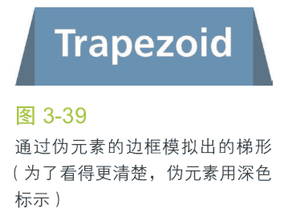

它还不是最佳方案，它用光了仅有的两个伪元素，而且在样式层面上也不够灵活。举个例子，当我们要给梯形标签页增加一圈边框、一层纹理背景，或者要在其顶部设置圆角时，就只能自求多福了。

### 5.2. 解决方案

如果有一组 2D 变形属性可以生成一个梯形，我们就可以利用“平行四边形”涉及的技巧来达到目的。然而遗憾的是并没有。

试想在现实的三维世界中旋转一个矩形。由于透视的关系，我们最终看到的二维图像往往就是一个梯形!谢天谢地，我们可以在 CSS 中用 3D 旋转来模拟出这个效果:

    transform: perspective(.5em) rotateX(5deg);

你可以在图 3-42 中看到这行代码所生成的梯形。当然，由于我们是对整个元素应用 3D 变形的，因此它上面的文字也变形了。对元素使用了 3D 变形之后，其内部的变形效应是“不可逆转”的，这一点跟 2D 变形不同。

因此，如果我们想发挥 3D 变形的功能来生成梯形，唯一可行的途径就是把变形效果作用在伪元素上。

```css
nav > a {
  position: relative;
  display: inline-block;
  padding: 0.3em 1em 0;
}

nav > a::before {
  position: absolute;
  top: 0;
  right: 0;
  bottom: 0;
  left: 0;
  z-index: -1;
  content: '';
  background: #ccc;
  background-image: linear-gradient(hsla(0, 0%, 100%, 0.6), hsla(0, 0%, 100%, 0));
  border: 1px solid rgba(0, 0, 0, 0.4);
  border-bottom: none;
  border-radius: 0.5em 0.5em 0 0;
  box-shadow: 0 0.15em white inset;
  transform: perspective(0.5em) rotateX(5deg);
  transform-origin: bottom;
}
```

如你所见，我们给它添加了背景、边框、圆角、投影等一系列样式。 它们都可以完美生效!不仅如此，我们只需要 `transform-origin` 改成 `bottom left` 或 `bottom right`，就可以立即得到左侧倾斜或右侧倾斜的标签页(参见图 3-49)!

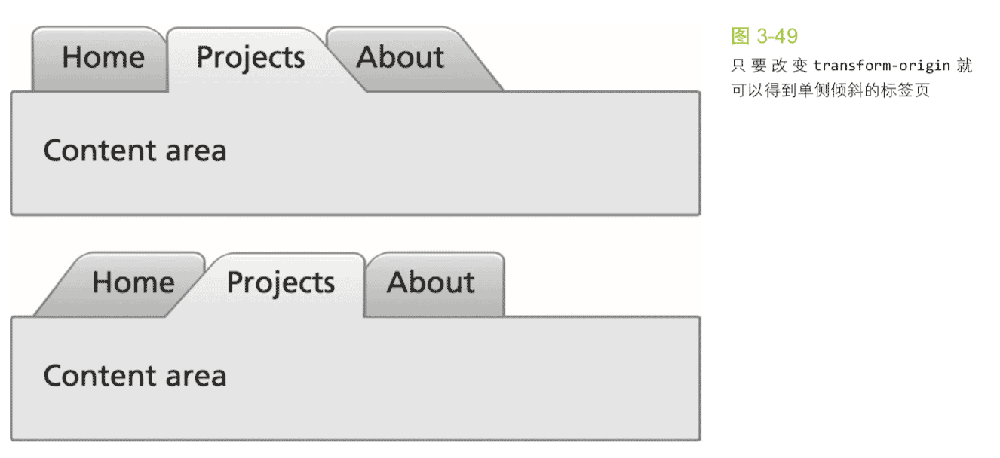

尽管优点多多，但这个技巧也不是完美无缺的。它存在一个非常大的缺点:斜边的角度依赖于元素的宽度。因此，当元素的内容长度不等时，想要得到斜度一致的梯形就很伤脑筋了。不过，对于宽度变化不大的多个元素(比如导航菜单)来说，这个方法还是非常管用的。在这种场景下，斜度的差异非常难以察觉。

参考：http://dabblet.com/gist/1345dc9399dc8e794502

### 5.3. 相关

规范：
* [CSS 变形](http://w3.org/TR/css-transforms)

## 6. 简单的饼图

### 6.1. 难题

饼图在网页中的运用极为普遍，比如简单的统计图表、进度指示器、定时器等，不一而足。尽管如此，饼图在过去很长一段时期内完全无法通过 Web 技术创建出来，即便是最简单的两种颜色的形态也不例外。

过去要实现饼图，要么动用一个外部的图像处理软件来为饼图中的多个值制作多张图片，要么动用那些专门为复杂图表而设计的 JavaScript 框架。

### 6.2. 基于 transform 的解决方案

