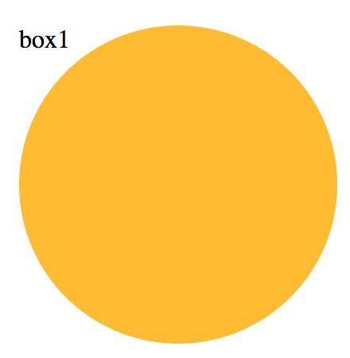
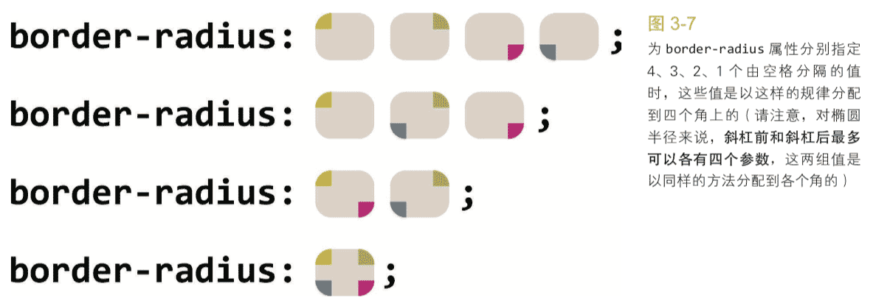
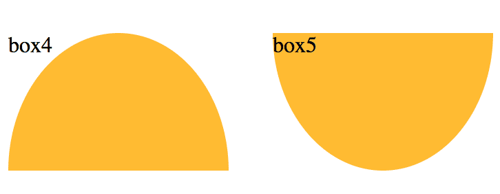
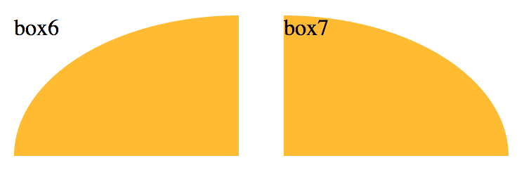

 # 形状

## 1. 自适应的椭圆

### 1.1. 难题

给任何正方形元素设置一个足够大的 `border-radius`，就可以把它变成一个圆形。



    .box1 {
        width: 200px;
        height: 200px;
        border-radius: 100px; /* >= 正方形边长的一半 */
    }

如果指定任何大于 100px 的半径，仍然可以得到一个圆形。规范特别指出了这其中的原因：

>“当任意两个相邻圆角的半径之和超过 border box 的尺寸时，用户代理必须按比例减小各个边框半径所使用的值，直到它们不会相互重叠为止。” <br>
>——CSS 背景与边框(第三版)(http://w3.org/TR/css3-background/#corner-overlap)

不过，我们往往不愿意对一个元素指定固定的宽度和高度，因为我们希望它能 **根据其内容自动调整并适应**

我们通常期望达到这个效果:**如果它的宽高相等，就显示为一个圆;如果宽高不等，就显示为一个椭圆**。

### 1.2. 小花絮

**为什么叫border-radius?**

可能有人会奇怪，border-radius 到底由何得名。这个属性并不需要边框来参与工作，似乎把它叫作 corner-radius 更贴切一些。这个名字乍听起来确实让人摸不着头脑，其实原因在于 border-radius 是对元素的 border box 进行切圆角处理的。当元素没有边框时，可能还看不出差异;当它有边框时，则以边框外侧的拐角作为切圆角的基准。边框内侧的圆角会稍小一些(严格来说内角半径将是 max(0, border-radius-border-width))。


### 1.3. 解决方案

`border-radius` 可以单独指定水平和垂直半径，只要用一个斜杠(`/`)分隔这两个值即可。

这个特性允许我们在拐角处创建椭圆圆角：


    .box2 {
        width: 200px;
        height: 150px;
        border-radius: 100px / 75px;
    }

这段代码存在一个很大的缺陷:只要元素的尺寸发生变化，`border-radius` 的值就得跟着改。

`border-radius` 这个属性还有另外一个鲜为人知的真相，它不仅可以接受长度值，还可以接受百分比值。

这个百分比值会基于元素的尺寸进行解析，即宽度用于水平半径的解析，而高度用于垂直半径的解析。这意味着相同的百分比可能会计算出不同的水平和垂直半径。因此，如果要创建一个自适应的椭圆，我们可以把这两个半径值都设置为 50%:

    border-radius: 50% / 50%;

由于斜杠前后的两个值现在是一致的(即使它们最终可能会被计算为不同的值)，我们可以把这行代码进一步简化为:

    border-radius: 50%;


最终，只需要这一行代码，我们就可以得到一个自适应的椭圆了。

### 1.4. 半椭圆

半椭圆是沿纵轴对称，而不是沿横轴对称的，我们需要给每个角指定不同的半径。

border-radius 是一个简写属性，我们可以为元素的每个角指定不同的值

    border-top-left-radius
    border-top-right-radius
    border-bottom-right-radius
    border-bottom-left-radius

也可以仍旧使用 border-radius 这个简写属性：

    border-radius: 水平方向的半径 / 垂直方向的编辑;




在掌握了这个新发现的知识之后，现在让我们来重新审视半椭圆的问题。以这样的方式来指定 border-radius 真的可以生成我们想要的形状吗?试了才知道。让我们先来观察一些细节。

* 这个形状是垂直对称的，这意味着左上角和右上角的水平半径值应该是相同的;与此类似，左下角和右下角的水平半径值也应该是相同的。
* 顶部边缘并没有平直的部分(也就是说，整个顶边都是曲线)，这意味着左上角和右上角的水平半径之和应该等于整个形状的宽度。
* 基于前两条观察，我们可以推断出，左半径和右半径在水平方向上的值应该均为 50%。
* 再看看垂直方向，似乎顶部的两个圆角占据了整个元素的高度，而且底部完全没有任何圆角。因此，在垂直方向上 border-radius 的合理值似乎就是 100% 100% 0 0。
* 因为底部两个角的垂直圆角是零，那么它们的水平圆角是多少就完全不重要了，因为此时水平圆角总是会被计算为零。(你能想像一个 垂直半径为零而水平半径为正值的圆角吗?没错，连写规范的作者们都做不到。)

把所有这些结论综合起来，我们就可以很容易地写出 CSS 代码，来生成那样自适应的半椭圆:



    .box4 {
        width: 160px;
        height: 100px;
        border-radius: 50% / 100% 100% 0 0;
    }
    .box5 {
        width: 160px;
        height: 100px;
        border-radius: 50% / 0 0 100% 100%;
    }

### 1.5. 四分之一椭圆

要创建一个四分之一椭圆，其中一个角的水平和垂直半径值都需要是 100%，而其他三个角都不能设为圆角。



由于这四个角的半径在水平和垂直方向上都是相同的，我们甚至都不需要使用斜杠语法了。最终代码应该是这样的:

    .box6 {
        width: 160px;
        height: 100px;
        border-radius: 100% 0 0 0;
    }
    .box7 {
        width: 160px;
        height: 100px;
        border-radius: 0 100% 0 0;
    }

你不免还会顺着往下想，是不是还能用 border-radius 来生成椭圆的 其他切块(比如八分之一椭圆、三分之一椭圆)?很遗憾，你可能会失望了，因为 border-radius 属性是无法生成这些形状的。

### 1.6. 糖果按钮

http://simurai.com/archive/buttons/


### 1.7. 相关规范

* [CSS 背景与边框](http://w3.org/TR/css-backgrounds)


## 2. 平行四边形

### 2.1. 难题

平行四边形其实是矩形的超集:它的各条边是两两平行的，但各个角则不一定都是直角。在视觉设计中，平行四边形往往可以传达出一种动感。

用 CSS 创建一个按钮状的平行四边形链接，可以通过 skew() 的变形属性来对这个矩形进行斜向拉伸：


```CSS
.box1 {
    background: #58a;
    transform: skewX(-45deg);
}
```

但是，这导致它的内容也发生了斜向变形，有没有办法只让容器的形状倾斜，而保持其内容不变呢?

### 2.2. 嵌套元素方案

对内容再应用一次反向的 skew() 变形，从而抵消容器的变形效果。
不幸的是，这意味着我们将不得不使用一层额外的 HTML 元素来包裹内容：


```html
<div class="box2">
    <span>box2</span>
</div>
```

```css
.box2 {
    background: #58a;
    transform: skewX(-45deg);
}
.box2 span {
    display: inline-block;
    transform: skewX(45deg);
}
```

如果你想把这个效果应用到一个默认显示为行内的元素，不要忘记把它的 display 属性设置为其他 值， 比如 inline-block 或 block，否则变形是不会生效的。这一点对它内层的元素也是适用的。

如果结构层的变更是不允许的，或者你希望严格保持结构层的纯净度，别担心，我们还有一个纯 CSS 的解决方案。

### 2.3. 伪元素方案

另一种思路是把所有样式(背景、边框等)应用到伪元素上，然后再对伪元素进行变形。因为我们的内容并不是包含在伪元素里的，所以内容并不会受到变形的影响。

我们希望伪元素保持良好的灵活性，可以自动继承其宿主元素的尺寸，甚至当宿主元素的尺寸是由其内容来决定时仍然如此。

一个简单的办法是 给宿主元素应用 `position: relative` 样式，并为伪元素设置 `position: absolute`，然后再把所有偏移量设置为零，以便让它在水平和垂直方向上都被拉伸至宿主元素的尺寸，并且给伪元素设置 `z-index: -1` 样式，这样它的堆叠层次就会被推到宿主元素之后。


```html
<div class="box3">box3</div>
```

```css
.box3 {
    position: relative;
}
.box3:before {
    content: "";
    z-index: -1;
    position: absolute;
    top: 0; left: 0; right: 0; bottom: 0;
    background: #58a;
    transform: skewX(-45deg);
}
```

这个技巧不仅对 `skew()` 变形来说很有用，还适用于其他任何变形样式，当我们想变形一个元素而不想变形它的内容时就可以用到它。

这个技巧的关键在于，我们利用伪元素以及定位属性产生了一个方块，然后对伪元素设置样式，并将其放置在其宿主元素的下层。这种思路同样可以运用在其他场景中，从而得到各种各样的效果。

### 2.4. 相关规范

* [CSS 变形](http://w3.org/TR/css-transforms)