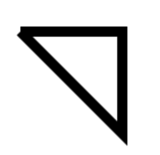

# canvas 教程

## 1. 体验

参考：[./src/01_hello_world.html](./src/01_hello_world.html)

```html
<style>
    canvas {border : solid 1px #cccccc;}
</style>
<!--
    1.准备画布
        * 画布是白色的，默认 300*150
        * 设置canvas元素的width和height属性来设置画布的大小
-->
<canvas width="400" height="300"></canvas>
<!--
    1. 准备绘制工具，进行绘图
-->
<script>
    // 获取画布
    var myCanvas = document.querySelector( "canvas" );
    // 获取上下文（绘制工具箱）
    var ctx = myCanvas.getContext( "2d" );
    // 移动画笔
    ctx.moveTo( 100, 100 );
    // 绘制直线的轨迹（路径）
    ctx.lineTo( 200, 100 );
    // 描边
    ctx.stroke();
</script>
```

说明：

* 通过样式设置画布的宽高，只是对画布元素进行拉伸。

## 2. 线条

### 2.1. 模糊的问题

**问题：**

线条默认 宽度1px 颜色黑色；但实际看到的却是 2px 灰色

**原因：**

线宽度的中心会与坐标轴的刻度对齐，因此把线分成两个0.5px，无法显示0.5px的色块，
所以颜色不饱和和增加宽度。

**解决：**

偏移 0.5px 即可。

### 2.2. 路径

绘图的轨迹。

移动画笔：`ctx.moveTo(x, y)`

绘制直线轨迹：`ctx.lineTo(x, y)`

### 2.3. 描边

对路径进行描边 `ctx.stroke()`

### 2.4. 开启新路径 ctx.beginPath()

开启新的路径后，对新路径的操作不会受别的影响。

```javascript
ctx.beginPath();

// 移动画笔 ctx.moveTo()
// 绘制路径 ctx.lineTo()
// 设置样式 ctx.strokeStyle ctx.lineWidth

ctx.stroke();
```

### 2.5. 闭合路径 ctx.closePath()

手动闭合的路径，描边时会产生问题，如图：



使用 `ctx.closePath()`，可解决闭合缺角的问题。

参考：[有缺陷的三角形](./src/02_三角形.html)

```javascript
ctx.beginPath();

ctx.moveTo( 100, 100 );
ctx.lineTo( 200, 100 );
ctx.lineTo( 200, 200 );
ctx.lineTo( 100, 100 );

// 不闭合路径，会造成闭合缺角
ctx.closePath();

ctx.lineWidth = 10;

// 描边
ctx.stroke();
```

### 2.6. 填充 ctx.fill()

对路径进行填充 `ctx.fill()`

### 2.7. 非零环绕填充规则

参考：[镂空的正方形](./src/03_镂空的正方形.html)


判断一块区域是否填充的方法：

1. 辅助线：做一条直线，起于区域内，终于无限远

2. 相交值：每个与辅助线相交（交叉）的轨迹
    * 如果是顺时针，则 +1
    * 如果是逆时针，则 -1

3. 得结果
    * 相交值 为0，则不填充
    * 相交值 为1，则填充

### 2.8. 画笔的状态

* `lineWidth` 线宽，默认 1px

   * `ctx.lineWidth = 30`

* `lineCap` 线末端类型， butt （默认）、 round 、square

  * `ctx.lineCap = 'round'`
  * 参考： [./src/04_lineCap.html](./src/04_lineCap.html)

* `lineJoin` 相交线的拐点， miter （默认，直角） 、 round （圆角）、 bevel （斜角）

  * `ctx.lineJoin = 'round'`
  * 参考： [./src/05.lineJoin.html](./src/05.lineJoin.html)

* `strokeStyle` 线的颜色

  * `ctx.strokeStyle = 'red'`

* `fillStyle` 填充颜色
  
  * `ctx.fillStyle = 'red'`

* `setLineDash()` 设置虚线

  * `ctx.setLineDash([10, 20, 30, 40, 50, 60])` 
  * 传排列方式 `[ 实线长, 虚线长, 实线长, 虚线长, ... ]`
  * 参考： [./src/06.dash_line.html](./src/06.dash_line.html)

* `getLineDash()` 获取虚线宽度集合

  * `console.log(ctx.getLineDash()); // [10, 20, 30, 40, 50, 60]`

* `lineDashOffset` 设置虚线偏移量（负值向右偏移）
