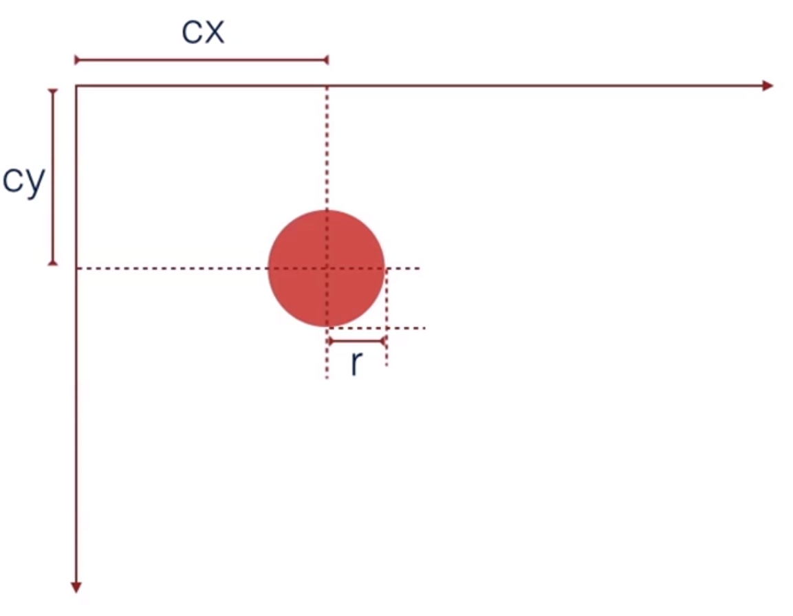
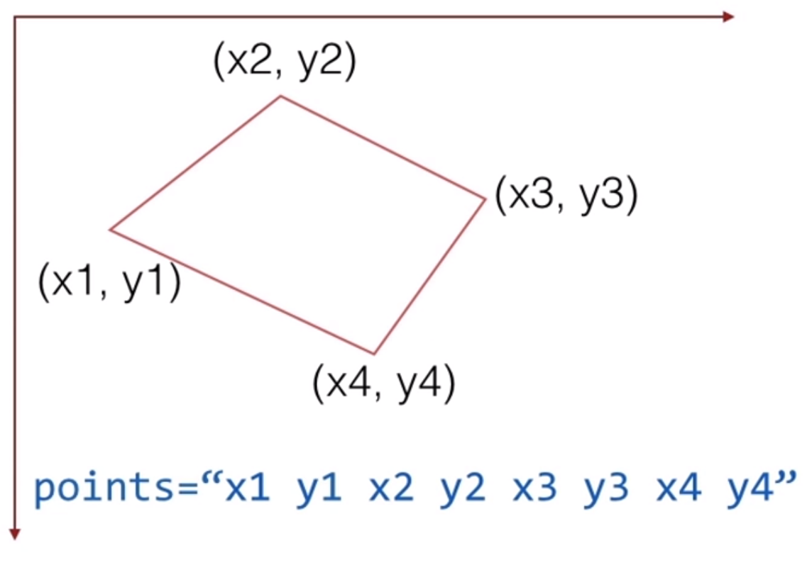

# SVG

>[走进SVG](https://www.imooc.com/learn/143)

## 1. SVG 入门

### 1.1. SVG 简介

* 使用 XML 描述的矢量文件

* W3C 标准（1.1） https://www.w3.org/TR/SVG11/

* 浏览器支持情况（ https://caniuse.com/ ）， IE9+

#### 1.1.1. 矢量图和位图


#### 1.1.2. 简单示例


```xml
<svg xmlns="http://www.w3.org/2000/svg" 
    width="200" height="200">
    <!--Face-->
    <circle cx="100" cy="100" r="90" fill="#39F" />
    <!--Eyes-->
    <circle cx="70" cy="80" r="20" fill="white" />
    <circle cx="130" cy="80" r="20" fill="white" />
    <circle cx="65" cy="75" r="10" fill="black" />
    <circle cx="125" cy="75" r="10" fill="black"/>
    <!--Smile-->
    <path d="M 50 140 A 60 60 0 0 0 150 140" 
        stroke="white" stroke-width="3" fill="none" />
</svg>
```

#### 1.1.3. 使用方式

在浏览器中直接打开：

* http://localhost:3000/static/simle.svg

在 HTML 中使用 `` 引入

* ``

在 HTML 中直接使用 `<svg>`

* `<svg ...> ... </svg>`

在 CSS 中当做图片背景使用

* `background-image: url(./images/simle.svg)`

### 1.2. SVG 的图像和属性

基本图形：

1. `<rect>`
2. `<circle>`
3. `<ellipse>`  : 椭圆
4. `<line>`
5. `<polyline>` : 折线
6. `<polygon>`  : 多边形

基本属性

* fill
* stroke
* stroke-width
* transform

#### 1.2.1. `<rect>`

属性：

* x : 矩形左上角坐标的 x
* y : 矩形左上角坐标的 y
* width  : 矩形的宽度
* height : 矩形的高度
* rx : 矩形的x轴圆角半径
* ry : 矩形的y轴圆角半径

注意：

* 如果 rx、ry 只有一个，则 r = rx = ry，即是一个圆

如图：


示例：


#### 1.2.2. `<circle>`

属性：

* cx : 圆心的坐标 x
* cy : 圆心的坐标 y
* r  : 圆的半径

如图：



#### 1.2.3. `<ellipse>`

属性：

* cx : 圆心的坐标 x
* cy : 圆心的坐标 y
* rx : 圆的x轴半径
* ry : 圆的y轴半径


如图：


#### 1.2.4. `<line>`

属性：

* x1 : 起点坐标 x
* y1 : 起点坐标 y
* x2 : 终点坐标 x
* y2 : 终点坐标 y


如图：


#### 1.2.5. `<polyline>`

属性：

* points : points="x1 y1 x2 y2 ... xn yn"
  * x1 : 第1个点的坐标 x
  * y1 : 第1个点的坐标 y
  * x2 : 第2个点的坐标 x
  * y2 : 第2个点的坐标 y
  * ...
  * xn : 第n个点的坐标 x
  * yn : 第n个点的坐标 y

注意：

* 首尾两个点会自动连接，形成一个闭合的多边形

如图：


#### 1.2.6. `<polygon>`

属性：

* points : points="x1 y1 x2 y2 ... xn yn"
  * x1 : 第1个点的坐标 x
  * y1 : 第1个点的坐标 y
  * x2 : 第2个点的坐标 x
  * y2 : 第2个点的坐标 y
  * ...
  * xn : 第n个点的坐标 x
  * yn : 第n个点的坐标 y

如图：

