# SVG

>[走进SVG](https://www.imooc.com/learn/143)

## 1. SVG 入门

### 1.1. SVG 简介

* 使用 XML 描述的矢量文件

* W3C 标准（1.1） https://www.w3.org/TR/SVG11/

* 浏览器支持情况（ https://caniuse.com/ ）， IE9+

#### 1.1.1. 矢量图和位图


#### 1.1.2. 简单示例


```xml
<svg xmlns="http://www.w3.org/2000/svg" 
    width="200" height="200">
    <!--Face-->
    <circle cx="100" cy="100" r="90" fill="#39F" />
    <!--Eyes-->
    <circle cx="70" cy="80" r="20" fill="white" />
    <circle cx="130" cy="80" r="20" fill="white" />
    <circle cx="65" cy="75" r="10" fill="black" />
    <circle cx="125" cy="75" r="10" fill="black"/>
    <!--Smile-->
    <path d="M 50 140 A 60 60 0 0 0 150 140" 
        stroke="white" stroke-width="3" fill="none" />
</svg>
```

#### 1.1.3. 使用方式

在浏览器中直接打开：

* http://localhost:3000/static/simle.svg

在 HTML 中使用 `` 引入

* ``

在 HTML 中直接使用 `<svg>`

* `<svg ...> ... </svg>`

在 CSS 中当做图片背景使用

* `background-image: url(./images/simle.svg)`

### 1.2. SVG 的图像和属性

基本图形：

1. `<rect>`
2. `<circle>`
3. `<ellipse>`  : 椭圆
4. `<line>`
5. `<polyline>` : 折线
6. `<polygon>`  : 多边形

基本属性

* fill
* stroke
* stroke-width
* transform

#### 1.2.1. `<rect>`

属性：

* x : 矩形左上角坐标的 x
* y : 矩形左上角坐标的 y
* width  : 矩形的宽度
* height : 矩形的高度
* rx : 矩形的x轴圆角半径
* ry : 矩形的y轴圆角半径

注意：

* 如果 rx、ry 只有一个，则 r = rx = ry，即是一个圆

如图：

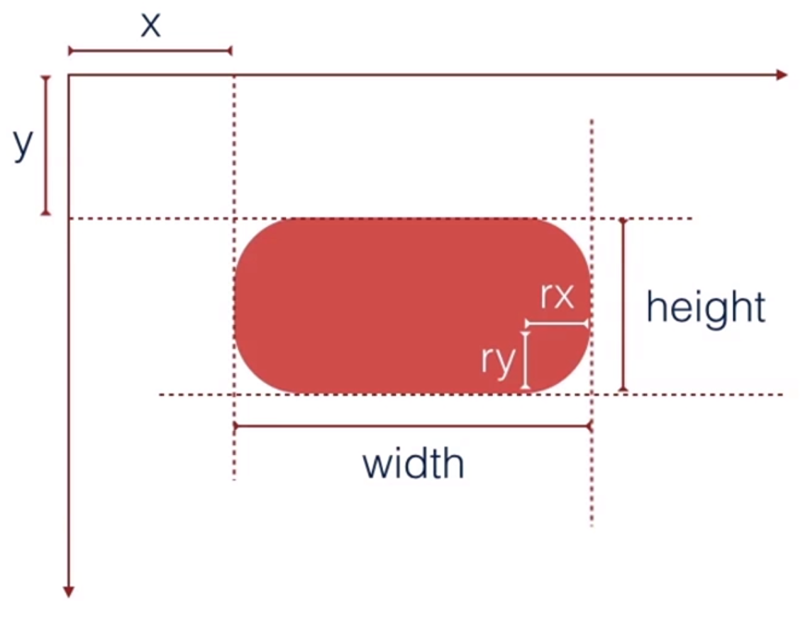


#### 1.2.2. `<circle>`

属性：

* cx : 圆心的坐标 x
* cy : 圆心的坐标 y
* r  : 圆的半径

如图：


#### 1.2.3. `<ellipse>`

属性：

* cx : 圆心的坐标 x
* cy : 圆心的坐标 y
* rx : 圆的x轴半径
* ry : 圆的y轴半径


如图：

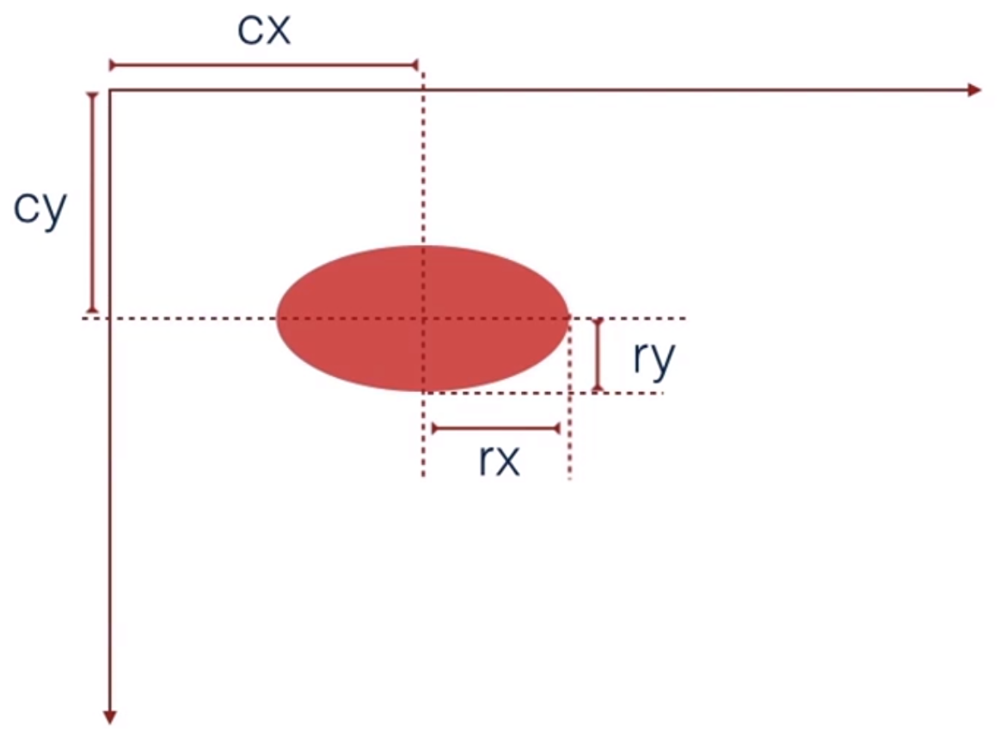

#### 1.2.4. `<line>`

属性：

* x1 : 起点坐标 x
* y1 : 起点坐标 y
* x2 : 终点坐标 x
* y2 : 终点坐标 y


如图：

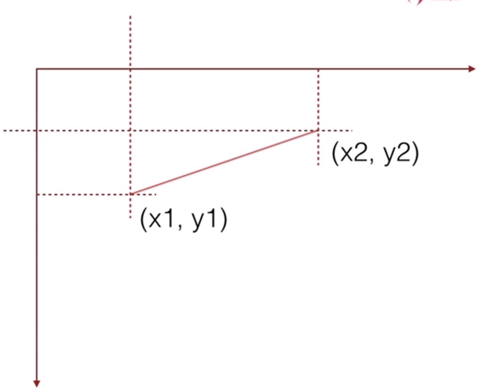


#### 1.2.5. `<polyline>`

属性：

* points : points="x1 y1 x2 y2 ... xn yn"
  * x1 : 第1个点的坐标 x
  * y1 : 第1个点的坐标 y
  * x2 : 第2个点的坐标 x
  * y2 : 第2个点的坐标 y
  * ...
  * xn : 第n个点的坐标 x
  * yn : 第n个点的坐标 y

注意：

* 首尾两个点会自动连接，形成一个闭合的多边形

如图：

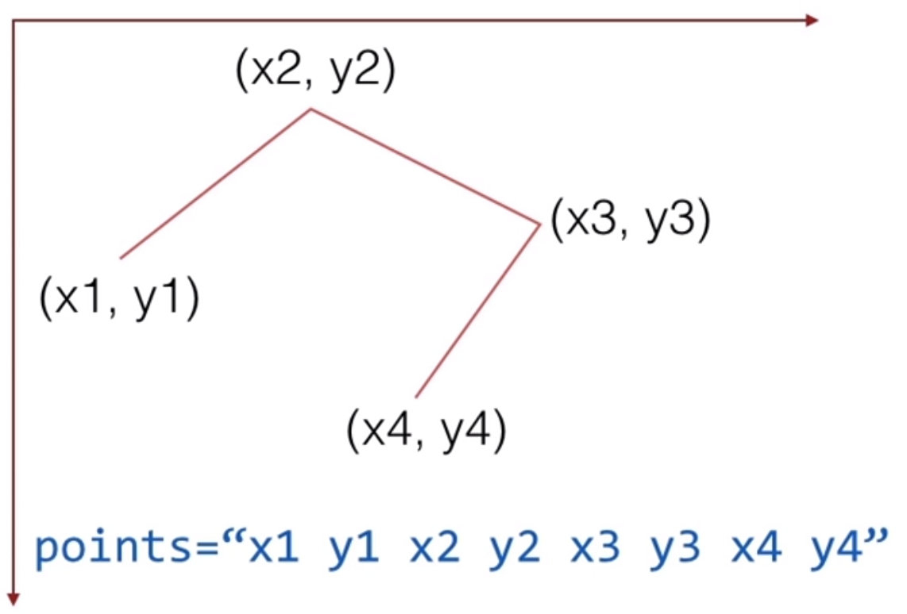


#### 1.2.6. `<polygon>`

属性：

* points : points="x1 y1 x2 y2 ... xn yn"
  * x1 : 第1个点的坐标 x
  * y1 : 第1个点的坐标 y
  * x2 : 第2个点的坐标 x
  * y2 : 第2个点的坐标 y
  * ...
  * xn : 第n个点的坐标 x
  * yn : 第n个点的坐标 y

如图：


#### 1.2.7. 填充、描边、变换

* fill : 填充
* stroke : 描边
* stroke-width : 描边的宽度
* transform : 变换

#### 1.2.8. 示例

[./code/1/basic.svg](./code/1/basic.svg)

```xml
<svg xmlns="http://www.w3.org/2000/svg">
    <rect 
        x="10" 
        y="10" 
        rx="5" 
        ry="5" 
        width="150" 
        height="100" 
        stroke="red" 
        fill="none">
    </rect>

    <circle 
        cx="250" 
        cy="60" 
        r="50" 
        stroke="red" 
        fill="none">
    </circle>

    <ellipse 
        cx="400" 
        cy="60" 
        rx="70" 
        ry="50" 
        stroke="red" 
        fill="none">
    </ellipse>

    <line 
        x1="10" 
        y1="120" 
        x2="160" 
        y2="220" 
        stroke="red">
    </line>

    <polyline 
        points="250 120 
                300 220
                200 220"
        stroke="red"
        fill="none">
    </polyline>

    <polygon 
        points="250 120 
                300 220
                200 220"
        stroke="red"
        stroke-width="5"
        fill="yellow"
        transform="translate(150 0)">
    </polygon>
</svg>
```

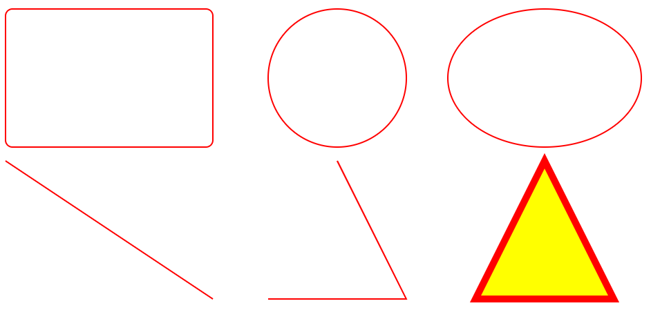

### 1.3. 基本操作 API

创建图形

* `document.createElementNS(ns, tagName);`

添加图形

* `element.appendChild(childElement)`

设置/获取 属性

* `element.setAttribute(name, value)`
* `element.getAttribute(name)`

### 1.4. 综合例子：简单SVG编辑器

[./code/1/svg-editor.html](./code/1/svg-editor.html)

## 2. SVG中的坐标系统

### 2.1. SVG的世界、视野、视窗的概念

#### 2.1.1. 视野与世界

* 世界是无穷大的
* 视野是观察世界的一个矩形区域

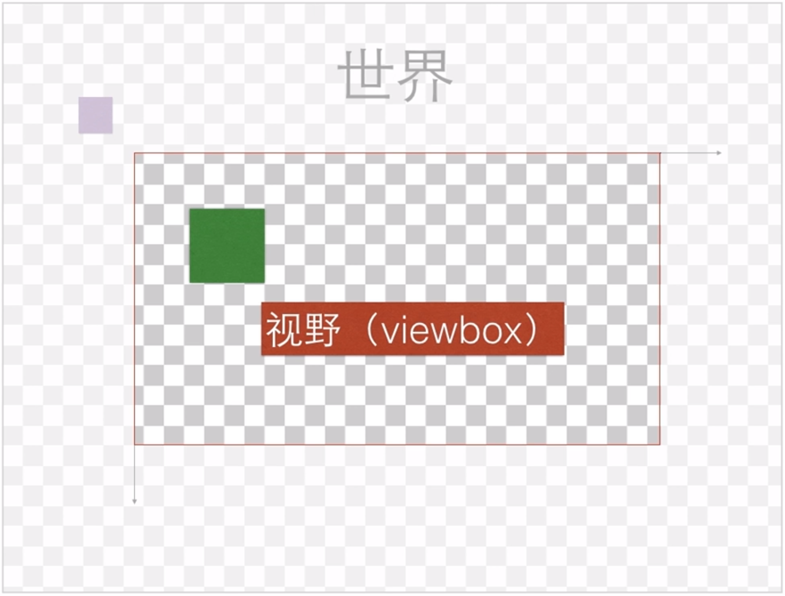

#### 2.1.2. 概念

```xml
<svg
    width="800" height="600"
    viewBox="0 0 400 300"
    preserveAspectRadio="xMidYMid meet"
></svg>
```

* width、height : 控制视窗 (svg 元素在网页中所占的区域)
* SVG 代码 : 定义世界
* viewBox、preserveAspectRadio : 控制视野 (世界中一个矩形区域)
  * preserveAspectRadio: 视野和视窗 宽高比不一样时的处理机制
  
### 2.2. SVG 中的图形分组

> 多个元素在逻辑上是一个整体，在代码里面如何体现？

* `<g>` 标签来创建分组
* 属性继承： 给分组设置描边、填充，分组内的元素会继承
* transform 属性定义坐标变换
* 可以嵌套使用

示例：

```xml
<svg xmlns="http://www.w3.org/2000/svg">
  <g stroke="red" fill="none" >
    <rect x="100" y="50" width="100" height="50"/>
    <rect x="140" y="100" width="20" height="120"/>
  </g>
</svg>
```

### 2.3. 坐标系统概述

* 笛卡尔直角坐标系： 给图形提供定位基准
* 原点
* 互相垂直的两条数轴
* 角度定义： 正方向，从 x 正半轴 到 y 正半轴的方向

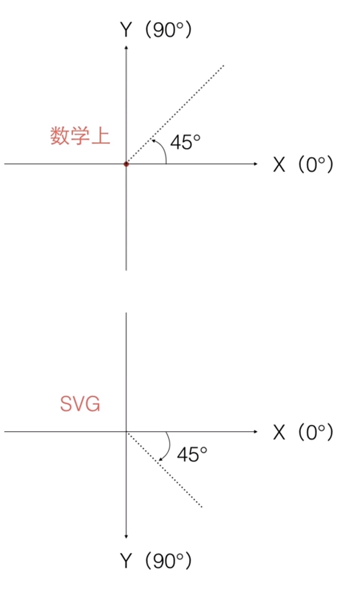

### 2.4. 四个坐标系

* 用户坐标系（User Coordinate）
  * 世界坐标系

* 自身坐标系（Current Coordinate）
  * 每个 图形元素或分组 独立与生俱来

* 前驱坐标系（Previous Coordinate）
  * 父容器的坐标系
  * 变换时，改变的是 自身的坐标系 在 父容器坐标系中 的位置

* 参考坐标系（Reference Coordinate）
  * 使用其他坐标系来考究自身的情况时使用

### 2.5. 坐标变换

* 定义
* 线性变换
* 线性变换列表
* transform 属性

#### 2.5.1. 定义

* 数学上： 坐标变换 是采用一定的数学方法将 一个坐标系的坐标 变换为 另一个坐标系的坐标 的过程。
* SVG 中， 坐标变换 是对一个坐标系到另一个坐标系的变换的描述。

#### 2.5.2. 线性变换

线性变换方程：

```text
X' = aX + cY + e
Y' = bX + dY + f
```

变换矩阵：

```text
a c e
b d f
0 0 1
```

示例：

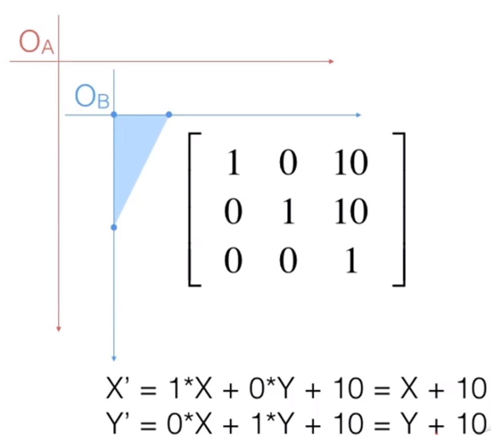

平移：

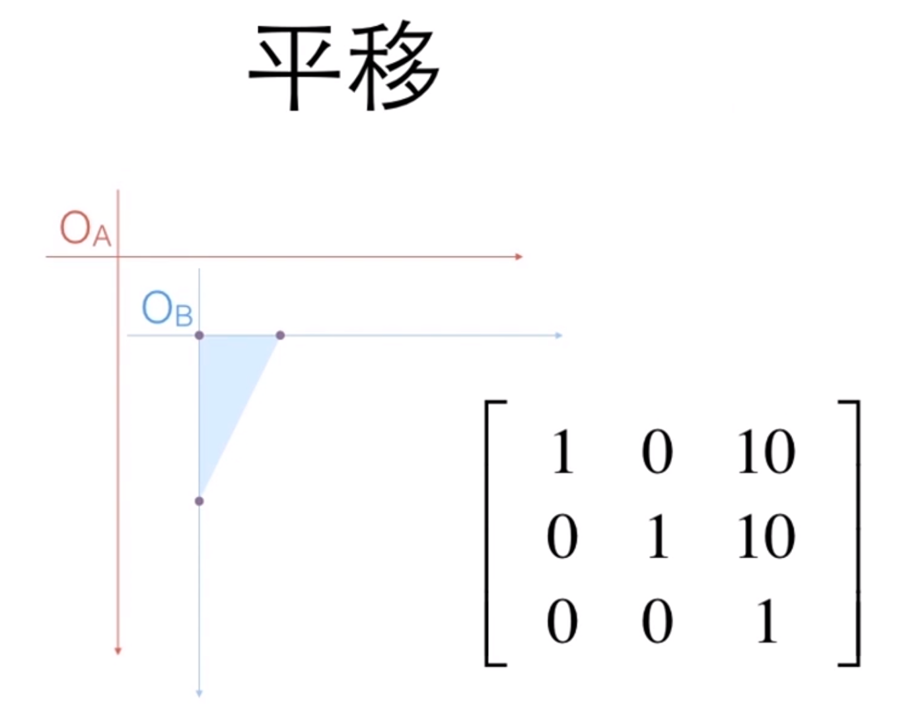

旋转：

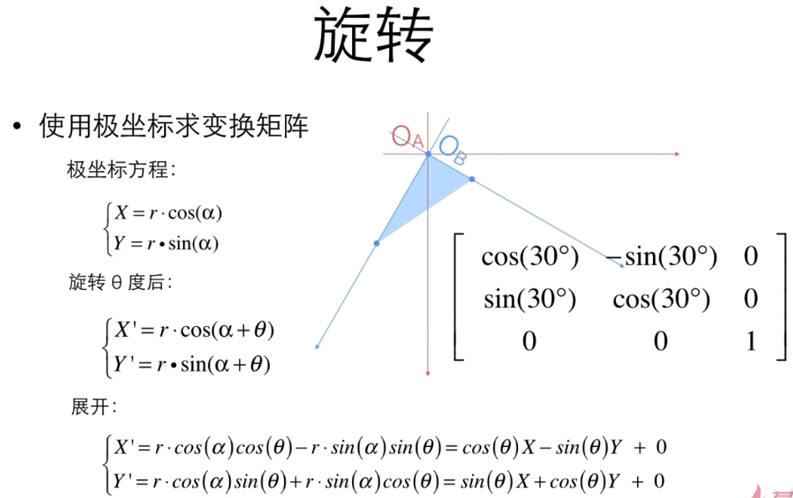

缩放：

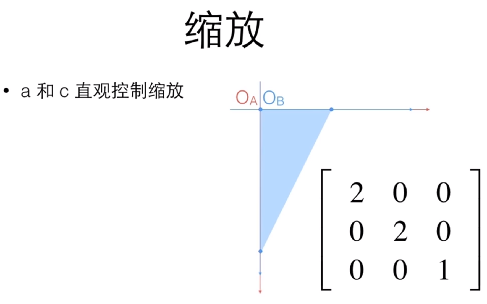

#### 2.5.3. 线性变换列表

表示一系列的变换，结果为变换的矩阵乘积：

```text
M = Mn * Mn-1 * ... * M2 * M1 * M0
```

后边的变换先乘

#### 2.5.4. transform 属性

定义前驱坐标系到自身坐标系的线性变换

语法：

* rotate(deg)
* translate(x, y)
* scale(sx, sy)
* matrix(a, b, c, d, e, f)

注意：

* 多个变换，变换的顺序对结果有影响

## 3. 颜色、渐变、笔刷

### 3.1. RGB 和 HSL

* 都是 CSS3 支持的颜色表示方法
* 互相转换的原理

#### 3.1.1. RGB

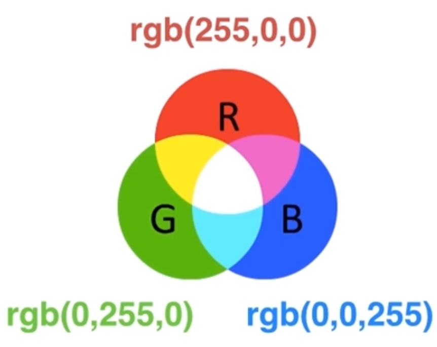

* 三个分量： 红、绿、蓝

* 表示方式： rgb(r, g, b) 或 #rrggbb

* 每个分量的取值范围： [0, 255]

* 优势： 显示器容易解析
* 劣势： 不符合人类描述颜色的习惯

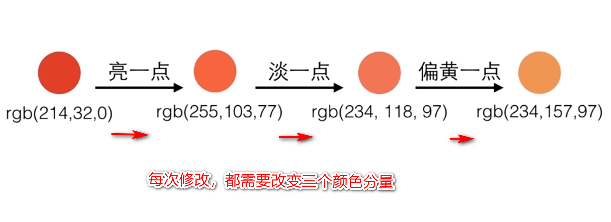