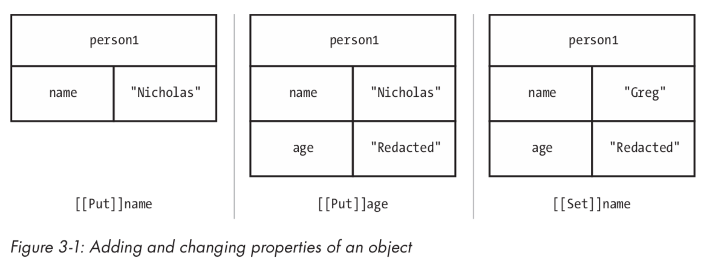

# 理解对象

尽管 JavaScript 中有许多内置引用类型，但您很可能会相当频繁地创建自己的对象。 在执行此操作时，请记住 JavaScript 中的对象是动态的，这意味着它们可以在代码执行期间随时更改。 基于类的语言基于类定义锁定对象，而 JavaScript 对象没有这样的限制。

JavaScript 编程的很大一部分是管理这些对象，这就是理解对象如何工作的原因是理解 JavaScript 整体的关键。 本章稍后将对此进行更详细的讨论。

## 1. 定义属性

回忆一下第 1 章，创建自己的对象有两种基本方法：使用 `Object` 构造函数和使用对象字面量。 例如：

```javascript
var person1 = {
    name: "Nicholas"
};

var person2 = new Object();
person2.name = "Nicholas";

person1.age = "Redacted";
person2.age = "Redacted";

person1.name = "Greg";
person2.name = "Michael";
```

`person1` 和 `person2` 都是具有 `name` 属性的对象。 稍后在该示例中，为两个对象分配了 `age` 属性，您可以在定义对象后立即执行此操作，或者稍后执行此操作。 除非另有说明，否则您创建的对象始终可以进行修改以进行修改（有关详细信息，请参阅第 45 页的“防止对象修改”）。 此示例的最后一部分更改每个对象上的 `name` 值; 属性值也可以随时更改。

首次将属性添加到对象时，JavaScript 会在对象上使用名为 `[[Put]]` 的内部方法。 `[[Put]]` 方法在对象中创建一个点来存储属性。 你可以类比往 hash 表中添加键值对。 此操作不仅指定初始值，还指定属性的某些特性。 因此，在前面的示例中，当首先在每个对象上定义 `name` 和 `age` 属性时，将为每个对象调用 `[[Put]]` 方法。

调用 `[[Put]]` 的结果是在对象上创建自有属性。 自有属性表示只有该属性拥有该属性。 该属性直接存储在实例上，并且必须通过该对象对该属性进行操作。

自有属性与原型属性不同，这将在第 4 章中讨论。

将新值分配给现有属性时，会发生名为 `[[Set]]` 的单独操作。 此操作将使用新值替换属性的当前值。 在上一个示例中，将 `name` 设置为第二个值会导致调用 `[[Set]]`。 有关 `person1` 的 `name` 和 `age` 属性发生变化背后发生了什么情况，请参见图 3-1。



在图的第一部分中，使用对象字面量来创建 `person1` 对象。 这会对 `name` 属性执行隐式 `[[Put]]`。 为 `person1.age` 分配值会为 `age` 属性执行 `[[Put]]`。 但是，将 `person1.name` 设置为新值（`"Greg"`）会对 `name` 属性执行 `[[Set]]` 操作，从而覆盖现有属性值。

## 2. 检测属性

由于可以随时添加属性，因此有时需要检查对象中是否存在属性。 新的 JavaScript 开发人员经常错误地使用以下模式来检测属性是否存在：

```javascript
// unreliable
if (person1.age) {
    // do something with age
}
```

这种模式的问题是 JavaScript 的强制类型转换造成的结果。 如果值为真值（对象，非空字符串，非零数字或 `true`），则 `if` 条件的计算结果为 `true`;如果值为假值（`null`，`undefined`，`0`，`false`，`NaN` 或空字符串），则计算结果为 `false`）。 因为对象属性可以包含这些假值之一，所以示例代码可能会产生错误判定。 例如，如果 `person1.age` 为 `0`，则即使属性存在，也不会满足 `if` 条件。 测试存在属性的更可靠方法是使用 `in` 运算符。

`in` 运算符在特定对象中查找具有给定名称的属性，如果找到它则返回 `true`。 实际上，`in` 运算符检查哈希表中是否存在给定键。 例如，以下是在使用 `in` 来检查 `person1` 对象中的某些属性：

```javascript
console.log("name" in person1); // true
console.log("age" in person1); // true
console.log("title" in person1); // false
```

请记住，方法只是引用函数的属性，因此您可以以相同的方式检查方法的存在。 下面向 `person1` 添加一个新函数 `sayName()`，并使用 `in` 来确认函数的存在。

```javascript
var person1 = {
    name: "Nicholas",
    sayName: function() {
        console.log(this.name);
    }
};

console.log("sayName" in person1);  // true
```

在大多数情况下，`in` 运算符是确定属性是否存在于对象中的最佳方法。 它具有不评估属性值的附加好处，如果这样的评估可能导致性能问题或错误，这可能很重要。

但是，在某些情况下，您可能只想检查属性是否属于自己的属性。 `in` 运算符检查自己的属性和原型属性，因此您需要采用不同的方法。 调用 `hasOwnProperty()` 方法，该方法存在于所有对象上，并且仅当给定属性存在且为自己的属性时才返回 `true`。 例如，以下代码在 `person1` 中的不同属性上比较使用 `in` 和 `hasOwnProperty()` 的结果：

```javascript
var person1 = {
    name: "Nicholas",
    sayName: function() {
        console.log(this.name);
    }
};

console.log("name" in person1); // true
console.log(person1.hasOwnProperty("name")); // true
console.log("toString" in person1); // true
console.log(person1.hasOwnProperty("toString")); // false
```

在此示例中，`name` 是 `person1` 的自己的属性，因此 `in` 运算符和 `hasOwnProperty()` 都返回 `true`。 然而，`toString()` 方法是一个存在于所有对象上的原型属性。 操作符对 `toString()` 返回 `true`，但 `hasOwnProperty()` 返回 `false`。 这是一个重要的区别，将在第 4 章进一步讨论。