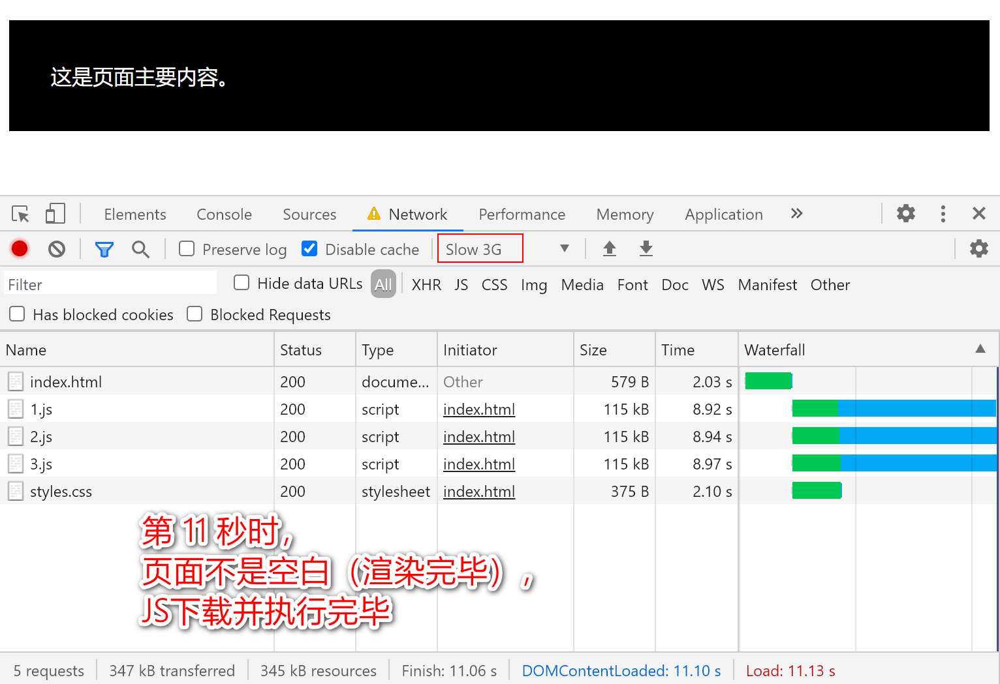
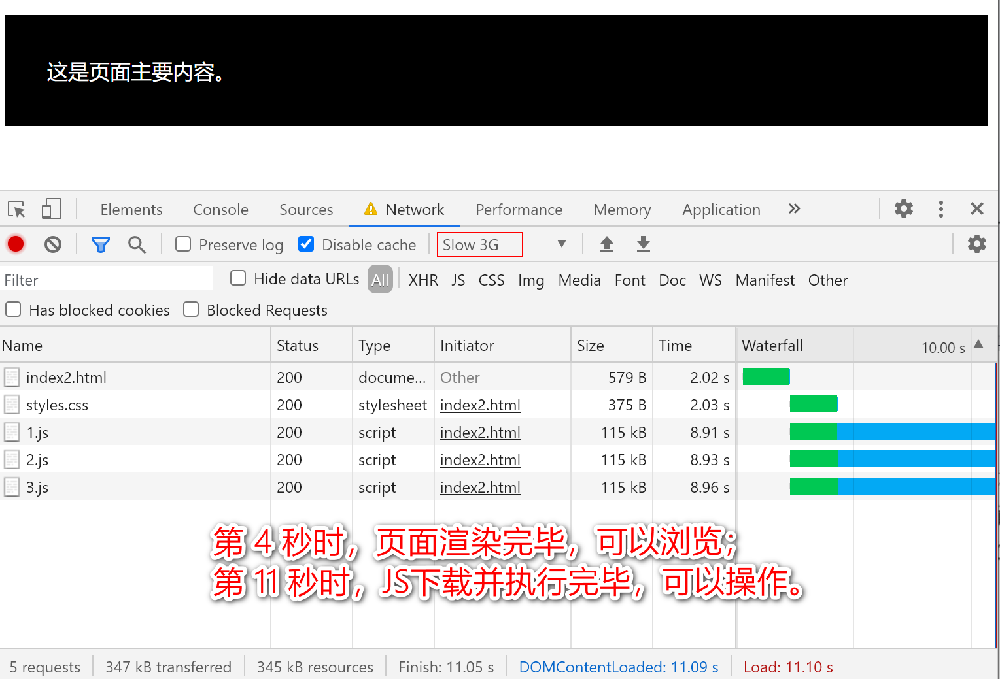

# 第 1 章 加载和执行

>《高性能 JavaScript》—— Nicholas C. Zakas

浏览器使用单一进程来处理用户界面刷新和 JS 脚本执行，所以同一时刻只能做一件事。
JS 执行过程耗时越久，用户界面冻结（未响应）的时间就越久。

```html
<html>
  <body>
    <script>
      document.write('这是一个广告');
    </script>

    <p>这是页面主要内容。</p>
  </body>
</html>
```

当浏览器遇到 `<script>` 标签，
浏览器不知道`<script>` 标签包含或引用的 JS 会干嘛，是增、删、改元素？是关闭页签？
因此浏览器会停止处理页面，先（下载并）执行 JS 代码，然后再继续解析、渲染页面。
这个过程中，页面渲染和用户交互式被完全阻塞的。

## 1. `<script>` 位置

>将 `<script>` 放在底部

将 `<script>`、`<link>` 放在一起并置于 `<head>` ，让它们先加载，
理论上来讲，这样做有助于确保正确地渲染页面和交互，如下：

```html
<html>
  <head>
    <script src="1.js"></script>
    <script src="2.js"></script>
    <script src="3.js"></script>
    <link href="styles.css" rel="stylesheet" type="text/css">    
  </head>
  <body>
    <p>这是页面主要内容。</p>
  </body>
</html>
```

这看似正常，但有十分严重的性能问题。
浏览器在解析 `<body>` 之前，不会渲染页面的任何部分；
`<head>` 中的 JS 全部下载并执行完毕后，才会继续渲染页面。
也就是说把脚本放在页面顶部会导致明显的延迟，表现为显示空白页面，用户不能浏览内容也不能操作页面。
如下的瀑布图，显示了 Chrome 浏览器资源文件的下载过程：



由于 JS 会阻塞页面的渲染，因此推荐将所有 `<script>` 尽可能放到 `<body>` 的底部，以降低对整个页面的渲染的影响，
代码如下：


```html
<!DOCTYPE html>
<html>
  <head>
    <link rel="stylesheet" href="styles.css">
  </head>
  <body>
    <p>这是页面主要内容。</p>
    <script src="1.js"></script>
    <script src="2.js"></script>
    <script src="3.js"></script>
  </body>
</html>
```

瀑布图如下：



尽管 JS 仍会阻塞，但页面的大部分内容已经下载并并显示给用户，因此页面下载不会显得太慢。