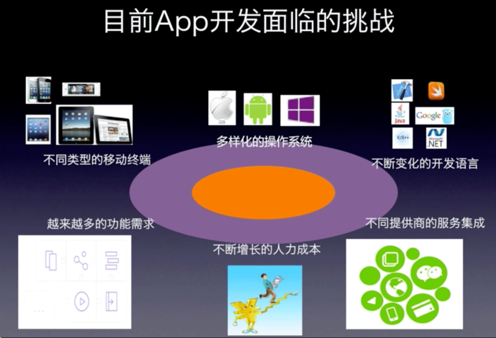
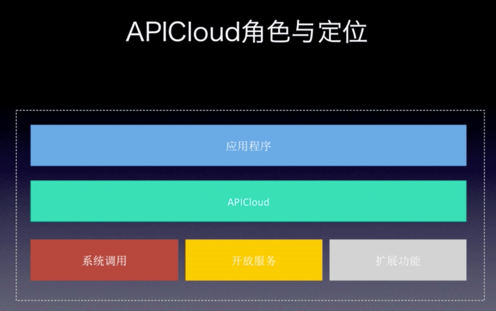

# 第一讲 欢迎来到APICloud的世界

目前 App 开发面临的挑战：

* 不同类型的移动终端
  * 手机、平板、电脑、TV、等等
* 多样化的操作系统
  * Android、iOS
* 不断变化的开发语言
  * APP：Java、Objective-C/Swift
  * 后端：Java、php、.net、Python
* 不同提供商的服务集成
  * 开放服务：分享、定位、地图、支付、推送、统计、等等
* 不断增长的人力成本
* 越来越多的功能需求

苦逼的传统开发流程：

1. Android 开发一遍、iOS 开发一遍
2. 搭建自己的服务器，设计数据库
3. 前后端的人坐在一起，讨论并确定接口，然后开发实现
4. 开发完了，联调、测试，大量的终端适配

目前 APP 开发最大的痛点：

* 传统的开发模式门槛高、成本高、效率低
* 跨平台模式开发的应用功能太弱、性能和体验太差

新的开放平台：

* 聚合 APP 开发所需要的一切功能，作为平台的能力，以统一的 API 形式提供给开发者
* 使用这种跨平台技术开发的 App 可以在功能、性能、体验上，与原生应用媲美
* 不仅仅是提供一个开发平台，同时也是一个通用、开放、标准的技术基础

APICloud 云端一体：（重新定义移动应用开发）

* 7 天： 传统开发（1 个安卓开发者和 1 个iOS开发者）一个月开发一款 App，平台只需要 7 天
* 减少 70% 的工作量

主要内容：

1. APICloud 是什么
2. 为什么要用 APICloud
3. 谁在用 APICloud
4. APICloud 应用类型
5. APICloud 商业与生态
6. APICloud 与 Web 技术
7. APICloud 开发流程

## 1. APICloud 是什么

APICloud 是中国领先的“**云端一体**”的**移动应用**云服务提供商，通过**端 API** 和**云 API** 来简化移动应用开发技术，可以帮助开发者快速实现移动应用的开发、测试、发布、运营等**全生命周期管理**。

云端一体：

* 既可以开发移动端的 App，也可以开发服务端的 service，从云到端在 APICloud 上就可以搞定
* 只需要掌握 JavaScript 一门语言就可以
* 提供了端 API 和云 API，且它们是一一对应的
* 端和云的开发使用同一种数据模型

移动应用：

* 只针对移动端
* 考虑了大量的机型

端 API：

* 完成移动端 App 的开发
* 包括：应用生命周期的管理、窗口的管理、网络通信、数据存储、多媒体的操作、开放 SDK 的调用、等等

云 API：

* 完成服务端的 service 的开发
* 包括：应用的配置、证书管理、代码管理、云端编译、统计分析、推送服务、等等

全生命周期管理：

* APICloud 提供一站式移动应用开发平台
* 从应用的开发、测试、发布、运营的全生命周期的管理

### 1.1. APICloud 角色与定位

APICloud 可以看做是中间层、中间件

## 2. 为什么要用 APICloud

特点：

* 快
* 标准
* 性能好
* 动态扩展
* 全终端适配
* 聚合开放服务