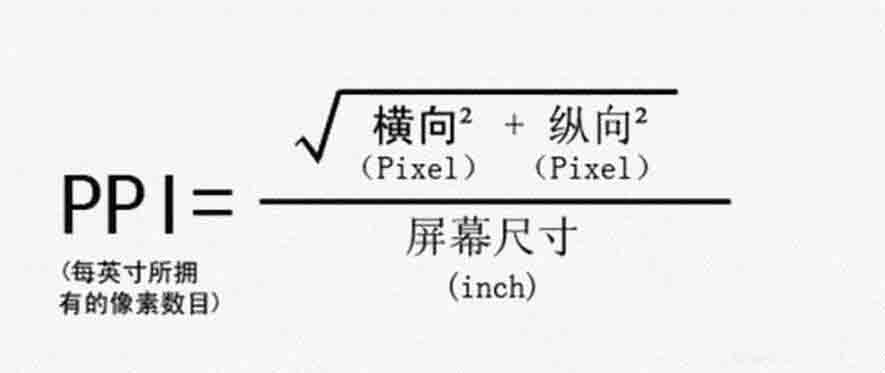

# 微信小程序开发框架

## 1. 基本构成

* wxml：内容
* wxss：样式
* wxs
* JavaScript：逻辑

## 2. wxml

### 2.1. 语法

说明：

* WXML：Weixin Markup Language
* 是框架设计的一套标签语言，结合组件、WXS、事件系统，可以构建出页面的结构

语法：

```xml
<标签名 属性名1="属性值1" 属性名2="属性值2" ...>
  ...
</标签名>
```

注意：

* 标签严格闭合
* 属性大小写敏感

### 2.2. 语言特性

* 数据绑定
* 列表渲染
* 条件渲染
* 模板引用

### 2.3. 数据绑定

mustache 语法：

* index.wxml

  ```xml
  <!-- 文本绑定 -->
  <view>{{ message }}</view>

  <!-- 属性值绑定 -->
  <text data-name="{{ name }}"></text>

  <view hidden="{{ flag ? true : false }}">
    表达式
  </view>
  ```

* index.js

  ```javascript
  Page({
    data: {
      message: 'Hello world!',
      name: '吴钦飞',
      flag: true,
    },
  });
  ```

### 2.4. 属性

所有标签都有的属性：

| 属性名 | 类型 | 描述 | 注解 |
| - | - | - | - |
| id | String | 唯一标志 | 保持整个页面唯一 |
| class | String | 样式类 | 在对于的 WXSS 中定义的样式类 |
| style | String | 内联样式 | 可动态设置 |
| hidden | Boolean | 是否显示 | 默认显示 |
| data-* | Any | 自定义属性 | 组件上触发事件时，会发送给事件处理函数 |
| bind* / catch* | EventHandler | 组件的事件 | 参考“事件” |

### 2.5. 列表渲染

* `index.wxml`

  ```xml
  <block wx:for="{{ items }}" wx:for-item="item" wx:key="item.id">
    <view>{{ index }} - {{ item.name }}</view>
  </block>
  ```

* `index.js`

  ```javascript
  Page({
    data: {
      items: [
        { id: 1, name: '哇哈哈' },
        { id: 2, name: '酸酸奶' },
        { id: 3, name: '优酸乳' },
      ],
    },
  });
  ```

### 2.6. 条件渲染

* `index.wxml`

  ```xml
  <view wx:if="{{ condition === 1 }}">条件 1</view>
  <view wx:elif="{{ condition === 2 }}">条件 2</view>
  <view wx:else>条件 3</view>
  ```

* `index.js`

  ```javascript
  Page({
    data: {
      condition: Math.floor(Math.random() * 3 + 1),
    },
  });
  ```

与 `hidden` 属性的区别：

* `hidden` 可类比 vue 中的 `v-show`
* `wx:if` 可类比 vue 中的 `v-if`

### 2.7. 模板引用

文件引用：

* `<import src="1.wxml" />` 只引入模板内容，且模板有独立的作用域
* `<include src="1.wxml" />` 只引入非模板内容

import：

* `layout.wxml`

  ```xml
  <view>页头</view>
  <template name="body">
    {{ message }}
  </template>
  <view>页脚</view>
  ```

* `import.wxml`：只引入模板

  ```xml
  <import src="/templates/layout.wxml" />
  <template is="body" data="{{ message }}"/>
  ```

* `include.wxml`：只引入非模板内容

  ```xml
  <include src="/templates/layout.wxml" />
  <template is="body" data="{{ message }}"/>
  ```

## 3. WXSS

### 3.1. 介绍

说明：

* CSS：是描述 HTML、XML 文档呈现的样式语言
* WXSS(WeiXin Style Sheets)
  * 是描述 WXML 的组件样式的样式语言
  * WXSS 覆盖了 CSS 绝大部分属性，并且做了部分修改和补充

区别：

* 尺寸单位 rpx
* 样式导入
* 内联样式
* 选择器

### 3.2. 尺寸单位 rpx

关于单位：

* 设备像素（device pixels）：设备上一个一个固定不动的点
* CSS 像素（CSS pixels）：样式表中使用的逻辑像素
* PPI/DPI（pixel per inch）：一英寸上有多少个CSS 像素
* DPR（device pixel ratio）：设备像素与CSS像素之比
* RPX（pesponse pixel）：规定屏幕宽度 750rpx，进行自适应

PPI 的计算公式：

* 
* 以 iPhone 6 为例

  ```javascript
  Math.sqrt(Math.pow(750, 2) + Math.pow(1334, 2)) / 4.7
  // 325.6122832234166
  ```
