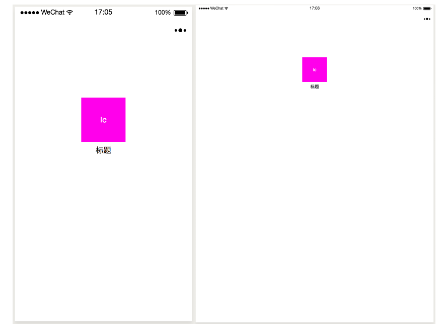
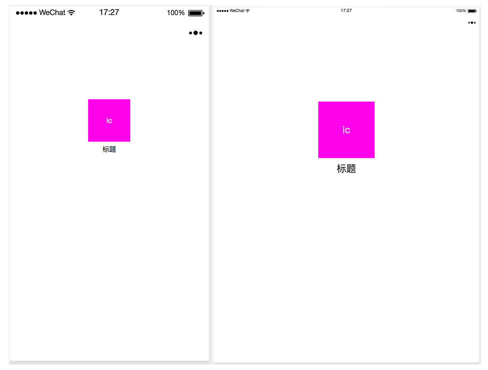
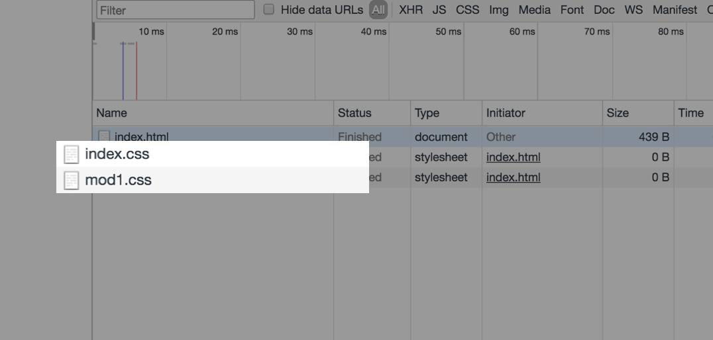
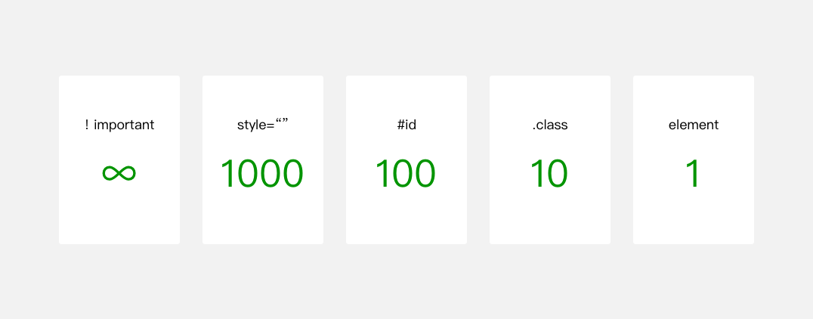

# 第 2 章 小程序代码组成

小程序由配置代码 JSON 文件、模板代码 WXML 文件、样式代码 WXSS 文件以及逻辑代码 JavaScript 文件组成。

本章会结合读者在上一章中创建的 Quick Start 项目对这几种文件做简单的介绍，建议大家读写并行，从而对小程序的代码组成有一个大致的理解。

## 1. JSON 配置

JSON 是一种数据格式，并不是编程语言，在小程序中，JSON 扮演的静态配置的角色。

### 1.1. 一个例子

先看一个例子，打开开发工具的编辑器，在根目录下可以找到 app.json 文件，双击打开，代码如下：

代码清单2-1 app.json文件代码

```javascript
{
  "pages":[
    "pages/index/index",
    "pages/logs/logs"
  ],
  "window":{
    "backgroundTextStyle":"light",
    "navigationBarBackgroundColor": "#fff",
    "navigationBarTitleText": "WeChat",
    "navigationBarTextStyle":"black"
  }
}
```

尝试修改第 9 行为 "navigationBarTitleText": "MiniProgram" ，保存代码，开发者工具自动刷新后，注意到模拟器顶部 bar 的文本字段由 Wechat 变为了 MiniProgram。

JSON文件在小程序代码中扮演静态配置的作用，在小程序运行之前就决定了小程序一些表现，需要注意的是小程序是无法在运行过程中去动态更新JSON 配置文件从而发生对应的变化的。

### 1.2. JSON 语法

相比于XML ，JSON格式最大的优点是易于人的阅读和编写，通常不需要特殊的工具，就能读懂和修改，是一种轻量级的数据交换格式。

JSON 文件都是被包裹在一个大括号中 {}，通过 key-value 的方式来表达数据。

看起来同 JavaScript 的对象表达方式十分相似，但是有所不同。

JSON 的 Key 必须包裹在一个双引号中，在实践中，编写 JSON 的时候，忘了给  Key 值加双引号或者是把双引号写成单引号是常见错误。

JSON的值只能是以下几种数据格式：

* 数字，包含浮点数和整数
* 字符串，需要包裹在双引号中
* Bool值，true 或者 false
* 数组，需要包裹在方括号中 []
* 对象，需要包裹在大括号中 {}
* Null

其他任何格式都会触发报错，例如 JavaScript 中的 undefined 。

还需要注意的是 JSON 文件中无法使用注释，试图添加注释将会引发报错。

## 2. WXML 模板

WXML 全称是 WeiXin Markup Language，是小程序框架设计的一套标签语言，结合小程序的基础组件、事件系统，可以构建出页面的结构。

打开开发工具的编辑器，在根目录下找到 `app.json` 文件，双击打开，在  `"pages/index/index"` 上新增一行 `"pages/wxml/index"` 保存文件。模拟器刷新后，读者可以在编辑器中找到 `pages/wxml/index.wxml` 文件，本小结的学习通过修改这个文件来完成。

### 2.1. 介绍

WXML 文件后缀名是 `.wxml` ，打开 `pages/wxml/index.wxml` 文件，有过 HTML 的开发经验的读者应该会很熟悉这种代码的书写方式，简单的 WXML 语句在语法上同 HTML 非常相似。

```xml
<!--pages/wxml/index.wxml-->

<text>pages/wxml/index.wxml</text>
```

不带有任何逻辑功能的 WXML 基本语法如下：

```xml
<!-- 在此处写注释 -->

<标签名 属性名1="属性值1" 属性名2="属性值2" ...> ...</标签名>
```

​一个完整的 WXML语句由一段开始标签和一段结束标签组成，在标签中可以是内容，也可以是其他的 WXML 语句，这一点上同 HTML 是一致的。有所不同的是，WXML 要求标签必须是严格闭合的，没有闭合将会导致编译错误。

​标签可以拥有属性，属性提供了有关的 WXML元素更多信息。属性总是定义在开始标签中，除了一些特殊的属性外，其余属性的格式都是 `key="value"` 的方式成对出现。需要注意的是，WXML 中的属性是大小写敏感的，也就是说 `class` 和 `Class` 在 WXML 中是不同的属性，代码 2-3 是一个文本标签的示例。

代码清单2-3 WXML 标签

```xml
<!--一个简单的文本标签 -->
<text>hello world</text>

<!-- view 中包含了 text 标签 -->
<view>
  <text>hello world</text>
</view>
```

代码 2-4 是一个带属性的图片标签的例子。

代码清单 2-4 带有属性的图片标签：

```xml
<image class="userinfo-avatar" src="./image/a.png" ></image>
```

### 2.2. 数据绑定

用户界面呈现会因为当前时刻数据不同而有所不同，或者是因为用户的操作发生动态改变，这就要求程序的运行过程中，要有动态的去改变渲染界面的能力。在 Web 开发中，开发者使用 JavaScript 通过 DOM 接口来完成界面的实时更新。在小程序中，使用 WXML 语言所提供的数据绑定功能，来完成此项功能。

先看一个简单的例子。

将 `pages/wxml/index.wxml` 文件的内容做一些简单的修改，如代码 2-5 所示。

代码清单 2-5，数据绑定示例：

```xml
<!--pages/wxml/index.wxml-->
<text>当前时间：{{time}}</text>
```

​保存后工具刷新，模拟器并没有显示出当前的时间，这是因为我们并没有给 `time` 设置任何初始值，请打开 `pages/wxml/index.js` 文件，在 `data` 的大括号中加入：`time: (new Date()).toString()`。

如代码 2-6 所示。

代码清单 2-6，数据绑定示例：

```javascript
// pages/wxml/index.js
Page({
  /**
   * 页面的初始数据
   */
  data: {
    time: (new Date()).toString()
  },
})
```

保存，模拟器刷新后正确的展示了当前时间，并且每次编译时间都会被更新。

WXML 通过 `{{变量名}}` 来绑定 WXML 文件和对应的 JavaScript 文件中的 `data` 对象属性。

后文中为了保持简单，通过以下格式来展示上述的代码逻辑，使用第一段注释来表明 WXML 对应的脚本文件中的 `data` 结构。

代码清单 2-7，展示格式：

```xml
<!--
{
  time: (new Date()).toString()
}
-->
<text>当前时间：{{time}}</text>
```

属性值也可以动态的去改变，有所不同的是，属性值必须被包裹在双引号中，如下：

代码清单 2-8， 属性值的绑定：

```xml
<!-- 正确的写法 -->
<text data-test="{{test}}"> hello world</text>


<!-- 错误的写法  -->
<text data-test={{test}}> hello world </text >
```

需要注意的是变量名是大小写敏感的，也就是说 `{{name}}` 和 `{{Name}}` 是两个不同的变量。

代码清单2-9， 绑定的变量大小写敏感：

```xml
<!--
{
  q: 'q',
  Q: 'Q'
}
-->


<view>{{q}}</view>
<view>{{Q}}</view>


<!-- 输出
q
Q
-->
```

还需要注意，没有被定义的变量的或者是被设置为 `undefined` 的变量不会被同步到 wxml 中，如代码2-10所示。

代码清单 2-10，`undefined` 值不会被输出到 wxml 中：

```xml
<!--
{
  var2: undefined,
  var3: null,
  var4: "var4"
}
-->


<view>{{var1}}</view>
<view>{{var2}}</view>
<view>{{var3}}</view>
<view>{{var4}}</view>


<!--
输出：
  null
  var4
-->
```

关于数据绑定的概念在第三章中有更为详细的介绍。

### 2.3. 逻辑语法

通过 `{{ 变量名 }}` 语法可以使得 WXML 拥有动态渲染的能力，除此外还可以在 `{{ }}` 内进行简单的逻辑运算。

三元运算：

```xml
<!-- 根据 a 的值是否等于 10 在页面输出不同的内容 -->
<text>{{ a === 10 ? "变量 a 等于10" : "变量 a 不等于10"}}</text>
```

算数运算：

```xml
<!--
{ a: 1,  b: 2, c: 3 }
-->


<view> {{a + b}} + {{c}} + d </view>


<!-- 输出 3 + 3 + d -->
```

类似于算数运算，还支持字符串的拼接，如代码 2-11 所示。

代码清单 2-11 字符串的拼接

```xml
<!--
{ name: 'world' }
-->


<view>{{"hello " + name}}</view>


<!-- 输出 hello world -->
```

`{{ }}` 中还可以直接放置数字、字符串或者是数组

代码清单 2-12 常量

```xml
<text>{{[1,2,3]}}</text>

<!-- 输出 1,2,3 -->


<text>{{"hello world"}}</text>

<!-- 输出 hello world -->
```

### 2.4. 条件逻辑

WXML 中，使用 `wx:if="{{condition}}"` 来判断是否需要渲染该代码块：

```xml
<view wx:if="{{condition}}"> True </view>
```

使用 `wx:elif` 和 `wx:else` 来添加一个 `else` 块：

```xml
<view wx:if="{{length > 5}}"> 1 </view>
<view wx:elif="{{length > 2}}"> 2 </view>
<view wx:else> 3 </view>
```

因为 `wx:if` 是一个控制属性，需要将它添加到一个标签上。如果要一次性判断多个组件标签，可以使用一个 `<block/>` 标签将多个组件包装起来，并在上边使用 `wx:if` 控制属性。

```xml
<block wx:if="{{true}}">
  <view> view1 </view>
  <view> view2 </view>
</block>
```

### 2.5. 列表渲染

在组件上使用 `wx:for` 控制属性绑定一个数组，即可使用数组中各项的数据重复渲染该组件。默认数组的当前项的下标变量名默认为 `index`，数组当前项的变量名默认为 `item`

代码清单 2-13 列表渲染示例

```xml
<!-- array 是一个数组 -->
<view wx:for="{{array}}">
  {{index}}: {{item.message}}
</view>

<!-- 对应的脚本文件
Page({
  data: {
    array: [
      { message: 'foo' },
      { message: 'bar' },
    ],
  },
});
-->
```

使用 `wx:for-item` 指定数组当前元素的变量名，使用 `wx:for-index` 指定数组当前下标的变量名：

```xml
<view wx:for="{{array}}" wx:for-index="idx" wx:for-item="itemName">
  {{idx}}: {{itemName.message}}
</view>
```

类似 `block wx:if` ，也可以将 `wx:for` 用在 `<block/>` 标签上，以渲染一个包含多节点的结构块。例如：

```xml
<block wx:for="{{[1, 2, 3]}}">
  <view> {{index}}: </view>
  <view> {{item}} </view>
</block>
```

如果列表中项目的位置会动态改变或者有新的项目添加到列表中，并且希望列表中的项目保持自己的特征和状态（如 `<input/>` 中的输入内容， `<switch/>` 的选中状态），需要使用 `wx:key` 来指定列表中项目的唯一的标识符。

`wx:key` 的值以两种形式提供：

1. 字符串，代表在 `for` 循环的 `array` 中 `item` 的某个 `property`，该 `property` 的值需要是列表中唯一的字符串或数字，且不能动态改变。
2. 保留关键字 `this` 代表在 `for` 循环中的 `item` 本身，这种表示需要 `item` 本身是一个唯一的字符串或者数字，如：

当数据改变触发渲染层重新渲染的时候，会校正带有 `key` 的组件，框架会确保他们被重新排序，而不是重新创建，以确保使组件保持自身的状态，并且提高列表渲染时的效率。

代码清单 2-14 使用 `wx:key` 示例（WXML）

```xml
<!-- item 中的某个能唯一标志该 item 的属性名 -->
<switch wx:for="{{objectArray}}" wx:key="unique" > {{item.id}} </switch>
<button bindtap="switch"> Switch </button>
<button bindtap="addToFront"> Add to the front </button>

<!-- item 本身就是唯一的数字或字符串 -->
<switch wx:for="{{numberArray}}" wx:key="*this" > {{item}} </switch>
<button bindtap="addNumberToFront"> Add Number to the front </button>
```

代码清单 2-15 使用 `wx:key` 示例（JavaScript）

```javascript
Page({
  data: {
    objectArray: [
      {id: 5, unique: 'unique_5'},
      {id: 4, unique: 'unique_4'},
      {id: 3, unique: 'unique_3'},
      {id: 2, unique: 'unique_2'},
      {id: 1, unique: 'unique_1'},
      {id: 0, unique: 'unique_0'},
    ],
    numberArray: [1, 2, 3, 4]
  },
  switch: function(e) {
    const length = this.data.objectArray.length
    for (let i = 0; i < length; ++i) {
      const x = Math.floor(Math.random() * length)
      const y = Math.floor(Math.random() * length)
      const temp = this.data.objectArray[x]
      this.data.objectArray[x] = this.data.objectArray[y]
      this.data.objectArray[y] = temp
    }
    this.setData({
      objectArray: this.data.objectArray
    })
  },
  addToFront: function(e) {
    const length = this.data.objectArray.length
    this.data.objectArray = [{id: length, unique: 'unique_' + length}].concat(this.data.objectArray)
    this.setData({
      objectArray: this.data.objectArray
    })
  },
  addNumberToFront: function(e){
    this.data.numberArray = [ this.data.numberArray.length + 1 ].concat(this.data.numberArray)
    this.setData({
      numberArray: this.data.numberArray
    })
  }
})
```

### 2.6. 模板

WXML提供模板（template），可以在模板中定义代码片段，然后在不同的地方调用。使用 `name` 属性，作为模板的名字。然后在 `<template/>` 内定义代码片段，如：

代码清单 2-16 定义模板

```xml
<template name="msgItem">
  <view>
    <text> {{index}}: {{msg}} </text>
    <text> Time: {{time}} </text>
  </view>
</template>
```

使用 `is` 属性，声明需要的使用的模板，然后将模板所需要的 `data` 传入，如代码 2-17 所示。

```xml
<!--
item: {
  index: 0,
  msg: 'this is a template',
  time: '2016-06-18'
}
-->


<template name="msgItem">
  <view>
    <text> {{index}}: {{msg}} </text>
    <text> Time: {{time}} </text>
  </view>
</template>


<template is="msgItem" data="{{...item}}"/>

<!-- 输出
0: this is a template Time: 2016-06-18
-->
```

`is` 可以动态决定具体需要渲染哪个模板，如代码 2-18 所示。

代码清单 2-18 动态使用模板

```xml
<template name="odd">
  <view> odd </view>
</template>


<template name="even">
  <view> even </view>
</template>


<block wx:for="{{[1, 2, 3, 4, 5]}}">
  <template is="{{item % 2 == 0 ? 'even' : 'odd'}}"/>
</block>


<!-- 输出
odd
even
odd
even
odd
-->
```

### 2.7. 引用

WXML 提供两种文件引用方式 `import` 和 `include`。

`import` 可以在该文件中使用目标文件定义的 `template`，如：

在 `item.wxml` 中定义了一个叫 `item` 的 `template` ：

```xml
<!-- item.wxml -->
<template name="item">
  <text>{{text}}</text>
</template>
```

在 `index.wxml` 中引用了 `item.wxml`，就可以使用 `item` 模板：

```xml
<import src="item.wxml"/>

<template is="item" data="{{text: 'forbar'}}"/>
```

需要注意的是 `import` 有作用域的概念，即只会 `import` 目标文件中定义的 `template`，而不会 `import` 目标文件中 `import` 的 `template`，简言之就是 `import` 不具有递归的特性。

例如：`C` 引用 `B`，`B` 引用 `A`，在 `C` 中可以使用 `B` 定义的 `template`，在 `B` 中可以使用 `A` 定义的 `template` ，但是 `C` 不能使用 `A` 定义的 `template` ，如代码 2-19、代码 2-20、代码 2-21 所示。

代码清单 2-19 模板 A

```xml
<!-- A.wxml -->
<template name="A">
  <text> A template </text>
</template>
```

代码清单 2-20 模板 B

```xml
<!-- B.wxml -->
<import src="A.wxml"/>

<template name="B">
  <text> B template </text>
</template>
```

代码清单 2-21 模板 C

```xml
<!-- C.wxml -->
<import src="B.wxml"/>

<template is="A"/>  <!-- 这里将会触发一个警告，因为 b 中并没有定义模板 A -->

<template is="B"/>
```

`include` 可以将目标文件中除了 `<template/> <wxs/>` 外的整个代码引入，相当于是拷贝到 `include` 位置，如代码 2-22、代码 2-23、代码 2-24 所示。

代码清单 2-22 `index.wxml`

```xml
<!-- index.wxml -->
<include src="header.wxml"/>

<view> body </view>

<include src="footer.wxml"/>
```

代码清单 2-23 `header.wxml`

```xml
<!-- header.wxml -->
<view> header </view>
```

代码清单 2-24 `footer.wxml`

```xml
<!-- footer.wxml -->
<view> footer </view>
```

### 2.8. 共同属性

所有 wxml 标签都支持的属性称之为共同属性，如表 2-1 所示。

表 2-1 共同属性：

| 属性名 | 类型 | 描述 | 注解 |
| - | - | - | - |
| `id` | String | 组件的唯一标识 | 整个页面唯一 |
| `class` | String | 组件的样式类 | 在对应的 WXSS 中定义的样式类 |
| `style` | String | 组件的内联样式 | 可以动态设置的内联样式 |
| `hidden` | Boolean | 组件是否显示 | 所有组件默认显示 |
| `data-*` | Any | 自定义属性 | 组件上触发的事件时，会发送给事件处理函数|
| `bind*`/`catch*` | EventHandler | 组件的事件 | |

## 3. WXSS 样式

WXSS（WeiXin Style Sheets）是一套用于小程序的样式语言，用于描述 WXML 的组件样式，也就是视觉上的效果。

WXSS 与 Web 开发中的 CSS 类似。为了更适合小程序开发，WXSS 对 CSS 做了一些补充以及修改。

### 3.1. 文件组成

项目公共样式：

* 根目录中的 `app.wxss` 为项目公共样式，它会被注入到小程序的每个页面。

页面样式：

* 与 `app.json` 注册过的页面同名且位置同级的 WXSS 文件。
* 比如 `app.json` 注册了 `pages/rpx/index` 页面，
* 那 `pages/rpx/index.wxss` 就是页面 `pages/rpx/index.wxml` 的样式。

其它样式：

* 其它样式可以被项目公共样式和页面样式引用，引用方法查看本章中的 2.3.3 小节。

在小程序开发中，开发者不需要像 Web 开发那样去优化样式文件的请求数量，只需要考虑代码的组织即可。样式文件最终会被编译优化，具体的编译原理我们留在后面章节再做介绍。

### 3.2. 尺寸单位

在 WXSS 中，引入了 rpx（responsive pixel）尺寸单位。引用新尺寸单位的目的是，适配不同宽度的屏幕，开发起来更简单。

如图 2-9 所示，同一个元素，在不同宽度的屏幕下，如果使用 `px` 为尺寸单位，有可能造成页面留白过多。

图 2-9，使用 `px` 尺寸单位，iPhone5 与 iPad 视觉对比：

* 

修改为 `rpx` 尺寸单位，效果如图 2-10 所示。

图 2-10 使用 `rpx` 尺寸单位， iPhone5 与 iPad 视觉对比：

* 

小程序编译后，`rpx` 会做一次 `px` 换算。换算是以 375 个物理像素为基准，也就是在一个宽度为 375 物理像素的屏幕下，`1rpx = 1px`。

举个例子：iPhone6 屏幕宽度为 `375px`，共 750 个物理像素，那么 `1rpx = 375 / 750 px = 0.5px`。

图 2-11 常用机型 rpx 尺寸换算表：

* 

### 3.3. WXSS 引用

在 CSS 中，开发者可以这样引用另一个样式文件： `@import url('./test_0.css')`

这种方法在请求上不会把 `test_0.css` 合并到 `index.css` 中，也就是请求 `index.css` 的时候，会多一个 `test_0.css` 的请求。



在小程序中，我们依然可以实现样式的引用，样式引用是这样写：

```css
@import './test_0.wxss'
```

由于 WXSS 最终会被编译打包到目标文件中，用户只需要下载一次，在使用过程中不会因为样式的引用而产生多余的文件请求。

### 3.4. 内联样式

WXSS 内联样式与 Web 开发一致:

```xml
<!--index.wxml-->

<!--内联样式-->
<view style="color: red; font-size: 48rpx"></view>
```

小程序支持动态更新内联样式：

```xml
<!--index.wxml-->

<!--可动态变化的内联样式-->
<!--
{
  eleColor: 'red',
  eleFontsize: '48rpx'
}
-->
<view style="color: {{eleColor}}; font-size: {{eleFontsize}}"></view>
```

### 3.5. 选择器

目前支持的选择器如表 2-2 所示。

表 2-2 小程序WXSS支持的选择器：

| 类型 |  选择器 | 样例 | 样例描述 |
| - | - | - | - |
| 类选择器 | `.class` | `.intro` | 选择所有拥有 `class="intro"` 的组件 |
| id选择器 | `#id` | `#firstname` | 选择拥有 `id="firstname"` 的组件 |
| 元素选择器 | `element` | `view` `checkbox` | 选择所有文档的 view 组件和所有的 checkbox 组件 |
| 伪元素选择器 | `::after` | `view::after` | 在 view 组件后边插入内容 |
| 伪元素选择器 | `::before` | `view::before` | 在 view 组件前边插入内容 |

WXSS 优先级与 CSS 类似，权重如图 2-13 所示。

图 2-13 WXSS 选择器优先级：



权重越高越优先。在优先级相同的情况下，后设置的样式优先级高于先设置的样式。

代码清单 2-25， WXSS 选择器优先级权重：

```scss
view { // 权重为 1
  color: blue;
}

.ele { // 权重为 10
  color: red;
}

#ele { // 权重为 100
  color: pink;
}

view#ele { // 权重为 1 + 100 = 101，优先级最高，元素颜色为orange
  color: orange;
}

view.ele { // 权重为 1 + 10 = 11
  color: green;
}
```
