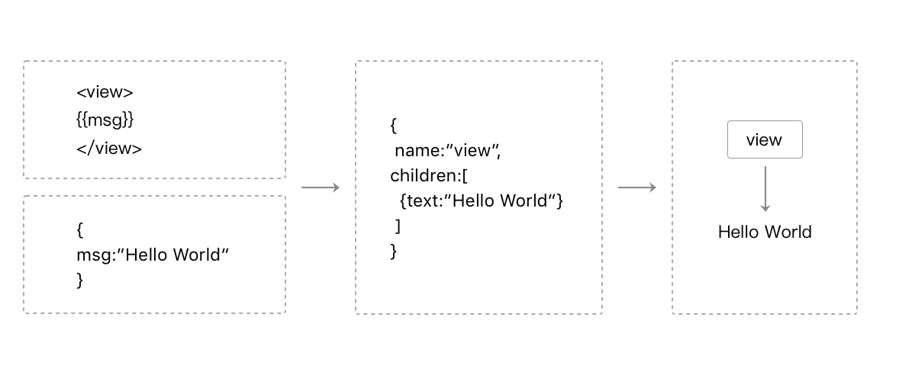
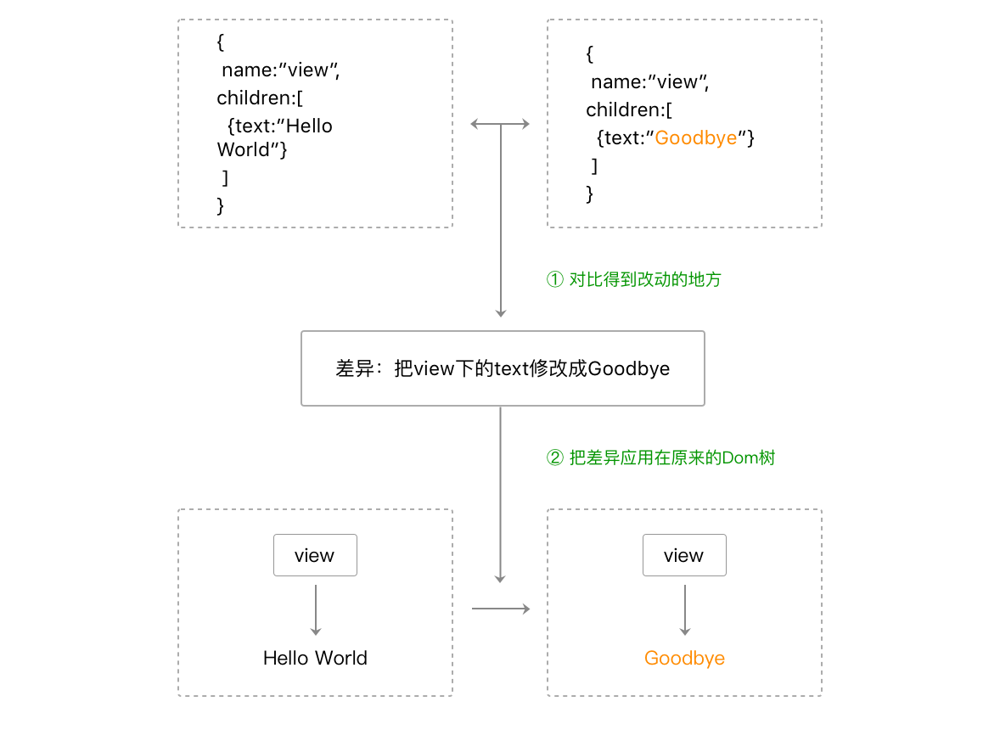
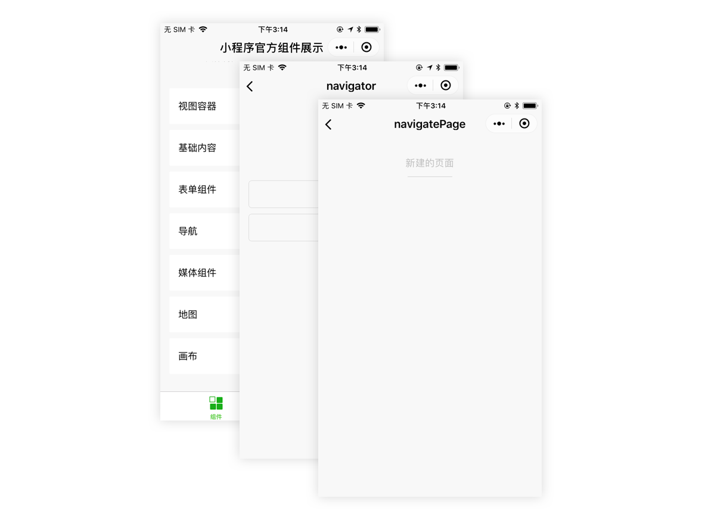
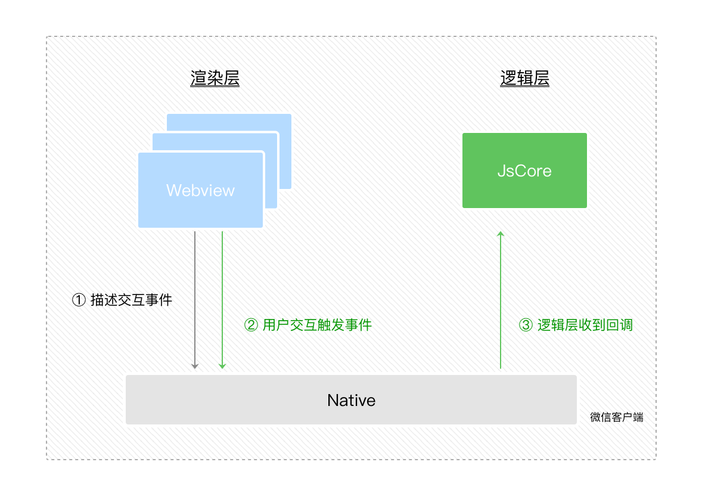

# 第 3 章：理解小程序宿主环境

第 2 章介绍了小程序的文件构成，那么这些文件在微信客户端是怎么协同工作的呢？在本章中我们会介绍微信客户端给小程序所提供的宿主环境，下文我们把这个概念简称为宿主或者宿主环境。

小程序可以调用宿主环境提供的微信客户端的能力，这就使得小程序比普通网页拥有更多的能力。你也会了解到，你的小程序会运行在不同版本的宿主环境下，因此针对各个版本的宿主环境做程序上的兼容也是在所难免的。

## 1. 渲染层和逻辑层

小程序的运行环境分成渲染层和逻辑层，第 2 章提到过 WXML 模板和 WXSS 样式工作在渲染层，JS 脚本工作在逻辑层。小程序的渲染层和逻辑层分离是经过很多考虑得出来的模型，在第 6 章我们会详细阐述这个模型背后的原理以及产生的问题。在本章我们会先介绍这个模型的基本工作方式。

### 1.1. 渲染“Hello World”页面

我们看看小程序是如何把脚本里边的数据渲染在界面上的。

WXML 模板使用 `view` 标签，其子节点用 `{{ }}` 的语法绑定一个 `msg` 的变量，如代码清单 3-1 所示。

代码清单 3-1， 渲染 “`Hello World`” WXML 代码：

```xml
<view>{{ msg }}</view>
```

在 JS 脚本使用 `this.setData` 方法把 `msg` 字段设置成 “`Hello World`” ，如代码清单 3-2 所示。

代码清单 3-2， 渲染 “`Hello World`” JS脚本：

```javascript
Page({
  onLoad: function () {
    this.setData({ msg: 'Hello World' })
  }
})
```

从这个例子我们可以看到 3 个点：

* 渲染层和数据相关。
* 逻辑层负责产生、处理数据。
* 逻辑层通过 `Page` 实例的 `setData` 方法传递数据到渲染层。

关于第 1 点，涉及了“数据驱动”的概念，我们会在 3.1.3 节详细讨论，我们现在先看看第 3 点涉及的“通信模型”。

### 1.2. 通信模型

小程序的渲染层和逻辑层分别由 2 个线程管理：

* 渲染层的界面使用了 `WebView` 进行渲染；
* 逻辑层采用 JsCore 线程运行JS脚本。

一个小程序存在多个界面，所以渲染层存在多个 WebView 线程，这两个线程的通信会经由微信客户端（下文中也会采用 Native 来代指微信客户端）做中转，逻辑层发送网络请求也经由 Native 转发，小程序的通信模型如图 3-1 所示。

图 3-1， 渲染层和逻辑层通信模型：

* 

### 1.3. 数据驱动

在开发 UI 界面过程中，程序需要维护很多变量状态，同时要操作对应的UI元素。随着界面越来越复杂，我们需要维护很多变量状态，同时要处理很多界面上的交互事件，整个程序变得越来越复杂。通常界面视图和变量状态是相关联的，如果有某种“方法”可以让状态和视图绑定在一起（状态变更时，视图也能自动变更），那我们就可以省去手动修改视图的工作。

这个方法就是“数据驱动”，下边我们来介绍一下小程序的数据驱动基本原理。

WXML 结构实际上等价于一棵 Dom 树，通过一个 JS 对象也可以来表达 Dom 树的结构，如图 3-2 所示。

图 3-2 WXML结构和JS对象均可以表示一棵 Dom 树：

* 

WXML 可以先转成 JS 对象，然后再渲染出真正的 Dom 树，回到 “Hello World” 那个例子，我们可以看到转换的过程如图 3-3 所示。

图 3-3 WXML结构转JS对象，再转Dom树：

* 

通过 `setData` 把 `msg` 数据从 “`Hello World`” 变成 “`Goodbye`”，产生的 JS 对象对应的节点就会发生变化，此时可以对比前后两个 JS 对象得到变化的部分，然后把这个差异应用到原来的 Dom 树上，从而达到更新 UI 的目的，这就是“数据驱动”的原理，如图 3-4 所示。

图3-4 状态更新的时候，通过对比前后JS对象变化，进而改变视图层的Dom树：

* 

### 1.4. 双线程下的界面渲染

小程序的逻辑层和渲染层是分开的两个线程。在渲染层，宿主环境会把 WXML 转化成对应的JS对象，在逻辑层发生数据变更的时候，我们需要通过宿主环境提供的 setData 方法把数据从逻辑层传递到渲染层，再经过对比前后差异，把差异应用在原来的 Dom 树上，渲染出正确的 UI 界面，如图 3-5 所示。

图3-5 逻辑层传递数据到渲染层：

* 

## 2. 程序与页面

从逻辑组成来说，一个小程序是由多个“页面”组成的“程序”。这里要区别一下“小程序”和“程序”的概念，往往我们需要在“程序”启动或者退出的时候存储数据或者在“页面”显示或者隐藏的时候做一些逻辑处理，了解程序和页面的概念以及它们的生命周期是非常重要的。

### 2.1. 程序

“小程序”指的是产品层面的程序，而“程序”指的是代码层面的程序实例，为了避免误解，下文采用 App 来代替代码层面的“程序”概念。

#### 2.1.1. 程序构造器 `App()`

宿主环境提供了 `App()` 构造器用来注册一个程序 App，需要留意的是 `App()` 构造器必须写在项目根目录的 `app.js` 里，`App` 实例是单例对象，在其他 JS 脚本中可以使用宿主环境提供的 `getApp()` 来获取程序实例。

代码清单 3-3， `getApp()` 获取 `App` 实例

```javascript
// other.js
var appInstance = getApp()
```

`App()` 的调用方式如代码清单 3-4 所示，`App` 构造器接受一个 `Object` 参数，参数说明如表 3-1 所示，其中 `onLaunch` / `onShow` / `onHide` 三个回调是 `App` 实例的生命周期函数，我们会在后文展开；`onError` 我们暂时不在本章展开，我们会在第 8 章里详细讨论；`App` 的其他参数我们也放在后文进行展开。

代码清单 3-4， App 构造器：

```javascript
App({
  onLaunch: function(options) {},
  onShow: function(options) {},
  onHide: function() {},

  onError: function(msg) {},

  globalData: 'I am global data'
})
```

表 3-1 `App` 构造器的参数：

| 参数属性 | 类型 | 描述 |
| - | - | - |
| `onLaunch` | Function | 当小程序初始化完成时，会触发 `onLaunch`（全局只触发一次） |
| `onShow` | Function | 当小程序启动，或从后台进入前台显示，会触发 `onShow` |
| `onHide` | Function | 当小程序从前台进入后台，会触发 `onHide` |
| `onError` | Function | 当小程序发生脚本错误，或者 API 调用失败时，会触发 `onError` 并带上错误信息 |
| 其他字段 | 任意 | 可以添加任意的函数或数据到 `Object` 参数中，在 `App` 实例回调用 `this` 可以访问 |

#### 2.1.2. 程序的生命周期和打开场景

初次进入小程序的时候，微信客户端初始化好宿主环境，同时从网络下载或者从本地缓存中拿到小程序的代码包，把它注入到宿主环境，初始化完毕后，微信客户端就会给 `App` 实例派发 `onLaunch` 事件，`App` 构造器参数所定义的 `onLaunch` 方法会被调用。

进入小程序之后，用户可以点击右上角的关闭，或者按手机设备的 Home 键离开小程序，此时小程序并没有被直接销毁，我们把这种情况称为“小程序进入后台状态”，`App` 构造器参数所定义的 `onHide` 方法会被调用。

当再次回到微信或者再次打开小程序时，微信客户端会把“后台”的小程序唤醒，我们把这种情况称为“小程序进入前台状态”，`App` 构造器参数所定义的 `onShow` 方法会被调用。

我们可以看到，`App` 的生命周期是由微信客户端根据用户操作主动触发的。为了避免程序上的混乱，我们不应该从其他代码里主动调用 `App` 实例的生命周期函数。

在微信客户端中打开小程序有很多途径：从群聊会话里打开，从小程序列表中打开，通过微信扫一扫二维码打开，从另外一个小程序打开当前小程序等，针对不同途径的打开方式，小程序有时需要做不同的业务处理，所以微信客户端会把打开方式带给 `onLaunch` 和 `onShow` 的调用参数 `options`，示例代码以及详细参数如代码清单 3-5 和表 3-2 所示。需要留意小程序的宿主环境在迭代更新过程会增加不少打开场景，因此要获取最新的场景值说明请查看官方文档：[https://mp.weixin.qq.com/debug/wxadoc/dev/framework/app-service/app.html](https://mp.weixin.qq.com/debug/wxadoc/dev/framework/app-service/app.html)。

代码清单 3-5 `onLaunch和onShow` 带参数

```javascript
App({
  onLaunch: function(options) { console.log(options) },
  onShow: function(options) { console.log(options) }
})
```

表 3-2 `onLaunch`, `onShow` 参数

| 字段 | 类型 | 描述 |
| - | - | - |
| `path` | String | 打开小程序的页面路径 |
| `query` | Object | 打开小程序的页面参数 query |
| `scene` | Number | 打开小程序的场景值，详细场景值请参考小程序官方文档 |
| `shareTicket` | String | shareTicket，详见小程序官方文档 |
| `referrerInfo` | Object | 当场景为由从另一个小程序或公众号或 App 打开时，返回此字段 |
| `referrerInfo.appId` | String | 来源小程序或公众号或 App 的 appId，详见下方说明 |
| `referrerInfo.extraData` | Object | 来源小程序传过来的数据，scene=1037或1038时支持 |

表 3-3 以下场景支持返回 `referrerInfo.appId`

| 场景值 | 场景 | appId 信息含义 |
| - | - | - |
| 1020 | 公众号 profile | 页相关小程序列表 返回来源公众号 appId |
| 1035 | 公众号自定义菜单 | 返回来源公众号 appId |
| 1036 | App 分享消息卡片 | 返回来源应用 appId |
| 1037 | 小程序打开小程序 | 返回来源小程序 appId |
| 1038 | 从另一个小程序返回 | 返回来源小程序 appId |
| 1043 | 公众号模板消息 | 返回来源公众号 appId |

#### 2.1.3. 小程序全局数据

我们在 3.1.2 节说到小程序的 JS 脚本是运行在 JsCore 的线程里，小程序的每个页面各自有一个 WebView 线程进行渲染，所以小程序切换页面时，小程序逻辑层的 JS 脚本运行上下文依旧在同一个 JsCore 线程中。
在上文中说道 `App` 实例是单例的，因此不同页面直接可以通过 `App` 实例下的属性来共享数据。`App` 构造器可以传递其他参数作为全局属性以达到全局共享数据的目的。

代码清单 3-6 小程序全局共享数据

```javascript
// app.js
App({
  globalData: 'I am global data' // 全局共享数据
})
// 其他页面脚本other.js
var appInstance = getApp()
console.log(appInstance.globalData) // 输出: I am global data
```

与此同时，我们要特别留意一点，所有页面的脚本逻辑都跑在同一个 JsCore 线程，页面使用 `setTimeout` 或者 `setInterval` 的定时器，然后跳转到其他页面时，这些定时器并没有被清除，需要开发者自己在页面离开的时候进行清理。

### 2.2. 页面

一个小程序可以有很多页面，每个页面承载不同的功能，页面之间可以互相跳转。为了叙述简洁，我们之后讨论所涉及的“页面”概念特指“小程序页面”。

#### 2.2.1. 文件构成和路径

一个页面是分三部分组成：

* 界面：由 WXML 文件和 WXSS 文件来负责描述
* 配置：由 JSON 文件进行描述
* 逻辑：页面逻辑则是由 JS 脚本文件负责

一个页面的文件需要放置在同一个目录下，其中 WXML 文件和 JS 文件是必须存在的，JSON 和 WXSS 文件是可选的。

页面路径需要在小程序代码根目录 `app.json` 中的 `pages` 字段声明，否则这个页面不会被注册到宿主环境中。

例如两个页面的文件的相对路径分别为

```text
pages/index/page.wxml
pages/index/page.wxss
pages/index/page.json
pages/index/page.js

pages/other/other.wxml
pages/other/other.wxss
pages/other/other.json
pages/other/other.js
```

在 `app.json` 的 `pages` 字段的代码路径需要去除 `.扩展名`，如代码清单 3-7 所示，默认 `pages` 字段的第一个页面路径为小程序的首页。

代码清单 3-7 `app.json` 声明页面路径

```javascript
{
  "pages":[
    "pages/index/page", // 第一项默认为首页
    "pages/other/other"
  ]
}
```

为了叙述方便，下文使用 `page.wxml` / `page.wxss` / `page.json` / `page.js` 来分别代表特定页面的 4 个文件。

#### 2.2.2. 页面构造器 Page()

宿主环境提供了 `Page()` 构造器用来注册一个小程序页面，`Page()` 在页面脚本 `page.js` 中调用，`Page()` 的调用方式如代码清单 3-8 所示。

`Page` 构造器接受一个 `Object` 参数，参数说明如表 3-4 所示，

* 其中 `data` 属性是当前页面 WXML 模板中可以用来做数据绑定的初始数据，我们会在后文展开讨论；
* `onLoad` / `onReady` / `onShow` / `onHide` /`onUnload` 5 个回调是 `Page` 实例的生命周期函数，我们在后文展开；
* `onPullDownRefresh` / `onReachBottom` / `onShareAppMessage` / `onPageScroll` 4 个回调是页面的用户行为，我们也会在后文展开。

代码清单 3-8 `Page` 构造器：

```javascript
Page({
  // 模板中可以用来做数据绑定的初始数据
  data: { text: "This is page data." },

  // `Page` 实例的生命周期函数
  onLoad: function(options) { },
  onReady: function() { },
  onShow: function() { },
  onHide: function() { },
  onUnload: function() { },

  // 页面的用户行为的回调
  onPullDownRefresh: function() { },
  onReachBottom: function() { },
  onShareAppMessage: function () { },
  onPageScroll: function() { }
})
```

表 3-4 `Page` 构造器的参数

| 参数属性 | 类型 | 描述 |
| - | - | - |
| `data` | Object | 页面的初始数据 |
| `onLoad` | Function | 生命周期函数--监听页面加载，触发时机早于 `onShow` 和 `onReady` |
| `onReady` | Function | 生命周期函数--监听页面初次渲染完成 |
| `onShow` | Function | 生命周期函数--监听页面显示，触发事件早于 `onReady` |
| `onHide` | Function | 生命周期函数--监听页面隐藏 |
| `onUnload` | Function | 生命周期函数--监听页面卸载 |
| `onPullDownRefresh` | Function | 页面相关事件处理函数--监听用户下拉动作 |
| `onReachBottom` | Function | 页面上拉触底事件的处理函数 |
| `onShareAppMessage` | Function | 用户点击右上角转发 |
| `onPageScroll` | Function | 页面滚动触发事件的处理函数 |
| 其他 | Any | 可以添加任意的函数或数据，在 `Page` 实例的其他函数中用 `this` 可以访问 |

#### 2.2.3. 页面的生命周期和打开参数

页面初次加载的时候，微信客户端就会给 `Page` 实例派发 `onLoad` 事件，`Page` 构造器参数所定义的 `onLoad` 方法会被调用，`onLoad` 在页面没被销毁之前只会触发 1 次，在 `onLoad` 的回调中，可以获取当前页面所调用的打开参数 `option`，关于打开参数我们放在这一节的最后再展开阐述。

页面显示之后，`Page` 构造器参数所定义的 `onShow` 方法会被调用，一般从别的页面返回到当前页面时，当前页的 `onShow` 方法都会被调用。

在页面初次渲染完成时，`Page` 构造器参数所定义的 `onReady` 方法会被调用，`onReady` 在页面没被销毁前只会触发 1 次，`onReady` 触发时，表示页面已经准备妥当，在逻辑层就可以和视图层进行交互了。

以上三个事件触发的时机是 `onLoad` 早于 `onShow`，`onShow` 早于 `onReady`。

页面不可见时，`Page` 构造器参数所定义的 `onHide` 方法会被调用，这种情况会在使用 `wx.navigateTo` 切换到其他页面、底部 `tab` 切换时触发。

当前页面使用 `wx.redirectTo` 或 `wx.navigateBack` 返回到其他页时，当前页面会被微信客户端销毁回收，此时 `Page` 构造器参数所定义的 `onUnload` 方法会被调用。

我们可以看到，`Page` 的生命周期是由微信客户端根据用户操作主动触发的。为了避免程序上的混乱，我们不应该在其他代码中主动调用 `Page` 实例的生命周期函数。

最后我们说一下页面的打开参数 `query`，让我们来设想这样一个场景，我们实现一个购物商城的小程序，我们需要完成一个商品列表页和商品详情页，点击商品列表页的商品就可以跳转到该商品的详情页，当然我们不可能为每个商品单独去实现它的详情页。我们只需要实现一个商品详情页的 `pages/detail/detail.`(代表WXML/WXSS/JS/JSON文件)即可，在列表页打开商品详情页时把商品的 `id` 传递过来，详情页通过刚刚说的 `onLoad` 回调的参数 `option` 就可以拿到商品 `id`，从而绘制出对应的商品，代码如代码清单 3-9 所示。

代码清单 3-9 页面的打开参数 `Page` 构造器

```javascript
// pages/list/list.js
// 列表页使用navigateTo跳转到详情页
wx.navigateTo({ url: 'pages/detail/detail?id=1&other=abc' })

// pages/detail/detail.js
Page({
  onLoad: function(option) {
    console.log(option.id)
    console.log(option.other)
  }
})
```

小程序把页面的打开路径定义成页面 URL，其组成格式和网页的 URL 类似，在页面路径后使用英文 `?` 分隔 `path` 和 `query` 部分，`query` 部分的多个参数使用 `&` 进行分隔，参数的名字和值使用 `key=value` 的形式声明。在页面 `Page` 构造器里 `onLoad` 的 `option` 可以拿到当前页面的打开参数，其类型是一个 `Object`，其键值对与页面 URL 上 `query` 键值对一一对应。和网页 URL 一样，页面 URL 上的 value 如果涉及特殊字符（例如：`&` 字符、`?` 字符、中文字符等，详情参考 URI 的 RFC3986 说明 ），需要采用 `UrlEncode` 后再拼接到页面 URL 上。

#### 2.2.4. 页面的数据

3.1.4 节讨论了小程序界面渲染的基本原理，我们知道小程序的页面结构由 WXML 进行描述，WXML 可以通过数据绑定的语法绑定从逻辑层传递过来的数据字段，这里所说的数据其实就是来自于页面 `Page` 构造器的 `data` 字段，`data` 参数是页面第一次渲染时从逻辑层传递到渲染层的数据。

代码清单 3-10 `Page` 构造器的 `data` 参数

```xml
<!-- page.wxml -->
<view>{{text}}</view>
<view>{{array[0].msg}}</view>

// page.js
Page({
  data: {
    text: 'init data',
    array: [{msg: '1'}, {msg: '2'}]
  }
})
```

宿主环境所提供的 `Page` 实例的原型中有 `setData` 函数，我们可以在 `Page` 实例下的方法调用 `this.setData` 把数据传递给渲染层，从而达到更新界面的目的。由于小程序的渲染层和逻辑层分别在两个线程中运行，所以 `setData` 传递数据实际是一个异步的过程，所以 `setData` 的第二个参数是一个 `callback` 回调，在这次 `setData` 对界面渲染完毕后触发。

`setData` 其一般调用格式是 `setData(data, callback)`，其中 `data` 是由多个 `key: value` 构成的 `Object` 对象。

代码清单 3-11 使用 `setData` 更新渲染层数据

```javascript
// page.js
Page({
  onLoad: function(){
    this.setData(
      {
        text: 'change data'
      },
      function(){
        // 在这次setData对界面渲染完毕后触发
      },
    )
  }
})
```

实际在开发的时候，页面的 `data` 数据会涉及相当多的字段，你并不需要每次都将整个 `data` 字段重新设置一遍，你只需要把改变的值进行设置即可，宿主环境会自动把新改动的字段合并到渲染层对应的字段中，如下代码所示。`data` 中的 `key` 还可以非常灵活，以数据路径的形式给出，例如 `this.setData({"d[0]": 100});` `this.setData({"d[1].text": 'Goodbye'});` 我们只要保持一个原则就可以提高小程序的渲染性能：每次只设置需要改变的最小单位数据。

代码清单 3-12 使用 `setData` 更新渲染层数据：

```javascript
// page.js
Page({
  data: {
    a: 1, b: 2, c: 3,
    d: [1, {text: 'Hello'}, 3, 4]
  }
  onLoad: function(){
       // a需要变化时，只需要setData设置a字段即可
    this.setData({a : 2})
  }
})
```

此外需要注意以下 3 点：

* 直接修改 `Page` 实例的 `this.data` 而不调用 `this.setData` 是无法改变页面的状态的，还会造成数据不一致。
* 由于 `setData` 是需要两个线程的一些通信消耗，为了提高性能，每次设置的数据不应超过 `1024kB`。
* 不要把 `data` 中的任意一项的 `value` 设为 `undefined`，否则可能会有引起一些不可预料的 bug。

#### 2.2.5. 页面的用户行为

小程序宿主环境提供了四个和页面相关的用户行为回调：

* 下拉刷新 `onPullDownRefresh`
  * 监听用户下拉刷新事件
  * 需要在 `app.json` 的 `window` 选项中或页面配置 `page.json` 中设置 `enablePullDownRefresh` 为 `true`。
  * 当处理完数据刷新后，`wx.stopPullDownRefresh` 可以停止当前页面的下拉刷新。
* 上拉触底 `onReachBottom`
  * 监听用户上拉触底事件。
  * 可以在 `app.json` 的 `window` 选项中或页面配置 `page.json` 中设置触发距离 `onReachBottomDistance`。
  * 在触发距离内滑动期间，本事件只会被触发一次。
* 页面滚动 `onPageScroll`
  * 监听用户滑动页面事件
  * 参数为 `Object`，包含 `scrollTop` 字段，表示页面在垂直方向已滚动的距离（单位 `px`）。
* 用户转发 `onShareAppMessage`
  * 在用户点击转发按钮的时候会调用
  * 只有定义了此事件处理函数，右上角菜单才会显示“转发”按钮
  * 此事件需要 `return` 一个 `Object`，包含 `title` 和 `path` 两个字段，用于自定义转发内容，如代码清单 3-13 所示。

代码清单 3-13 使用 `onShareAppMessage` 自定义转发字段

```javascript
// page.js
Page({
  onShareAppMessage: function () {
    return {
      title: '自定义转发标题',
      path: '/page/user?id=123'
    }
  }
})
```

#### 2.2.6. 页面跳转和路由

一个小程序拥有多个页面，我们可以通过 `wx.navigateTo` 推入一个新的页面，如图 3-6 所示，在首页使用 2 次 `wx.navigateTo` 后，页面层级会有三层，我们把这样的一个页面层级称为页面栈。

图 3-6 使用 2 次 `wx.navigateTo` 后的页面栈：

* 

后续为了表述方便，我们采用这样的方式进行描述页面栈：`[ pageA, pageB, pageC ]`，其中 `pageA` 在最底下，`pageC` 在最顶上，也就是用户所看到的界面，需要注意在本书编写的时候，小程序宿主环境限制了这个页面栈的最大层级为 10 层 ，也就是当页面栈到达 10 层之后就没有办法再推入新的页面了。我们下面来通过上边这个页面栈描述以下几个和导航相关的 API。

使用 `wx.navigateTo({ url: 'pageD' })` 可以往当前页面栈多推入一个 `pageD`，此时页面栈变成 `[ pageA, pageB, pageC, pageD ]`。

使用 `wx.navigateBack()` 可以退出当前页面栈的最顶上页面，此时页面栈变成 `[ pageA, pageB, pageC ]`。

使用 `wx.redirectTo({ url: 'pageE' })` 是替换当前页变成 `pageE`，此时页面栈变成 `[ pageA, pageB, pageE ]`，当页面栈到达 10 层没法再新增的时候，往往就是使用 `redirectTo` 这个 `API` 进行页面跳转。

小程序提供了原生的 `Tabbar` 支持，我们可以在 `app.json` 声明 `tabBar` 字段来定义 Tabbar 页（注：更多详细参数见Tabbar官方文档 ）。

代码清单 3-14 `app.json` 定义小程序底部 tab

```json
{
  "tabBar": {
    "list": [
      { "text": "Tab1", "pagePath": "pageA" },
      { "text": "Tab1", "pagePath": "pageF" },
      { "text": "Tab1", "pagePath": "pageG" }
    ]
  }
}
```

我们可以在刚刚的例子所在的页面栈中使用 `wx.switchTab({ url: 'pageF' })`，此时原来的页面栈会被清空（除了已经声明为 Tabbar 页 `pageA` 外其他页面会被销毁），然后会切到 `pageF` 所在的 tab 页面，页面栈变成 `[ pageF ]`，此时点击 `Tab1` 切回到 `pageA` 时，`pageA` 不会再触发 `onLoad`，因为 `pageA` 没有被销毁。

补充一下，`wx.navigateTo` 和 `wx.redirectTo` 只能打开非 TabBar 页面，`wx.switchTab` 只能打开 Tabbar 页面。

我们还可以使用 `wx.reLaunch({ url: 'pageH' })` 重启小程序，并且打开 `pageH`，此时页面栈为 `[ pageH ]`。表 3-5 罗列了详细的页面路由触发方式及页面生命周期函数的对应关系。

表 3-5 页面路由触发方式及页面生命周期函数的对应关系

| 路由方式 | 触发时机 | 路由前页面生命周期 | 路由后页面生命周期 |
| - | - | - | - |
| 初始化 | 小程序打开的第一个页面 |  | onLoad, onShow |
| 打开新页面 调用 | API wx.navigateTo | onHide | onLoad, onShow |
| 页面重定向 调用 | API wx.redirectTo | onUnload | onLoad, onShow |
| 页面返回 调用 | API wx.navigateBack | onUnload | onShow |
| Tab | 切换 调用 API wx.switchTab | 请参考表3-6 | 请参考表3-6 |
| 重启动 | 调用 API wx.reLaunch | onUnload | onLoad, onShow |

Tab 切换对应的生命周期（以 A、B 页面为 Tabbar 页面，C 是从 A 页面打开的页面，D 页面是从 C 页面打开的页面为例）如表 3-6 所示，注意 Tabbar 页面初始化之后不会被销毁。

表 3-6 页面路由触发方式及页面生命周期函数的对应关系

| 当前页面 | 路由后页面 | 触发的生命周期（按顺序） |
| - | - | - |
| A | A | 无 |
| A | B | A.onHide(), B.onLoad(), B.onShow() |
| A | B(再次打开) | A.onHide(), B.onShow() |
| C | A | C.onUnload(), A.onShow() |
| C | B | C.onUnload(), B.onLoad(), B.onShow() |
| D | B | D.onUnload(), C.onUnload(), B.onLoad(), B.onShow() |
| D(从转发进入) | A | D.onUnload(), A.onLoad(), A.onShow() |
| D(从转发进入) | B | D.onUnload(), B.onLoad(), B.onShow() |

## 3. 组件

一个小程序页面可以分解成多个部分组成，组件就是小程序页面的基本组成单元。为了让开发者可以快速进行开发，小程序的宿主环境提供了一系列基础组件。

组件是在 WXML 模板文件声明中使用的，WXML 的语法和 HTML 语法相似，小程序使用标签名来引用一个组件，通常包含开始标签和结束标签，该标签的属性用来描述该组件。

代码清单 3-15 在 WXML 使用组件示例

```xml
<!-- page.wxml -->
<image mode="scaleToFill" src="img.png"></image>
```

需要注意，所有组件名和属性都是小写，多个单词会以英文横杠 "`-`" 进行连接。

对于一些容器组件，其内容可以声明在其开始标签和结束标签之间。

代码清单 3-16 容器组件嵌套其他组件：

```xml
<!-- page.wxml -->
<view>
  <image mode="scaleToFill" src="img.png"></image>
  <view>
    <view>1</view>
    <view>2</view>
    <view>3</view>
  </view>
</view>
```

所有组件都拥有表 3-7 列举的属性，主要涉及样式和事件绑定，我们不在此处再做额外的说明，详细可以了解 2.3 节以及 3.5 节的相关内容。

表 3-7 组件共有属性：

| 属性名 | 类型 | 描述 | 其他说明 |
| - | - | - | - |
| id | String | 组件的唯一标示 | 保持整个页面唯一 |
| class | String | 组件的样式类 | 在对应的WXSS中定义的样式类 |
| style | String | 组件的内联样式 | 可以通过数据绑定进行动态设置的内联样式 |
| hidden | Boolean | 组件是否显示 | 所有组件默认显示 |
| data-* | Any | 自定义属性 | 组件上触发的事件时，会发送给事件处理函数 |
| bind / catch | EventHandler | 事件 | 详情见3.5节 |

组件都拥有各自自定义的属性，可以对该组件的功能或者样式进行修饰，以 `image` 图片组件为例，其属性列表如表 3-8 所示。

表 3-8 `Image` 图片组件属性：

| 属性名 | 类型 | 默认值 | 描述 |
| - | - | - | - |
| src | String |  | 图片资源地址 |
| mode | String | 'scaleToFill' | 图片裁剪、缩放的模式 |
| lazy-load | Boolean | false | 图片懒加载。只针对page与scroll-view下的image有效 1.5.0 |
| binderror | HandleEvent |  | 当错误发生时触发事件，事件对象event.detail = {errMsg: 'something wrong'} |
| bindload | HandleEvent |  | 当图片载入完毕时触发事件，事件对象event.detail = {height:'图片高度px', width:'图片宽度px'} |

为了不占篇幅，我们不在本书展开所有组件的属性说明，请在使用时前往官方文档进行查阅相关组件说明 [https://mp.weixin.qq.com/debug/wxadoc/dev/component/](https://mp.weixin.qq.com/debug/wxadoc/dev/component/)。

## 4. API

宿主环境提供了丰富的 API，可以很方便调起微信提供的能力。在前文的代码示例中可以看到，`wx.navigateTo` 可以保留当前页面，然后跳转到新的页面。这里的 `wx` 对象实际上就是小程序的宿主环境所提供的全局对象，几乎所有小程序的 API 都挂载在 `wx` 对象底下（除了 `Page/App` 等特殊的构造器），所以本书谈到 API 概念时，通常指的是 `wx` 对象底下的方法。

小程序提供的 API 按照功能主要分为几大类：网络、媒体、文件、数据缓存、位置、设备、界面、界面节点信息还有一些特殊的开放接口，我们介绍一下 API 一般调用的约定：

* `wx.on*` 开头的 API 是监听某个事件发生的 API 接口，接受一个 `Callback` 函数作为参数。当该事件触发时，会调用 `Callback` 函数。
* 如未特殊约定，多数 API 接口为异步接口 ，都接受一个 `Object` 作为参数。
* API 的 `Object` 参数一般由 `success`、`fail`、`complete` 三个回调来接收接口调用结果，示例代码如代码清单 3-17 所示，详细说明如表 3-9 所示。
* `wx.get*` 开头的 API 是获取宿主环境数据的接口。
* `wx.set*` 开头的 API 是写入数据到宿主环境的接口。

代码清单 3-17 通过 `wx.request` 发起网络请求：

```javascript
wx.request({
  url: 'test.php',
  data: {},
  header: { 'content-type': 'application/json' },
  success: function(res) {
    // 收到https服务成功后返回
  console.log(res.data)
  },
  fail: function() {
    // 发生网络错误等情况触发
  },
  complete: function() {
    // 成功或者失败后触发
  }
})
```

代表 3-9 API 接口回调说明：

| 参数名字 | 类型 | 必填 | 描述 |
| - | - | - | - |
| success | Function | 否 | 接口调用成功的回调函数 |
| fail | Function | 否 | 接口调用失败的回调函数 |
| complete | Function | 否 | 接口调用结束的回调函数（调用成功、失败都会执行） |

还有需要注意到 API 调用大多都是异步的，其次，有部分 API 会拉起微信的原生界面，此时会触发 `Page` 的 `onHide` 方法，当用户从原生界面返回到小程序时，会触发 `Page` 的 `onShow` 方法。

API 的数量非常多，而且随着宿主环境的迭代更新会持续新增 API，在这里我们并不想一一展开叙述每一个 API 的含义，开发者只要了解一般调用 API 的技巧，再通过官方API文档 [https://mp.weixin.qq.com/debug/wxadoc/dev/api/](https://mp.weixin.qq.com/debug/wxadoc/dev/api/) 了解到对应的 API 参数细节即可。在第四章中我们还会通过各种应用场景来展示很多 API 的用法。

## 5. 事件

### 5.1. 什么是事件

UI 界面的程序需要和用户互动，例如用户可能会点击你界面上某个按钮，又或者长按某个区域，这类反馈应该通知给开发者的逻辑层，需要将对应的处理状态呈现给用户。

有些时候程序上的“行为反馈”不一定是用户主动触发的，例如我们在视频 video 播放的过程中，播放进度是会一直变化的，这种反馈也应该通知给开发者做相应的逻辑处理。

在小程序里边，我们把这种“用户在渲染层的行为反馈”以及“组件的部分状态反馈”抽象为渲染层传递给逻辑层的“事件”，如图 3-7 所示。

图 3-7 渲染层产生用户交互事件传递给逻辑层：

* 

我们给出一个简单的处理事件的小程序代码。

代码清单 3-18 事件处理示例：

```xml
<!-- page.wxml -->
<view id="tapTest" data-hi="WeChat" bindtap="tapName"> Click me! </view>

// page.js
Page({
  tapName: function(event) {
    console.log(event)
  }
})
```

事件是通过 `bindtap` 这个属性绑定在组件上的，同时在当前页面的 `Page` 构造器中定义对应的事件处理函数 `tapName`，当用户点击该 `view` 区域时，达到触发条件生成事件 `tap`，该事件处理函数 `tapName` 会被执行，同时还会收到一个事件对象 `event`。

### 5.2. 事件类型和事件对象

前边说到触发事件是由“用户在渲染层的行为反馈”以及“组件的部分状态反馈”引起的，由于不同组件的状态不一致，所以我们这里不讨论组件相关的事件（组件的事件可以参考其参数说明，详情见官方文档 [https://mp.weixin.qq.com/debug/wxadoc/dev/component/](https://mp.weixin.qq.com/debug/wxadoc/dev/component/) ）
常见的事件类型如表 3-10 所示。

表 3-10 常见的事件类型：

| 类型 | 触发条件 |
| - | - |
| touchstart | 手指触摸动作开始 |
| touchmove | 手指触摸后移动 |
| touchcancel | 手指触摸动作被打断，如来电提醒，弹窗 |
| touchend | 手指触摸动作结束 |
| tap | 手指触摸后马上离开 |
| longpress | 手指触摸后，超过350ms再离开，如果指定了事件回调函数并触发了这个事件，tap事件将不被触发 |
| longtap | 手指触摸后，超过350ms再离开（推荐使用longpress事件代替） |
| transitionend | 会在 WXSS transition 或 wx.createAnimation 动画结束后触发 |
| animationstart | 会在一个 WXSS animation 动画开始时触发 |
| animationiteration | 会在一个 WXSS animation 一次迭代结束时触发 |
| animationend | 会在一个 WXSS animation 动画完成时触发 |

当事件回调触发的时候，会收到一个事件对象，对象的详细属性如下表所示。

表 3-11 事件对象属性：

| 属性 | 类型 | 说明 |
| - | - | - |
| type | String | 事件类型 |
| timeStamp | Integer | 页面打开到触发事件所经过的毫秒数 |
| target | Object | 触发事件的组件的一些属性值集合 |
| currentTarget | Object | 当前组件的一些属性值集合 |
| detail | Object | 额外的信息 |
| touches | Array | 触摸事件，当前停留在屏幕中的触摸点信息的数组 |
| changedTouches | Array | 触摸事件，当前变化的触摸点信息的数组 |

这里需要注意的是 `target` 和 `currentTarget` 的区别，`currentTarget` 为当前事件所绑定的组件，而 `target` 则是触发该事件的源头组件。

代码清单 3-19 事件对象示例

```xml
<!-- page.wxml -->
<view id="outer" catchtap="handleTap">
  <view id="inner">点击我</view>
</view>
```

```javascript
// page.js
Page({
  handleTap: function(evt) {
    // 当点击inner节点时
    // evt.target 是inner view组件
    // evt.currentTarget 是绑定了handleTap的outer view组件
    // evt.type == “tap”
    // evt.timeStamp == 1542
    // evt.detail == {x: 270, y: 63}
    // evt.touches == [{identifier: 0, pageX: 270, pageY: 63, clientX: 270, clientY: 63}]
    // evt.changedTouches == [{identifier: 0, pageX: 270, pageY: 63, clientX: 270, clientY: 63}]
  }
})
```

关于 `target` 和 `currentTarget` 对象的详细参数如表 3-12 所示。

表 3-12 `target` 和 `currentTarget` 事件对象属性：

| 属性 | 类型 | 说明 |
| - | - | - |
| id | String | 当前组件的id |
| tagName | String | 当前组件的类型 |
| dataset | Object | 当前组件上由 `data-` 开头的自定义属性组成的集合 |


关于 `touch` 和 `changedTouches` 对象的详细参数如表3-13所示。

表 3-13 touch和changedTouches对象属性：

| 属性 | 类型 | 说明 |
| - | - | - |
| identifier | Number | 触摸点的标识符 |
| pageX, pageY | Number | 距离文档左上角的距离，文档的左上角为原点 ，横向为X轴，纵向为Y轴 |
| clientX, clientY | Number | 距离页面可显示区域（屏幕除去导航条）左上角距离，横向为X轴，纵向为Y轴 |

### 5.3. 事件绑定与冒泡捕获

事件绑定的写法和组件属性一致，以 `key="value"` 的形式，其中：

* `key` 以 `bind` 或者 `catch` 开头，然后跟上事件的类型，如 `bindtap`、`catchtouchstart`。自基础库版本 1.5.0 起，`bind` 和 `catch` 后可以紧跟一个冒号，其含义不变，如 `bind:tap`、`catch:touchstart`。同时 `bind` 和 `catch` 前还可以加上 `capture-` 来表示捕获阶段。`bind` 和 `capture-bind` 的含义分别代表事件的冒泡阶段和捕获阶段，其触发的顺序如图 3-8 所示。
* `value` 是一个字符串，需要在对应的页面 `Page` 构造器中定义同名的函数，否则触发事件时在控制台会有报错信息。

图 3-8 事件捕获和冒泡触发时序：

* 

以下示例中，点击 inner view 会先后调用 `handleTap2`、`handleTap4`、`handleTap3`、`handleTap1`。

代码清单 3-20 事件的冒泡和捕获：

```xml
<view
  id="outer"
  bind:touchstart="handleTap1"
  capture-bind:touchstart="handleTap2"
>
  outer view
  <view
    id="inner"
    bind:touchstart="handleTap3"
    capture-bind:touchstart="handleTap4"
  >
    inner view
  </view>
</view>
```

`bind` 事件绑定不会阻止冒泡事件向上冒泡，`catch` 事件绑定可以阻止冒泡事件向上冒泡。如果将上面代码中的第一个 `capture-bind` 改为 `capture-catch`，将只触发 `handleTap2`(`capture-catch` 将中断捕获阶段和取消冒泡阶段)

代码清单 3-21 使用 `catch` 阻止事件的传递：

```xml
<view
  id="outer"
  bind:touchstart="handleTap1"
  capture-catch:touchstart="handleTap2"
>
  outer view
  <view
    id="inner"
    bind:touchstart="handleTap3"
    capture-bind:touchstart="handleTap4"
  >
    inner view
  </view>
</view>
```

注意，除表 3-10 列举的事件类型之外的其他组件自定义事件，如无特殊声明都是非冒泡事件，如 `<form/>` 的 `submit` 事件，`<input/>` 的 `input` 事件，`<scroll-view/>` 的 `scroll` 事件。

## 6. 兼容

小程序的宿主环境一直在迭代更新，提供更多的能力给开发者去完成更多的事情，所以你的小程序会运行在不同版本的宿主环境下。为了让你的小程序在不同环境下都能提供相应的服务，我们需要来了解一下在小程序中如何实现兼容办法。

我们可能需要针对不同手机进行程序上的兼容，此时可以使用 `wx.getSystemInfo` 或者 `wx.getSystemInfoSync` 来获取手机品牌、操作系统版本号、微信版本号以及小程序基础库版本号等，通过这个信息，我们可以针对不同平台做差异化的服务。

代码清单 3-22 通过 `wx.getSystemInfoSync` 获取宿主环境信息：

```javascript
wx.getSystemInfoSync()
/*
  {
    brand: "iPhone",      // 手机品牌
    model: "iPhone 6",    // 手机型号
    platform: "ios",      // 客户端平台
    system: "iOS 9.3.4",  // 操作系统版本
    version: "6.5.23",    // 微信版本号
    SDKVersion: "1.7.0",  // 小程序基础库版本
    language: "zh_CN",    // 微信设置的语言
    pixelRatio: 2,        // 设备像素比
    screenWidth: 667,    // 屏幕宽度
    screenHeight: 375,     // 屏幕高度
    windowWidth: 667,    // 可使用窗口宽度
    windowHeight: 375,     // 可使用窗口高度
    fontSizeSetting: 16   // 用户字体大小设置
  }
 */
```

随着宿主环境的更新，新版本的宿主环境会提供一些新的 API，你可以通过判断此 API 是否存在来做程序上的兼容。

代码清单 3-23 通过判断API是否存在做兼容：

```javascript
if (wx.openBluetoothAdapter) {
  wx.openBluetoothAdapter()
} else {
  // 如果希望用户在最新版本的客户端上体验您的小程序，可以这样子提示
  wx.showModal({
    title: '提示',
    content: '当前微信版本过低，无法使用该功能，请升级到最新微信版本后重试。'
  })
}
```

小程序还提供了 `wx.canIUse` 这个 API，用于判断接口或者组件在当前宿主环境是否可用，其参数格式为:

```text
${API}.${method}.${param}.${options}

或者

${component}.${attribute}.${option}
```

各个段的含义如下：

* `${API}` 代表 API 名字
* `${method}` 代表调用方式，有效值为 `return`, `success`, `object`, `callback`
* `${param}` 代表参数或者返回值
* `${options}` 代表参数的可选值
* `${component}` 代表组件名字
* `${attribute}` 代表组件属性
* `${option}` 代表组件属性的可选值

调用的示例代码如下。

码清单 3-24 wx.canIUse 调用示例：

```javascript
// 判断接口及其参数在宿主环境是否可用
wx.canIUse('openBluetoothAdapter')
wx.canIUse('getSystemInfoSync.return.screenWidth')
wx.canIUse('getSystemInfo.success.screenWidth')
wx.canIUse('showToast.object.image')
wx.canIUse('onCompassChange.callback.direction')
wx.canIUse('request.object.method.GET')

// 判断组件及其属性在宿主环境是否可用
wx.canIUse('contact-button')
wx.canIUse('text.selectable')
wx.canIUse('button.open-type.contact')
```

我们可以选择合适的判断方法来做小程序的向前兼容，以保证我们的小程序在旧版本的微信客户端也能工作正常。在不得已的情况下（小程序强依赖某个新的 API 或者组件时），还可以通过在小程序管理后台设置“基础库最低版本设置”来达到不向前兼容的目的。例如你选择设置你的小程序只支持1.5.0版本以上的宿主环境，那么当运行着1.4.0版本宿主环境的微信用户打开你的小程序的时候，微信客户端会显示当前小程序不可用，并且提示用户应该去升级微信客户端。