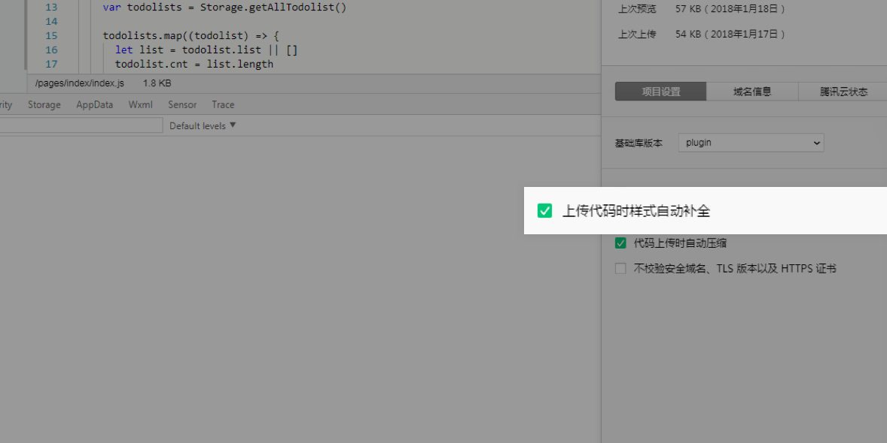
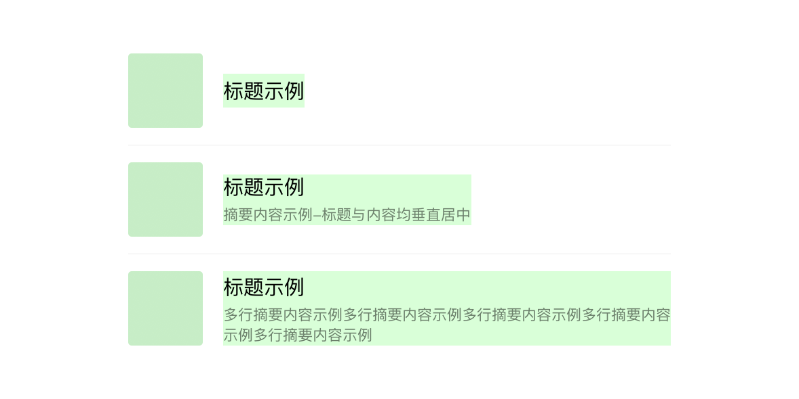
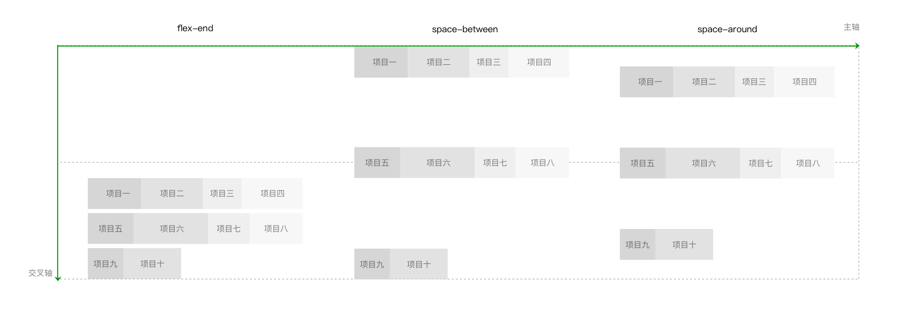
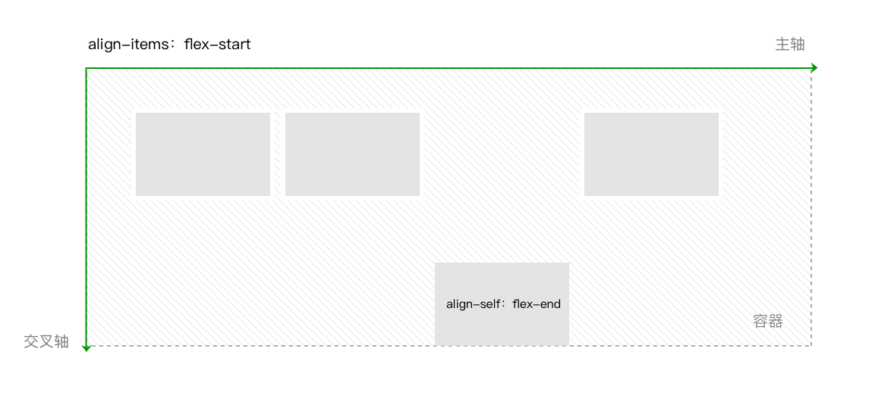
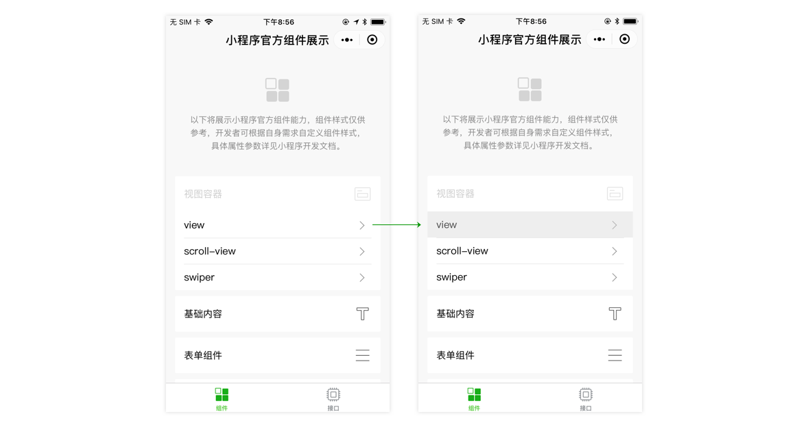
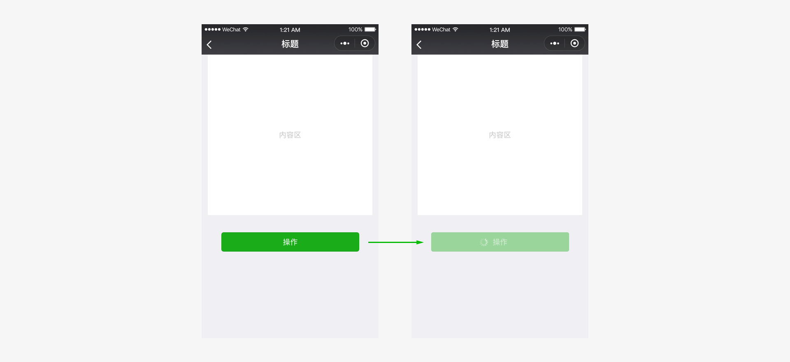
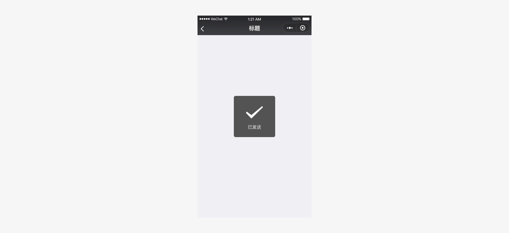
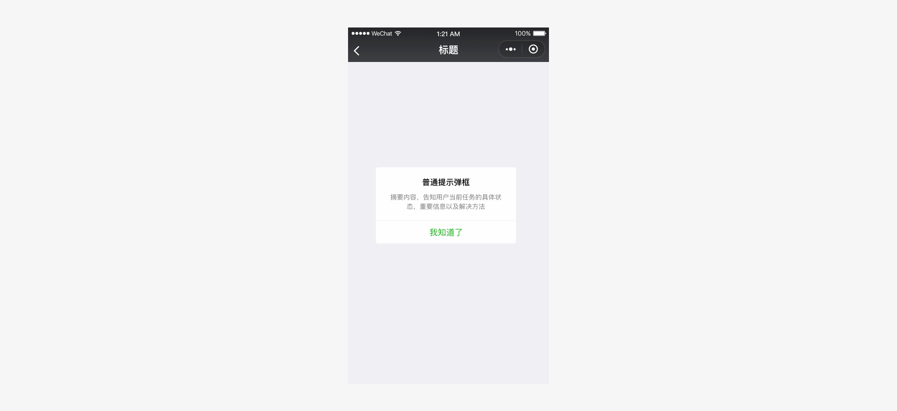
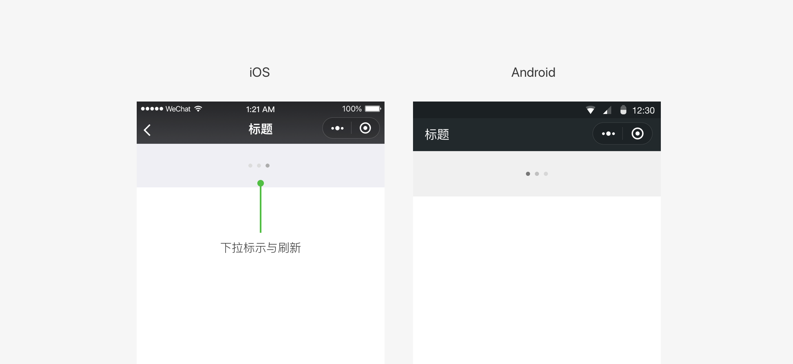

# 第 4 章 场景应用

在本章我们会介绍小程序的基本开发流程，结合第 2 章和第 3 章的知识，足以让你独立完成一个体验很完善的小程序。为了让开发者更加了解小程序开发，在这章中我们还会通过常见的一些应用场景介绍小程序 API 一些细节，及开发的一些技巧和注意事项。

## 1. 开发流程基本介绍

在启动开发前，首先我们对整个小程序整体的产品体验有一个清晰的规划和定义，一般会通过交互图或者手稿描绘小程序的界面交互和界面之间的跳转关系。图 4-1 是一个管理文章留言小程序的交互图。

图 4-1 文章留言管理的交互图：

* 

紧接着，我们优先完成 WXML + WXSS 还原设计稿，把界面涉及到的元素和视觉细节先调试完成。最后我们把按照页面交互梳理出每个页面的 data 部分，填充 WXML 的模板语法，还有完成 JS 逻辑部分。

当然并不是要完全按照这样的开发流程来开发小程序，有些时候我们可能在产品交互体验还不明确的情况下，先完成JS逻辑层一些模块的工作并做好测试。高效的开发流程有很多种方式，一般是根据整个团队的工作节奏来选择和开展，我们这一节讨论到的流程只是其中常见的开发流程。

## 2. 基本的布局方法 —— Flex 布局

如果之前你接触过网页开发中的 flexbox 布局，基本上你可以略过这节。但有一点需要注意的是，你的小程序要求兼容到 iOS8 以下版本，需要开启样式自动补全。开启样式自动补全，在“设置”—“项目设置”—勾选“上传代码时样式自动补全”。

图 4-2 开发者工具开启样式自动补全：

* 

在小程序开发中，我们需要考虑各种尺寸终端设备上的适配。在传统网页开发，我们用的是盒模型，通过 `display:inline | block | inline-block`、 `position`、`float` 来实现布局，缺乏灵活性且有些适配效果难以实现。比如像下面这种常见的信息列表，要求内容高度不确定下保持垂直居中：

图 4-3 常见的信息列表排版方式:

* 

这种情况下，我们更建议用 flex 布局。

在开始介绍 flex 之前，为了表述方便，我们约定以下术语：采用 flex 布局的元素，简称为“容器”，在代码示例中以 container 表示容器的类名。容器内的元素简称为“项目”，在代码示例中以 item 表示项目的类名。

图 4-4 container 容器和 item 项目：

* 

### 2.1. 基本概念

flex 的概念最早是在 2009 年被提出，目的是提供一种更灵活的布局模型，使容器能通过改变里面项目的高宽、顺序，来对可用空间实现最佳的填充，方便适配不同大小的内容区域。

在不固定高度信息的例子中，我们只需要在容器中设置以下两个属性即可实现内容不确定下的垂直居中。

```css
.container {
  display: flex;
  flex-direction: column;
  justify-content: center;
}
```

flex 不单是一个属性，它包含了一套新的属性集。属性集包括用于设置容器，和用于设置项目两部分。

设置容器的属性有：

```text
display:flex;

flex-direction:row（默认值） | row-reverse | column |column-reverse

flex-wrap:nowrap（默认值） | wrap | wrap-reverse

justify-content:flex-start（默认值） | flex-end | center |space-between | space-around | space-evenly

align-items:stretch（默认值） | center  | flex-end | baseline | flex-start

align-content:stretch（默认值） | flex-start | center |flex-end | space-between | space-around | space-evenly
```

设置项目的属性有：

```text
order:0（默认值） | <integer>

flex-shrink:1（默认值） | <number>

flex-grow:0（默认值） | <number>

flex-basis:auto（默认值） | <length>

flex:none | auto | @flex-grow @flex-shrink @flex-basis

align-self:auto（默认值） | flex-start | flex-end |center | baseline| stretch
```

在开始介绍各个属性之前，我们需要先明确一个坐标轴。默认的情况下，水平方向的是主轴（main axis），垂直方向的是交叉轴（cross axis）。

图4-5 默认情况下的主轴与交叉轴：

* 

项目是在主轴上排列，排满后在交叉轴方向换行。需要注意的是，交叉轴垂直于主轴，它的方向取决于主轴方向。

图 4-6 项目是在主轴上排列，排满后在交叉轴方向换行：

* 

接下来的例子如无特殊声明，我们都以默认情况下的坐标轴为例。

### 2.2. 容器属性

设置容器，用于统一管理容器内项目布局，也就是管理项目的排列方式和对齐方式。

#### 2.2.1. flex-direction 属性

通过设置坐标轴，来设置项目排列方向。

```css
.container {
  flex-direction: row（默认值） | row-reverse | column | column-reverse
}
```

`row`（默认值）：主轴横向，方向为从左指向右。项目沿主轴排列，从左到右排列。

`row-reverse`：row的反方向。主轴横向，方向为从右指向左。项目沿主轴排列，从右到左排列。

`column`：主轴纵向，方向从上指向下。项目沿主轴排列，从上到下排列。

`column-reverse`：column的反方向。主轴纵向，方向从下指向上。项目沿主轴排列，从下到上排列。

图4-7 flex-direction：

* 

#### 2.2.2. flex-wrap 属性

设置是否允许项目多行排列，以及多行排列时换行的方向。

```css
.container {
  flex-wrap: nowrap（默认值） | wrap | wrap-reverse;
}
```

`nowrap`（默认值）：不换行。如果单行内容过多，则溢出容器。

`wrap`：容器单行容不下所有项目时，换行排列。

`wrap-reverse`：容器单行容不下所有项目时，换行排列。换行方向为wrap时的反方向。

图4-8 flex-wrap：

* 

#### 2.2.3. justify-content 属性

设置项目在主轴方向上对齐方式，以及分配项目之间及其周围多余的空间。

```css
.container {
  justify-content: flex-start（默认值） | flex-end | center | space-between | space-around| space-evenly
}
```

`flex-start`（默认值）：项目对齐主轴起点，项目间不留空隙。

`center`：项目在主轴上居中排列，项目间不留空隙。主轴上第一个项目离主轴起点距离等于最后一个项目离主轴终点距离。

`flex-end`：项目对齐主轴终点，项目间不留空隙。

`space-between`：项目间间距相等，第一个项目离主轴起点和最后一个项目离主轴终点距离为 0。

`space-around`：与 `space-between` 相似。不同点为，第一个项目离主轴起点和最后一个项目离主轴终点距离为中间项目间间距的一半。

`space-evenly`：项目间间距、第一个项目离主轴起点和最后一个项目离主轴终点距离等于项目间间距。

图4-9 justify-content：

* 

#### 2.2.4. align-items 属性

设置项目在行中的对齐方式。

```css
.container {
  align-items: stretch（默认值） | flex-start | center | flex-end | baseline;
}
```

`stretch`（默认值）：项目拉伸至填满行高。

`flex-start`：项目顶部与行起点对齐。

`center`：项目在行中居中对齐。

`flex-end`：项目底部与行终点对齐。

`baseline`：项目的第一行文字的基线对齐。

图4-10 align-items

* 

#### 2.2.5. align-content 属性

多行排列时，设置行在交叉轴方向上的对齐方式，以及分配行之间及其周围多余的空间。

```css
.container {
  align-content: stretch（默认值） | flex-start | center | flex-end | space-between |space-around | space-evenly;
}
```

`stretch`（默认值）：当未设置项目尺寸，将各行中的项目拉伸至填满交叉轴。当设置了项目尺寸，项目尺寸不变，项目行拉伸至填满交叉轴。

`flex-start`：首行在交叉轴起点开始排列，行间不留间距。

`center`：行在交叉轴中点排列，行间不留间距，首行离交叉轴起点和尾行离交叉轴终点距离相等。

`flex-end`：尾行在交叉轴终点开始排列，行间不留间距。

`space-between`：行与行间距相等，首行离交叉轴起点和尾行离交叉轴终点距离为 0。

`space-around`：行与行间距相等，首行离交叉轴起点和尾行离交叉轴终点距离为行与行间间距的一半。

`space-evenly`：行间间距、以及首行离交叉轴起点和尾行离交叉轴终点距离相等。

​图4-11 align-content

* 
* 
* 

### 2.3. 项目属性

设置项目，用于设置项目的尺寸、位置，以及对项目的对齐方式做特殊设置。

#### 2.3.1. order 属性

设置项目沿主轴方向上的排列顺序，数值越小，排列越靠前。属性值为整数。

```css
.item {
  order: 0（默认值） | <integer>;
}
```

图4-12 order：

* 

#### 2.3.2. flex-shrink 属性

当项目在主轴方向上溢出时，通过设置项目收缩因子来压缩项目适应容器。属性值为项目的收缩因子，属性值取非负数。

```scss
.item {
  flex-shrink: 1（默认值） | <number>
}

.item1 {
  flex-shrink: 2;
  width: 120px;
}

.item2 {
  flex-shrink: 3;
  width: 150px;
}

.item3 { // 项目 3 未设置 flex-shrink，默认 flex-shrink 值为 1
  width: 180px;
}
```

为了加深理解，我们举个例子：

一个宽度为 400px 的容器，里面的三个项目 width 分别为 120px，150px，180px。分别对这项目 1 和项目 2 设置 `flex-shrink` 值为 2 和 3。

```scss
.container {
  display: flex;
  width: 400px; // 容器宽度为400px
}
```

在这个例子中，项目溢出 `400 - (120 + 150 + 180) = -50px`。计算压缩量时总权重为各个项目的宽度乘以 `flex-shrink` 的总和，这个例子压缩总权重为 `120 * 2 + 150 * 3+ 180 * 1 = 870`。各个项目压缩空间大小为总溢出空间乘以项目宽度乘以 `flex-shrink` 除以总权重：

item1 的最终宽度为：`120 - 50 * 120 * 2 / 870 ≈ 106px`

item2 的最终宽度为：`150 - 50 * 150 * 3 / 870 ≈ 124px`

item3 的最终宽度为：`180 - 50 * 180 * 1 / 870 ≈ 169px`

其中计算时候值如果为小数，则向下取整。

图 4-13 flex-shrink:

* 

需要注意一点，当项目的压缩因子相加小于 1 时，参与计算的溢出空间不等于完整的溢出空间。在上面例子的基础上，我们改变各个项目的 `flex-shrink`。

```scss
.container {
  display: flex;
  width: 400px; // 容器宽度为400px
}

.item1 {
  flex-shrink: 0.1;
  width: 120px;
}

.item2 {
  flex-shrink: 0.2;
  width: 150px;
}

.item3 {
  flex-shrink: 0.3;
  width: 180px;
}
```

总权重为：`120 * 0.1 + 150 * 0.2 + 180 * 0.3 = 96`。参与计算的溢出空间不再是 50px，而是 `50 * (0.1 + 0.2 + 0.3) / 1 = 30`：

item1的最终宽度为：`120 - 30 * 120 * 0.1 / 96 ≈ 116px`

item2的最终宽度为：`150 - 30 * 150 * 0.2 / 96 ≈ 140px`

item3的最终宽度为：`180 - 30 * 180 * 0.3 / 96 ≈ 163px`

#### 2.3.3. flex-grow 属性

当项目在主轴方向上还有剩余空间时，通过设置项目扩张因子进行剩余空间的分配。属性值为项目的扩张因子，属性值取非负数。

```scss
.item {
  flex-grow: 0（默认值） | <number>
}
```

为了加深理解，我们举个例子：

一个宽度为 400px 的容器，里面的三个项目 `width` 分别为 80px，120px，140px。分别对这项目 1 和项目 2 设置 `flex-grow` 值为 3 和 1。

```scss
.container {
  display: flex;
  width: 400px; // 容器宽度为400px
}

.item1 {
  flex-grow: 3;
  width: 80px;
}

.item2 {
  flex-grow: 1;
  width: 120px;
}

.item3 {// 项目3未设置flex-grow，默认flex-grow值为0
  width: 140px;
}
```

在这个例子中，容器的剩余空间为 `400 - (80 + 120 + 140) = 60px`。剩余空间按 `60 / (3 + 1 + 0) = 15px` 进行分配：

item1 的最终宽度为：`80 + (15 * 3) = 125px`

item2 的最终宽度为：`120 + (15 * 1) = 135px`

item3的最终宽度为：`140 + (15 * 0) = 140px`

图 4-14 flex-grow：

* 

需要注意一点，当项目的扩张因子相加小于 1 时，剩余空间按除以 1 进行分配。在上面例子的基础上，我们改变各个项目的 `flex-grow`。

```scss
.container {
  display: flex;
  width: 400px; // 容器宽度为400px
}

.item1 {
  flex-grow: 0.1;
  width: 50px;
}

.item2 {
  flex-grow: 0.3;
  width: 80px;
}

.item3 {
  flex-grow: 0.2;
  width: 110px;
}
```

在这个例子中，容器的剩余空间为 `400 - (50 + 80 + 110) = 160px`。由于项目的 `flex-grow` 相加 `0.1 + 0.3 + 0.2 = 0.6` 小于 1，剩余空间按 `160 / 1 = 160px` 划分。例子中的项目宽度分别为：

item1 的最终宽度为：`50 + (160 * 0.1) = 66px`

item2 的最终宽度为：`80 + (160 * 0.3) = 128px`

item3 的最终宽度为：`110 + (160 * 0.2) = 142px`

#### 2.3.4. flex-basis 属性

当容器设置 `flex-direction` 为 `row` 或 `row-reverse` 时，`flex-basis` 和 `width` 同时存在，`flex-basis` 优先级高于 `width`，也就是此时 `flex-basis` 代替项目的 `width` 属性。

当容器设置 `flex-direction` 为 `column` 或 `column-reverse` 时，`flex-basis` 和 `height` 同时存在，`flex-basis` 优先级高于 `height`，也就是此时 `flex-basis` 代替项目的 `height` 属性。

需要注意的是，当 `flex-basis` 和 `width`（或 `height`），其中一个属性值为 `auto` 时，非 `auto` 的优先级更高。

```scss
.item {
  flex-basis: auto（默认值） | <number>px
}
```

图4-15 flex-basis：

* 

#### 2.3.5. flex 属性

是 `flex-grow`，`flex-shrink`，`flex-basis` 的简写方式。值设置为 `none`，等价于 `0 0 auto`。值设置为 `auto`，等价于 `1 1 auto`。

```scss
.item {
  flex: none | auto | @flex-grow @flex-shrink@flex-basis
}
```

#### 2.3.6. align-self 属性

设置项目在行中交叉轴方向上的对齐方式，用于覆盖容器的 `align-items`，这么做可以对项目的对齐方式做特殊处理。默认属性值为 `auto`，继承容器的 `align-items` 值，当容器没有设置 `align-items` 时，属性值为 `stretch`。

```scss
.item {
  align-self: auto（默认值） | flex-start | center | flex-end | baseline |stretch
}
```

​图4-16 align-self：

* 

## 3. 界面常见的交互反馈

用户和小程序上进行交互的时候，某些操作可能比较耗时，我们应该予以及时的反馈以舒缓用户等待的不良情绪。

### 3.1. 触摸反馈

通常页面会摆放一些 button 按钮或者 view 区域，用户触摸按钮之后会触发下一步的操作。这种情况下，我们要对触摸这个行为给予用户一些响应。如图 4-17 所示，当我们手指触摸了 button 文字所在的 cell 区域时，对应的区域底色变成浅灰色，这样用户就可以知道小程序是有及时响应他的这次触摸操作，用户就不会很迷惑。

图4-17 触摸区域底色变成灰色响应用户的触摸操作：

* 

小程序的 view 容器组件和 button 组件提供了 `hover-class` 属性，触摸时会往该组件加上对应的 `class` 改变组件的样式。

代码清单4-1 通过 hover-class 属性改变触摸时的样式：

```xml
/*page.wxss */

.hover {
  background-color: gray;
}


<!--page.wxml -->
<button hover-class="hover"> 点击button </button>
<view hover-class="hover"> 点击view</view>
```

对于用户的操作及时响应是非常优秀的体验，有时候在点击 button  按钮处理更耗时的操作时，我们也会使用 button 组件的 `loading` 属性，在按钮的文字前边出现一个 `Loading`，让用户明确的感觉到，这个操作会比较耗时，需要等待一小段时间。

图4-18 button文字前出现loading：

* 

代码清单4-2 设置 button 的 loading 属性：

```xml
<!--page.wxml -->
<button loading="{{loading}}" bindtap="tap">操作</button>

// page.js

Page({
  data: { loading: false },
  tap: function() {
    // 把按钮的loading状态显示出来
    this.setData({
      loading: true
    })
    // 接着做耗时的操作
  }
})
```

### 3.2. Toast和模态对话框

在完成某个操作成功之后，我们希望告诉用户这次操作成功并且不打断用户接下来的操作。弹出式提示 Toast 就是用在这样的场景上，Toast 提示默认 1.5 秒后自动消失，其表现形式如图 4-19 所示。

图4-19 Toast弹出式提示：

* 

小程序提供了显示隐藏 Toast 的接口，代码示例如下所示。

代码清单4-3 显示/隐藏 Toast :

```javascript
Page({
  onLoad: function() {
    wx.showToast({ // 显示Toast
      title: '已发送',
      icon: 'success',
      duration: 1500
    })

    // wx.hideToast() // 隐藏Toast
  }
})
```

特别要注意，我们不应该把 Toast 用于错误提示，因为错误提示需要明确告知用户具体原因，因此不适合用这种一闪而过的 Toast 弹出式提示。一般需要用户明确知晓操作结果状态的话，会使用模态对话框来提示，同时附带下一步操作的指引。

图4-20 模态对话框:

* 

代码清单4-4 显示模态对话框：

```javascript
Page({
  onLoad: function() {
    wx.showModal({
      title: '标题',
      content: '告知当前状态，信息和解决方法',
      confirmText: '主操作',
      cancelText: '次要操作',
      success: function(res) {
        if (res.confirm) {
          console.log('用户点击主操作')
        } else if (res.cancel) {
          console.log('用户点击次要操作')
        }
      }
    })
  }
})
```

### 3.3. 界面滚动

往往手机屏幕是承载不了所有信息的，所以内容区域肯定会超出屏幕区域，用户可以通过滑动屏幕来查看下一屏的内容，这是非常常见的界面滚动的交互。

为了让用户可以快速刷新当前界面的信息，一般在小程序里会通过下拉整个界面这个操作来触发，如图4-21所示。

图4-21 下拉刷新：

* 

宿主环境提供了统一的下拉刷新交互，开发者只需要通过配置开启当前页面的下拉刷新，用户往下拉动界面触发下拉刷新操作时，`Page` 构造器的 `onPullDownRefresh` 回调会被触发，此时开发者重新拉取新数据进行渲染，实例代码如下所示。

代码清单 4-5 页面下拉刷新：

```javascript
// page.json
{ "enablePullDownRefresh": true }


// page.js
Page({
  onPullDownRefresh: function() {
    // 用户触发了下拉刷新操作
    // 拉取新数据重新渲染界面
    // wx.stopPullDownRefresh() // 可以停止当前页面的下拉刷新。
  }
})
```

多数的购物小程序会在首页展示一个商品列表，用户滚动到底部的时候，会加载下一页的商品列表渲染到列表的下方，我们把这个交互操作叫为上拉触底。宿主环境提供了上拉的配置和操作触发的回调，如下代码所示。

代码清单4-6 页面上拉触底

```javascript
// page.json

// 界面的下方距离页面底部距离小于 onReachBottomDistance 像素时触发 onReachBottom 回调
{ "onReachBottomDistance": 100 }


// page.js

Page({
  onReachBottom: function() {
    // 当界面的下方距离页面底部距离小于100像素时触发回调
  }
})
```

当然我们有些时候并不想整个页面进行滚动，而是页面中某一小块区域需要可滚动，此时就要用到宿主环境所提供的 `scroll-view` 可滚动视图组件。可以通过组件的 `scroll-x` 和 `scroll-y` 属性决定滚动区域是否可以横向或者纵向滚动，`scroll-view` 组件也提供了丰富的滚动回调触发事件，这部分我们就不再展开细节，读者可以通过 `scroll-view` 组件的官方文档了解到细节。

## 4. 发起HTTPS网络通信

小程序经常需要往服务器传递数据或者从服务器拉取信息，这个时候可以使用 `wx.request` 这个API，在这一节我们会重点讨论 `wx.request` 的使用和注意事项。为了叙述方便，假设我们的服务器域名是 `test.com`。

### 4.1. wx.request 接口

如果我们需要从 `https://test.com/getinfo` 接口拉取用户信息，其代码示例如下所示，详细参数如表 4-1 所示。

代码清单 4-7 wx.request调用示例：

```javascript
wx.request({
  url: 'https://test.com/getinfo',
  success: function(res) {
    console.log(res)// 服务器回包信息
  }
})
```

表 4-1 wx.request详细参数：

| 参数名 | 类型 | 必填 | 默认值 | 描述 |
| - | - | - | - | - |
| `url` | String | 是 |  | 开发者服务器接口地址 |
| `data` | Object/String | 否 |  | 请求的参数 |
| `header` | Object | 否 |  | 设置请求的 header，header 中不能设置 Referer，默认`header['content-type'] = 'application/json'` |
| `method` | String | 否 | GET | （需大写）有效值：OPTIONS, GET, HEAD, POST, PUT, DELETE, TRACE, CONNECT |
| `dataType` | String | 否 | json | 回包的内容格式，如果设为`json`，会尝试对返回的数据做一次 JSON解析 |
| `success` | Function | 否 |  | 收到开发者服务成功返回的回调函数，其参数是一个Object，见表4-2。 |
| `fail` | Function | 否 |  | 接口调用失败的回调函数 |
| `complete` | Function | 否 |  | 接口调用结束的回调函数（调用成功、失败都会执行） |

### 4.2. 服务器接口

url参数是当前发起请求的服务器接口地址，小程序宿主环境要求 request 发起的网络请求必须是 https 协议请求，因此开发者服务器必须提供 HTTPS 服务的接口，同时为了保证小程序不乱用任意域名的服务，`wx.request` 请求的域名需要在小程序管理平台进行配置，如果小程序正式版使用 `wx.request` 请求未配置的域名，在控制台会有相应的报错。

一般我们在开发阶段时，处于开发阶段的服务器接口还没部署到现网的域名下，经常会通过另一个域名来进行开发调试，考虑到这一点，为了方便开发者进行开发调试，开发者工具、小程序的开发版和小程序的体验版在某些情况下允许 `wx.request` 请求任意域名。

由于我们一直在迭代更新小程序，那么就会有一个问题：在新版小程序发布时的某段时间内，会有部分用户使用旧版本的小程序。如果接口需要支持新的特性需要修改返回的数据格式，那接口的参数和返回字段至少向前兼容一个版本。举个例子，假设前边的 `https://test.com/getinfo` 接口返回的JSON数据为：`{ "username": "zhangsan","sex": "man" }`，在新版本中，我们需要把 `sex` 字段的值改成用 `0`、`1` 来表示性别男女。为了保持接口向前兼容，我们不应该直接改 `sex` 字段值的类型，而是返回的 JSON 数据中再定义多一个字段 `sexNumber`，这样旧版本通过这个接口拿到的数据格式依旧是能够正常工作的。

### 4.3. 请求参数

通过 `wx.request` 这个 API，有两种方法把数据传递到服务器：通过 `url` 上的参数以及通过 `data` 参数。举个例子：我们需要向服务器拿 `id` 为 1 的用户的信息，同时我们把当前小程序的版本带给服务器，让服务器可以做新旧版逻辑兼容，两种方法的代码示例如代码 4-8 所示。

代码清单4-8 wx.request调用示例：

```javascript
// 通过 url 参数传递数据
wx.request({
  url:'https://test.com/getinfo?id=1&version=1.0.0',
  success: function(res) {
    console.log(res)// 服务器回包信息
  }
})

// 通过 data 参数传递数据
wx.request({
  url: 'https://test.com/getinfo',
  data: { id:1, version:'1.0.0' },
  success: function(res) {
    console.log(res)// 服务器回包信息
  }
})
```

两种实现方式在 HTTP GET 请求的情况下表现几乎是一样的，需要留意的是 `url` 是有长度限制的，其最大长度是 1024 字节，同时 `url` 上的参数需要拼接到字符串里，参数的值还需要做一次 urlEncode。向服务端发送的数据超过 1024 字节时，就要采用 HTTP POST 的形式，此时传递的数据就必须要使用 `data` 参数，基于这个情况，一般建议需要传递数据时，使用 `data` 参数来传递。

我们再来单独看看 POST 请求的情况，并不是所有请求都是按照键值对 `key=value` 的形式传递到后台服务器，有时候需要传一些比较复杂的数据结构到后台的时候，用 JSON 格式会更加合适。此时我们可以在 `wx.request` 的 `header` 参数设置 `content-type` 头部为 `application/json`，小程序发起的请求的包体内容就是 `data` 参数对应的 JSON 字符串，代码示例如下。

代码清单4-9 wx.request发起POST请求包体使用json格式:

```javascript
// 请求的包体为 {"a":{"b":[1,2,3],"c":{"d":"test"}}}
wx.request({
  url: 'https://test.com/postdata',
  method: 'POST',
  header: { 'content-type': 'application/json'},
  data: {
    a: {
      b: [1, 2, 3],
      c: { d: "test" }
    }
  },
  success: function(res) {
    console.log(res)// 服务器回包信息
  }
})
```

### 4.4. 收到回包

通过 `wx.request` 发送请求后，服务器处理请求并返回 HTTP 包，小程序端收到回包后会触发 `success` 回调，同时回调会带上一个 Object 信息，详细参数表 4-2 所示。

表4-2 wx.request的success返回参数：

| 参数名 | 类型 | 描述 |
| - | - | - |
| `data` | Object/String | 开发者服务器返回的数据 |
| `statusCode` | Number | 开发者服务器返回的 HTTP 状态码 |
| `header` | Object | 开发者服务器返回的 HTTP Response Header |

尤其注意，只要成功收到服务器返回，无论 HTTP 状态码是多少都会进入 `success` 回调。因此开发者自己通过对回包的返回码进行判断后再执行后续的业务逻辑。

`success` 回调的参数 `data` 字段类型是根据 `header['content-type']` 决定的，默认 `header['content-type']` 是 `'application/json'`，在触发 `success` 回调前，小程序宿主环境会对 `data` 字段的值做 JSON 解析，如果解析成功，那么 `data` 字段的值会被设置成解析后的 `Object` 对象，其他情况 `data` 字段都是 `String` 类型，其值为 HTTP 回包包体。

### 4.5. 一般使用技巧

#### 4.5.1. 设置超时时间

小程序发出一个 HTTPS 网络请求，有时网络存在一些异常或者服务器存在问题，在经过一段时间后仍然没有收到网络回包，我们把这一段等待的最长时间称为请求超时时间。小程序 `request` 默认超时时间是 60 秒，一般来说，我们不需要这么长的一个等待时间才收到回包，可能在等待 3 秒后还没收到回包就需要给用户一个明确的服务不可用的提示。在小程序项目根目录里边的 `app.json` 可以指定 `request` 的超时时间。

代码清单4-10 app.json指定wx.requset超时时间为3000毫秒:

```json
{
  "networkTimeout": {
    "request": 3000
  }
}
```

#### 4.5.2. 请求前后的状态处理

大部分场景可能是这样的，用户点击一个按钮，界面出现“加载中...”的 Loading 界面，然后发送一个请求到后台，后台返回成功直接进入下一个业务逻辑处理，后台返回失败或者网络异常等情况则显示一个“系统错误”的 Toast，同时一开始的 Loading 界面会消失。我们给出一个常见的 `wx.request` 的示例代码，如下所示。

代码清单4-11 wx.request常见的示例代码:

```javascript
var hasClick = false;

Page({
  tap: function() {
    if (hasClick) {
      return
    }

    hasClick = true

    wx.showLoading()

    wx.request({
      url: 'https://test.com/getinfo',
      method: 'POST',
      header: { 'content-type':'application/json' },
      data: { },
      success: function (res) {
        if (res.statusCode === 200) {
          console.log(res.data)// 服务器回包内容
        }
      },
      fail: function (res) {
        wx.showToast({ title: '系统错误' })
      },
      complete: function (res) {
        wx.hideLoading()
        hasClick = false
      }
    })
  }
})
```

为了防止用户极快速度触发两次 `tap` 回调，我们还加了一个 `hasClick` 的“锁”，在开始请求前检查是否已经发起过请求，如果没有才发起这次请求，等到请求返回之后再把锁的状态恢复回去。

### 4.6. 排查异常的方法

在使用 `wx.request` 接口我们会经常遇到无法发起请求或者服务器无法收到请求的情况，我们罗列排查这个问题的一般方法：

1. 检查手机网络状态以及wifi连接点是否工作正常。
2. 检查小程序是否为开发版或者体验版，因为开发版和体验版的小程序不会校验域名。
3. 检查对应请求的 HTTPS 证书是否有效，同时 TLS 的版本必须支持 1.2 及以上版本，可以在开发者工具的 console 面板输入 `showRequestInfo()查` 看相关信息。
4. 域名不要使用 IP 地址或者 `localhost`，并且不能带端口号，同时域名需要经过 ICP 备案。
5. 检查 `app.json` 配置的超时时间配置是否太短，超时时间太短会导致还没收到回报就触发 `fail` 回调。
6. 检查发出去的请求是否 302 到其他域名的接口，这种 302 的情况会被视为请求别的域名接口导致无法发起请求。

## 5. 微信登录

已有的互联网产品在接入小程序会面临一些和登录态相关的问题：怎么获取微信登录态；怎么把微信帐号和自己的帐号进行打通。在这一节中，我们来介绍一下如何把微信登录应用到你的小程序中。

我们先来看看微信登录的整个过程，如图4-22所示。

图4-22 微信登录的整个过程:

* 

我们来依次分解一下图中的七个步骤，其中，第 1 步到第 4 步我们分别用一小节来讲述，第 5 步到第 7 步都和 SessionId 相关，我们放在 4.5.5 节一起讨论。

### 5.1. 获取微信登录凭证 code

首先说到登录，我们可能很正常地想到一个做法：通过 `wx.login` 直接拿到微信用户的 `id` 编号，再把这个 `id` 传到自己的后台，从而知道是哪个微信用户在使用我的服务。而我们上述微信登录的流程中并不是通过 `wx.login` 直接获取微信用户的 `id`，那直接获取微信用户 `id` 的做法有什么问题呢？ 假设现在我们有个接口，通过 `wx.request` 请求 `https://test.com/getUserInfo?id=1` 拉取到微信用户 `id` 为 `1` 在我们业务侧的个人信息，那么黑客就可以通过遍历所有的 `id`，把整个业务侧的个人信息数据全部拉走，如果我们还有其他接口也是依赖这样的方式去实现的话，那黑客就可以伪装成任意身份来操作任意账户下的数据，想想这给业务带来多大的安全风险。

为了避免这样的风险，`wx.login` 是生成一个带有时效性的凭证，就像是一个会过期的临时身份证一样，在 `wx.login` 调用时，会先在微信后台生成一张临时的身份证，其有效时间仅为 5 分钟。然后把这个临时身份证返回给小程序方，这个临时的身份证我们把它称为微信登录凭证 `code`。如果 5 分钟内小程序的后台不拿着这个临时身份证来微信后台服务器换取微信用户 id 的话，那么这个身份证就会被作废，需要再调用 `wx.login` 重新生成登录凭证。

由于这个临时身份证 5 分钟后会过期，如果黑客要冒充一个用户的话，那他就必须在 5 分钟内穷举所有的身份证 `id`，然后去开发者服务器换取真实的用户身份。显然，黑客要付出非常大的成本才能获取到一个用户信息，同时，开发者服务器也可以通过一些技术手段检测到 5 分钟内频繁从某个 ip 发送过来的登录请求，从而拒绝掉这些请求。
