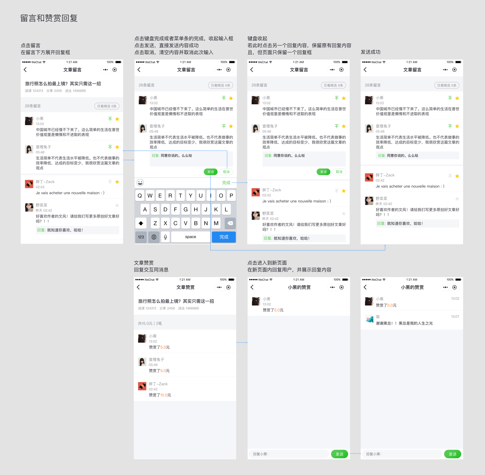
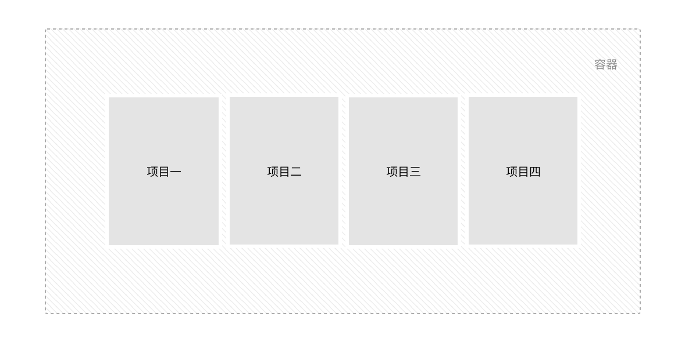
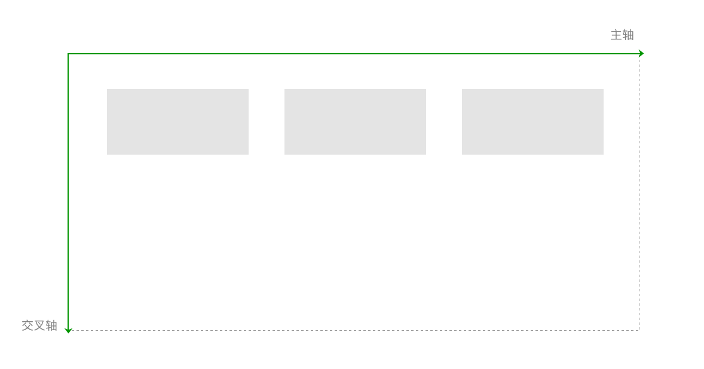
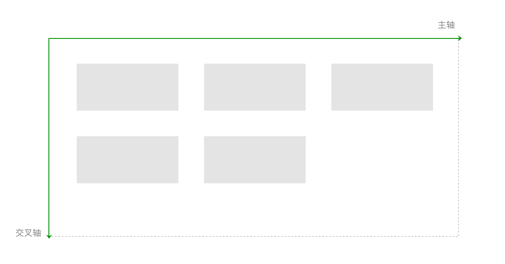
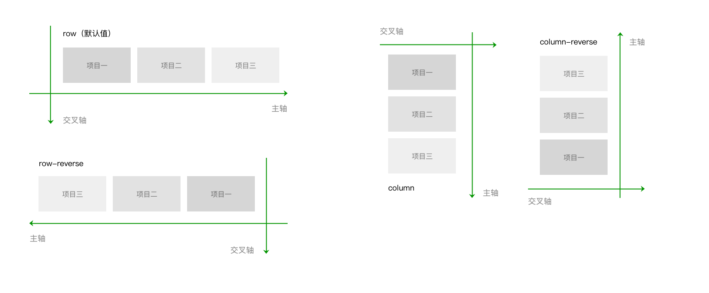
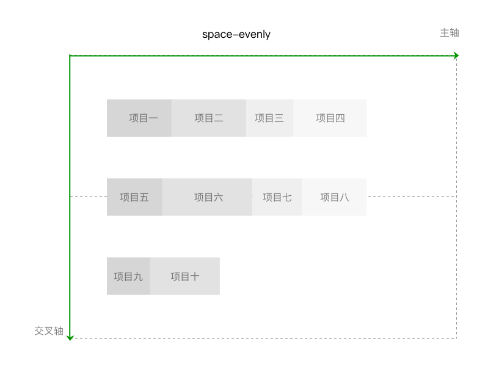

# 第 4 章 场景应用

在本章我们会介绍小程序的基本开发流程，结合第 2 章和第 3 章的知识，足以让你独立完成一个体验很完善的小程序。为了让开发者更加了解小程序开发，在这章中我们还会通过常见的一些应用场景介绍小程序 API 一些细节，及开发的一些技巧和注意事项。

## 1. 开发流程基本介绍

在启动开发前，首先我们对整个小程序整体的产品体验有一个清晰的规划和定义，一般会通过交互图或者手稿描绘小程序的界面交互和界面之间的跳转关系。图 4-1 是一个管理文章留言小程序的交互图。

图 4-1 文章留言管理的交互图：

* 

紧接着，我们优先完成 WXML + WXSS 还原设计稿，把界面涉及到的元素和视觉细节先调试完成。最后我们把按照页面交互梳理出每个页面的 data 部分，填充 WXML 的模板语法，还有完成 JS 逻辑部分。

当然并不是要完全按照这样的开发流程来开发小程序，有些时候我们可能在产品交互体验还不明确的情况下，先完成JS逻辑层一些模块的工作并做好测试。高效的开发流程有很多种方式，一般是根据整个团队的工作节奏来选择和开展，我们这一节讨论到的流程只是其中常见的开发流程。

## 2. 基本的布局方法 —— Flex 布局

如果之前你接触过网页开发中的 flexbox 布局，基本上你可以略过这节。但有一点需要注意的是，你的小程序要求兼容到 iOS8 以下版本，需要开启样式自动补全。开启样式自动补全，在“设置”—“项目设置”—勾选“上传代码时样式自动补全”。

图 4-2 开发者工具开启样式自动补全：

* 

在小程序开发中，我们需要考虑各种尺寸终端设备上的适配。在传统网页开发，我们用的是盒模型，通过 `display:inline | block | inline-block`、 `position`、`float` 来实现布局，缺乏灵活性且有些适配效果难以实现。比如像下面这种常见的信息列表，要求内容高度不确定下保持垂直居中：

图 4-3 常见的信息列表排版方式:

* 

这种情况下，我们更建议用 flex 布局。

在开始介绍 flex 之前，为了表述方便，我们约定以下术语：采用 flex 布局的元素，简称为“容器”，在代码示例中以 container 表示容器的类名。容器内的元素简称为“项目”，在代码示例中以 item 表示项目的类名。

图 4-4 container 容器和 item 项目：

* 

### 2.1. 基本概念

flex 的概念最早是在 2009 年被提出，目的是提供一种更灵活的布局模型，使容器能通过改变里面项目的高宽、顺序，来对可用空间实现最佳的填充，方便适配不同大小的内容区域。

在不固定高度信息的例子中，我们只需要在容器中设置以下两个属性即可实现内容不确定下的垂直居中。

```css
.container {
  display: flex;
  flex-direction: column;
  justify-content: center;
}
```

flex 不单是一个属性，它包含了一套新的属性集。属性集包括用于设置容器，和用于设置项目两部分。

设置容器的属性有：

```text
display:flex;

flex-direction:row（默认值） | row-reverse | column |column-reverse

flex-wrap:nowrap（默认值） | wrap | wrap-reverse

justify-content:flex-start（默认值） | flex-end | center |space-between | space-around | space-evenly

align-items:stretch（默认值） | center  | flex-end | baseline | flex-start

align-content:stretch（默认值） | flex-start | center |flex-end | space-between | space-around | space-evenly
```

设置项目的属性有：

```text
order:0（默认值） | <integer>

flex-shrink:1（默认值） | <number>

flex-grow:0（默认值） | <number>

flex-basis:auto（默认值） | <length>

flex:none | auto | @flex-grow @flex-shrink @flex-basis

align-self:auto（默认值） | flex-start | flex-end |center | baseline| stretch
```

在开始介绍各个属性之前，我们需要先明确一个坐标轴。默认的情况下，水平方向的是主轴（main axis），垂直方向的是交叉轴（cross axis）。

图4-5 默认情况下的主轴与交叉轴：

* 

项目是在主轴上排列，排满后在交叉轴方向换行。需要注意的是，交叉轴垂直于主轴，它的方向取决于主轴方向。

图 4-6 项目是在主轴上排列，排满后在交叉轴方向换行：

* 

接下来的例子如无特殊声明，我们都以默认情况下的坐标轴为例。

### 2.2. 容器属性

设置容器，用于统一管理容器内项目布局，也就是管理项目的排列方式和对齐方式。

#### 2.2.1. flex-direction 属性

通过设置坐标轴，来设置项目排列方向。

```css
.container {
  flex-direction: row（默认值） | row-reverse | column | column-reverse
}
```

`row`（默认值）：主轴横向，方向为从左指向右。项目沿主轴排列，从左到右排列。

`row-reverse`：row的反方向。主轴横向，方向为从右指向左。项目沿主轴排列，从右到左排列。

`column`：主轴纵向，方向从上指向下。项目沿主轴排列，从上到下排列。

`column-reverse`：column的反方向。主轴纵向，方向从下指向上。项目沿主轴排列，从下到上排列。

图4-7 flex-direction：

* 

#### 2.2.2. flex-wrap 属性

设置是否允许项目多行排列，以及多行排列时换行的方向。

```css
.container {
  flex-wrap: nowrap（默认值） | wrap | wrap-reverse;
}
```

`nowrap`（默认值）：不换行。如果单行内容过多，则溢出容器。

`wrap`：容器单行容不下所有项目时，换行排列。

`wrap-reverse`：容器单行容不下所有项目时，换行排列。换行方向为wrap时的反方向。

图4-8 flex-wrap：

* 

#### 2.2.3. justify-content 属性

设置项目在主轴方向上对齐方式，以及分配项目之间及其周围多余的空间。

```css
.container {
  justify-content: flex-start（默认值） | flex-end | center | space-between | space-around| space-evenly
}
```

`flex-start`（默认值）：项目对齐主轴起点，项目间不留空隙。

`center`：项目在主轴上居中排列，项目间不留空隙。主轴上第一个项目离主轴起点距离等于最后一个项目离主轴终点距离。

`flex-end`：项目对齐主轴终点，项目间不留空隙。

`space-between`：项目间间距相等，第一个项目离主轴起点和最后一个项目离主轴终点距离为 0。

`space-around`：与 `space-between` 相似。不同点为，第一个项目离主轴起点和最后一个项目离主轴终点距离为中间项目间间距的一半。

`space-evenly`：项目间间距、第一个项目离主轴起点和最后一个项目离主轴终点距离等于项目间间距。

图4-9 justify-content：

* 

#### 2.2.4. align-items 属性

设置项目在行中的对齐方式。

```css
.container {
  align-items: stretch（默认值） | flex-start | center | flex-end | baseline;
}
```

`stretch`（默认值）：项目拉伸至填满行高。

`flex-start`：项目顶部与行起点对齐。

`center`：项目在行中居中对齐。

`flex-end`：项目底部与行终点对齐。

`baseline`：项目的第一行文字的基线对齐。

图4-10 align-items

* 

#### 2.2.5. align-content 属性

多行排列时，设置行在交叉轴方向上的对齐方式，以及分配行之间及其周围多余的空间。

```css
.container {
  align-content: stretch（默认值） | flex-start | center | flex-end | space-between |space-around | space-evenly;
}
```

`stretch`（默认值）：当未设置项目尺寸，将各行中的项目拉伸至填满交叉轴。当设置了项目尺寸，项目尺寸不变，项目行拉伸至填满交叉轴。

`flex-start`：首行在交叉轴起点开始排列，行间不留间距。

`center`：行在交叉轴中点排列，行间不留间距，首行离交叉轴起点和尾行离交叉轴终点距离相等。

`flex-end`：尾行在交叉轴终点开始排列，行间不留间距。

`space-between`：行与行间距相等，首行离交叉轴起点和尾行离交叉轴终点距离为 0。

`space-around`：行与行间距相等，首行离交叉轴起点和尾行离交叉轴终点距离为行与行间间距的一半。

`space-evenly`：行间间距、以及首行离交叉轴起点和尾行离交叉轴终点距离相等。

​图4-11 align-content

* 
* 
* 
