# 第 5 章：小程序的协同工作和发布

在中大型的公司里，人员的分工非常仔细，一般会有不同岗位角色的员工同时参与同一个小程序项目。考虑到这样的情况，小程序平台设计了不同的权限管理使得项目管理者可以更加高效管理整个团队的协同工作。

以往我们在开发完网页之后，需要把网页的代码和资源放在服务器上，让用户通过互联网来访问。在小程序的平台里，开发者完成开发之后，需要在开发者工具提交小程序的代码包，然后在小程序管理平台[1]发布小程序，用户可以通过搜索或者其他入口来进入该小程序。

在这一章我们会把团队的协同工作的注意事项和小程序发布前后涉及的概念和流程做一些介绍。

## 1. 协同工作

### 1.1. 人员组织结构和权限分配

多数情况下，一个团队多人同时参与同一个小程序项目，每个角色所承担的工作或者权限不一样，中大公司的分工更为仔细。为了更形象的表达团队不同角色的关系以及权限的管理，我们通过虚拟一个项目成员组织结构来描述日常如何协同合作完成一个小程序的发布，组织关系如图 5-1 所示。

图5-1 虚拟小程序项目组：

* 

项目管理成员负责统筹整个项目的进展和风险、把控小程序对外发布的节奏，产品组提出需求，设计组与产品讨论并对需求进行抽象，设计出可视化流程与图形，输出设计方案。开发组依据设计方案，进行程序代码的编写，代码编写完成后，产品组与设计组体验小程序的整体流程，测试组编写测试用例并对小程序进行各种边界测试。项目一般的成员构成与工作流程如图5-2所示。

图5-2 提需求到发布小程序的流程:

* 

为了便于管理，小程序平台给不同角色定义了 7 种权限，如表5-1所示。

表5-1 小程序平台的7种权限:

| 权限 | 说明 |
| - | - |
| 开发者权限 | 可使用小程序开发者工具及开发版小程序进行开发 |
| 体验者权限 | 可使用体验版小程序 |
| 登录 | 可登录小程序管理后台，无需管理员确认 |
| 数据分析 | 使用小程序数据分析功能查看小程序数据 |
| 开发管理 | 小程序提交审核、发布、回退 |
| 开发设置 | 设置小程序服务器域名、消息推送及扫描普通链接二维码打开小程序 |
| 暂停服务设置 | 暂停小程序线上服务 |

管理者可以很方便分配这些权限给项目的各个组织成员，小程序的管理比传统的网页开发和App应用开发更为简单便捷。图5-1展示的虚拟组织的成员权限可以按照表5-2进行分配：

表5-2 虚拟组织成员的权限分配:

| 成员 | 权限分配 |
| - | - |
| 项目管理组成员 | 拥有所有权限 |
| 开发组成员 | 开发者权限 / 体验者权限 / 数据分析 |
| 产品组成员 | 体验者权限 / 数据分析 |
| 测试组成员 | 体验者权限 |

需要留意，项目管理者控制整个小程序的发布、回退、下架等敏感操作，不应把敏感操作的权限分配给不相关人员。

### 1.2. 小程序的版本

一般的软件开发流程，开发者编写代码自测开发版程序，直到程序达到一个稳定可体验的状态时，开发者会把这个体验版本给到产品经理和测试人员进行体验测试，最后修复完程序的Bug后发布供外部用户正式使用。小程序的版本根据这个流程设计了小程序版本的概念，如表5-2所示。

表5-3 小程序的版本:

| 权限 | 说明|
| - | - |
| 开发版本 | 使用开发者工具，可将代码上传到开发版本中。 开发版本只保留每人最新的一份上传的代码。点击提交审核，可将|代| 码提交审核。开发版本可删除，不影响线上版本和审核中版本的代码。|
| 体验版本 | 可以选择某个开发版本作为体验版，并且选取一份体验版。|
| 审核中版本 | 只能有一份代码处于审核中。有审核结果后可以发布到线上，也可直接重新提交审核，覆盖原审核版本。|
| 线上版本 | 线上所有用户使用的代码版本，该版本代码在新版本代码发布后被覆盖更新。|

考虑到项目是协同开发的模式，一个小程序可能同时由多个开发者进行开发，往往开发者在小程序开发者工具上编写完代码后需要到手机进行真机体验，所以每个开发者拥有自己对应的一个开发版本。因为处于开发中的版本是不稳定的，开发者随时会修改代码覆盖开发版，为了让测试和产品经理有一个完整稳定的版本可以体验测试，小程序平台允许把其中一个开发版本设置成体验版，因此建议在项目开发阶段特殊分配一个开发角色，用于上传稳定可供体验测试的代码，并把他上传的开发版本设置成体验版。

刚刚说到开发者需要真机调试开发版本时，可以点击开发者工具的预览按钮，此时开发者工具会打包当前项目，并上传到微信服务器生成一个二维码，开发者使用当前开发身份的微信扫描二维码就可以在手机上体验对应的开发版本，如图5-3所示。

图5-3 预览小程序开发版：

* 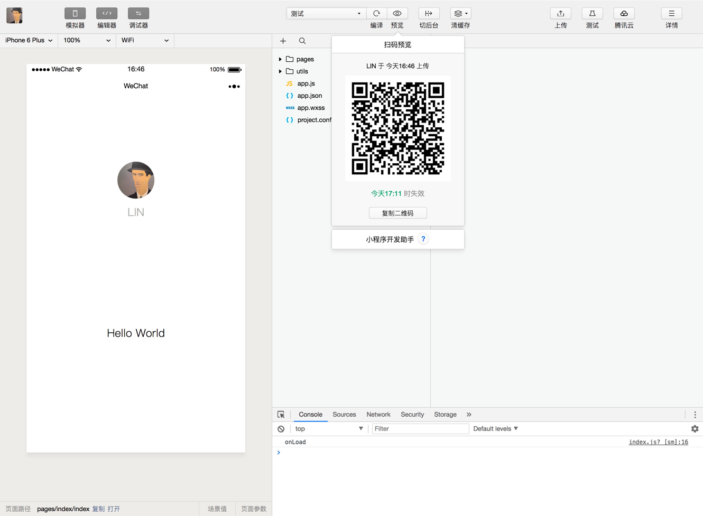

在小程序管理平台上可以选取某个开发版作为体验版本，操作成功之后可以得到一个体验版的二维码，当前项目有权限的体验者均可用其对应的微信号进行扫码体验。

## 2. 用户体验审视

在小程序发布之前，我们建议开发者务必对小程序做认真严格的用户体验审视。有创造性的产品思路、友好流畅的用户体验和稳定谨慎的运营也是一款优秀小程序能够脱颖而出的关键因素。

本小节将从产品和设计两方面，帮助开发者在小程序发布之前审视自身产品设计和用户体验情况，达到较高的用户体验水准，且是对用户友好的一款产品。

### 2.1. 产品和运营思路

我们希望开发者能坚持“一切以用户价值为依归” 这一产品观，让创造发挥价值。产品设计过程中，开发者亦需要保持一定的克制心态。繁复的需求和商业行为，在用户利益前都需要谨慎平衡。

在运营行为上，小程序需要遵从微信小程序运营规范。若开发者的小程序违反了其中的条款、相关平台规则或法律法规，或对公众平台、开放平台造成了影响，可能会被强制处罚。条款将根据新问题、相关法律法规或产品运营需要对其内容进行修改并更新，详细条款请查阅[小程序运营文档](https://developers.weixin.qq.com/miniprogram/product/)

### 2.2. 体验和设计评估

在小程序的设计和开发阶段，我们希望开发者始终将优秀的用户体验作为产品目标之一，通过积极的用户体验和设计评估，在不断的迭代中完善用户体验，用心打磨小程序，从而更好实现产品价值，激发用户正向情感。因此，我们建议小程序在开发过程中以及发布之前，开发者务必对自身产品的体验和设计做全面走查。

开发者可依据以下9点基础设计原则，对小程序的体验进行评估。

#### 2.2.1. 导航清晰

导航是确保用户在网页中浏览跳转时不迷路的最关键因素。导航需要告诉用户，当前在哪，可以去哪，如何回去等问题。开发者在小程序的设计中，应确保各个页面之间层级清晰明确。每个界面的导航，都指向清晰，有路可退，实际应用样例请参考图 5-4。

图5-4 不同页面之间应保持明确的导航层级:

* 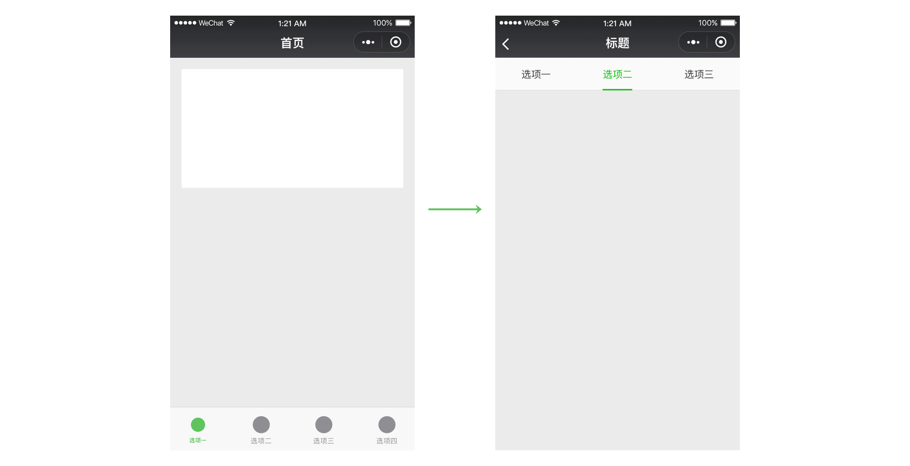

#### 2.2.2. 流程明确

为了让用户能够顺畅地使用小程序，用户进行操作时，应确定当前页面只设置了单一任务，且不出现目标流程之外的内容。此举有利于让用户明确当前操作的目的，从而集中精力聚焦当前任务，并通过简单操作达到结果。在图5-5中，出现了目标流程之外的操作，使用户体验受阻。

图5-5 出现目标流程之外的操作而打断用户的体验:

* 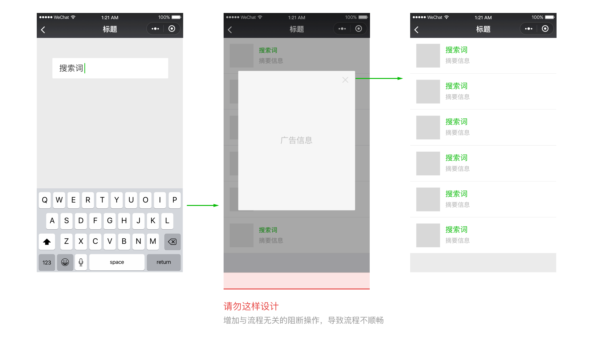

#### 2.2.3. 重点突出

每个页面都应有明确的重点，以便于用户每进入一个新页面的时候都能快速理解页面内容。在确定过了重点的前提下，应尽量避免页面上出现其它与用户的决策和操作无关的干扰因素。图5-6以搜索功能作为案例说明，突出的搜索入口以达到重点突出，操作明确。图5-7对比了有主次之分的按钮排列与平级按钮排列的效果，有主次之分的视觉展示能让操作决策更快速。

图5-6 案例说明：搜索功能:

* 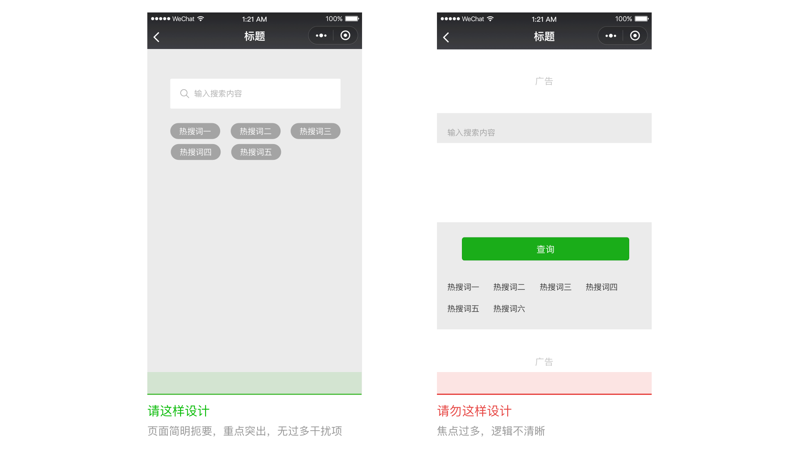

图5-7 案例说明：多按钮情况

* 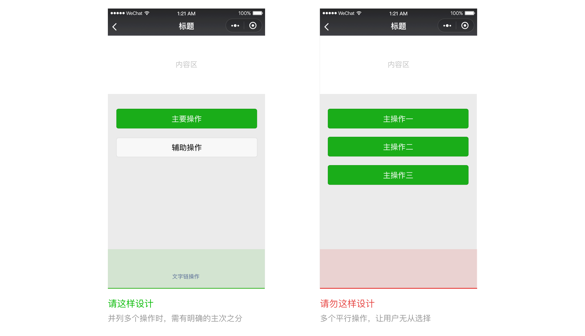

#### 2.2.4. 符合预期

对用户友好的产品，需要在其设计阶段便将自身信息架构和模型与用户的心理模型匹配，以便于用户能够依据以往的使用经验或其他生活经验，降低使用的理解和学习成本，从而快速达成使用目的。

#### 2.2.5. 等待与反馈

在用户使用产品时，往往页面过长时间的等待会引起不良情绪。在不得不需要用户以一定的加载等待时间作为代价时，我们需要用明确的等待状态告知用户，以舒缓用户在等待时期的不良情绪。图5-8是不同的加载样式举例。

在设计加载等待状态时，应注意以下事项：

* 若载入等待时间较长，应提供取消操作，并使用进度条显示载入的进度；
* 载入过程中，应保持动画效果；无动画效果的加载很容易让人产生该界面已经卡死的错觉；
* 不要在同一个页面同时使用超过1个加载动画。

图5-8 加载样式举例：标题栏加载、Toast加载、按钮加载

* 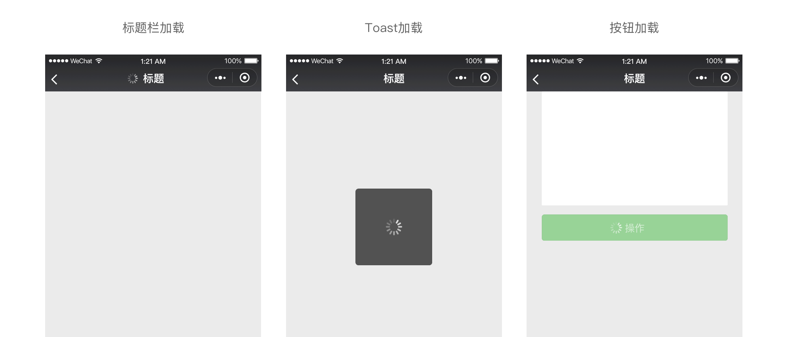

此外，对于用户的操作结果，小程序也需要给出明确的结果反馈，以增强用户的操作信心和控制感。开发者可以根据实际情况，选择不同的反馈样式。例如，对于页面局部的操作，可在操作区域予直接反馈。对于页面级别的操作结果，可使用弹出式提示、模态对话框或结果页面展示。具体示例如图5-9所示。

图5-9 提示样式举例：图标弹出提示、文字弹出提示、对话框

* 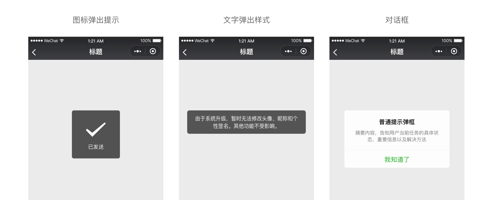

#### 2.2.6. 异常处理

在设计任务和流程时，往往用户会因为各种原因导致操作失败。此类异常场景往往是用户最为沮丧和需要帮助的时候，因此，要注意在异常状态下的设计。在出现异常的时候需要给予用户清晰的状态提示，并告知解决方案，使其有路可退。

上文提到的模态对话框和结果页面都可以作为异常状态的提醒方式。除此之外，在表单项较多的页面中，应明确指出出错项目，以便用户修改，如图5-10所示。

图5-10 表单异常提醒:

* 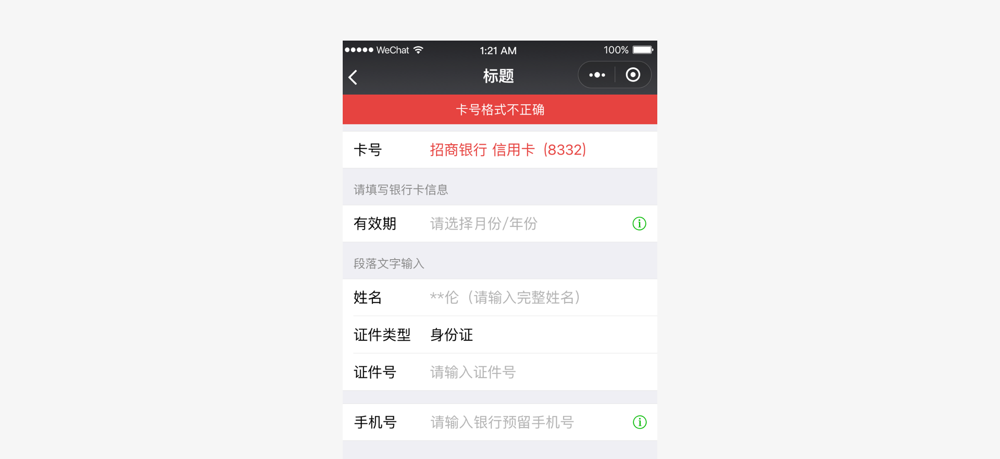

#### 2.2.7. 内容和文案准确友好

在产品通过文案或者页面表达内容时，需要斟酌使用的内容和文案。使用的语言应当简洁，礼貌并容易被用户理解。此外，还要注意专业术语需要被清楚解释，特有词汇全局需用统一的特定表达，重要内容能够被快速获取，且页面不存在无关文案干扰用户决策。

#### 2.2.8. 和谐统一

小程序内的设计风格应该是统一、和谐且具有延续性的，这样才能确保用户建立完整的产品品牌认知，更好地辨析不同的小程序。

#### 2.2.9. 平台适配

在小程序的设计过程中，应该充分考虑iOS与Android平台不同的设计规范，对设计进行适当调整以适应不同平台上的用户使用习惯。

[设计文档](https://mp.weixin.qq.com/debug/wxadoc/design/index.html)内容将不断进行修改、完善并更新，可以查看线上资讯获取最新小程序信息。

### 2.3. 用户体验测试和完善体验

我们建议开发者在发布之前，结合体验和设计评估过程，同步进行用户体验测试，以发现更多设计在实际场景和应用中，存在的难以预见的可用性问题。或者以用户测试环节，验证体验和设计评估迭代成果，在不断的更新和迭代中打磨小程序体验。

以下是我们关于进行用户体验测试的一些建议：

* 用户体验测试，可以在设计、开发、测试等全部阶段使用。是一种低成本检测设计质量的方法。
* 尽早进行用户体验测试。在产品及设计过程中，尚未启动开发时，便可以用低保真/高保真模型进行用户体验测试，以检测设计质量。这样更有利于及早发现问题并进行调整，减少开发成本。
* 用户测试之前需要确定好需要被检验的流程和任务，需要为用户构建明确的目标，并提示用户以完成任务的方式完成目标。
* 最好选择产品真实的受众，作为被测试的用户。并在测试时，使用户处于真实的场景和时间下。
* 设计开放性的问题让用户回答。不用带有主观性的询问语言，引导用户回答。
* 在用户测试过程中，需要全程做好记录。

## 3. 发布

### 3.1. 发布前最后的检查

有不少开发者在发布小程序后发现正式版小程序无法正常使用，所以我们罗列一下开发者在发布前常常遗漏的点：

* 如果小程序使用到Flex布局，并且需要兼容iOS8以下系统时，请检查上传小程序包时，开发者工具是否已经开启“上传代码时样式自动补全”。
* 小程序使用的服务器接口应该走HTTPS协议，并且对应的网络域名确保已经在小程序管理平台配置好。
* 在测试阶段不要打开小程序的调试模式进行测试，因为在调试模式下，微信不会校验域名合法性，容易导致开发者误以为测试通过，导致正式版小程序因为遇到非法域名无法正常工作。
* 发布前请检查小程序使用到的网络接口已经在现网部署好，并且评估好服务器的机器负载情况。

当体验版进行充分的检查和测试后达到发布状态，项目管理者可以在小程序平台进行提交审核的操作，提交审核后，微信审核团队会根据相关的运营规范进行提审小程序的审核。审核通过之后，管理者可以随时发布自己的小程序。

### 3.2. 发布模式

小程序提供了两种发布模式：全量发布和分阶段发布。全量发布是指当点击发布之后，所有用户访问小程序时都会使用当前最新的发布版本。分阶段发布是指分不同时间段来控制部分用户使用最新的发布版本，分阶段发布我们也称为灰度发布。一般来说，普通小程序发布时采用全量发布即可，当小程序承载的功能越来越多，使用的用户数越来越多时，采用分阶段发布是一个非常好的控制风险的办法。因为随着程序的复杂度提高以及影响面的扩大，新版本的代码改动或多或少会带来Bug，作为服务方当然不希望异常的服务状态一下子扩散到整个用户群体，此时应该通过分阶段发布来逐步观察服务的稳定性，再决定是否进行全量发布。

还需要留意一点，并非全量发布之后，用户就会立即使用到最新版的小程序，这是因为微信客户端存有旧版本小程序包缓存。用户在使用小程序时会优先打开本地的小程序包，微信客户端在某些特定的时机异步去更新最新的小程序包。一般我们认为全量发布的24小时后，所有用户才会真正使用到最新版的小程序。

### 3.3. 小程序码

很多场景下用户会通过扫码快速进入一个小程序，在小程序设计的初期，小程序平台提供的二维码的形式。我们发现用户在扫一个二维码时，他并不知道当前这次扫码会出现什么样的服务，因为二维码的背后有可能是公众号、小程序、网页服务、支付页面、添加好友等不同的服务。为了让用户在扫码之前就有一个明确的预期，因此微信设计了小程序码，如图5-11所示。

图5-11 “小程序数据助手”的小程序码:

* 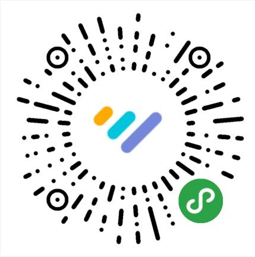

小程序码在样式上更具辨识度和视觉冲击力，相对于二维码来说，小程序主题的品牌形象更加清晰明显，可以帮助开发者更好地推广小程序。在发布小程序之后，小程序管理平台会提供对应的小程序码的预览和下载，开发者可以自行下载用于线上和线下的小程序服务推广。

## 4. 运营

发布完小程序之后，我们还需要关注小程序的运行数据，分析数据背后的原因，帮助小程序产品迭代优化和运营，开发者可以利用小程序平台里边提供了面向产品的运营数据分析和面向开发的运维中心来完成数据运营的工作。小程序提供了微信开发者社区供开发者在上边互助答疑，小程序官方也会在社区上同步各类最新的信息，例如小程序Bug的修复情况、解答一些开发者疑问等等。

### 4.1. 数据分析

#### 4.1.1. 常规分析

开发网页和App应用都需要开发者自己通过编写代码来上报访问数据，小程序平台则直接内置在宿主环境底层，无需开发者新增一行代码。

小程序数据分析，是面向小程序开发者、运营者的数据分析工具，提供关键指标统计、实时访问监控、自定义分析等，帮助小程序产品迭代优化和运营。主要功能包括每日例行统计的标准分析，以及满足用户个性化需求的自定义分析。开发者可以登录小程序管理平台，通过左侧“数据分析”菜单可以进入数据分析查看。

图5-12为小程序当前日期的昨日关键用户指标，反映小程序昨日用户活跃概况，以及对比一天前、一周前、一月前的增长率。

​图5-12 小程序昨日关键用户指标

* 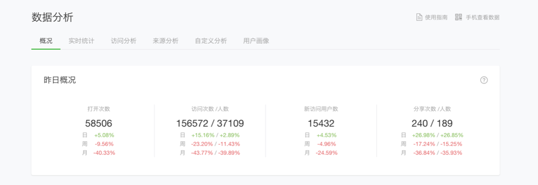

我们还可以查看关键指标的趋势，包括累计访问用户数、打开次数、访问次数等指标，可选择时间进行对比，如图5-13所示。

图5-13 小程序趋势概况:

* 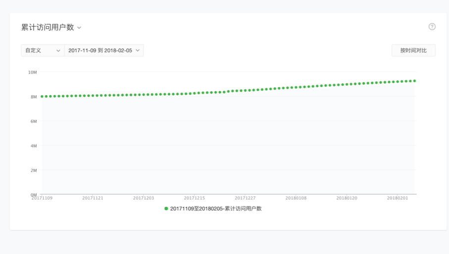

我们在小程序平台还可以查看小程序的访问分析，包括小程序用户访问规模、来源、频次、时长、深度、留存以及页面详情等数据，可以用于具体分析用户新增、活跃和留存情况。为了让开发者可以更加详细了解使用的用户情况，数据分析也提供了小程序的用户画像数据，包括用户年龄、性别、地区、终端及机型分布。

#### 4.1.2. 自定义分析

除了小程序宿主环境提供的数据分析能力，为了让开发者可以更加灵活多维和近实时的用户行为分析，小程序平台提供了自定义上报的特性，开发者可以对用户在小程序内的行为做精细化跟踪，满足页面访问等标准统计以外的个性化分析需求。例如，电商类小程序通过配置自定义上报，收集数据，可以完成如下分析：

购买商品的人，各省份、城市、年龄、性别的分布如何？不同用户群购买的商品数量、商品价格有什么差别？

用户访问商品页、查看商品详情、查看评论、下单、支付、完成购买，逐步的转化率如何？不同用户群的转化是否有差异？

今天参与线上活动的用户，各个时段（小时级）的活跃度如何？

在小程序官方提供的小程序自定义分析文档有非常详细的指引，为了不占本书篇幅，我们不在这展开阐述，有兴趣的读者可以查阅相关文档。

### 4.2. 运维中心

我们的程序变更总会伴随一些Bug产生，小程序的逻辑代码由JavaScript脚本编写，JavaScript可以通过一些方法[7]来检测运行时异常的发生，小程序宿主环境已经内置了异常检测的模块，并且上报到小程序平台，开发者可以通过小程序平台的“运维中心”查看具体的错误日志，开发者根据日志详细定位自己代码的异常处并及时修复。通过开发者自己主动去查阅日志定位错误的方式会显得比较被动，因为开发者不可能时时刻刻都在电脑前关注这个日志的变化曲线，因此比较推荐的方法是通过运维中心的监控告警功能，开发者设置合理的错误阈值，再通过加入微信告警群，当小程序运行发生大量异常现象时，微信告警群会提醒开发者，此时开发者再登录小程序管理平台查阅错误日志。小程序平台目前只提供了脚本错误告警，如果需要监控异常的访问或者服务接口耗时时，需要开发者自行开发监控系统，并在小程序逻辑代码加上对应的数据上报。
