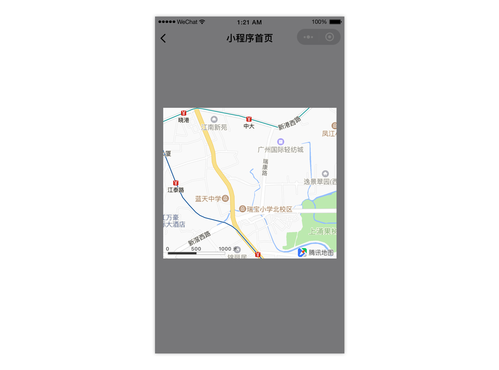

# 第 6 章：底层框架

经过前面章节的学习，相信大家对小程序开发已经非常熟悉了。从这一章开始，我们会向大家介绍在编写小程序代码背后的方方面面的细节，而在这一章里我们会先深入小程序底层，介绍底层的架构设计，一些细节原理，以及大家所熟悉的组件系统。通过这一章的学习，我们可以在之后的小程序开发中编写出更合理的代码，遇到问题可以有依据可循，能想到更好的解决办法。

## 1. 双线程模型

在前面第二章中，我们就有提到过小程序是基于双线程模型的，在这个模型中，小程序的逻辑层与渲染层分开在不同的线程运行，这跟传统的Web 单线程模型有很大的不同，使得小程序架构上多了一些复杂度，也多了一些限制。至于为何选择基于双线程模型来搭建小程序，以及因此而产生的问题和解决方案，接下来我们将一一介绍。

### 1.1. 技术选型

我们在对小程序的架构设计时的要求只有一个，就是要快，包括要渲染快、加载快等。当用户点开某个小程序时，我们期望体验到的是只有很短暂的加载界面，在一个过渡动画之后可以马上看到小程序的主界面。

我们首先需要确定用什么技术来渲染小程序界面，这是跟开发者的学习门槛息息相关的。

一般来说，渲染界面的技术有三种：

* 用纯客户端原生技术来渲染
* 用纯 Web 技术来渲染
* 介于客户端原生技术与 Web 技术之间的，互相结合各自特点的技术（下面统称 Hybrid 技术）来渲染

由于小程序的宿主是微信，所以我们不太可能用纯客户端原生技术来编写小程序 。如果这么做，那小程序代码需要与微信代码一起编包，跟随微信发版本，这种方式跟开发节奏必然都是不对的。因此，我们需要像Web 技术那样，有一份随时可更新的资源包放在云端，通过下载到本地，动态执行后即可渲染出界面。

但是，如果我们用纯 Web 技术来渲染小程序，在一些有复杂交互的页面上可能会面临一些性能问题，这是因为在 Web 技术中，UI渲染跟 JavaScript 的脚本执行都在一个单线程中执行，这就容易导致一些逻辑任务抢占UI渲染的资源。

按照上面的讨论，使用纯客户端原生技术或纯 Web 技术都有各自的缺点，那如果使用两者结合起来的 Hybrid 技术来渲染小程序，能否优于各自独立渲染的技术方案呢？实际上，这种 Hybrid 技术在业界过去几年里演化过数种技术方案，典型的如早期的PhoneGap，还有近两年流行的React Native（下称 RN），还有像微信网页里的 JS-SDK 这种轻量级的应用。

从渲染底层来看，PhoneGap与微信 JS-SDK 是类似的，它们最终都还是使用浏览器内核来渲染界面。而 RN 则不同，虽然是用 Web 相关技术来编写，同样是利用了 JavaScript 解释执行的特性，但 RN 在渲染底层是用客户端原生渲染的。实际上，小程序最初选型时 RN 是候选之一，虽然说 RN 是结合了 React 框架的代码组成方式，但是我们完全可以剥离React 框架这套写法，定义出更符合小程序特点的代码组成方式。不过，最终我们并没有选择这种类 RN 技术，原因有三：

* RN 所支持的样式是 CSS 的子集，会满足不了 Web 开发者日渐增长的需求，而对 RN 的改造具有不小的成本和风险。
* RN 现有能力下还存在的一些不稳定问题，比如性能、Bug等。RN 是把渲染工作全都交由客户端原生渲染，实际上一些简单的界面元素使用 Web 技术渲染完全能胜任，并且非常稳定。
* RN 存在一些不可预期的因素，比如近期就出现了许可协议问题。

最终，我们选择类似于微信 JSSDK 这样的 Hybrid 技术，即界面主要由成熟的 Web 技术渲染，辅之以大量的接口提供丰富的客户端原生能力。同时，每个小程序页面都是用不同的WebView去渲染，这样可以提供更好的交互体验，更贴近原生体验，也避免了单个WebView的任务过于繁重。此外，界面渲染这一块我们定义了一套内置组件以统一体验，并且提供一些基础和通用的能力，进一步降低开发者的学习门槛。值得一提的是，内置组件有一部分较复杂组件是用客户端原生渲染的，以提供更好的性能，在后面的章节中将深入介绍。

### 1.2. 管控与安全

基于Web 技术来渲染小程序是存在一些不可控因素和安全风险的。这是因为Web技术是非常开放灵活的，我们可以利用JavaScript 脚本随意地跳转网页或者改变界面上的任意内容。

我们原本定义了一套内置组件以提供统一的体验，用户进入小程序时，小程序代码包会被拉到本地（第七章将会详细介绍），这使得小程序可以离线浏览（只要小程序开发者把一些应用数据缓存到了本地），但要是开发者通过JavaScript 把渲染小程序的 WebView 跳转到其他在线网页，这个体验就变得非常糟。

除此之外，我们也提供一种可以展示敏感数据的组件（这些数据只能被展示，开发者并不能拿到数据），若开发者可以通过JavaScript 操作界面（DOM树），从而直接获取这些敏感数据，那小程序毫无安全可言。

为了解决管控与安全问题，我们必须阻止开发者使用一些浏览器提供的，诸如跳转页面、操作DOM、动态执行脚本的开放性接口。假设我们一个一个禁止，那势必会进入一个攻防战，这是因为 JavaScript 的灵活性以及浏览器接口的丰富性，我们很容易遗漏一些危险的接口，而且就算被我们找到所有危险的接口，也许在下一次浏览器内核更新而新增了一个可能会在这套体系下产生漏洞的接口，这样还是无法完全避免。

因此，要彻底解决这个问题，我们必须提供一个沙箱环境来运行开发者的JavaScript 代码。这个沙箱环境不能有任何浏览器相关接口，只提供纯JavaScript 的解释执行环境，那么像HTML5中的ServiceWorker、WebWorker特性就符合这样的条件，这两者都是启用另一线程来执行 JavaScript。但是考虑到小程序是一个多 WebView 的架构，每一个小程序页面都是不同的WebView 渲染后显示的，在这个架构下我们不好去用某个WebView中的ServiceWorker去管理所有的小程序页面。

得益于客户端系统有JavaScript 的解释引擎（在iOS下是用内置的 JavaScriptCore框架，在安卓则是用腾讯x5内核提供的JsCore环境），我们可以创建一个单独的线程去执行 JavaScript，在这个环境下执行的都是有关小程序业务逻辑的代码，也就是我们前面一直提到的逻辑层。而界面渲染相关的任务全都在WebView线程里执行，通过逻辑层代码去控制渲染哪些界面，那么这一层当然就是所谓的渲染层。这就是小程序双线程模型的由来。

### 1.3. 天生的延时

既然小程序是基于双线程模型，那就意味着任何数据传递都是线程间的通信，也就是都会有一定的延时。这不像传统Web那样，当界面需要更新时，通过调用更新接口 UI就会同步地渲染出来。在小程序架构里，这一切都会变成异步。

异步会使得各部分的运行时序变得复杂一些。比如在渲染首屏的时候，逻辑层与渲染层会同时开始初始化工作，但是渲染层需要有逻辑层的数据才能把界面渲染出来，如果渲染层初始化工作较快完成，就要等逻辑层的指令才能进行下一步工作。因此逻辑层与渲染层需要有一定的机制保证时序正确，这些工作在小程序框架里会处理好，开发者只需要理解生命周期，以及控制合适的时机更新UI即可。更多的运行流程细节会在第七章中详细介绍。

除了逻辑层与渲染层之间的通信有延时，各层与客户端原生交互同样是有延时的。以逻辑层为例，开发者的代码是跑在逻辑层这个线程之上，而客户端原生是跑在微信主线程（安卓上是线程）之上，所以注册给逻辑层有关客户端能力的接口，实际上也是跟微信主线程之间的通信，同样意味着有延时。这也是我们看到大部分提供的接口都是异步的原因。

在理解了小程序架构下很多天生的延时后，我们会更容易想到一些问题的解决方法。比如，我们在使用一块画布（canvas组件）做图像处理并导出照片时，会习惯地在调用 `draw` 方法渲染后，立即调用  `wx.canvasToTempFilePath` 接口来导出图片，实际上很有可能调用的时刻画布还未完成渲染而使导出的图片不是期望的效果。

代码清单6-1 使用canvas导出图片脚本

```javascript
var ctx = wx.createCanvasContext('myCanvas');

ctx.fillRect(0, 0, 100, 100);
// ……

ctx.draw();

// 以下调用应该要在 ctx.draw 调用的回调函数里执行
wx.canvasToTempFilePath({
  canvasId: 'myCanvas',
  success(res) {
    console.log('canvasToTempFilePathresult: ' + res.tempFilePath);
  }
});
```

## 2. 组件系统

小程序的视图是在WebView里渲染的，那搭建视图的方式自然就需要用到HTML语言。如果我们直接提供HTML的能力，那前面章节所介绍的为解决管控与安全而建立的双线程模型就成为摆设了。开发者可以利用A标签实现跳转到其它在线网页，也可以动态执行JavaScript等。除管控与安全外，还有一些的不足之处：

* 标签众多，增加理解成本；
* 接口底层，不利于快速开发；
* 能力有限，会限制小程序的表现形式。

因此，我们设计一套组件框架——Exparser。基于这个框架，内置了一套组件，以涵盖小程序的基础功能，便于开发者快速搭建出任何界面。同时也提供了自定义组件的能力，开发者可以自行扩展更多的组件，以实现代码复用。

### 2.1. Exparser框架

Exparser是微信小程序的组件组织框架，内置在小程序基础库中，为小程序的各种组件提供基础的支持。小程序内的所有组件，包括内置组件和自定义组件，都由Exparser组织管理。

Exparser的组件模型与WebComponents标准中的ShadowDOM高度相似。Exparser会维护整个页面的节点树相关信息，包括节点的属性、事件绑定等，相当于一个简化版的Shadow DOM实现。Exparser的主要特点包括以下几点：

* 基于Shadow DOM模型：模型上与WebComponents的ShadowDOM高度相似，但不依赖浏览器的原生支持，也没有其他依赖库；实现时，还针对性地增加了其他API以支持小程序组件编程。
* 可在纯JS环境中运行：这意味着逻辑层也具有一定的组件树组织能力。
* 高效轻量：性能表现好，在组件实例极多的环境下表现尤其优异，同时代码尺寸也较小。

小程序中，所有节点树相关的操作都依赖于Exparser，包括WXML到页面最终节点树的构建、createSelectorQuery 调用和自定义组件特性等。

### 2.2. 内置组件

我们基于Exparser框架，内置了一套组件，提供了视图容器类、表单类、导航类、媒体类、开放类等几十种组件。有了这么丰富的组件，再配合WXSS，我们可以搭建出任何效果的界面。在功能层面上，也满足绝大部分需求。

一般而言，我们会把一个组件内置到小程序框架里的一个重要原则是：这个组件是基础的。换句话说，没有这个组件的话，在小程序架构里无法实现或者实现不好某类功能。比如像一些开放类组件，有open-data组件提供展示群名称、用户信息等微信体系下的隐私信息，有button组件里open-type属性所提供分享、跳转App等敏感操作的能力。还有比如像视图容器类组件movable-view这种因双线程模型导致手势识别不好实现的组件，这是因为手势识别需要高频率捕捉手指的触摸事件，而在双线程模型中，触摸事件从渲染层发出，派发到逻辑层，这中间是有一定的延时而导致视图跟随手指运动这类交互变得有些卡顿。

### 2.3. 自定义组件

自定义组件是开发者可以自行扩充的组件。开发者可以将常用的节点树结构提取成自定义组件，实现代码复用。

#### 2.3.1. ShadowTree的概念

我们以下面的代码为例来阐述 Shadow Tree 的概念。

代码清单6-2 页面节点树(Composed Tree)

```xml
<view>
  <input-with-label>
    <label>
      TEXT
    </label>
    <input />
  </input-with-label>
</view>
```

这里如果将 `input-with-label` 抽象成一个组件，那么可以将整个节点树拆分成两部分。

代码清单6-3 组件节点树(Shadow Tree)

```xml
<label>
  <slot/>
</label>

<input />
```

代码清单6-4 调用组件的节点树

```xml
<view>
    <input-with-label>
        TEXT
    </input-with-label>
</view>
```

在Exparser的组件模型中，这两个节点树可以被拼接成上方的页面节点树。其中，组件的节点树称为“ShadowTree”，即组件内部的实现；最终拼接成的页面节点树被称为“Composed Tree”，即将页面所有组件节点树合成之后的树。在进行了这样的组件分离之后，整个页面节点树实质上被拆分成了若干个ShadowTree（页面的body实质上也是一个组件，因而也是一个ShadowTree）。

同时，各个组件也将具有各自独立的逻辑空间。每个组件都分别拥有自己的独立的数据、setData调用，createSelectorQuery也将运行在Shadow Tree的层面上。关于具体如何使用自定义组件特性，这里不再详细讨论，请参阅小程序开发文档。

#### 2.3.2. 运行原理

在使用自定义组件的小程序页面中，Exparser将接管所有的自定义组件注册与实例化。从外部接口上看，小程序基础库提供有Page和Component两个构造器。以Component为例，在小程序启动时，构造器会将开发者设置的properties、data、methods等定义段，写入Exparser的组件注册表中。这个组件在被其它组件引用时，就可以根据这些注册信息来创建自定义组件的实例。Page构造器的大体运行流程与之相仿，只是参数形式不一样。这样每个页面就有一个与之对应的组件，称为“页面根组件”。

在初始化页面时，Exparser会创建出页面根组件的一个实例，用到的其他组件也会响应创建组件实例（这是一个递归的过程）。组件创建的过程大致有以下几个要点：

* 根据组件注册信息，从组件原型上创建出组件节点的JS对象，即组件的this；
* 将组件注册信息中的data 复制一份，作为组件数据，即this.data；
* 将这份数据结合组件WXML，据此创建出Shadow Tree，由于Shadow Tree中可能引用有其他组件，因而这会递归触发其他组件创建过程；
* 将ShadowTree拼接到Composed Tree上，并生成一些缓存数据用于优化组件更新性能；
* 触发组件的created生命周期函数；
* 如果不是页面根组件，需要根据组件节点上的属性定义，来设置组件的属性值；
* 当组件实例被展示在页面上时，触发组件的attached 生命周期函数，如果Shadw Tree中有其他组件，也逐个触发它们的生命周期函数。

#### 2.3.3. 组件间通信

不同组件实例间的通信有WXML属性值传递、事件系统、selectComponent和relations等方式。其中，WXML属性值传递是从父组件向子组件的基本通信方式，而事件系统是从子组件向父组件的基本通信方式。

Exparser的事件系统完全模仿Shadow DOM的事件系统。在通常的理解中，事件可以分为冒泡事件和非冒泡事件，但在ShadowDOM体系中，冒泡事件还可以划分为在Shadow Tree上冒泡的事件和在Composed Tree上冒泡的事件。如果在Shadow Tree上冒泡，则冒泡只会经过这个组件Shadow Tree上的节点，这样可以有效控制事件冒泡经过的范围。

代码清单6-5 input-with-label的WXML

```xml
<label>
  <input />
  <slot />
</label>
```

代码清单6-6 页面WXML

```xml
<view>
  <input-with-label>
    <button />
  </input-with-label>
</view>
```

用上面的例子来说，当在 button 上触发一个事件时：

* 如果事件是非冒泡的，那只能在 button 上监听到事件；
* 如果事件是在 Shadow Tree 上冒泡的，那 button 、 input-with-label 、view 可以依次监听到事件；
* 如果事件是在 Composed Tree 上冒泡的，那 button 、 slot 、label 、 input-with-label 、 view 可以依次监听到事件。

在自定义组件中使用triggerEvent触发事件时，可以指定事件的bubbles、composed和capturePhase属性，用于标注事件的冒泡性质。

代码清单6-7 triggerEvent事例

```javascript
Component({
  methods: {
    helloEvent: function() {
      this.triggerEvent('hello', {}, {
        bubbles: true,      // 这是一个冒泡事件
        composed: true,     // 这个事件在Composed Tree 上冒泡
        capturePhase: false // 这个事件没有捕获阶段
      })
    }
  }
})
```

小程序基础库自身也会通过这套事件系统提供一些用户事件，如tap、touchstart和form组件的submit等。其中，tap等用户触摸引发的事件是在ComposedTree上的冒泡事件，其他事件大多是非冒泡事件。

## 3. 原生组件

在内置组件中，有一些组件较为特殊，它们并不完全在Exparser的渲染体系下，而是由客户端原生参与组件的渲染，这类组件我们称为“原生组件”,这也是小程序Hybrid技术的一个应用。

### 3.1. 原生组件运行机制

要介绍原生组件的运行机制，我们需要从一行代码看起。

代码清单6-8 展示一个地图组件

```xml
<map latitude="39.92" longtitude="116.46"></map>
```

在原生组件内部，其节点树非常简单，基本上可以认为只有一个 div 元素。上面这行代码在渲染层开始运行时，会经历以下几个步聚：

* 组件被创建，包括组件属性会依次赋值。
* 组件被插入到DOM树里，浏览器内核会立即计算布局，此时我们可以读取出组件相对页面的位置（x, y坐标）、宽高。
* 组件通知客户端，客户端在相同的位置上，根据宽高插入一块原生区域，之后客户端就在这块区域渲染界面
* 当位置或宽高发生变化时，组件会通知客户端做相应的调整

我们可以看出，原生组件在WebView这一层的渲染任务是很简单，只需要渲染一个占位元素，之后客户端在这块占位元素之上叠了一层原生界面。因此，原生组件的层级会比所有在WebView层渲染的普通组件要高。

图6-1 原生组件层级示意图

* 

引入原生组件主要有3个好处：

* 扩展Web的能力。比如像输入框组件（input, textarea）有更好地控制键盘的能力。
* 体验更好，同时也减轻WebView的渲染工作。比如像地图组件（map）这类较复杂的组件，其渲染工作不占用WebView线程，而交给更高效的客户端原生处理。
* 绕过setData、数据通信和重渲染流程，使渲染性能更好。比如像画布组件（canvas）可直接用一套丰富的绘图接口进行绘制。

表6-1 常用的几个原生组件

| 件名 | 名称 | 是否有**context** | 描述 |
| - | - | - | - |
| video | 视频 | 是 | 播放视频 |
| map | 地图 | 是 | 展示地图 |
| canvas | 画布 | 是 | 提供一个可以自由绘图的区域 |
| picker | 弹出式选择器 | 否 | 初始时没有界面，点击时弹出选择器 |

交互比较复杂的原生组件都会提供“context”，用于直接操作组件。以canvas为例，小程序提供了wx.createCanvasContext方法来创建canvas的context。这是一个可以用于操作canvas的对象，对象下提供了很多绘图的方法，如“setFillStyle”方法可以设置填充样式，“fillRect”方法用于绘制矩形（这些方法与HTML DOM Canvas兼容）。

代码清单6-9 canvas组件context对象示例（WXML代码）

```xml
<canvas canvas-id="myCanvas"></canvas>
```

代码清单6-10 canvas组件context对象示例（JS代码）

```javascript
const ctx = wx.createCanvasContext('myCanvas')
ctx.setFillStyle('red')
ctx.fillRect(10, 10, 150, 75)
ctx.draw()
```

这段代码可以创建WXML中对应canvas节点的context，通过调用context中的方法，在画布上绘制一个矩形。

类似于canvas，video、map等原生组件都可以创建context，context中提供的方法非常丰富，这里就不一一列举了。

### 3.2. 原生组件渲染限制

原生组件脱离在WebView渲染流程外，这带来了一些限制。最主要的限制是一些CSS样式无法应用于原生组件，例如，不能在父级节点使用overflow:hidden来裁剪原生组件的显示区域；不能使用transformrotate让原生组件产生旋转等。

开发者最为常见的问题是，原生组件会浮于页面其他组件之上（相当于拥有正无穷大的z-index值）使其它组件不能覆盖在原生组件上展示。想要解决这个问题，可以考虑使用cover-view和cover-image组件。这两个组件也是原生组件，同样是脱离WebView的渲染流程外，而原生组件之间的层级就可以按照一定的规则控制。

## 4. 小程序与客户端通信原理

### 4.1. 视图层组件

内置组件中有部分组件是利用到客户端原生提供的能力，这类组件基本都是前一个章节描述的原生组件。既然需要客户端原生提供的能力，那就会涉及到视图层与客户端的交互通信。这层通信机制在 iOS 和安卓系统的实现方式并不一样，iOS 是利用了WKWebView 的提供 messageHandlers 特性，而在安卓则是往 WebView 的 window 对象注入一个原生方法，最终会封装成 WeiXinJSBridge 这样一个兼容层，主要提供了调用（invoke）和监听（on）这两种方法。

实际上，在视图层与客户端的交互通信中，开发者只是间接调用的，真正调用是在组件的内部实现中。开发者插入一个原生组件，一般而言，组件运行的时候被插入到 DOM 树中，会调用客户端接口，通知客户端在哪个位置渲染一块原生界面。在后续开发者更新组件属性时，同样地，也会调用客户端提供的更新接口来更新原生界面的某些部分。

### 4.2. 逻辑层接口

逻辑层与客户端原生通信机制与渲染层类似，不同在于，iOS平台可以往JavaScripCore框架注入一个全局的原生方法，而安卓方面则是跟渲染层一致的。

同样地，开发者也是间接地调用到与客户端原生通信的底层接口。一般我们会对逻辑层接口做层封装后才暴露给开发者，封装的细节可能是统一入参、做些参数校验、兼容各平台或版本问题等等。
