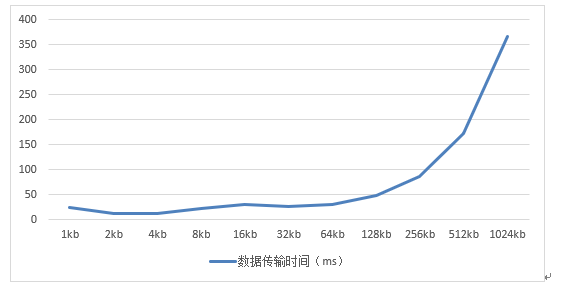

# 第 7 章：性能优化

之前的章节已经介绍了小程序的编写方法和基础原理。本章将进一步介绍一些运行细节，以及针对性的优化策略。

## 1. 启动

在小程序启动时，微信会为小程序展示一个固定的启动界面，界面内包含小程序的图标、名称和加载提示图标。此时，微信会在背后完成几项工作：下载小程序代码包、加载小程序代码包、初始化小程序首页。

图7-1 小程序启动流程图：

* 

### 1.1. 代码包下载

在某个小程序第一次启动时，微信需要下载小程序代码包。此后，如果小程序代码包未更新且还被保留在缓存中，则下载小程序代码包的步骤会被跳过。下载到的小程序代码包不是小程序的源代码，而是编译、压缩、打包之后的代码包。代码包大小可以在开发者工具的“详情”栏中找到。
从开发者的角度看，控制代码包大小有助于减少小程序的启动时间。对低于1MB的代码包，其下载时间可以控制在929ms（iOS）、1500ms（Android）内。

以下是一些常规的控制代码包大小的方法。

* 精简代码，去掉不必要的WXML结构和未使用的WXSS定义。
* 减少在代码包中直接嵌入的资源文件。
* 压缩图片，使用适当的图片格式。

如果小程序比较复杂，优化后的代码总量可能仍然比较大，此时可以采用分包加载的方式进行优化。

### 1.2. 分包加载流程

一般情况下，小程序的代码将打包在一起，在小程序启动时一次性下载完成。采用分包时，小程序的代码包可以被划分为几个：一个是“主包”，包含小程序启动时会马上打开的页面代码和相关资源；其余是“分包”，包含其余的代码和资源。这样，小程序启动时，只需要先将主包下载完成，就可以立刻启动小程序。这样就可以显著降低小程序代码包的下载时间。

图7-2 分包目录结构示例:

* 

代码清单7-1 使用分包时 app.json 示例

```json
{
  "pages":[
    "pages/index",
    "pages/logs"
  ],
  "subPackages": [
    {
      "root": "packageA",
      "pages": [
        "pages/cat",
        "pages/dog"
      ]
    }, {
      "root": "packageB",
      "pages": [
        "pages/apple",
        "pages/banana"
      ]
    }
  ]
}
```

一个支持分包的小程序目录结构可以组织成上图的形式。代码根目录下有“packageA”和“packageB”两个子目录（它们的名字需要在app.json中声明），这两个子目录就构成了两个分包，每个分包下都可以有自己的页面代码和资源文件。而除掉这两个目录的部分就是小程序的主包。在小程序启动时，“packageA”和“packageB”两个子目录的内容不会马上被下载下来，只有主包的内容才会被下载。利用这个特性就可以显著降低初始启动时的下载时间。

使用分包时需要注意代码和资源文件目录的划分。启动时需要访问的页面及其依赖的资源文件应放在主包中。

### 1.3. 代码包加载

微信会在小程序启动前为小程序准备好通用的运行环境。这个运行环境包括几个供小程序使用的线程，并在其中完成小程序基础库的初始化，预先执行通用逻辑，尽可能做好小程序的启动准备。这样可以显著减少小程序的启动时间。

小程序的代码包被下载（或从缓存中读取）完成后，小程序的代码会被加载到适当的线程中执行。此时，所有app.js、页面所在的JS文件和所有其他被require的JS文件会被自动执行一次，小程序基础库会完成所有页面的注册。在小程序代码调用Page构造器的时候，小程序基础库会记录页面的基础信息，如初始数据（data）、方法等。需要注意的是，如果一个页面被多次创建，并不会使得这个页面所在的JS文件被执行多次，而仅仅是根据初始数据多生成了一个页面实例（this），在页面JS文件中直接定义的变量，在所有这个页面的实例间是共享的。

例如，若从页面 A 使用 `wx.navigateTo` 跳转到页面B，再使用 `wx.navigateTo` 跳转到页面 A，此时页面栈中有三个页面：A、B、A。这时两个 A 页面的实例将共享它的JS文件中Page构造器以外直接定义的变量。有经验的开发者可以利用这个特性，但一些开发者也会错误地共享出一些变量，因而使用时要小心。

代码清单7-2 小程序代码包加载期间执行的代码示例

```javascript
console.log('加载 page.js')
var count = 0
Page({
  onLoad: function() {
    count += 1
    console.log('第 ' + count + ' 次启动这个页面')
  }
})
```

如果在 `page.js` 中加入这段代码，则在小程序代码包加载阶段就会在控制台中输出一段提示语，并在每次页面被创建后输出这是这个页面第几次被创建。

在小程序代码包加载完毕后，小程序基础库会根据启动路径选择一个页面来启动。这时会根据页面路径和初始数据创建一个新页面。页面创建和运行期间会涉及许多数据通信和页面渲染，接下来会详细介绍。

## 2. 页面层级准备

在视图层内，小程序的每一个页面都独立运行在一个页面层级上。小程序启动时仅有一个页面层级，每次调用 `wx.navigateTo` ，都会创建一个新的页面层级；相对地，`wx.navigateBack` 会销毁一个页面层级。

对于每一个新的页面层级，视图层都需要进行一些额外的准备工作。在小程序启动前，微信会提前准备好一个页面层级用于展示小程序的首页。除此以外，每当一个页面层级被用于渲染页面，微信都会提前开始准备一个新的页面层级，使得每次调用 `wx.navigateTo` 都能够尽快展示一个新的页面。

页面层级的准备工作分为三个阶段。第一阶段是启动一个 WebView，在 iOS 和 Android 系统上，操作系统启动 WebView 都需要一小段时间。第二阶段是在 WebView 中初始化基础库，此时还会进行一些基础库内部优化，以提升页面渲染性能。第三阶段是注入小程序 WXML 结构和 WXSS 样式，使小程序能在接收到页面初始数据之后马上开始渲染页面（这一阶段无法在小程序启动前执行）。

图7-3 页面层级准备过程图:

* 

对于 `wx.redirectTo`，这个调用不会打开一个新的页面层级，而是将当前页面层级重新初始化：重新传入页面的初始数据、路径等，视图层清空当前页面层级的渲染结果然后重新渲染页面。

## 3. 数据通信

在每个小程序页面的生命周期中，存在着若干次页面数据通信。逻辑层向视图层发送页面数据（ data 和 setData 的内容），视图层向逻辑层反馈用户事件。

### 3.1. 页面初始数据通信

在小程序启动或一个新的页面被打开时，页面的初始数据（data）和路径等相关信息会从逻辑层发送给视图层，用于视图层的初始渲染。Native层会将这些数据直接传递给视图层，同时向用户展示一个新的页面层级，视图层在这个页面层级上进行界面绘制。视图层接收到相关数据后，根据页面路径来选择合适的WXML结构，WXML结构与初始数据相结合，得到页面的第一次渲染结果。

图7-4 初始数据通信时序图:

* 

分析这个流程不难得知：页面初始化的时间大致由页面初始数据通信时间和初始渲染时间两部分构成。其中，数据通信的时间指数据从逻辑层开始组织数据到视图层完全接收完毕的时间，数据量小于 64KB 时总时长可以控制在 30ms 内。传输时间与数据量大体上呈现正相关关系，传输过大的数据将使这一时间显著增加。因而减少传输数据量是降低数据传输时间的有效方式。

图7-5 数据传输时间与数据量关系图:

* 


