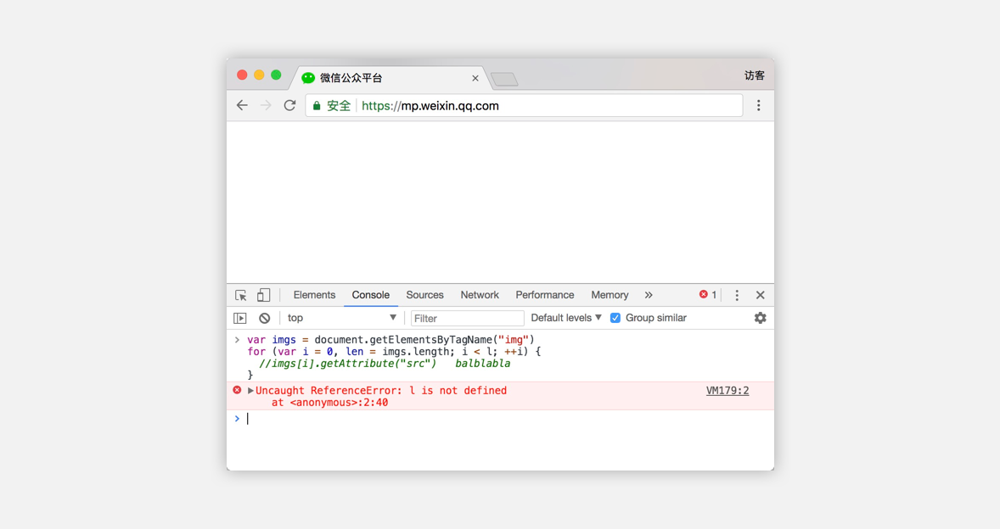

# 第 8 章：小程序基础库的更新迭代

小程序平台正式发布后，收到许多开发者的反馈，其中有Bug类的反馈，也有向我们提出某些具体需求的。程序总有出错的时候，小程序的底层也有出现重大 Bug 的现象发生，一旦这种Bug出现，会影响到很多小程序的正常工作，因此我们需要迅速进行修复。同时，我们也以小步快跑的方式发布很多新的能力供开发者使用，所以小程序的底层基础库迭代速度是非常快。在这一章我们会介绍小程序基础库是如何进行更新迭代的。

## 1. 小程序基础库

我们在第三章提到过小程序的运行环境是分成渲染层和逻辑层的，我们在渲染层可以用各类组件组建界面的元素，在逻辑层可以用各类API来处理各种逻辑，这里提到的组件、API其实都是小程序基础库进行包装提供的，基础库的职责还要处理数据绑定、组件系统、事件系统、通信系统等一系列框架逻辑，才能让整个小程序有序的运作起来。小程序的基础库是JavaScript编写的，它可以被注入到渲染层和逻辑层运行。为了叙述方便，下文我们把小程序基础库简称为基础库。

### 1.1. 基础库载入时机

我们在开发网页时，经常会引用很多开源的JS库，在使用到这些库所提供的 API 前，我们需要先在业务代码前边引入这些库，如代码 8-1 所示，我们在使用 jQuery 库的$函数前，需要在业务代码前用 script 标签先引入 jQuery.js。

代码清单8-1 在HTML引入其他JS库:

```html
<script src="jQuery.js"></script>
<script src="Vue.js"></script>
<script>
  $(function() {
    // console.log("ready")
  })
</script>
```

同样道理，为了让小程序业务代码能够调用 `wx.navigateTo` 等 API 以及组件，就需要在启动小程序后先载入基础库，接着再载入业务代码。由于小程序的渲染层和逻辑层是两个线程管理，渲染层 WebView 层注入的称为 WebView 基础库，逻辑层注入的称为 AppService 基础库，如果没有特殊声明，后文提到基础库的概念指的是 WebView 基础库和 AppService 基础库两个的组合。

显然，所有小程序在微信客户端打开的时候，都需要注入相同的基础库 ，所以，小程序的基础库不会被打包在某个小程序的代码包里边，它会被提前内置在微信客户端。这样做的好处有两点：

* 降低业务小程序的代码包大小。
* 可以单独修复基础库中的 Bug，无需修改到业务小程序的代码包。

### 1.2. 基础库的版本号

小程序基础库版本号使用 semver 规范，格式为 `Major.Minor.Patch`，其中 `Major`、`Minor`、`Patch`均为整数，`1.9.901`、`2.44.322`、`10.32.44` 都是符合 semver 风格的版本号。通常我们月度发布版本会把 `Minor` 提升一位，例如从 `1.9.x` 升级到 `1.10.x`，如果是修正版本，会把 `Patch` 提升一位，例如 `1.10.0` 升级到 `1.10.1`。`Major 位则是重大特性发布时才会被提升一位。

在小程序中，可以通过 `wx.getSystemInfo()` 或者 `wx.getSystemInfoSync()` 方法获取小程序版本号，如代码8-2所示。

代码清单8-2 用字符串直接比较版本号

```javascript
var info = wx.getSystemInfoSync()
console.log("小程序基础库版本号为：" + info.SDKVersion)
```

我们还要再强调一点，不少开发者会使用错误的版本号比较方法，例如直接用字符串比较，`parseInt` 比较等，往后当基础库版本号提升上去后，会引发一些逻辑错误，如代码8-3所示。

代码清单8-3 用字符串直接比较版本号:

```javascript
var info = wx.getSystemInfoSync() // info.SDKVersion == "1.11.0"
if (info.SDKVersion > "1.9.0") { // 此时条件为false，无法进入if分支
  // 处理高版本小程序的逻辑
}
```

代码8-4给出了正确的比较版本号的方法，后续小程序基础库会内置版本比较的API，建议查阅小程序官方文档使用该方法。

代码清单8-4 正确比较版本号的方法

```javascript
function compareVersion(v1, v2) {
  v1 = v1.split('.')
  v2 = v2.split('.')
  var len = Math.max(v1.length, v2.length)

  while (v1.length < len) {
    v1.push('0')
  }
  while (v2.length < len) {
    v2.push('0')
  }

  for (var i = 0; i < len; i++) {
    var num1 = parseInt(v1[i])
    var num2 = parseInt(v2[i])

    if (num1 > num2) {
      return 1
    } else if (num1 < num2) {
      return -1
    }
  }
  return 0
}

compareVersion('1.11.0', '1.9.9') // => 1 // 1表示 1.11.0比1.9.9要新
compareVersion('1.11.0', '1.11.0') // => 0 // 0表示1.11.0和1.11.0是同一个版本
compareVersion('1.11.0', '1.99.0') // => -1 // -1表示1.11.0比 1.99.0要老
```

## 2. 异常

程序不可避免会出现运行时错误，JavaScript 语言是一种非常灵活的脚本语言，由于没有静态编译的过程，在运行时就更容易出现异常现象，例如错误的把某个字符串类型变量当做整数类型去做处理等。

### 2.1. JS 运行异常

我们在网页开发中，如果在 Chrome 运行代码 8-5 片段，在 Chrome 浏览器的开发者工具 里的 Console 面板中出现脚本运行异常的错误信息，示例中 `for` 循环的条件表达式 `i < l` 中的 `l` 变量没定义，运行后出现异常，如图 8-1 所示。

代码清单8-5 运行时产生异常的代码示例

```javascript
var imgs = document.getElementsByTagName("img")
for (var i = 0, len = imgs.length; i < l; ++i) {
  //imgs[i].getAttribute("src")   balblabla
}
```

图8-1 网页JS运行错误:

* 

一般语法错误以及运行时错误，浏览器都会在 Console 里边显示对应的错误信息，以及出错的文件、行号、堆栈信息。

