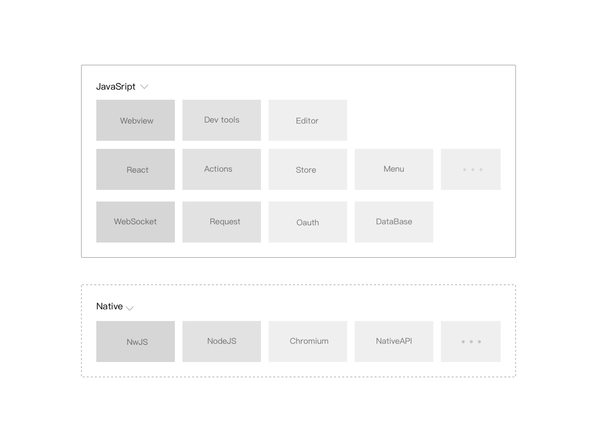
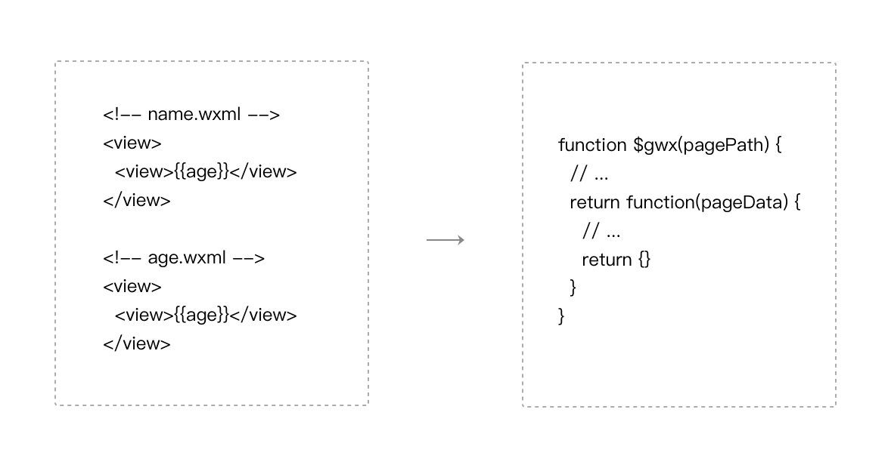
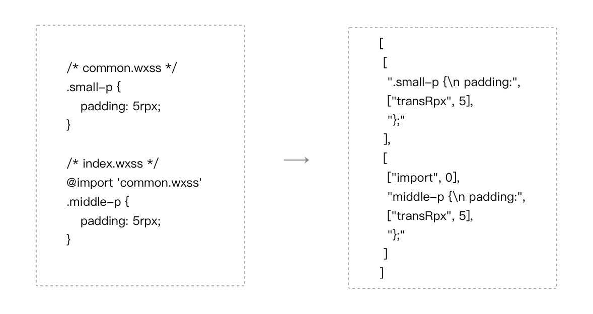
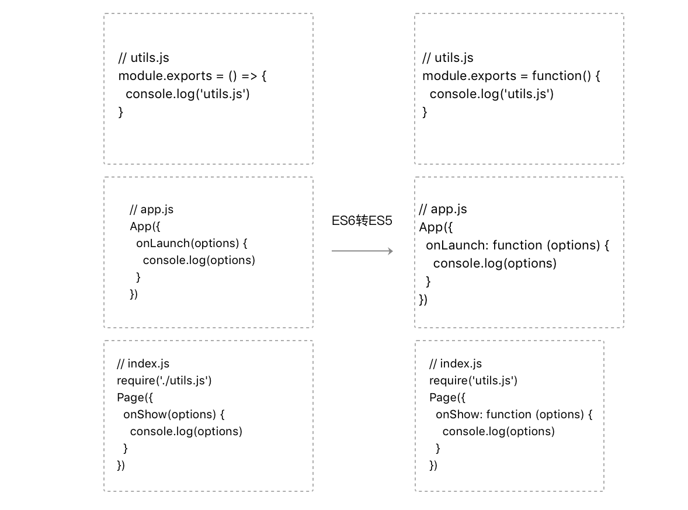
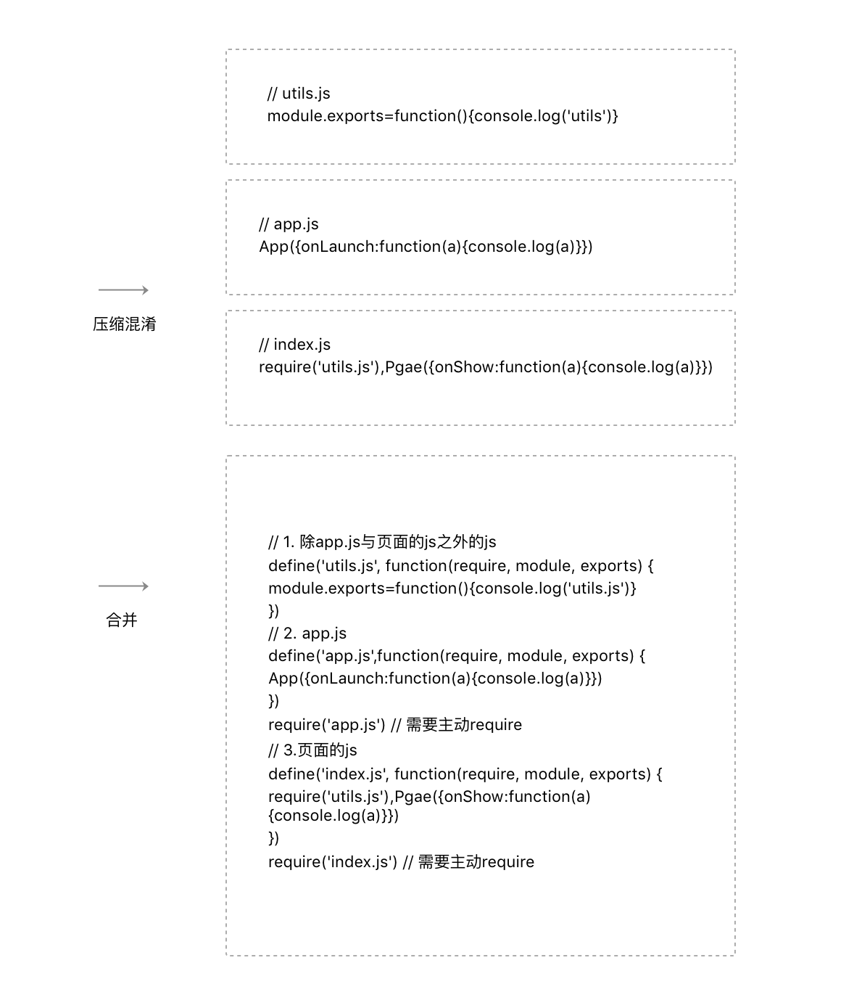
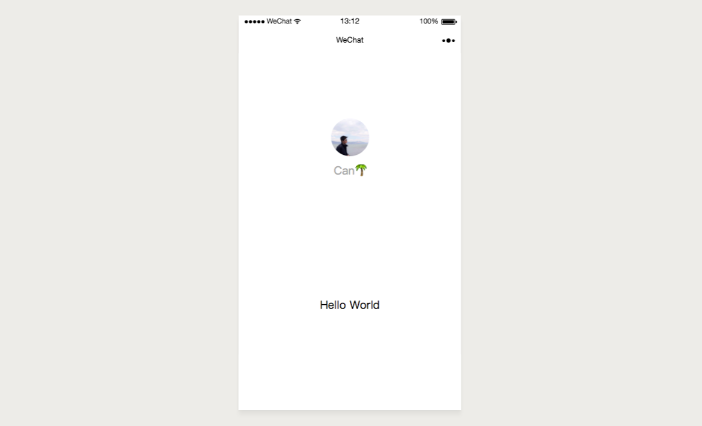

# 第 9 章：微信开发者工具

本章主要介绍微信开发者工具如何编译小程序代码，如何实现小程序模拟器以及如何调试小程序。

## 1. 简介

虽然在开发语言层面小程序与传统的网页差别不大：是使用 JavaScript 脚本语言编写逻辑代码、使用类似于 HTML 的 WXML 来描述页面的结构、使用类似于 CSS 的 WXSS 来描述节点的样式，但是由于小程序渲染和逻辑分离的运行机制与传统的网页存在差异，所以无法使用传统的网页的开发调试工具，因此我们推出了小程序开发生态一站式 IDE ——微信开发者工具。开发者可以借助微信开发者工具完成小程序的代码开发、编译运行、界面和逻辑调试、真机预览和提交发布版本等功能。

图9-1 微信开发者工具:

* 

微信开发者工具是一个基于 `nw.js` ，使用 `node.js`、`chromium` 以及系统 API 来实现底层模块，使用 `React`、`Redux` 等前端技术框架来搭建用户交互层，实现同一套代码跨 Mac 和Windows 平台使用。

图9-2 微信开发者工具底层框架

* 

## 2. 代码编译

微信开发者工具和微信客户端都无法直接运行小程序的源码，因此我们需要对小程序的源码进行编译。代码编译过程包括本地预处理、本地编译和服务器编译。为了快速预览，微信开发者工具模拟器运行的代码只经过本地预处理、本地编译，没有服务器编译过程，而微信客户端运行的代码是额外经过服务器编译的。

### 2.1. 编译 WXML

WXML（WeiXin Markup Language）是小程序框架设计的一套标签语言，用于构建出页面的结构。小程序的渲染层的运行环境是一个 WebView，而 WebView 无法直接理解 WXML 标签，所以需要经过编译。

微信开发者工具内置了一个二进制的 WXML 编译器，这个编译器接受 WXML 代码文件列表，处理完成之后输出 JavaScript 代码，这段代码是各个页面的结构生成函数。

图9-3 WXML的编译过程：

* 

编译过程将所有的 WXML 代码最终变成一个 JavaScript 函数，预先注入在 WebView 中。在运行时确定了页面路径之后，将路径作为参数传递给这个函数得到该页面的结构生成函数，页面结构生成函数接受页面数据，输出一段描述页面结构的 JSON，最终通过小程序组件系统生成对应的 HTML。

代码清单10-1 如何使用页面结构生成函数

```javascript
// $gwx 是 WXML 编译后得到的函数
// 根据页面路径获取页面结构生成函数
var generateFun = $gwx('name.wxml')

// 页面结构生成函数接受页面数据，得到描述页面结构的 JSON
var virtualTree = generateFun({
   name:  'miniprogram'
})

/**
virtualTree == {
   tag: 'view'，
   children: [{
       tag: 'view',
       children: ['miniprogram']
     }]
 }
 **/

 // 小程序组件系统在虚拟树对比后将结果渲染到页面上
virtualDom.render(virtualTree)
```

上传代码时，微信开发者工具直接将本地的 WXML 代码文件提交到后台，由后台进行 WXML 编译，后台的 WXML 编译器和开发者工具本地内置的 WXML 编译器是同一套代码生成的。

### 2.2. 编译 WXSS

WXSS (WeiXin Style Sheets) 是一套样式语言，用来决定 WXML 的组件应该怎么显示。为了适应广大的前端开发者，WXSS 具有 CSS 大部分特性。同时为了更适合开发微信小程序，WXSS 对 CSS 进行了扩充以及修改。与 CSS 相比，WXSS 扩展的一些特性，包括 rpx 尺寸单位和样式导入语法，这些特性都是 WebView 无法直接理解的。

微信开发者工具内置了一个二进制的 WXSS 编译器，这个编译器接受 WXSS 文件列表，分析文件之间的引用关系，同时预处理 rpx，输出一个样式信息数组，如图 10-4，每个 WXSS 文件对应于这个数组中的一项。

图9-4 WXSS的编译过程:

* 

在运行时，根据当前的屏幕宽度，计算出 1rpx 对应多少像素单位，然后将样式信息数组转换成最终的样式添加到页面中。

由于样式在微信客户端存在兼容性问题，为了方便开发者，微信开发者工具提供了上传代码时样式自动补全的功能，利用 PostCSS 对 WXSS 文件进行预处理，自动添加样式前缀。

### 2.3. 编译 JavaScript

微信客户端在运行小程序的逻辑层的时候只需要加载一个 JS 文件（我们称为 `app-service.js`），而小程序框架允许开发者将 JavaScript 代码写在不同的文件中，所以在代码上传之前，微信开发者工具会对开发者的 JS 文件做一些预处理，包括 ES6 转 ES5 和代码压缩（开发者可以选择关闭预处理操作），在服务器编译过程将每个 JS 文件的内容分别包裹在 define 域中，再按一定的顺序合并成 `app-service.js` 。其中对于页面 JS 和 `app.js` 需要主动 require。

图9-5 JavaScript的编译过程:

* 
* 

## 3. 模拟器

小程序模拟器模拟小程序在微信客户端的逻辑和界面表现，方便开发者实时查看代码效果。由于系统差异以及微信客户端特有的一些交互流程，少部分的API无法在模拟器上进行模拟，但对于绝大部分的 API 均能够在模拟器上呈现出正确的状态。同时微信开发者工具提供多种机型尺寸以及自定义机型尺寸功能，方便开发者进行界面样式的机型适配。

图9-6 小程序模拟器：

* 
