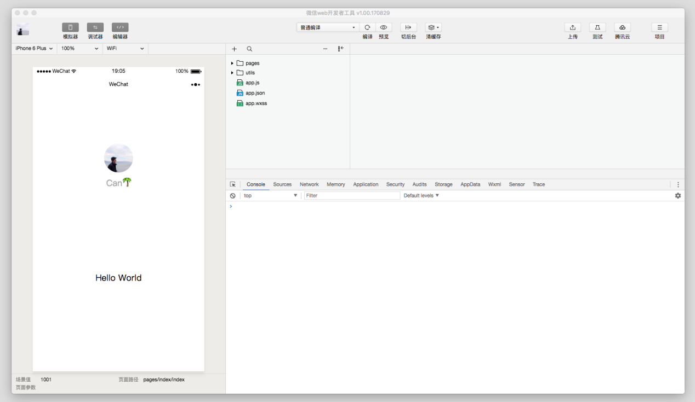

# 第 9 章：微信开发者工具

本章主要介绍微信开发者工具如何编译小程序代码，如何实现小程序模拟器以及如何调试小程序。

## 1. 简介

虽然在开发语言层面小程序与传统的网页差别不大：是使用 JavaScript 脚本语言编写逻辑代码、使用类似于 HTML 的 WXML 来描述页面的结构、使用类似于 CSS 的 WXSS 来描述节点的样式，但是由于小程序渲染和逻辑分离的运行机制与传统的网页存在差异，所以无法使用传统的网页的开发调试工具，因此我们推出了小程序开发生态一站式 IDE ——微信开发者工具。开发者可以借助微信开发者工具完成小程序的代码开发、编译运行、界面和逻辑调试、真机预览和提交发布版本等功能。

图9-1 微信开发者工具:

* 

微信开发者工具是一个基于 `nw.js` ，使用 `node.js`、`chromium` 以及系统 API 来实现底层模块，使用 `React`、`Redux` 等前端技术框架来搭建用户交互层，实现同一套代码跨 Mac 和Windows 平台使用。

