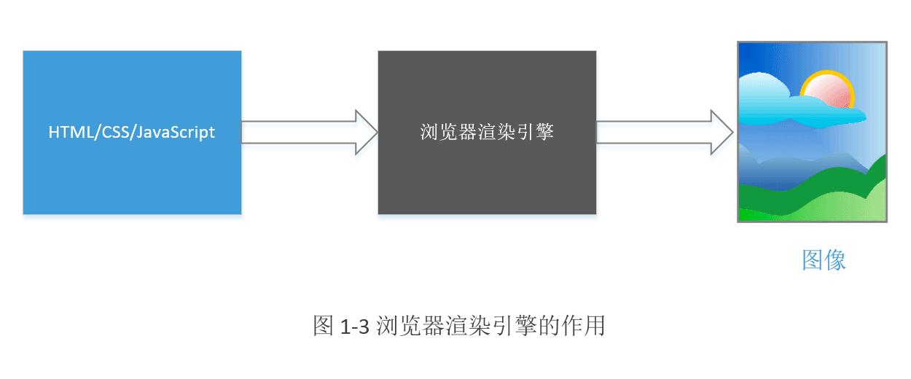

# 第 1 章 浏览器和浏览器内核

浏览器是目前用户使用范围最广、使用时间最长的应用程序之一。伴随这浏览器发展的是浏览器内核，它是浏览器中最核心的功能部件。本章基础性地介绍浏览器和浏览器内核等概念，引入 WebKit 内核的特征分析和框架概述。

## 1. 浏览器

### 1.1. 浏览器简介

互联网的革命浪潮带动了众多技术的快速发展，其中，网络浏览器（简称浏览器）作为互联网最重要的终端接口之一在短短的二十多年时间里日新月异，特别是 21 世纪，越来越多的功能被加入到浏览器中来。在 W3C 的积极推动下的 HTML 5 技术，更是称为了浏览器发展的火箭推进器。

* WorldWideWeb。世界上第一个浏览器，后改名为 Nexus；Berners-Lee（W3C 理事）20 世纪 90 年代初期发明的；在 1991 年开放源码。
* Mosaic。在 1993 年诞生，也就是后来鼎鼎大名的网景（Netscape）浏览器
* Internet Explorer（简称 IE）。在 1995 年诞生，由微软推出，第一次浏览器大战正式打响；IE 得益于 Windows 操作系统，获得了空前的成功，逐渐取代了网景浏览器的领导地位；网景浏览器的消亡，标志着第一次浏览器大战的结束。
* Firefox。网景公司在 1998 年成立 Mozilla 基金会，开发了著名的开源项目火狐浏览器；在 2004 年发布 1.0 版本，拉开了第二次浏览器大战的序幕；得益于 IE 浏览器的缓慢发展，Firefox 大受欢迎。
* Safari。2003 年，苹果公司发布了 Safari 浏览器；2005 年发起了新的开源项目 WebKit（Safari 浏览器内核），拉开了一个新序幕。
* Chrome。2008 年，Google 公司以 WebKit 作为内核，创建了一个新的项目 Chromium 浏览器，在 Chromium 的基础上发布了自己的浏览器产品 Chrome；Chromium 是开源试验场，Chrome 选择 Chromium 的稳定版作为基础。

自此，对于桌面系统而言，三足鼎立之势已成：微软 IE、Mozilla 火狐、谷歌 Chrome。对于移动系统而言，谷歌的安卓、苹果的 iOS占据绝对领导地位。

### 1.2. 浏览器特性

目前一个浏览器应该包括哪些功能呢？大体上来讲，包括：

* 网络
* 资源管理
* 网页浏览
* 多页面管理
* 插件和扩展
* 书签管理
* 历史记录管理
* 设置管理
* 下载管理
* 账户和同步
* 安全机制
* 隐私管理
* 外观主题
* 开发者工具

下面对他们中一些重要功能进行详细介绍：

* **网络**：它是第一步，浏览器通过网络模块来下载各种资源，如 HTML、文本、JavaScript 文件、样式表、图标、影视频文本等。网络部分非常重要，因为它耗时比较长且需要安全访问互联网上的资源。
* **资源管理**：从网络下载或者本地获取资源，并将它们管理起来，这需要高效的管理机制。如避免重复下载资源、缓存资源等，都是它们要解决的问题。
* **网页浏览**：这是浏览器的核心也是最基本最重要的功能，它从资源管理器获取资源，并将它们转变为可视化的结果，这是浏览器内核最重要的功能。
* **多页面管理**：很多浏览器支持多页面管理浏览，所以需要支持多个网页同时加载，这让浏览器变得更为复杂。同时，如何解决多页面的相互影响和安全等问题也非常重要。
* **插件和扩展**：这是现代浏览器的一个重要特征，它们不仅能显示网页，而且能支持各种形式的插件和扩展。插件是用来显示网页特定内容的，而扩展则是增强浏览器新功能的软件或压缩包。常见的插件有 NPAPI 插件、PPAPI 插件、ActiveX 插件等，扩展则跟浏览器密切相关，常见的有 Firefox 扩展和 Chromium 扩展。
* **账户和同步**：将浏览器的相关信息、如历史记录、书签等信息同步到服务器，给用户一个多系统下统一的体验，这对用户非常友好，是浏览器易用性的一个显著标志。
* **安全机制**：本质是提供一个安全的浏览器环境，避免用户信息被各种非法工具窃取和破坏。这可能包括显示用户访问的网站是否安全、为网站设置安全级别、防止浏览器被恶意代码破坏等。
* **开发者工具**：帮助审查 HTML 元素、调试 JavaScript 代码、改善网页性能等。

浏览器的多操作系统支持：

|         | IE   | Firefox | Chrome           | Safari |
| ------- | ---- | ------- | ---------------- | ------ |
| Windows | √    | √       | √                | ×      |
| Mac OS  | ×    | √       | √                | √      |
| Linux   | ×    | √       | √                | ×      |
| Android | ×    | √       | √                | ×      |
| iOS     | ×    | ×       | √（iOS默认内核）   | √      |

### 1.3. HTML

HTML（HyperText Markup Language），一种超文本标记语言，用于网页的创建和其他信息在浏览器中的显示。它的语法比较简单，基本上是一系列的标签（也称为元素），这些标签可以用来表示文字、图片、多媒体等。HTML 1.0 由 Berners-Lee 于 1991 年提出，直到 1997 年的 4.0 版本和 1999 年的 4.01 版本。

HTML 4.01 之后，新规范草案的争论非常激烈。直到 2012 年，划时代的 HTML5 技术由 WHATWG 和 W3C 推荐为候选规范。

HTML5 是一系列的标准，一共包含了 10 个大的类别，它们分别是：

* 离线（offline）
* 存储（storage）
* 连接（connectivity）
* 文件访问（file access）
* 语义（semantics）
* 音频和视频（audio/video）
* 3D 和图形（3D/graphics）
* 展示（presentation）
* 性能（performance）
* 其他（Nuts and bolts）

其中每个大的类别都是由众多技术或规范组成的，每个类别包含的具体规范如下：

| 类别      | 具体规范                                                     |
| --------- | ------------------------------------------------------------ |
| 存储      | Application cache、Local storage、Indexed DB 等              |
| 连接      | Web Sockets、Server-sent 事件                                |
| 文件访问  | File API、File System、FileWriter、ProgressEvents            |
| 语义      | 新的元素、Media、structural、国际化、Link relation、属性、form 类型、microdata 等 |
| 音视频    | HTML5 Video、Web Audio、WebRTC、Video track 等               |
| 3D 和图形 | Canvas 2D、3D CSS 变换、WebGL、SVG 等                        |
| 展示      | CSS3 2D/3D 变换、转换（transition）、WebFonts 等             |
| 性能      | Web Worker、HTML catching 等                                 |
| 其他      | 触控和鼠标、Shadow DOM、CSS masking 等                       |

HTML5 是如此重要，已经成为了众多浏览器重点关注的对象，更好地支持 HTML5 是浏览器能力强大的表现。目前 html5test.com 网站提供了测试浏览器支持 HTML5 的情况，其中 Chrome 的之前率最高。

在 HTML 历史上的早期阶段、网页内容是静态的，也就是说内容是不能动态变化的。服务器将内容传给浏览器之后，页面显示结果就固定不变了，这显然难以满足各种各样的显示需求。随后 JavaScript 语言诞生了，该语言是 ECMAScript 规范的一种实现，最初还有其他用于网页的脚本语言，如 JScript。HTML5 中的很多规范都是基于 JavaScript 语言来定义的。

网页的第三个革命性成功是 CSS。

伴随 HTML 技术的另一个技术是 HTTP，这是构建在 TCP/IP 协议之上的应用层协议，用于传输 HTML 文本和所涉及的各种资源，包括图片和多媒体等。随后，安全版的 HTTP 也是就是 HTTPS 诞生了，它在 HTTP 之下加入了 SSL/TLS，用于安全地传输数据。

### 1.4. 用户代理和浏览器行为

用户代理（User Agent）的作用是表明浏览器的身份，因而互联网的内容供应者能够知道发送请求的浏览器身份，浏览器能够支持什么样的功能。因此内容提供者能为不同的浏览器发送不同的网页。

一般用户识别已有的浏览器，因为其用户代理字符串基本不会改变；而对于新浏览器或新版本的浏览器，用户代理字符串是变化的，得不断维护才能识别它们。所以，建议用于对老旧浏览器的识别。

在服务端，一般用于识别移动端（Android、iOS）、PC 端设备，以发送不同的网页内容。

## 2. 浏览器内核及其特征

### 2.1. 内核和主流浏览器

在浏览器中，有一个最重要的模块，它主要的作用是将页面转变成可视化的图像结果，这就是浏览器内核。通常，它也被称为渲染引擎。

所谓渲染，就是根据描述（或定义）构建数学模型，通过模型生成图像的过程。

浏览器的渲染引擎就是能够将 HTML/CSS/JavaScript 文本及其相应的资源文件转换成图像结果的模块，如图 1-3：

第二次浏览器大战也是浏览器渲染引擎之争，目前主流的渲染引擎为：

* Trident（IE 的内核）
* Gecko（火狐的内核）
* WebKit（Chrome 的内核，2013 年 Google 宣布了基于 WebKit 的 Blink 内核）

渲染引擎可类比于 Linux 内核，浏览器类比于基于 Linux 内核的操作系统，如 Ubuntu、Fedora、Android 等。基于 Linux 的操作系统差异很大，而基于同一渲染引擎的浏览器之间的差异同样很大。

### 2.2. 内核特征

