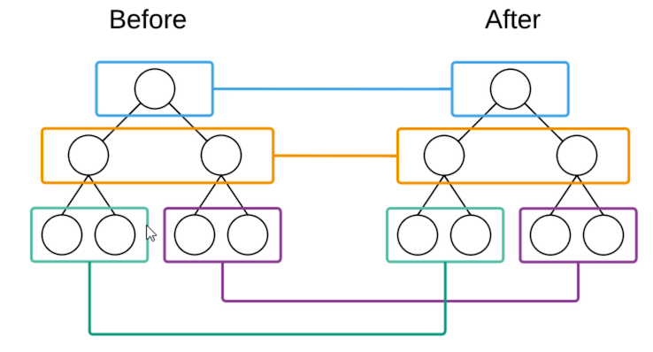

# React中的核心概念

## 1. 虚拟 DOM （Virtual Document Object Model）

### 1.1. DOM

【本质】：浏览器中的概念，用 JS 对象来表示页面中的元素，并提供了操作 DOM 对象的API

### 1.2. React 中的虚拟 DOM

【本质】：框架中的概念，用 JS 对象来模拟页面上的 DOM 以及 DOM 的嵌套关系。

【目的】：为了实现页面中的 DOM 元素高效更新（按需更新）

示例：

```html
<p>
  点击
  <a href="#">我是超链接</a>
</p>

<script>
let virtualA = {
  tagName: 'p',
  children: [
    '点击',
    {
      tagName: 'a',
      attr: {
        href: '#'
      },
      children: [
        '我是超链接'
      ]
    }
  ]
};
</script>
```

## 2. Diff 算法

* tree diff
* component diff
* element diff



### 2.1. tree diff

新旧两颗 DOM 树，逐层对比的过程，就是 Tree Diff。

当整棵 DOM 树逐层对比完毕，则所有按需要更新的元素都能被找到。

### 2.2. component dif

在进行 tree diff 的过程中，会每一层中进行组件级别的对比，叫做 component diff。

对比前后的组件类型：

* 如果相同，则暂时认为不需要被更新
* 如果不同，则需要移除旧组件，创建新组件并追加到页面上。

### 2.3. element diff

在进行组件对比的过程中，如果两个组件类型相同，会进行元素级别的对比，叫做 element diff。
