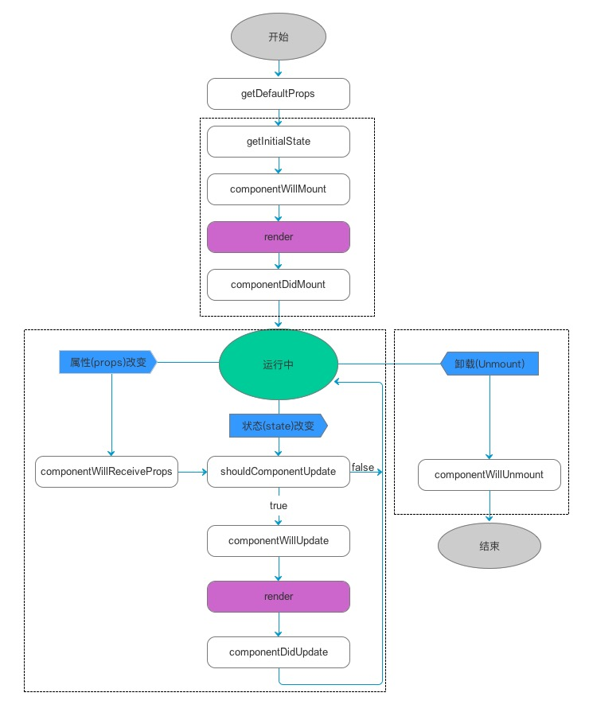

# 组件的声明周期

## 1. 说明

查看：[React 声明周期图](http://projects.wojtekmaj.pl/react-lifecycle-methods-diagram/)

每个组件的实例从创建、运行、销毁的整个生命周期过程中，会产生一系列的生命周期函数。

React 的组件的生命周期函数分为三部分：

1. **组件创建阶段**：一次
   1. componentWillMount：<==> Vue 的 created，请求后台数据
   2. render
   3. componentDidMount：<==> Vue 的 mounted，初始化第三方库
2. **组件运行阶段**：多次
   1. componentWillReceiveProps
   2. shouldComponentUpdate
   3. componentWillUpdate
   4. render
   5. componentDidUpdate
3. **组件销毁阶段**：一次
   1. componentWillUnmount：<==> Vue 的 beforeDestroy



* `getDefaultProps`：不在生命周期内，初始化 `props` 属性
* `getInitialState`：初始化 `state` 属性
* `componentWillMount`：可以操作 `state` 和 `props`

## 2. 示例

```jsx
import React from 'react';
import ReactDom from 'react-dom';

class Clock extends React.Component {
  constructor(props) {
    super(props);

    this.state = {
      msg: 123,
    };
  }

  // created
  componentWillMount() {
    this.setState({ msg: 456 });
    console.log('componentWillMount()');
  }

  // mounted
  componentDidMount() {
    console.log('componentDidMount()');
  }

  // beforeDestroy
  componentWillUnmount() {
    console.log('componentWillUnmount()', this.state.msg);
  }


  render() {
    return (
      <div>
        <h1>Hello, world!</h1>
        <h2>{this.state.msg}.</h2>
      </div>
    );
  }
}

const vnode = <div>
  <Clock></Clock>
</div>;

ReactDom.render(vnode, document.querySelector('#app'));
```