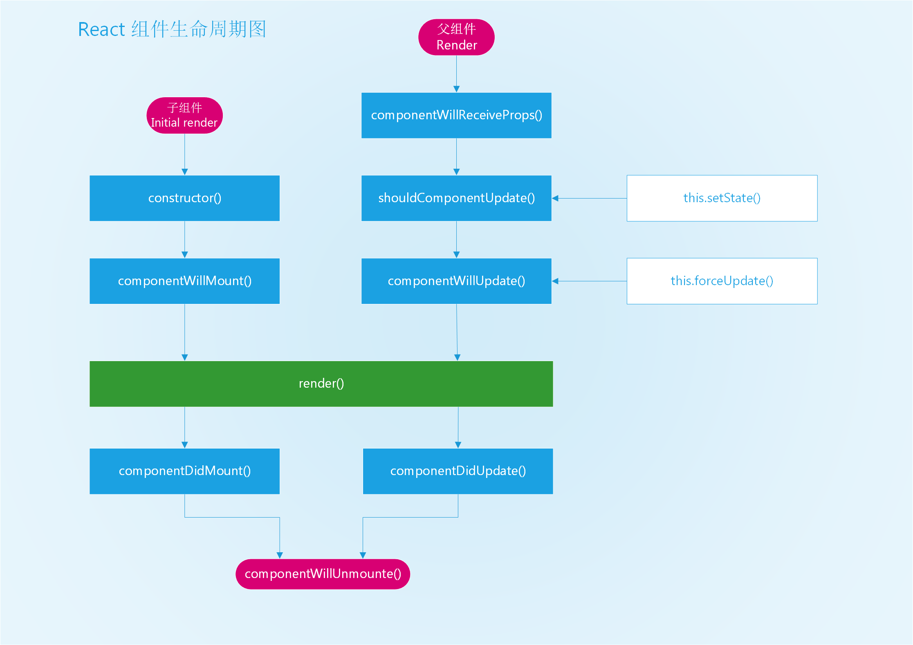

# 基础

## 1. 概要

* React 基本介绍
* React 脚手架、Yarn 介绍
* React 生命周期介绍

## 2. React 基本介绍

* Facebook 开源的一个 JavaScript 库
* React 结合生态库构成一个 MV* 框架（只关注 View 视图层、Model 数据层）
* React 特点
  * Declarative（声明式编码）
  * Component-Based（基于组件的）
  * 高效（DOM diff 算法，最小化页面重绘）
  * 单向数据流（数据在父子组件之间流动，兄弟组件通信需要借助 Redux）

### 2.1. 生态介绍

>单独的 vue.js 或 react.js 只是一个 JS 库，本身不能构成 MV* 框架。

Vue 生态：

```text
Vue + Vue-Router + Vuex + Axios + Babel + Webpack
```

React 生态：

```text
React + React-Router + Redux + Axios + Babel + Webpack
```

### 2.2. 编程方式

编程式实现：在哪里（where）做什么（what），如何实现（how）。如下

```html
<input id="username">

<script>
var user = { username: 'admin' };
var username = document.getElementById('username');

username.value = user.username;
</script>
```

声明式实现：在哪里（where）做什么（what），不关心实现（how）

```jsx
class FooComponent extends React.Component {
  constructor(props) {
    super(props);
    this.state = { username: 'admin' };
  }
  render() {
    return (
      <input id="username" value={this.state.username}>
    );
  }
}
```

## 3. React 脚手架、Yarn 介绍

### 3.1. 概况

* 如何安装 React 脚手架
* 如何使用脚手架初始化项目
* 什么是 Yarn，为什么要使用 Yarn
* 如何使用 Yarn

### 3.2. 如何安装和使用 React 脚手架

>官方文档：[https://facebook.github.io/create-react-app/docs/getting-started](https://facebook.github.io/create-react-app/docs/getting-started)

```shell
# 创建项目名为 “my-app” 的 react 项目，默认使用 yarn 安装
$ npx create-react-app my-app

# 切换到项目的根目录
$ cd my-app

# 启动项目
$ npm start
```

项目目录：

```text
my-app/
  .gitignore
  node_modules
  package-lock.json
  package.json
  public/
    favicon.ico
    index.html
    manifest.json
  README.md
  src/
    App.css
    App.js
    App.test.js
    index.css
    index.js
    logo.svg
    serviceWorker.js
```

### 3.3. Yarn

什么是 Yarn

* Yarn 是新一代包管理工具

为什么要使用 Yarn

* 速度快
* 安装版本统一、更安全（锁定版本）
* 更简洁的输出
* 更好的语义化

安装 Yarn：

>官网：[https://yarnpkg.com/](https://yarnpkg.com/)

```shell
brew install yarn
```

如何使用 Yarn：

```shell
# 初始化一个项目
$ yarn init

# 添加一个依赖
$ yarn add

# 删除一个依赖
$ yarn remove

# 安装依赖
$ yarn install

# 安装依赖（快捷方式）
$ yarn
```

安装 `eslint-config-airbnb` ：

```shell
$ npm info "eslint-config-airbnb@latest" peerDependencies

{ eslint: '^4.19.1 || ^5.3.0',
  'eslint-plugin-import': '^2.14.0',
  'eslint-plugin-jsx-a11y': '^6.1.1',
  'eslint-plugin-react': '^7.11.0' }

$ yarn add eslint@latest --dev
eslint@5.12.1

$ yarn add --dev eslint-plugin-import@2.14.0 eslint-plugin-jsx-a11y@6.1.1 eslint-plugin-react@7.11.0
```

## 4. React 生命周期介绍

### 4.1. 说明

React 生命周期包含哪些

1. **getDefaultProps**: 初始化 `props` 属性，将父组件传递的参数赋值给 `props`
2. **getInitialState**: 初始化 `state` 属性（私有数据）。
3. **componentWillMount**: 组件挂载之前，类似 Vue 的 created
4. **render**: 渲染，最频繁
5. **componentDidMount**: 组件挂载后，类似 Vue 的 mounted
6. **componentWillReceiveProps**: 接收父组件数据之前
7. **shouldComponentUpdate**: 执行 `setState()` 时，是否要更新组件
8. **componentWillUpdate**: 组件更新之前
9. **componentDidUpdate**: 组件更新之后
10. **componentWillUnmounte**: 组件销毁之前

如下图所示：



### 4.2. 示例

```jsx
import React from 'react';

import Child from './Child';

export default class Parent extends React.Component {
  constructor(props) {
    super(props);
    this.state = {
      count: 0,
    };
  }

  add() {
    const { count } = this.state;

    this.setState({
      count: count + 1,
    });
  }

  render() {
    const handleAdd = () => this.add();
    const { count } = this.state;

    return (
      <div>
        <h1>React 生命周期介绍</h1>
        <button type="button" onClick={handleAdd}>点我</button>
        <p>{count}</p>
        <Child count={count} />
      </div>
    );
  }
}
```

```jsx
import React from 'react';
import PropTypes from 'prop-types';

export default class Child extends React.Component {
  static propTypes = {
    count: PropTypes.number,
  };

  static defaultProps = {
    count: 0,
  }

  constructor(props) {
    super(props);

    this.state = {};
  }

  componentWillMount() {
    console.log('componentWillMount()');
  }

  componentDidMount() {
    console.log('componentDidMount()');
  }

  componentWillReceiveProps(newProp) {
    console.log(`componentWillReceiveProps(${JSON.stringify(newProp)})`);
  }

  shouldComponentUpdate() {
    const isUpdate = Date.now() % 2 === 1;
    console.log(`shouldComponentUpdate(), return ${isUpdate}`);
    return isUpdate;
  }

  componentWillUpdate() {
    console.log('componentWillUpdate()');
  }

  componentDidUpdate() {
    console.log('componentDidUpdate()');
  }

  render() {
    const { count } = this.props;

    return (
      <div>
        子组件接收到的值：
        {count}
      </div>
    );
  }
}
```