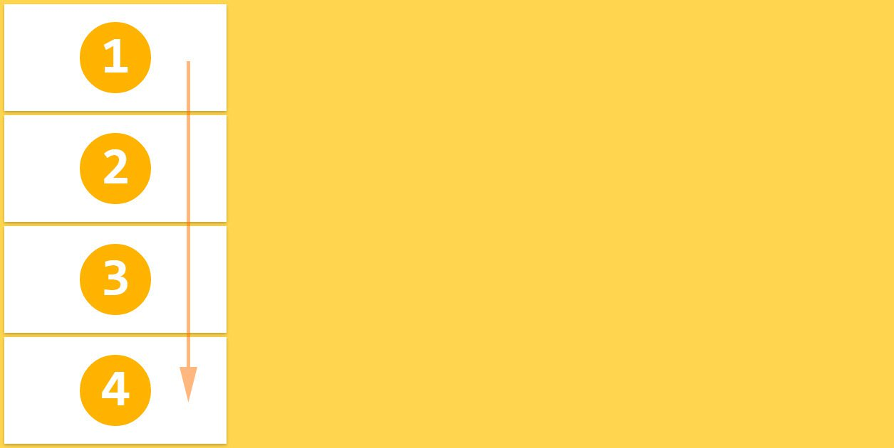
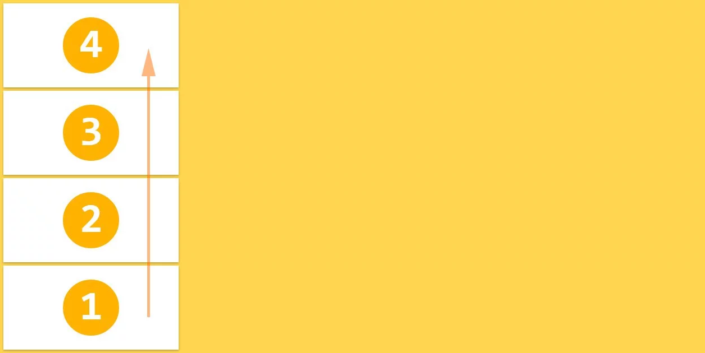
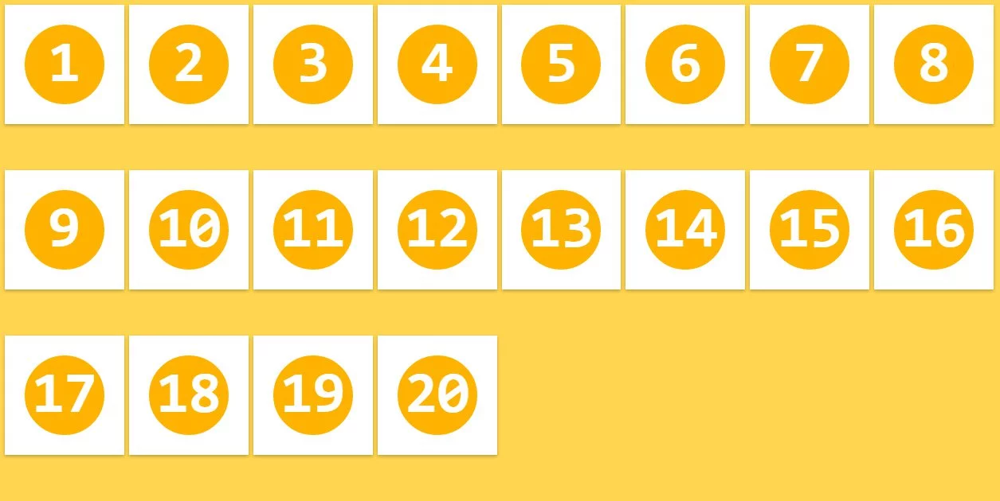
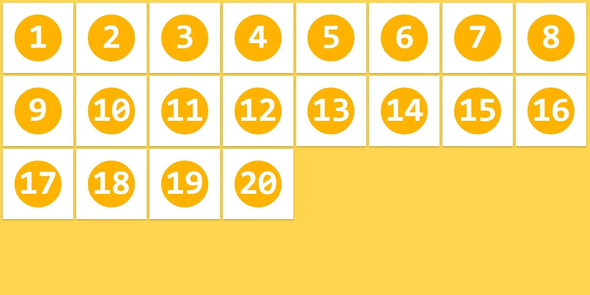
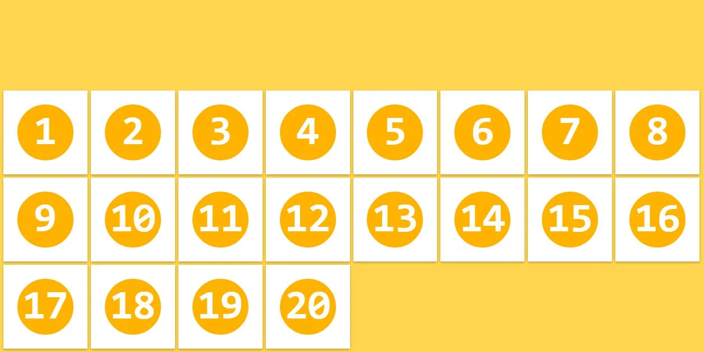
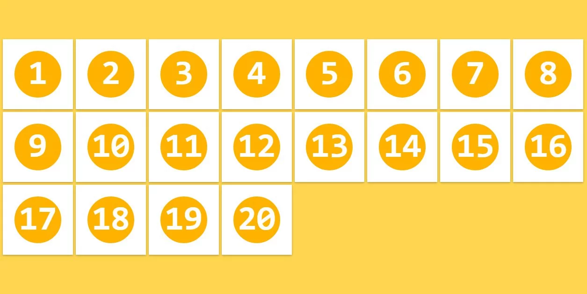
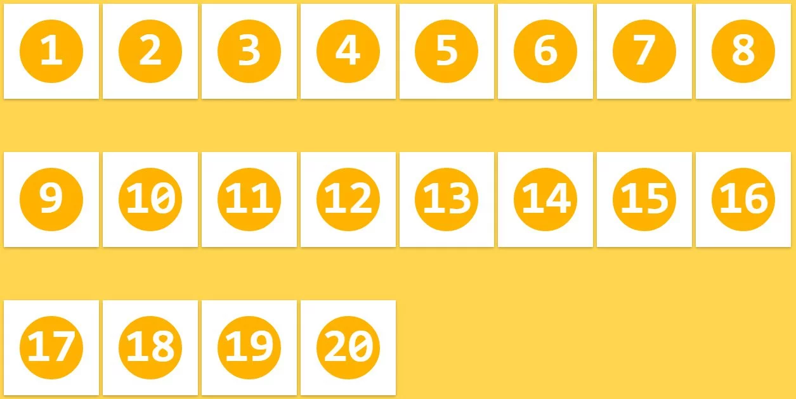
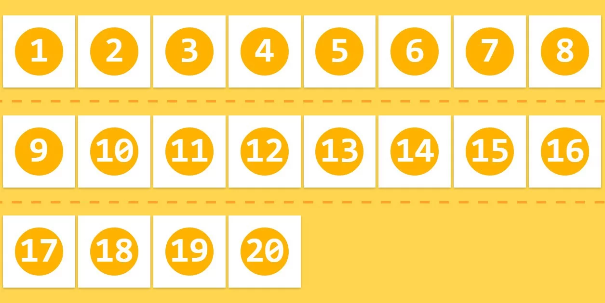

 # A Visual Guide to CSS3 Flexbox Properties（弹性盒属性的直观教程）

## 1. 介绍

翻译 [A Visual Guide to CSS3 Flexbox Properties](https://scotch.io/tutorials/a-visual-guide-to-css3-flexbox-properties)。

## 2. 编撰

吴钦飞（wuqinfei@qq.com）

## 3. 参考

* [Flex 布局教程：语法篇](http://www.ruanyifeng.com/blog/2015/07/flex-grammar.html)

## 4. Basics（基础）

*Before we start with describing the flexbox properties let’s give a little introduction of the flexbox model. The flex layout is constituted of parent container referred as flex container and its immediate children which are called flex items.*

叙述弹性盒属性之前，先介绍一下 弹性盒模型。
弹性布局由 **父容器**（flex容器）和它的 **直接子元素**（flex项目）组成。

*In the box above you can see the properties and the terminology used to describe the flex container and its children. For more information on their meaning read the official flexbox model by W3C.*

在上面的框中，你能看到描述 flex容器和它的孩子 的属性和术语。

*The browser support for the latest flexbox specification is:*

支持最新弹性盒标准的浏览器：

    Chrome 29+
    Firefox 28+
    Internet Explorer 11+
    Opera 17+
    Safari 6.1+ (prefixed with -webkit-)
    Android 4.4+
    iOS 7.1+ (prefixed with -webkit-)

*You can see detailed browser support and compatibility [here](https://caniuse.com/flexbox).*

你可以在 [这里](https://caniuse.com/flexbox) 查看更详细的浏览器支持和兼容。

## 5. Usage（使用）

*To use flexbox layout just set the display property on the parent HTML element:*

只要在父级HTML元素上设置`display`属性就可以使用弹性盒布局了：

    .flex-container {
        display: flex;
    }

*Or if you want to display it like an inline element use:*

或者，如果你想像一个行内元素一样显示它，可以使用：

    .flex-container {
        display: inline-flex;
    }

*Note: This is the only property you need to set on the parent container and all its immediate children will become automatically flex items.*

**注意**：对于父容器，这是你唯一需要设置的属性（`display:flex;`）；父容器的所有直接子元素将自动变为flex项目。

*There are several ways to group the flexbox properties and by far the easiest way I’ve found to understand the flexbox options and their usage is to divide them in two groups one for the flex container and one for the flex items. Below are explained all of them and how they affect the layout visually.*

弹性盒的属性有很多分类方式，目前为止最容易理解弹性盒选项和用法的分类方式是：flex容器 与 flex项目。
下面将对它们进行解释，以及它们如何影响视觉上的布局。

## 6. Flexbox container properties（弹性盒容器属性）

*all of the column-* properties have no effect on a flex container.
the ::first-line and ::first-letter pseudo-elements do not apply to flex containers.*

所有的 `column-*` 属性在 flex容器 上无效。
`::first-line` 和 `::first-letter` 不能应用在 flex容器 上。

### 6.1. flex-direction

*This property specifies how flex items are laid out in the flex container, by setting the direction of the flex container’s main axis. They can be laid out in two main directions, like rows horizontally or like columns vertically.*

这个属性通过设置 flex主轴 的方向，以决定 flex项目 在 flex容器 里是如何布局的。
flex项目可以按两个主要方向排列，如 水平行 或 垂直列。

    .flex-container {
        flex-direction: row（默认） | row-reverse | column | column-reverse;
    }

#### 6.1.1. flex-direction:row

    .flex-container {
        flex-direction: row;
    }

*With `row` direction the flex items are stacked in a row from left-to-right in `ltr` context*

使用 `row` 方向，flex项目 在一行里 从左到右 排列。

#### 6.1.2. flex-direction:row-reverse

    .flex-container {
        flex-direction:         row-reverse;
    }

*With `row-reverse` direction the flex items are stacked in a row from right-to-left in `ltr` context*

使用 `row-reverse` 方向，flex项目 在一行里 从右到左 排列。

#### 6.1.3. flex-direction:column

    .flex-container {
        flex-direction:         column;
    }

*With `column` direction the flex items are stacked in a column from top-to-bottom*

使用 `column` 方向，flex项目 在一列里 从上往下 排列。

#### 6.1.4. flex-direction:column-reverse

    .flex-container {
        flex-direction:         column-reverse;
    }

*With `column-reverse` direction the flex items are stacked in a column from bottom-to-top*

使用 `column-reverse` 方向，flex项目 在一列里 从下往上 排列。

### 6.2. flex-wrap

*The initial flexbox concept is the container to set its items in one single line. The `flex-wrap` property controls if the flex container lay out its items in single or multiple lines, and the direction the new lines are stacked in.*

弹性盒的初始定义是 一个将所有项目排列在单独一行的容器。
`flex-wrap`属性控制 flex容器是否使用多行，以及项目在新行里如何排列。

    .flex-container {
        flex-wrap: nowrap（默认） | wrap | wrap-reverse;
    }

#### 6.2.1. flex-wrap:nowrap

    .flex-container {
        flex-wrap: nowrap;
    }

*Flex items are displayed in one row, by default they are shrunk to fit the flex container's width*

flex项目在一行里显示，默认情况下 flex项目 缩小以适应 flex容器 的宽度。

#### 6.2.2. flex-wrap:wrap

    .flex-container {
        flex-wrap: wrap;
    }

*Flex items are displayed in multiple rows if needed from left-to-right and top-to-bottom*

flex项目 在多行里显示，从左到右 从上到下 排列。

#### 6.2.3. flex-wrap:wrap-reverse

    .flex-container {
        flex-wrap: wrap-reverse;
    }

*Flex items are displayed in multiple rows if needed from left-to-right and bottom-to-top*

flex项目 在多行里显示，从左到右 从下到上 排列。

### 6.3. flex-flow

*This property is a shorthand for setting the `flex-direction` and `flex-wrap` properties.*

这个属性是 `flex-direction` 和 `flex-wrap` 的简写形式。

    .flex-container {
        flex-flow: <flex-direction> || <flex-wrap>;
    }

**Default value**: `row nowrap`

### 6.4. justify-content

*The `justify-content` property aligns flex items along the main axis of the current line of the flex container. It helps distribute left free space when either all the flex items on a line are inflexible, or are flexible but have reached their maximum size.*

`justify-content` 指定 flex项目 在主轴上的对齐方式。

    .flex-container {
        justify-content: 
            flex-start（默认值） | flex-end | center | 
            space-between | space-around;
    }

#### 6.4.1. justify-content:flex-start

    .flex-container {
        justify-content: flex-start;
    }

*Flex items are aligned to the left side of the flex container in ltr context*

flex项目 在 flex容器 里 左对齐。

#### 6.4.2. justify-content:flex-end

    .flex-container {
        justify-content: flex-end;
    }

*Flex items are aligned to the right side of the flex container in ltr context*

flex项目 在 flex容器 里 右对齐。

#### 6.4.3. justify-content:center

    .flex-container {
        justify-content: center;
    }

*Flex items are aligned at the center of the flex container*

flex项目 在 flex容器 里 居中。

#### 6.4.4. justify-content:space-between

    .flex-container {
        justify-content: space-between;
    }

*Flex items are displayed with equal spacing between them, first and last flex items are aligned to the edges of the flex container*

flex项目 间距相等，第一个和最后一个 flex项目 紧贴 flex容器 的边缘。

#### 6.4.5. justify-content:space-around

    .flex-container {
        justify-content: space-around;
    }

*Flex items are displayed with equal spacing around every flex item, even the first and last flex items*

所有的 flex项目 在左右使用相等的间距，包括第一个和最后一个 flex项目。

### 6.5. align-items

*Flex items can be aligned in the cross axis of the current line of the flex container, similar to `justify-content` but in the perpendicular direction. This property sets the default alignment for all flex items, including the anonymous ones.*

flex项目 定义在 flex容器的 交叉轴 上如何对齐，类似于垂直版的 `justify-content`。
这个属性设置所有的flex项目的默认对齐方式。

    .flex-container {
        align-items: stretch（默认值） | flex-start | flex-end | center | baseline;
    }

#### 6.5.1. align-items:stretch

    .flex-container {
        align-items: stretch;
    }

*Flex items fill the whole height (or width) from cross start to cross end of the flex container*

flex项目 填满交叉轴的整个高度（或宽度）。

#### 6.5.2. align-items:flex-start

    .flex-container {
        align-items: flex-start;
    }

*Flex items are stacked to the cross start of the flex container*

flex项目 从 flex容器 的交叉轴起点 处堆叠。

#### 6.5.3. align-items:flex-end

    .flex-container {
        align-items: flex-end;
    }

*Flex items are stacked to the cross end of the flex container*

flex项目 从 flex容器 的交叉轴终点 处堆叠。

#### 6.5.4. align-items:center

    .flex-container {
        align-items: center;
    }

*Flex items are stacked to the center of the cross axis of the flex container*

flex项目 从 flex容器 的交叉轴中心 处堆叠。

#### 6.5.5. align-items:baseline

    .flex-container {
        align-items: baseline;
    }

*Flex items are aligned in a way that their baselines are aligned*

flex项目 沿基线对齐。

Note: Read more details about how baselines are calculated [here](https://www.w3.org/TR/css-flexbox/#flex-baselines).

注意：在[这里](https://www.w3.org/TR/css-flexbox/#flex-baselines)阅读更多关于基线的细节。

### 6.6. align-content

*The `align-content` property aligns a flex container’s lines within the flex container when there is extra space in the cross-axis, similar to how `justify-content` aligns individual items within the main-axis.*

`align-content`属性指定 flex容器 里行的对齐方式，类似于 `justify-content`。

    .flex-container {
        align-content: stretch（默认值） | flex-start | flex-end
                       | center | space-between | space-around;
    }

Note: This property has only effect when the flex container has multiple lines of flex items. If they are placed in single line this property has no effect on the layout.

注意：这个属性只在有多行flex项目的flex容器里起作用。

#### 6.6.1. align-content:stretch

    .flex-container {
        align-content:         stretch;
    }

*Flex items are displayed with distributed space after every row of flex items*

行后等间距。

#### 6.6.2. align-content:flex-start

    .flex-container {
        align-content:         flex-start;
    }

*Flex items are stacked toward the cross start of the flex container*

行 顶部对齐。

#### 6.6.3. align-content:flex-end

    .flex-container {
        align-content:         flex-end;
    }

*Flex items are stacked toward the cross end of the flex container*

行 底部对齐。

#### 6.6.4. align-content:center;

    .flex-container {
        align-content:         center;
    }

*Rows of flex items are stacked in the center of the cross axis of the flex container*

行 居中对齐。

#### 6.6.5. align-content:space-between;

    .flex-container {
        align-content:         space-between;
    }

*Rows of flex items are displayed with equal spacing between them, first and last rows are aligned to the edges of the flex container*

行间距相等，第一行和最后一行紧贴 flex容器 边缘。

#### 6.6.6. align-content:space-around;

    .flex-container {
        align-content:         space-around;
    }

*Flex items are displayed with equal spacing around every row of flex items.*

每行周围等间距。 

## 7. Flexbox item properties（弹性盒项目属性）

*float, clear and vertical-align have no effect on a flex item, and do not take it out-of-flow.*

`float`、`clear`、`vertical-align` 对 flex项目 无效，不能让它离开文档流。

### 7.1. order

*The `order` property controls the order in which children of a flex container appear inside the flex container. By default they are ordered as initially added in the flex container.*

`order`属性控制 flex项目 的顺序。默认顺序就是 flex项目 被添加进 flex容器 的顺序。数值越小，排列越靠前，默认为0。

    .flex-item {
        order:         整数;
    }

*Flex items can be reordered with this simple property, without restructuring the HTML code*

flex项目 可以通过简单的属性进行重新排序，而不必改变HTML代码。

### 7.2. flex-grow

*This property specifies the flex grow factor, which determines how much the flex item will grow relative to the rest of the flex items in the flex container when positive free space is distributed.*

这个属性定义 flex项目 的放大比例。默认为0（即如果存在剩余空间，也不放大。）。
（类比 权重）

    .flex-item {
        flex-grow: <number>; /* default 0 */
    }

*Note: Negative numbers are invalid.*

注意：负数是非法的。

*If all flex items have same value for `flex-grow` than all items have same size in the container*

如果所有的 flex项目 的`flex-grow`值相等，则它们分配相等的尺寸。

*The second flex item takes up more space relative to the size of the other flex items*

第二个 flex项目 相对于其他 flex项目 占用更多的空间。

### 7.3. flex-shrink

*The `flex-shrink` specifies the flex shrink factor, which determines how much the flex item will shrink relative to the rest of the flex items in the flex container when negative free space is distributed.*

这个属性定义了项目的缩小比例。默认为1（即如果空间不足，该项目将缩小）。

    .flex-item {
        flex-shrink: <number>; /* default 1 */
    }

*Note: Negative numbers are invalid.*

注意：负数是非法的。

*By default all flex items can be shrunk, but if we set it to 0 (don't shrink) they will maintain the original size*

默认情况下所有的 flex项目 都是可以缩小的，如果我们设置为0则不会缩小，即为原始大小。

### 7.4. flex-basis

*This property takes the same values as the `width` and `height` properties, and specifies the initial main size of the flex item, before free space is distributed according to the flex factors.*

这个属性指定 flex项目 占据的主轴尺寸，跟 `width` 和 `height` 具有相同的值。

    .flex-item {
        flex-basis: <length> | auto; /* default auto */
    }

**Default value**: `auto`

*Note: There is a naming issue with the auto value which will be resolved in future.*

注意：`auto`值 命名有问题，将在未来解决。

*`flex-basis` is specified for the 4th flex item and dictates the initial size of the element*

`flex-basis` 给第4个 flex项目 指定初始值。

### 7.5. flex

*This property is the shorthand for the `flex-grow`, `flex-shrink` and `flex-basis` properties. Among other values it also can be set to `auto` (`1 1 auto`) and `none` (`0 0 auto`).*

这个属性是 `flex-grow`、`flex-shrink`、`flex-basis` 的简写。
`flex:auto` 等价于 `flex:1 1 auto`，`flex:none` 等价于 `flex:0 0 auto`。

**Default value**: `0 1 auto`

*Note: W3C encourages to use the flex shorthand rather than the separate component properties, as the shorthand correctly resets any unspecified components to accommodate common uses.*

注意：W3C鼓励使用 `flex` 而不是单独设置每个属性，因为简写可以重置未指定的属性为合适的常用值。

### 7.6. align-self

This `align-self` property allows the default alignment (or the one specified by `align-items`) to be overridden for individual flex items. Refer to `align-items` explanation for flex container to understand the available values.

`align-self` 对个别的 flex项目 的指定对齐方式，覆盖 `align-items` 的值。
可用值参考 `align-items` 的介绍。

    .flex-item {
        align-self: auto | flex-start | flex-end | center | baseline | stretch;
    }

**Default value**: `auto`

*Note: The value of `auto` for `align-self` computes to the value of `align-items` on the element’s parent, or `stretch` if the element has no parent.*

`align-self:auto` 使用的是 `align-items`的值，如果没有。

*The 3rd and 4th flex items have overridden alignment through the `align-self` property*

第三个和第三个 flex项目 通过 `align-self` 覆写了对齐方式。

