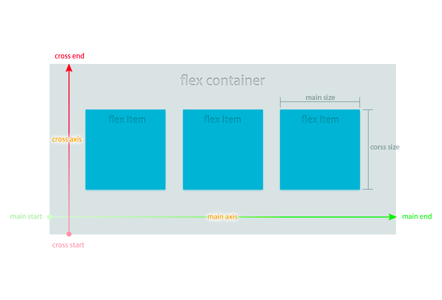

 # A Visual Guide to CSS3 Flexbox Properties（弹性盒属性的直观教程）

## 1. 介绍

翻译 [A Visual Guide to CSS3 Flexbox Properties](https://scotch.io/tutorials/a-visual-guide-to-css3-flexbox-properties)。

## 2. 编撰

吴钦飞（wuqinfei@qq.com）

## 3. 参考

* [Flex 布局教程：语法篇](http://www.ruanyifeng.com/blog/2015/07/flex-grammar.html)

## 4. Basics（基础）

*Before we start with describing the flexbox properties let’s give a little introduction of the flexbox model. The flex layout is constituted of parent container referred as flex container and its immediate children which are called flex items.*

叙述弹性盒属性之前，先介绍一下 弹性盒模型。
弹性布局由 **父容器**（flex容器）和它的 **直接子元素**（flex项目）组成。

*In the box above you can see the properties and the terminology used to describe the flex container and its children. For more information on their meaning read the official flexbox model by W3C.*

在上面的框中，你能看到描述 flex容器和它的孩子 的属性和术语。

*The browser support for the latest flexbox specification is:*

支持最新弹性盒标准的浏览器：

    Chrome 29+
    Firefox 28+
    Internet Explorer 11+
    Opera 17+
    Safari 6.1+ (prefixed with -webkit-)
    Android 4.4+
    iOS 7.1+ (prefixed with -webkit-)

*You can see detailed browser support and compatibility [here](https://caniuse.com/flexbox).*

你可以在 [这里](https://caniuse.com/flexbox) 查看更详细的浏览器支持和兼容。

## 5. Usage（使用）

*To use flexbox layout just set the display property on the parent HTML element:*

只要在父级HTML元素上设置`display`属性就可以使用弹性盒布局了：

    .flex-container {
        display: -webkit-flex; /* Safari */
        display: flex;
    }

*Or if you want to display it like an inline element use:*

或者，如果你想像一个行内元素一样显示它，可以使用：

    .flex-container {
        display: -webkit-inline-flex; /* Safari */
        display: inline-flex;
    }

*Note: This is the only property you need to set on the parent container and all its immediate children will become automatically flex items.*

**注意**：对于父容器，这是你唯一需要设置的属性（`display:flex;`）；父容器的所有直接子元素将自动变为flex项目。

*There are several ways to group the flexbox properties and by far the easiest way I’ve found to understand the flexbox options and their usage is to divide them in two groups one for the flex container and one for the flex items. Below are explained all of them and how they affect the layout visually.*

弹性盒的属性有很多分类方式，目前为止最容易理解弹性盒选项和用法的分类方式是：flex容器 与 flex项目。
下面将对它们进行解释，以及它们如何影响视觉上的布局。

## 6. Flexbox container properties（弹性盒容器属性）

### 6.1. flex-direction

*This property specifies how flex items are laid out in the flex container, by setting the direction of the flex container’s main axis. They can be laid out in two main directions, like rows horizontally or like columns vertically.*