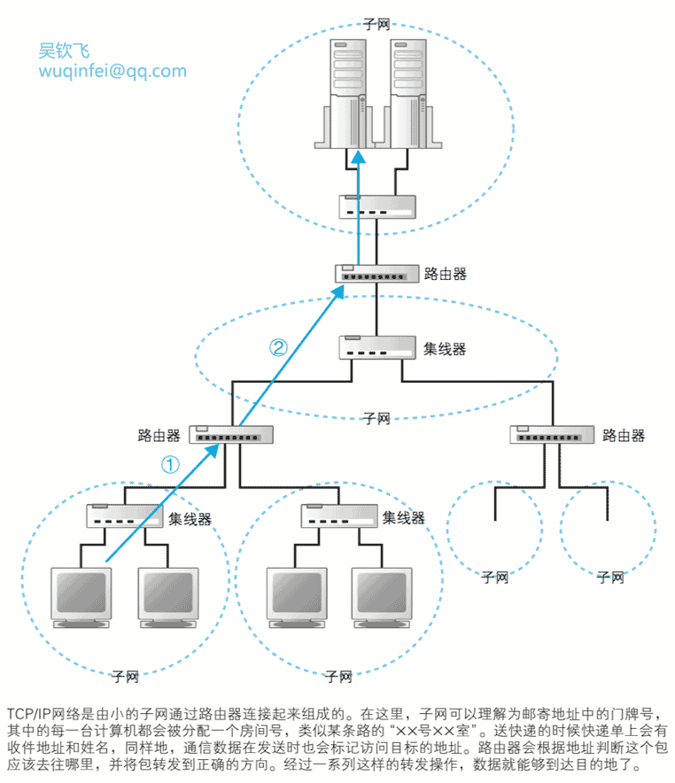
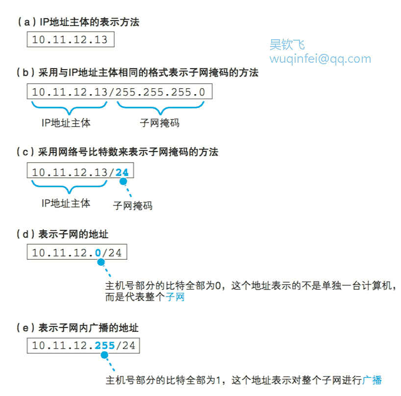

## 1.2.1 IP 地址的基本知识

### 委托操作系统发送消息

 * 生成 HTTP 消息之后,接下来我们需要􏰀托操作系统将消息发送给 Web 服务器。
 * 尽管浏览器能够解析网址并生成 HTTP 消息,
   但它本身并不具备将消息发送到网络中的功能,因此这一功能需要􏰀托操作系统来实现。
 * 发送消息的功能对于所有的应用程序来说都是通用的,
   因此让操作系统来实现这一功能,其他应用程序委托操作系统来进行操作,
   这是一个比较合 理的做法。  
 * 在进行这一操作时,我们还有一个工作需要完成,
   那就是查询网址中服务器域名对应的 IP 地址。
 * 在􏰀托操作系统发送消息时,必须要提供的不是通信对象的域名,
   而是它的 IP 地址 
 * 因此,在生成 HTTP 消息之后,下一个步骤就是根据域名查询 IP 地址。
 
###  TCP/IP 的基本思路

 * 互联网和公司内部的局域网都是基于 TCP/IP 的思路来设计的,
   所以我们先来了解 TCP/IP 的基本思路。
 * TCP/IP 的结构如图 1.8 所示,
   就是由一些小的子网,通过路由器连接起来组成一个大的网络。
   这里的子网可以理解为用集线器连接起来的几台计算机,
   我们将它看作一个单位,称为子网。
   将子网通过路由器连接起来,就形成了一个网络 。
 * 在网络中,所有的设备都会被分配一个地址。
   这个地址就相当于现实中某条路上的“×× 号 ×× 室”。
   其中“号”对应的号码是分配给整个子网的,
   而“室”对应的号码是分配给子网中的计算机的,这就是网络中的地址。
   “号”对应的号码称为网络号,
   “室”对应的号码称为主机号,
   这个地址的整体称为 IP 地址。
 * 通过 IP 地址我们可以判断出访问对象服务器的位置,
   从而将消息发送到服务器。
   
#### 解释  
 * 路由器:一种对包进行转发的设备。
 * 集线器:一种对包进行转发的设备,分为中继式集线器和交换式集线器两种
 * 当计算机数量较少时,可以用一台集线器连接起来;当计算机数量较多时,
   一台集线器可能无法连接这么多计算机,可以增加集线器数量并将集线器相互连接起来,
   这时,凡是通过集线器连接起来的所有设备都属于同一个子网。
 * 一些家用路由器中已经内置了集线器功能,  
   因此大家可以理解为这种路由器内部同时包含路由器和集线器两种设备,
   它们在里面已经连接起来了。
 * 数据是以包的形式传送的

#### 消息传送的过程

 * 发送者发出的消息首先经过子网中的集线器，
   转发到距离发送者最近的路由器上
 * 接下来, 路由器会根据消息的目的地判断下一个路由器的位置,
   然后将消息发送到下一个路由器，
   即消息再次经过子网内的集线器被转发到下一个路由器
 * 上面的过程不断重复，最终消息就被传送到了目的地。
 
#### 实际的IP地址

 * 实际的 IP 地址是一串 32 比特的数字,
   按照 8 比特(1 字节)为一组分成 4 组, 分别用十进制表示 然后再用圆点隔开。
 * 这就是我们平常经常见到的 IP 地址格式,
   但仅凭这一串数字我们无法区分哪部分是网络号,哪部分是主机号。
 * 在 IP 地址的规则中,网络号和主机号连起来总共是 32 比特,
   但这两部分的具体结构是不固定的。
 * 在组建网络时,用户可以自行决定它们之间的分配关系,
   因此,我们还需要另外的附加信息来表示 IP 地址的内部结构。