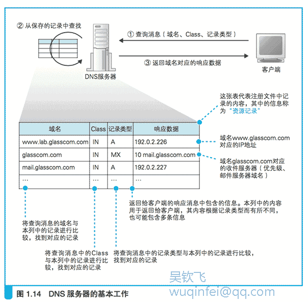

# 1.3 全世界 DNS 服务器的大接力

## 1.3.1 DNS 服务器的基本工作

* 接收来自客户端的查询消息,然后根据消息的内容返回响应。
* 根据需要查询的域名和记录类型查找相关的记录,并向客户端返回响应消息。
* DNS 服务器会从域名与 IP 地址的对照表中查找相应的记录,并返回 IP 地址。

### 来自客户端的查询消息包含以下 3 种信息。

1. 域名

    服务器、邮件服务器(邮件地址中 @ 后面的部分)的名称
    
2. Class

    在最早设计 DNS 方案时,DNS 在互联网以外的其他网络中的应用
    也被考虑到了,而 Class 就是用来识别网络的信息。
    不过,如今除了互联网并没有其他的网络了,
    因此 Class 的值永远是代表互联网的 IN

3. 记录类型

    表示域名对应何种类型的记录。 例如,
    当类型为 A 时,表示域名对应的是 IP 地址;
    当类型为 MX 时,表示域名对应的是邮件服务器。
    对于不同的记录类型,服务器向客户端返回的信息也会不同。
    A 是 Address 的缩写。MX:Mail eXchange,邮件交换。
    
DNS 服务器上事先保存有前面这 3 种信息对应的记录数据,
如图 1.14 所示。DNS 服务器就是根据这些记录 查找符合查询请求的内容 并对客户端作出响应的。

### 查A类型的域名

* 如果要查询 www.baidu.com 这个域名对应的 IP 地址,
  客户端会向 DNS 服务器发送包含以下信息的查询消息。
    1. 域名 = www.baidu.com
    2. Class = IN
    3. 记录类型 = A
* 然后,DNS 服务器会从已有的记录中 查找域名、Class、记录类型 全部匹配的记录。

在查询 IP 地址时我们使用 A 这个记录类型, 而查询邮件服务器时则 要使用 MX 类型。
这是因为在 DNS 服务器上,IP 地址是保存在 A 记录中的,
而邮件服务器则是保存在 MX 记录中的。

### 查MX类型的域名

 * 对于一个邮件地址 tone@glasscom.com,
   当需要知道这个地址对应的邮件服务器时,我们需要提供 @ 后面的那一串名称。
   查询消息的内容如下:
   1. 域名 = glasscom.com
   2. Class = IN
   3. 记录类型 = MX
 * DNS 服务器会返回 10 和 mail.glasscom.com 这两条信息。

* 当记录类型为 MX 时,DNS 服务器会在记录中保存两种信息, 
  分别是邮件服务器的域名和优先级。 
* 优先级：当一个邮件地址对应多个邮件服务器时,需要根据优先级来判断哪个邮件服务器是优先的。
  优先级数值较小的邮件服务器代表更优先。
* MX 记录的返回消息还包括邮件服务器 mail.glasscom.com 的 IP 地址

### 其他记录类型

 * 根据 IP 地址反查域名的 PTR 类型
 * 查询域名相关别名的 CNAME 类型
 * 查询 DNS 服务器 IP 地址的 NS 类型
 * 询域名属性信息的 SOA 类型
 
## 1.3.2 域名的层次结构

在前面的讲解中,我们假设要查询的信息已经保存在 DNS 服务器内部的记录中了。

如果是在像公司内部网络这样 Web 和邮件服务器数量有限的环境中,
所有的信息都可以保存在一台 DNS 服务器中,
其工作方式也就完全符合我们前面讲解的内容。

然而,互联网中存在着不计其数的服务器，
将这些服务器的信息全部保存在一台 DNS 服务器中是不可能的,
因此一定会出现在 DNS 服务器中找不到要查询的信息的情况。

**此时 DNS 服务器是如何工作的**

直接说答案的话很简单,就是将信息分布保存在多台 DNS 服务器中, 
这些 DNS 服务器相互接力配合,从而查找出要查询的信息。
不过,这个机制其实有点复杂。

**先来看一看信息是如何在 DNS 服务器上注册并保存的。**

首先,DNS 服务器中的所有信息都是按照域名以分层次的结构来保存的。

DNS 中的域名都是用句点来分隔的,比如 www.lab.glasscom.com,
这里的句点代表了不同层次之间的界限,
就相当于公司里面的组织结构不用部、科之类的名称来划分,
只是用句点来分隔而已。

在域名中,越靠右的位置表示其层级越高,
比如 www.lab.glasscom.com 这个域名如果按照公司里的组织结构来说,
大概就是“com事业集团  glasscom部  lab科 的 www” 这样。

其中,相当于一个层级的部分称为域。
因此,com 域的下一层是 glasscom 域,
再下一层是 lab 域,
再下面才是 www 这个名字。

**这种具有层次结构的域名信息会注册到 DNS 服务器中,
而每个域都是作为一个整体来处理的。**

换句话说就是,一个域的信息是作为一个整体存放在 DNS 服务器中的,
不能将一个域拆开来存放在多台 DNS 服务器中。

不过,DNS 服务器和域之间的关系也并不总是一对一的,
一台 DNS 服务器中也可以存放多个域的信息。

为了避免把事情搞得太复杂,
这里先假设一台 DNS 服务器中只存放一个域的信息,
后面的讲解也是基于这个前提来进行的。
于是,DNS 服务器也具有了像域名一样的层次结构,
每个域的信息都存放在相应层级的 DNS 服务器中。
例如,这里有一个公司的域,那么就相应地有一台 DNS 服务器,
其中存放了公司中所有 Web 服务器和邮件服务器的信息

**下级域（子域）**

对于公司域来说,例如现在需要为每一个事业集团配备一台 DNS 服务器,
分别管理各事业集团自己的信息,
但我们之前也说过一个域是不可分割的,这该怎么办呢?

我们可以在域的下面创建下级域,
然后再将它们分别分配给各个事业集团。

比如,假设公司的域为 example.co.jp,
我们可以在这个域的下面创建两个子域,
即 sub1. example.co.jp 和 sub2.example.co.jp,
然后就可以将这两个下级域分配给不同的事业集团来使用。

互联网中的域也是一样,通过创建下级的域来分配给不同的国家、公司和组织使用。
通过实际的域名可能更容易理解,比如 www.nikkeibp.co.jp 这个域名,
最上层的 jp 代表分配给日本这个国家的域;
下一层的 co 是日本国内进行分类的域,代表公司;
再下层的 nikkeibp 就是分配给某个公司的域; 
最下层的 www 就是服务器的名称。
