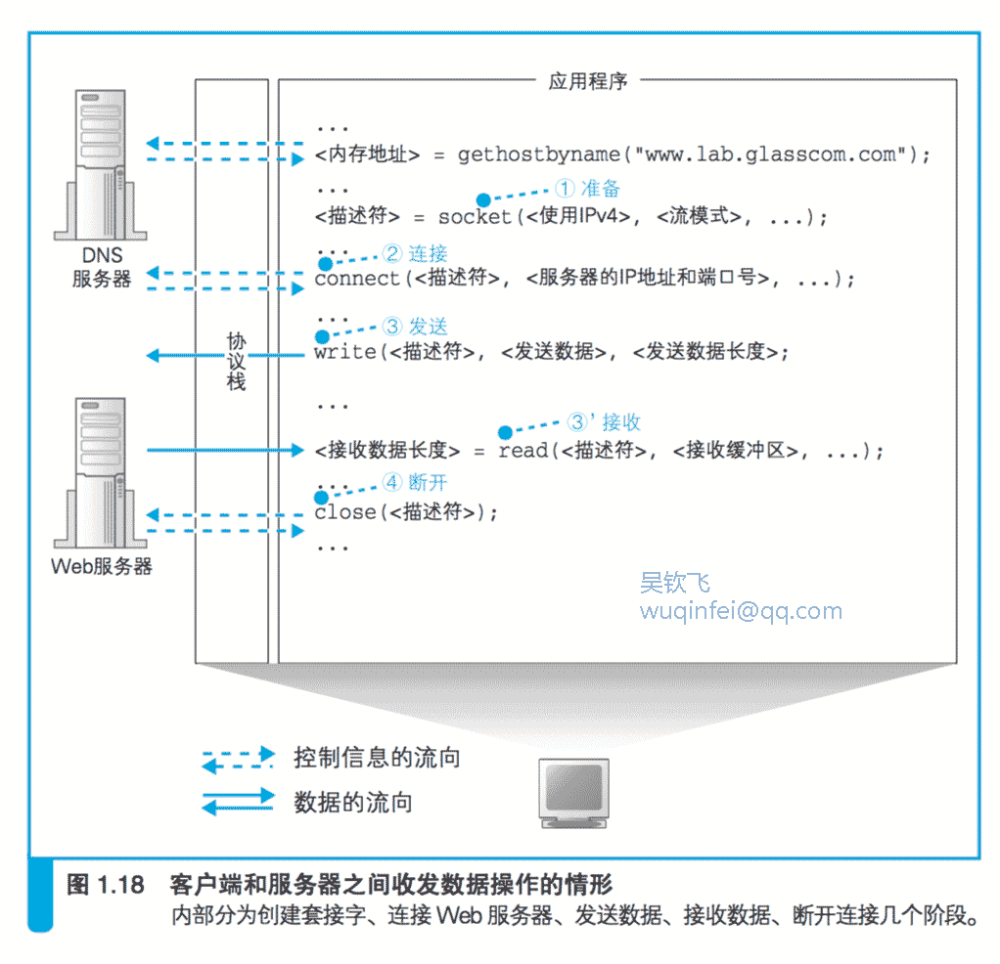

# 1.4 委托协议栈发送消息

## 1.4.1 数据收发操作概览

知道了 IP 地址之后,就可以􏰀托操作系统内部的协议栈向这个目标 IP 地址,
也就是我们要访问的 Web 服务器发送消息了。

要发送给 Web 服务器的HTTP消息是一种数字信息(digital data),
因此也可以说是􏰀托协议栈来发送数字信息。

收发数字信息这一操作不仅限于浏览器,
对于各种使用网络的应用程序来说都是共通的。

因此,这一操作的过程也不仅适用于 Web,而是适用于任何网络应用程序,
通过 DNS 服务器查询 IP 地址的操作也同样适用于所有网络应用程序。

下面就来一起探索这一操作的过程。

 

和向 DNS 服务器查询 IP 地址的操作一样,
这里也需要使用 Socket 库中 的程序组件。

不过,查询 IP 地址只需要调用一个程序组件就可以了,
而这里需要按照指定的顺序调用多个程序组件,这个过程有点复杂。

发送数据是一系列操作相结合来实现的,
如果不能理解这个操作的全貌,就无法理解其中每个操作的意义。
因此,我们先来介绍一下收发数据操作的整体思路。

 

向操作系统内部的协议栈发出委托时,
需要按照指定的顺序来调用 Socket 库中的程序组件。

使用 Socket 库来收发数据的操作过程如图 1.17 所示

简单来说,收发数据的两台计算机之间连接了一条数据通道,
数据沿着这条通道流动,最终到达目的地。

我们可以把数据通道想象成一条管道,
将数据从一端送入管道,数据就会到达管道的另一端然后被取出。
数据可以从任何一端被送入管道,数据的流动是双向的。

不过,这并不是说现实中真的有这么一条管道,
只是为了帮助大家理解数据收发操作的全貌。

 

收发数据的整体思路就是这样,但还有一点也非常重要。

光从图上来看,这条管道好像一开始就有,实际上并不是这样,
在进行收发数据操作之前,双方需要先建立起这条管道才行。

建立管道的关键在于管道两端的数据出入口,这些出入口称为**套接字**。

我们需要先创建套接字,然后再将套接字连接起来形成管道。

实际的过程是下面这样的。
首先,服务器一方先创建套接字,然后等待客户端向该套接字连接管道。

当服务器进入等待状态时,客户端就可以连接管道了。

具体来说,客户端也会先创建一个套接字,
然后从该套接字延伸出管道,最后管道连接到服务器端的套接字上。

当双方的套接字连接起来之后,通信准备就完成了。

接下来,就像我们刚刚讲过的一样,只要将数据送入套接字就可以收发数据了。

 

我们再来看一看收发数据操作结束时的情形。

当数据全部发送完毕之后,连接的管道将会被断开。

管道在连接时是由客户端发起的,但在断开时可以由客户端或服务器任意一方发起。

其中一方断开后,另一方也会随之断开,当管道断开后,套接字也会被删除。

到此为止,通信操作就结束了。

 

综上所述,收发数据的操作分为若干个阶段,可以大致总结为以下 4 个。

1. 创建套接字(创建套接字阶段) 
2. 将管道连接到服务器端的套接字上(连接阶段) 
3. 收发数据(通信阶段) 
4. 断开管道并删除套接字(断开阶段)

在每个阶段,Socket 库中的程序组件都会被调用来执行相关的数据收发操作。

不过,在探索其具体过程之前,我们来补充一点内容。

前面这 4 个操作都是由操作系统中的协议栈来执行的,
浏览器等应用程序并不会自己去做连接管道、放入数据这些工作,
而是􏰀托协议栈来代劳。

本章将要介绍的只是这个“􏰀委􏰀托”的操作。
关于协议栈收到委􏰀托之后具体是如何连接管道和放入数据的,
我们将在第 2 章介绍。

此外,这些􏰀托的操作都是通过调用 Socket 库中的程序组件来执行的,
但这些数据通信用的程序组件其实仅仅充当了一个桥梁的角色,
并不执行任何实质性的操作,应用程序的􏰀委托内容最终会被原原本本地传递给协议栈。

因此,我们无法形象地展示这些程序组件到底完成了怎样的工作,
与其勉强强调 Socket 库的存在,
还不如将 Socket 库和协议栈看成一个整体并讲解它们的整体行为 让人更容易理解。
因此,后文将会采用这样的讲法。

不过,请大家不要忘记 Socket 库这一桥梁的存在

## 1.4.2 创建套接字阶段

下面我们就来探索一下应用程序(浏览器)􏰀委托收发数据的过程。

这个过程的关键点跟对 DNS 服务器发送查询一样,
调用 Socket 库中的特定程序组件。

访问 DNS 服务器时我们调用的是一个叫作 gethostbyname 的程序组件(也就是解析器),
而这一次则需要按照一定的顺序调用若干个程序组件,其过程如图 1.18 所示,
请大家边看图边继续看下面的讲解。

**首先是套接字创建阶段。**

客户端创建套接字的操作非常简单,
只要调用 Socket 库中的 socket 程序组件就可以了。

和调用解析器一样,调用 socket 之后,控制流程会转移到 socket 内部并执行创建套接字的操作,
完成之后控制流程又会被移交回应用程序。

只不过,socket 的内部操作并不像解析器那样简单,
因此我们将在第 2 章为大家详细讲解这部分内容。
现在大家只要知道调用 socket 后套接字就创建好了就可以了

**描述符**

套接字创建完成后,协议栈会返回一个描述符,应用程序会将收到的描述符存放在内存中。

描述符是用来识别不同的套接字的,大家可以作如下理解。

我们现在只关注了浏览器访问 Web 服务器的过程,
但实际上计算机中会同时进行多个数据的通信操作,
比如可以打开两个浏览器窗口,同时访问两台 Web 服务器。
这时,有两个数据收发操作在同时进行,也就需要创建两个不同的套接字。

这个例子说明,同一台计算机上可能同时存在多个套接字,
在这样的情况下,我们就需要一种方法来识别出某个特定的套接字,
这种方法就是描述符。

我们可以将描述符理解成给某个套接字分配的编号。

当创建套接字后,我们就可以使用这个套接字来执行收发数据的操作了。
这时,只要我们出示描述符, 
协议栈就能够判断出我们希望用哪一个套接字来连接或者收发数据了。

## 1.4.3 连接阶段:把管道接上去

**描述符**:应用程序用来识别套接字的机制

**IP 地址和端口号**:客户端和服务器之间用来识别对方套接字的机制

接下来,我们需要􏰀委托协议栈将客户端创建的套接字与服务器那边的套接字连接起来。
应用程序通过调用 Socket 库中的名为 connect 的程序组件来完成这一操作。

这里的要点是当调用 connect 时,需要指定描述符、服务器 IP 地址和端口号这 3 个参数。

第 1 个参数,即**描述符**,就是在创建套接字的时候由协议栈返回的那个描述符。
connect 会将应用程序指定的描述符告知协议栈,
然后协议栈根据这个描述符来判断到底使用哪一个套接字去和服务器端的套接字进行连接,
并执行连接的操作。

第 2 个参数,即**服务器 IP 地址**,就是通过 DNS 服务器查询得到的我们要访问的服务器的 IP 地址。
在 DNS 服务器的部分已经讲过,在进行数据收发操作时,双方必须知道对方的 IP 地址并告知协议栈。
这个参数就是那个 IP 地址了。

第 3 个参数,即端口号,这个需要稍微解释一下。
可能大家会觉得, IP 地址就像电话号码,只要知道了电话号码不就可以联系到对方了吗?
其实,网络通信和电话还是有区别的,我们先来看一看 IP 地址到底能用来干什么。

IP 地址是为了区分网络中的各个计算机而分配的数值。
因此,只要知道了 IP 地址,我们就可以识别出网络上的某台计算机。
但是,连接操作的对象是某个具体的套接字,因此必须要识别到具体的套接字才行,
而仅凭 IP 地址是无法做到这一点的。

我们打电话的时候,也需要通过“请帮我找一下某某某”这样的方式来找到具体的某个联系人,
而端口号就是这样一种方式。

当同时指定 IP 地址和端口号时,就可以明确识别出某台具体的计算机上的某个具体的套接字。

也许有人会说:“能不能用前面创建套接字时提到的那个描述符来识别套接字呢?”
这种方法其实是行不通的,因为描述符是和􏰀托创建套接字的应用程序进行交互时使用的,
并不是用来告诉网络连接的另一方的,因此另一方并不知道这个描述符。

同样地,客户端也无法知道服务器上的描述符。
因此,客户端也无法通过服务器端的描述符去确定位于服务器上的某一个套接字。
所以,我们需要另外一个对客户端也同样适用的机制,而这个机制就是端口号。

如果说描述符是用来在一台计算机内部识别套接字的机制,
那么端口号就是用来让通信的另一方能够识别出套接字的机制。

既然需要通过端口号来确定连接对象的套接字,那么到底应该使用几号端口呢?
网址中好像并没有端口号，也不能像 IP 地址一样去问 DNS 服务器。

找了半天也没有任何线索,这可怎么办?
其实,这件事情也并没有那么神奇,
服务器上所使用的端口号是根据应用的种类事先规定好的,仅此而已。
比如 Web 是 80 号端口,电子邮件是 25 号端口。

关于端口号,我们将在第 6 章探索服务器内部工作的时候进行介绍,
这里大家只要这样记住就行了:只要指定了事先规定好的端口号,就可以连接到相应的服务器程序的套接字。
也就是说,浏览器访问 Web 服务器时使用 80 号端口,这是已经规定好的。

可能大家还有一个疑问,既然确定连接对象的套接字需要使用端口号,
那么服务器也得知道客户端的套接字号码才行吧,这个问题是怎么解决的呢?

事情是这样的,首先,客户端在创建套接字时,协议栈会为这个套接字随便分配一个端口号。
接下来,当协议栈执行连接操作时,会将这个随便分配的端口号通知给服务器。

说了这么多,总而言之,就是当调用 connect 时,协议栈就会执行连接操作。
当连接成功后,协议栈会将对方的 IP 地址和端口号等信息保存在套接字中,
这样我们就可以开始收发数据了。