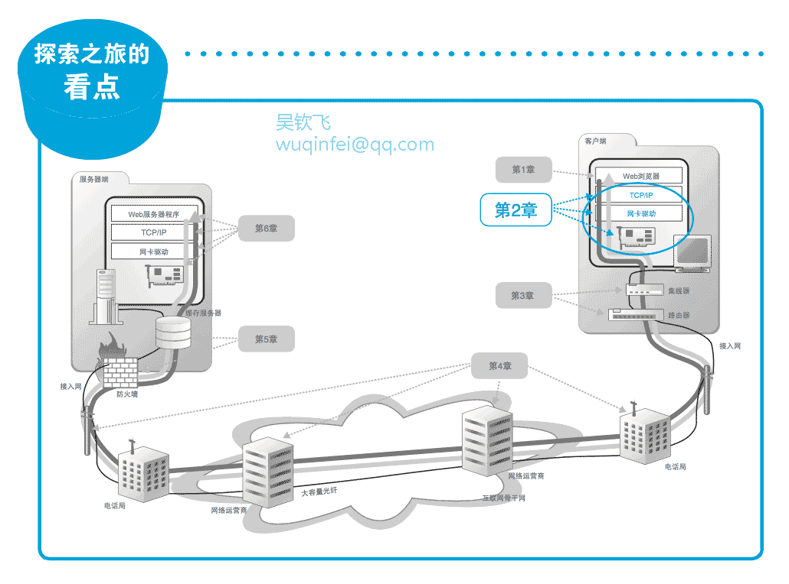

# 用电信号传输 TCP/IP 数据

## 热身问答

### 问题
 1. 我们现在使用的以太网中存在不符合国际标准(IEEE802.3/802.2) 的部分。
 2. TCP/IP是由TCP和IP两个协议的名字组合而成的,最开始这两个协议是合在一起的。
 3. 网络包通信技术是20世纪60年代为用计算机进行数据通信而设计出来的。

### 答案
 1. √。一般情况下,以太网的头部(网络包开头的控制信息)格式并非遵循国际标准(IEEE802.3/802.2),而是遵循一个更古老的规格(以太网第 2 版,又称 DIX 规格),相对地,国际标准(IEEE802.3/802.2)的头部格式由于长度太长、效率降低而没有普及。
 2. √。最早的 TCP/IP 协议原型设计相当于现在的 TCP 和 IP 合 在一起的样子,后来才拆分成为 TCP 和 IP 两个协议。
 3. √。在网络包出现之前,通信都是像电话一样把线路连接起来进行的。但是,连接线路的通信方式只能和固定的对象进行通 信,无法发挥计算机可以处理多种工作的特点。为了解决这个问题,人们设计出了使用网络包来进行通信的方式。

## 前情提要

第 1 章,我们从解析浏览器中输入的网址开始,探索了生成 HTTP 请求消息、委托操作系统发送消息等步骤。
本章,我们将讲解操作系统中的协议栈是如何处理数据发送请求的。

第 1 章介绍了发送消息的场景,接下来我们将视角切换到协议栈的内部来继续 探索吧。

## 探索之旅的看点

**(1)创建套接字**

从应用程序收到􏰀托后,协议栈通过 TCP 协议收发数据的操作可以分为 4 个阶段。
首先是创建套接字,在这个阶段,我们将介绍协议栈的内部结构、套接字的实体,以及创建套接字的操作过程。
到这里,大家应该可以对套接字到底是什么样的一个东西有一个比较具体的理解。

**(2)连接服务器**

接下来是客户端套接字向服务器套接字进行连接的阶段。
我们将介绍 “连接”具体是进行怎样的操作,在这个过程中协议栈到底是如何工作的,
以及客户端和服务器是如何进行交互的。

**(3)收发数据**

两端的套接字完成连接之后,就进入收发消息的阶段了。
在这个阶段, 协议栈会将从应用程序收到的数据切成小块并发送给服务器,
考虑到通信过程中可能会出错导致网络包丢失,协议栈还需要确认切分出的每个包是否已经送达服务器,
对于没有送达的包要重新发送一次。
这里我们将对收发数据的情形加以说明。

**(4)从服务器断开连接并删除套接字**

收发消息的操作全部结束之后,接下来要断开服务器的连接并删除套接字。
断开操作的本质是当消息收发完成后客户端和服务器相互进行确认的过程,
但这个过程并不只是相互确认并删除套接字那么简单,其中有些地方是很有意思的。

**(5)IP与以太网的包收发操作**

在介绍 TCP 协议收发消息的操作之后,我们再来看看实际的网络包是如何进行收发的。
协议栈会与网卡进行配合,将数据切分成小块并封装成网络包,
再将网络包转换成电信号或者光信号发送出去。
介绍完这个过程之后, 大家应该就可以对计算机网络功能有一个完整的概念了。

**(6)用 UDP 协议收发数据的操作**

TCP 协议有很多方便的功能,比如网络包出错丢失时可以重发,
因此很多应用程序都是使用 TCP 协议来收发数据的,
但这些方便的功能也有帮倒忙的时候,在这种情况下我们还有另外一种叫 UDP 的协议。
这里我们将介绍 UDP 的必要性以及它与 TCP 的差异。

