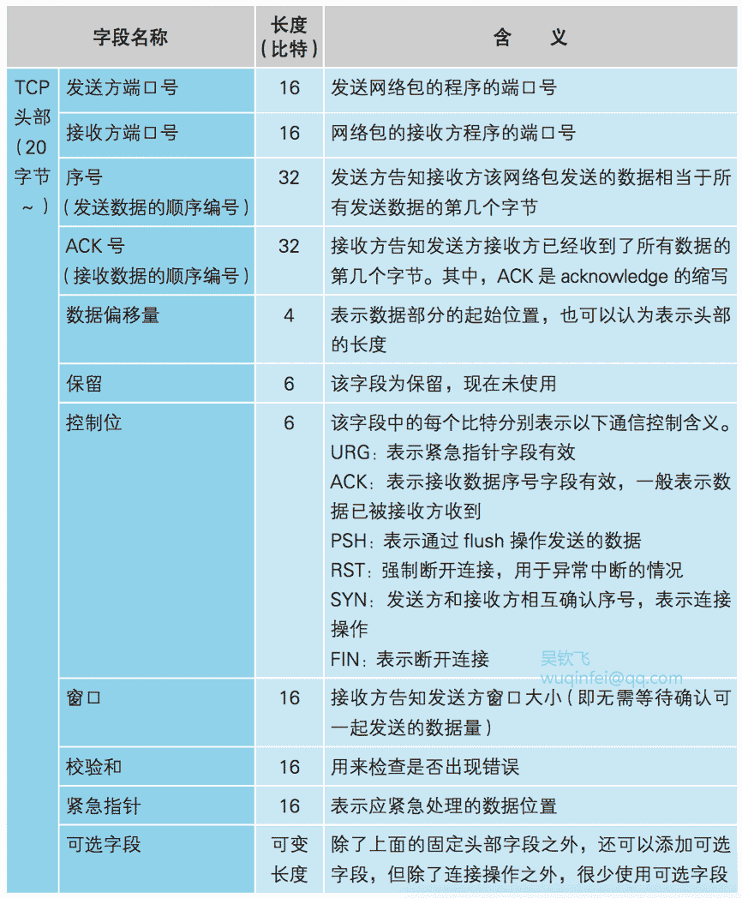
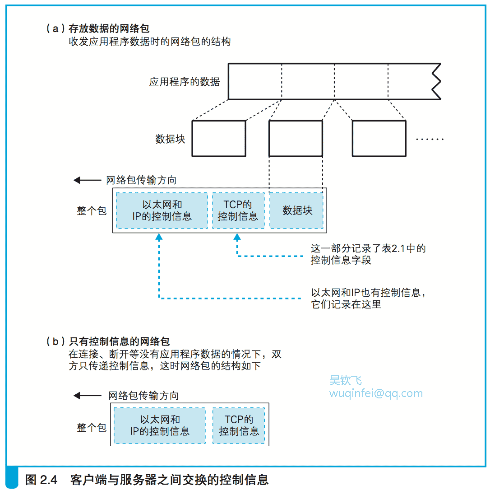

# 2.2 连接服务器

## 2.2.1 连接是什么意思

创建套接字之后,应用程序(浏览器)就会调用 connect,
随后协议栈会将本地的套接字与服务器的套接字进行连接。

话说,以太网的网线都是一直连接的状态,我们并不需要来回插拔网线,
那么这里的“连接”到底是什么意思呢?

连接实际上是通信双方交换控制信息,在套接字中记录这些必要信息并准备数据收发的一连串操作,
在讲解具体的过程之前,我们先来说一说“连接”到底代表什么意思。

网线是一直连接着的,随时都有信号从中流过,
如果通信过程只是将数据转换为电信号,那么这一操作随时都可以进行。

不过,在这个时间点,也就是套接字刚刚创建完成时,当应用程序委􏰀托发送数据的时候,
协议栈会如何操作呢?

套接字刚刚创建完成的时候,里面并没有存放任何数据,也不知道通信的对象是谁。
在这个状态下,即便应用程序要求发送数据,协议栈也不知道数据应该发送给谁。

浏览器可以根据网址来查询服务器的 IP 地址,而且根据规则也知道应该使用 80 号端口,
但只有浏览器知道这些必要的信息是不够的,
因为在调用 socket 创建套接字时,这些信息并没有传递给协议栈。

因此,我们需要把服务器的 IP 地址和端口号等信息告知协议栈,这是连接操作的目的之一。

那么,服务器这边又是怎样的情况呢?服务器上也会创建
套接字（服务器程序一般会在系统启动时就创建套接字并等待客户端连接）,
但服务器上的协议栈和客户端一样,只创建套接字是不知道应该和谁进行通信的。

而且,和客户端不同的是,在服务器上,连应用程序也不知道通信对象是谁,
这样下去永远也没法开始通信。

于是,我们需要让客户端向服务器告知必要的信息,
比如“我想和你开始通信,我的 IP 地址是 xxx.xxx. xxx.xxx,端口号是 yyyy。”
可见,客户端向服务器传达开始通信的请求, 也是连接操作的目的之一。

之前我们讲过,连接实际上是通信双方交换控制信息,在套接字中记录这些必要信息并准备数据收发的一连串操作,
像上面提到的客户端将 IP 地址和端口号告知服务器这样的过程就属于交换控制信息的一个具体的例子。

所谓控制信息,就是用来控制数据收发操作所需的一些信息,IP 地址 和端口号就是典型的例子。

除此之外还有其他一些控制信息,我们后面会逐一进行介绍。

连接操作中所交换的控制信息是根据通信规则来确定的, 
只要根据规则执行连接操作,双方就可以得到必要的信息从而完成数据收发的准备。

此外,当执行数据收发操作时,我们还需要一块用来临时存放要收发的数据的内存空间,
这块内存空间称为缓冲区,它也是在连接操作的过程中分配的。

上面这些就是“连接”这个词代表的具体含义。

使用“连接”这个词是有原因的。
通信技术的历史已经有 100 多年,从通信技术诞生之初到几年之前的很长一段时间内,电话技术一直都是主流。 
而电话的操作过程分为三个阶段:(1)拨号与对方连接;(2)通话;(3)挂断。
人们将电话的思路套用在现在的计算机网络中了,所以也就自然而然地将通信开始之前的准备操作称为“连接”了。
如果没有这段历史的话, 说不定现在我们就不叫“连接”而是叫“准备”了。
因此,如果觉得“连接”这个词听起来有些怪,那么用“准备”这个词来替换也问题不大。

## 2.2.2 负责保存控制信息的头部

关于控制信息,这里再补充一些。
之前我们说的控制信息其实可以大体上分为两类。

**第一类是客户端和服务器相互联络时交换的控制信息。**

这些信息不仅连接时需要,包括数据收发和断开连接操作在内,整个通信过程中都需要, 
这些内容在 TCP 协议的规格中进行了定义。

    

具体来说,表 2.1 中的这些字段就是 TCP 规格中定义的控制信息。
（这张表中只列出了必需字段,TCP 协议规格中还定义了另外一些可选字段。）

这些字段是固定的,在连接、收发、断开等各个阶段中,每次客户端和服务器之间进行通信时,
都需要提供这些控制信息。

具体来说,如图 2.4(a)所示,这些信息会被添加在客户端与服务器之间传递的网络包的开头。

在连接阶段,由于数据收发还没有开始, 
所以如图 2.4(b)所示,网络包中没有实际的数据,只有控制信息。

这些控制信息位于网络包的开头,因此被称为头部。

此外,以太网和 IP 协议也有自己的控制信息,这些信息也叫头部,
为了避免各种不同的头部发生混淆, 
我们一般会记作 TCP 头部、以太网头部(MAC 头部)、IP 头部。

客户端和服务器在通信中会将必要的信息记录在头部并相互确认,例如下面这样。

    发送方:“开始数据发送。” 
    接收方:“请继续。” 
    发送方:“现在发送的是 ×× 号数据。” 
    接收方:“×× 号数据已收到。” ......(以下省略)

正是有了这样的交互过程,双方才能够进行通信。
头部的信息非常重要,理解了头部各字段的含义,就等于理解了整个通信的过程。

在后面介绍协议栈的工作过程时,我们将根据需要讲解头部各字段的含义,
现在大家只要先记住头部是用来记录和交换控制信息的就可以了。

**控制信息还有另外一类,那就是保存在套接字中,用来控制协议栈操作的信息。**

应用程序传递来的信息以及从通信对象接收到的信息都会保存在这里,
还有收发数据操作的执行状态等信息也会保存在这里,
协议栈会根据这些信息来执行每一步的操作。

我们可以说,套接字的控制信息和协议栈的程序本身其实是一体的,
因此,“协议栈具体需要哪些信息”会根据协议栈本身的实现方式不同而不同,
但这并没有什么问题。

因为协议栈中的控制信息通信对方是看不见的,
只要在通信时按照规则将必要的信息写入头部,客户端和服务器之间的通信就能够得以成立。

例如,Windows 和 Linux 操作系统的内部结构不同,协议栈的实现方式不同,必要的控制信息也就不同。
但即便如此,两种系统之间依然能够互相通信,同样地,计算机和手机之间也能够互相通信。

正如前面所说,协议栈的实现不同,因此我们无法具体说明协议栈里到底保存了哪些控制信息,
但可以用命令来显示一些重要的套接字控制信息,这些信息无论何种操作系统的协议栈都是共通的,
通过理解这些重要信息,就能够理解协议栈的工作方式了。