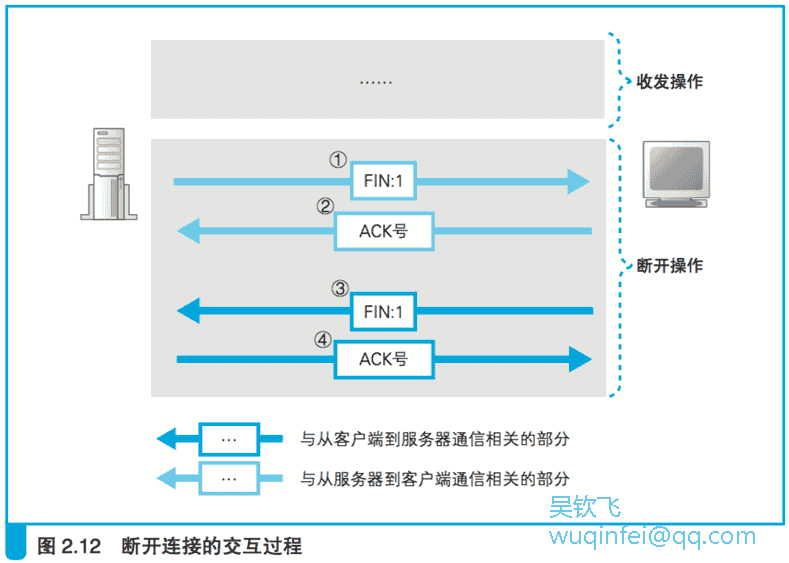

# 2.4 从服务器断开并删除套接字

## 2.4.1 数据发送完毕后断开连接

既然我们已经讲解到了这里,那么索性把数据收发完成后协议栈要执行的操作也讲一讲吧。
这样一来,从创建套接字到连接、收发数据、断开 连接、删除套接字这一系列关于收发数据的操作就全部讲完了。

毫无疑问,收发数据结束的时间点应该是应用程序判断所有数据都已经发送完毕的时候。
这时,数据发送完毕的一方会发起断开过程,但不同的应用程序会选择不同的断开时机。

以 Web 为例,浏览器向 Web 服务器 发送请求消息,Web 服务器再返回响应消息,这时收发数据的过程就全部 结束了,服务器一方会发起断开过程。(这里讲的是 HTTP1.0 的情形,在 HTTP1.1 中,服务器返回响应消息之后, 
客户端还可以继续发起下一个请求消息,如果接下来没有请求要发送了,客户端一方会发起断开过程。)

当然,可能也有一些程序是客户端发送完数据就结束了,不用等服务器响应,
这时客户端会先发起断开过程。

这一判断是应用程序作出的,协议栈在设计上允许任何一方先发起断开过程。

无论哪种情况,完成数据发送的一方会发起断开过程,这里我们以服务器一方发起断开过程为例来进行讲解。

首先,服务器一方的应用程序会调用 Socket 库的 close 程序。

然后,服务器的协议栈会生成包含断开信息的 TCP 头部,
具体来说就是将控制位中的 FIN 比特设为 1。

接下来,协议栈会委􏰀托 IP 模块向客户端发送数据(图 2.12 ①)。
同时,服务器的套接字中也会记录下断开操作的相关信息。

接下来轮到客户端了。当收到服务器发来的 FIN 为 1 的 TCP 头部时, 
客户端的协议栈会将自己的套接字标记为进入断开操作状态。

然后,为了告知服务器已收到 FIN 为 1 的包,客户端会向服务器返回一个 ACK 号(图 2.12 ②)。
这些操作完成后,协议栈就可以等待应用程序来取数据了。

过了一会儿,应用程序就会调用 read 来读取数据（应用程序有可能在收到 FIN 为 1 的包之前就来读取数据,
这时读取数据的操作会被挂起,等到 FIN 包到达再继续执行）。
这时,协议栈不会向应用程序传递数据（如果接收缓冲区中还有剩余的已接收数据,则这些数据会被传递给应用程序。）,
而是会告知应用程序(浏览器)来自服务器的数据已经全部收到了。

根据规则,服务器返回请求之后,Web 通信操作就全部结束了,
因此只要收到服务器返回的所有数据,客户端的操作也就随之结束了。

因此,客户端应用程序会调用 close 来结束数据收发操作,
这时客户端的协议栈也会和服务器一样,生成一个 FIN 比特为 1 的 TCP 包,
然后委托 IP 模块发送给服务器(图 2.12 ③)。
一段时间之后,服务器就会返回 ACK 号(图 2.12 ④)。
到这里,客户端和服务器的通信就全部结束了。

## 2.4.2 删除套接字

和服务器的通信结束之后,用来通信的套接字也就不会再使用了,这时我们就可以删除这个套接字了。
不过,套接字并不会立即被删除,而是会等待一段时间之后再被删除。

等待这段时间是为了防止误操作,引发误操作的原因有很多,这里无法全部列举,下面来举一个最容易理解的例子。
假设和图 2.12 的过程相反,客户端先发起断开,则断开的操作顺序如下。

    (1)客户端发送 FIN 
    (2)服务器返回 ACK 号 
    (3)服务器发送 FIN 
    (4)客户端返回 ACK 号

如果最后客户端返回的 ACK 号丢失了,结果会如何呢?
这时,服务器没有接收到 ACK 号,可能会重发一次 FIN。

如果这时客户端的套接字已经删除了,会发生什么事呢?
套接字被删除,那么套接字中保存的控制信息也就跟着消失了,套接字对应的端口号就会被释放出来。

这时,如果别的应用程序要创建套接字,新套接字碰巧又被分配了同一个端口号
（客户端的端口号是从空闲的端口号中随意选择的）,
而服务器重发的 FIN 正好到达,会怎么样呢?

本来这个 FIN 是要发给刚刚删除的那个套接字的,但新套接字具有相同的端口号,
于是这个 FIN 就会错误地跑到新套接字里面,新套接字就开始执行断开操作了。

之所以不马上删除套接字,就是为了防止这样的误操作。

至于具体等待多长时间,这和包重传的操作方式有关。
网络包丢失之后会进行重传,这个操作通常要持续几分钟。
如果重传了几分钟之后依然无效,则停止重传。
在这段时间内,网络中可能存在重传的包,也就有可能发生前面讲到的这种误操作,因此需要等待到重传完全结束。
协议中对于这个等待时间没有明确的规定,一般来说会等待几分钟之后再删除套接字。

