# 2.5 IP 与以太网的包收发操作

## 2.5.1 包的基本知识

TCP 模块在执行连接、收发、断开等各阶段操作时,都需要􏰀托 IP 模块将数据封装成包发送给通信对象。
我们在 TCP 的讲解中也经常提到 IP, 下面就来讨论一下 IP 模块是如何将包发送给对方的。

正式开始这个话题之前,我们先来介绍一下关于网络包的一些基本知识。

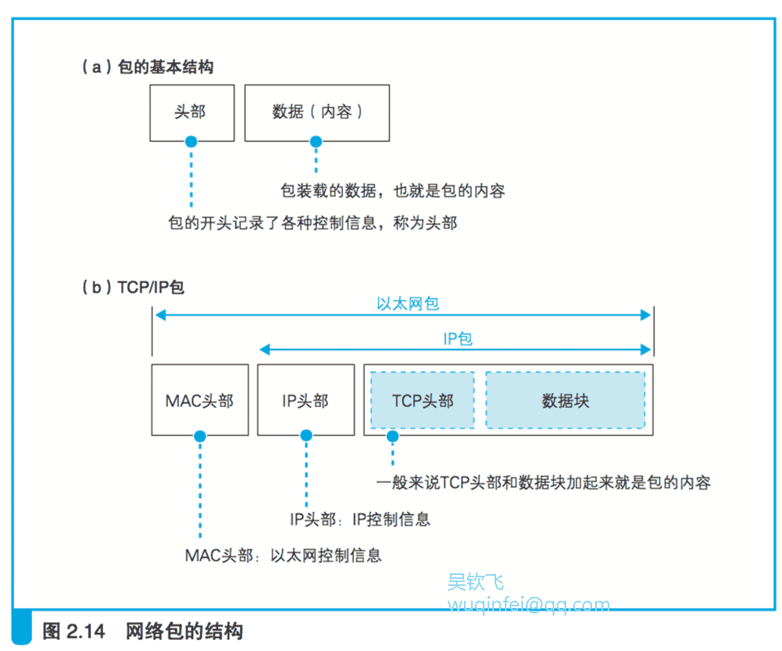

首先,包是由头部和数据两部分构成的(图 2.14(a)。
头部包含目的地址等控制信息,大家可以把它理解为快递包裹的快递单;
头部后面就是􏰀委托方要发送给对方的数据,也就相当于快递包裹里的货物。

一个包发往目的地的过程如图 2.15 所示。

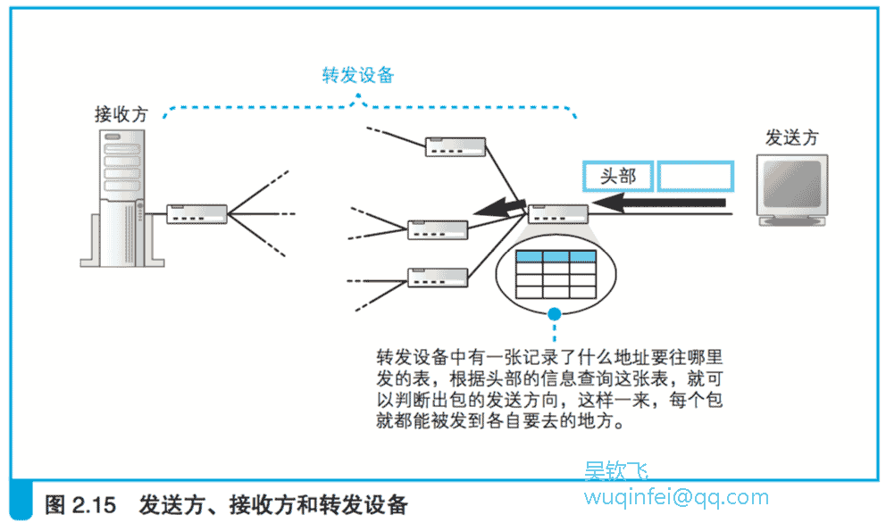

首先,发送方的网络设备会负责创建包,
创建包的过程就是生成含有正确控制信息的头部,然后再附加上要发送的数据。

接下来,包会被发往最近的网络转发设备。

当到达最近的转发设备之后,转发设备会根据头部中的信息判断接下来应该发往哪里。

这个过程需要用到一张表,这张表里面记录了每一个地址对应的发送方向,
也就是按照头部里记录的目的地址在表里进行查询,
并根据查到的信息判断接下来应该发往哪个方向。

比如, 如果查表的结果是“目标地址为 ×××× 的包应该发到 ×××× 号线路”,
那么转发设备就会把这个包发到 ×××× 号线路去。

接下来,包在向目的地移动的过程中,又会到达下一个转发设备,
然后又会按照同样的方式被发往下一个转发设备。

就这样,经过多个转发设备的接力之后,包最终就会到达接收方的网络设备。

当然,发送方 向 接收方 发送一个包,接收方可能也会向发送方返回一个包,
此时的发送方到了接下来的某个时刻就会变成接收方。

因此,我们不需要把发送方和接收方明确区分开来,在这里我们把发送方和接收方统称为终端节点。
（相应地,转发设备被称为转发节点或者中间节点。）

前面介绍的这些基本知识,对于各种通信方式都是适用的,当然也适用于 TCP/IP 网络。

不过,TCP/IP 包的结构是在这个基本结构的基础上扩展出来的,因此更加复杂。

在第 1 章 1.2.1 节,我们讲过子网的概念,
还讲过网络中有路由器和集线器两种不同的转发设备,
它们在传输网络包时有着各自的分工。
 1. 路由器根据目标地址判断下一个路由器的位置
 2. 集线器在子网中将网络包传输到下一个路由

实际上,集线器是按照以太网规则传输包的设备,
而路由器是按照 IP 规则传输包的设备,因此我们也可以作如下理解。
 1. IP 协议根据目标地址判断下一个 IP 转发设备的位置
 2. 子网中的以太网协议将包传输到下一个转发设备

具体来说,如图 2.14(b)所示,TCP/IP 包包含如下两个头部。
 1. MAC 头部(用于以太网协议)
 2. IP 头部(用于 IP 协议)

这两个头部分别具有不同的作用。

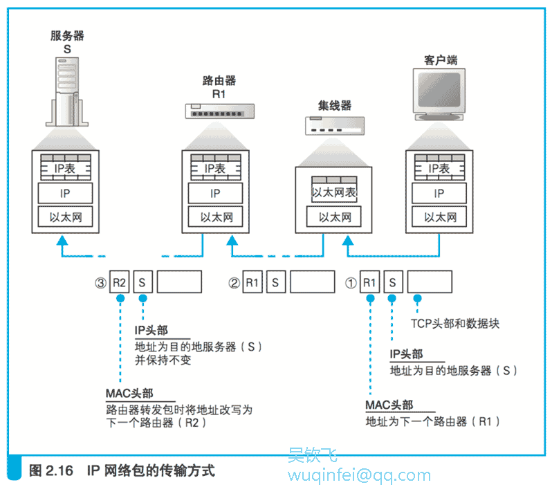

首先,发送方将包的目的地,也就是要访问的服务器的 IP 地址写入 IP 头部中。

这样一来,我们就知道这个包应该发往哪里,IP 协议就可以根据这一地址查找包的传输方向,
从而找到下一个路由器的位置,也就是图 2.16 中的路由器 R1。

接下来,IP 协议会委􏰀托以太网协议将包传输过去。
这时,IP 协议会查找下一个路由器的以太网地址(MAC 地址),并将这个地址写入 MAC 头部中。
这样一来,以太网协议就知道要将这个包发到哪一个路由器上了。

网络包在传输过程中(图 2.16 ①)会经过集线器,集线器是根据以太网协议工作的设备。

为了判断包接下来应该向什么地方传输,集线器里有一张表(用于以太网协议的表),
可根据以太网头部中记录的目的地信息查出相应的传输方向。

这张图中只有一个集线器,当存在多个集线器时,网络包会按顺序逐一通过这些集线器进行传输。

接下来,包会到达下一个路由器(图 2.16 ②)。
路由器中有一张 IP 协议的表,
可根据这张表以及 IP 头部中记录的目的地信息查出接下来应该发往哪个路由器。

为了将包发到下一个路由器,我们还需要查出下一个路由器的 MAC 地址,
并记录到 MAC 头部中,大家可以理解为改写了 MAC 头部。
（更准确地说,收到包的时候 MAC 头部会被舍弃,而当再次发送的时候又会加上包含新 MAC 地址的新 MAC 头部。）

这样,网络包就又被发往下一个节点了。

再往后的过程图上就没有画出来了。
网络包会通过路由器到达下一个路由器 R2。
这个过程不断重复,最终网络包就会被送到目的地,当目的地设备成功接收之后,网络包的传输过程就结束了。

前面介绍的就是在 TCP/IP 网络中,一个网络包从出发 到 到达目的地 的全过程。

虽然看起来有点复杂,不过设计这样的分工是有原因的。
前面讲了 IP 和以太网的分工,其中以太网的部分也可以替换成其他的东西,
例如 无线局域网、ADSL、FTTH 等,
它们都可以替代以太网的角色帮助 IP 协议来传输网络包。
（当使用除以太网之外的其他网络进行传输时,MAC 头部也会被替换为适合所选通信规格的其他头部。）

因此,将 IP 和负责传输的网络分开,可以更好地根据需要使用各种通信技术。

像互联网这样庞大复杂的网络,在架构上需要保证灵活性,这就是设计这种分工方式的原因。

## 2.5.2 包收发操作概览

了解了整体流程之后,下面来讲一讲在协议栈中 IP 模块是如何完成包收发操作的。

尽管我们说 IP 模块负责将包发给对方,
但实际上将包从发送方传输到接收方的工作是由集线器、路由器等网络设备来完成的,
因此 IP模块仅仅是整个包传输过程的入口而已。

即便如此,IP 模块还是有很多工作需要完成,首先我们先粗略地整理一下。

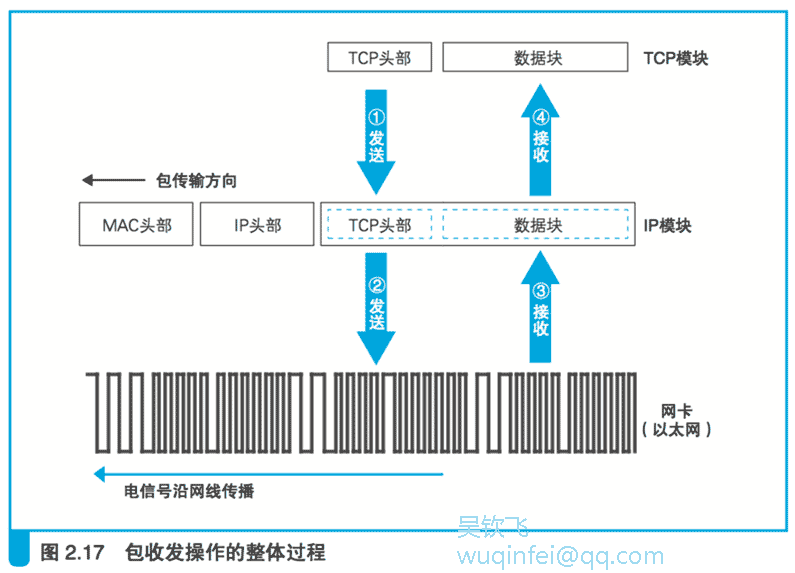

包收发操作的起点是 TCP 模块􏰀托 IP 模块发送包的操作(图 2.17 中 的“①发送”)。

这个􏰀托的过程就是 TCP 模块在数据块的前面加上 TCP 头部,
然后整个传递给 IP 模块,这部分就是网络包的内容。

与此同时, TCP 模块还需要指定通信对象的 IP 地址,
也就是需要写清楚“将什么内 容发给谁”。

收到􏰀托后,IP 模块会将包的内容当作一整块数据,在前面加上包含控制信息的头部。

刚才我们讲过,IP 模块会添加 IP 头部和 MAC 头部这两种头部。

IP 头部中包含 IP 协议规定的、根据 IP 地址将包发往目的地所需的控制信息;
MAC 头部包含通过以太网的局域网将包传输至最近的路由器所需的控制信息。

（凡是局域网所使用的头部都叫 MAC 头部,但其内容根据局域网的类型有所不同。
此外,对于除局域网之外的其他通信技术,还有不同名称的各种头部,
但它们只是名字不叫 MAC 头部而已,承担的作用和 MAC 头部是相同的。）

关于 IP 头部和 MAC 头部的区别以及其中包含的控制信息的含义,我们将稍后介绍。
总之,加上这两个头部之后,一个包就封装好了,这些就是 IP 模块负责的工作。

    IP 模块负责添加如下两个头部。
    (1) MAC 头部:以太网用的头部,包含 MAC 地址 
    (2) IP 头部:IP 用的头部,包含 IP 地址
    
接下来,封装好的包会被交给网络硬件(图 2.17 中的“②发送”),例如以太网、无线局域网等。

网络硬件可能是插在计算机主板上的板卡,也可能是笔记本电脑上的 PCMCIA 卡,
或者是计算机主板上集成的芯片,不同形态的硬件名字也不一样,本书将它们统称为网卡。

（把集成在主板上的网络硬件叫作“网卡”可能听上去有些奇怪,从这个意义上来看应该叫作“网络接口”比较准确。
不过,也有接在 USB 接口上的网卡,在计算机的领域中,“接口”这个词有时候会带来更多的歧义。 
在计算机和网络行业中,有很多术语的用法其实都比较混乱。）

传递给网卡的网络包是由一连串 0 和 1 组成的数字信息,
网卡会将这些数字信息转换为电信号或光信号,并通过网线(或光纤)发送出去,
然后这些信号就会到达集线器、路由器等转发设备,再由转发设备一步一步地送达接收方。

包送达对方之后,对方会作出响应。
返回的包也会通过转发设备发送回来,然后我们需要接收这个包。

接收的过程和发送的过程是相反的,信息先以电信号的形式从网线传输进来,
然后由网卡将其转换为数字信息并传递给 IP 模块(图 2.17 中的“③接收”)。

接下来,IP 模块会将 MAC 头部 和 IP 头部后面的内容,
也就是 TCP 头部加上数据块,传递给 TCP 模块。

接下来的操作就是我们之前讲过的 TCP 模块负责的部分了。

在这个过程中,有几个关键的点。

TCP 模块在收发数据时会分为好几个阶段,并为各个阶段设计了实现相应功能的网络包,
但 IP 的包收发操作都是相同的,并不会因包本身而有所区别。

因为 IP 模块会将 TCP 头部和数据块看作一整块二进制数据,
在执行收发操作时并不关心其中的内容, 
也不关心这个包是包含 TCP 头部和数据两者,还是只有 TCP 头部而没有数据。

当然,IP 模块也不关心 TCP 的操作阶段,对于包的乱序和丢失也一概不知。

总之,IP 的职责就是将􏰀托的东西打包送到对方手里,或者是将对方送来的包接收下来,仅此而已。

因此,接下来我们要讲的这些关于 IP 的工作方式,可适用于任何 TCP 􏰀派的收发操作。

    无论要收发的包是控制包还是数据包,IP 对各种类型的包的收 发操作都是相同的。

## 2.5.3 生成包含接收方 IP 地址的 IP 头部

下面来看一看 IP 模块的具体工作过程。

IP 模块接受 TCP 模块的􏰀委托 负责包的收发工作,它会生成 IP 头部并附加在 TCP 头部前面。

IP 头部包含的内容如表 2.2 所示,其中最重要的内容就是 IP 地址,它表示这个包应该发到哪里去。

这个地址是由 TCP 模块告知的,而 TCP 又是在执行连接操作时从应用程序那里获得这个地址的,
因此这个地址的最初来源就是应用程序。

IP 不会自行判断包的目的地,而是将包发往应用程序指定的接收方,
即便应用程序指定了错误的 IP 地址,IP 模块也只能照做。

当然,这样 做肯定会出错,但这个责任应该由应用程序来承担。

（在连接操作中发送第一个 SYN 包时就可能发生这样的情况,
一旦 TCP 连接完毕,就已经确认能够正常和对方进行包的收发,
这时就不会发生这样的情况了。）

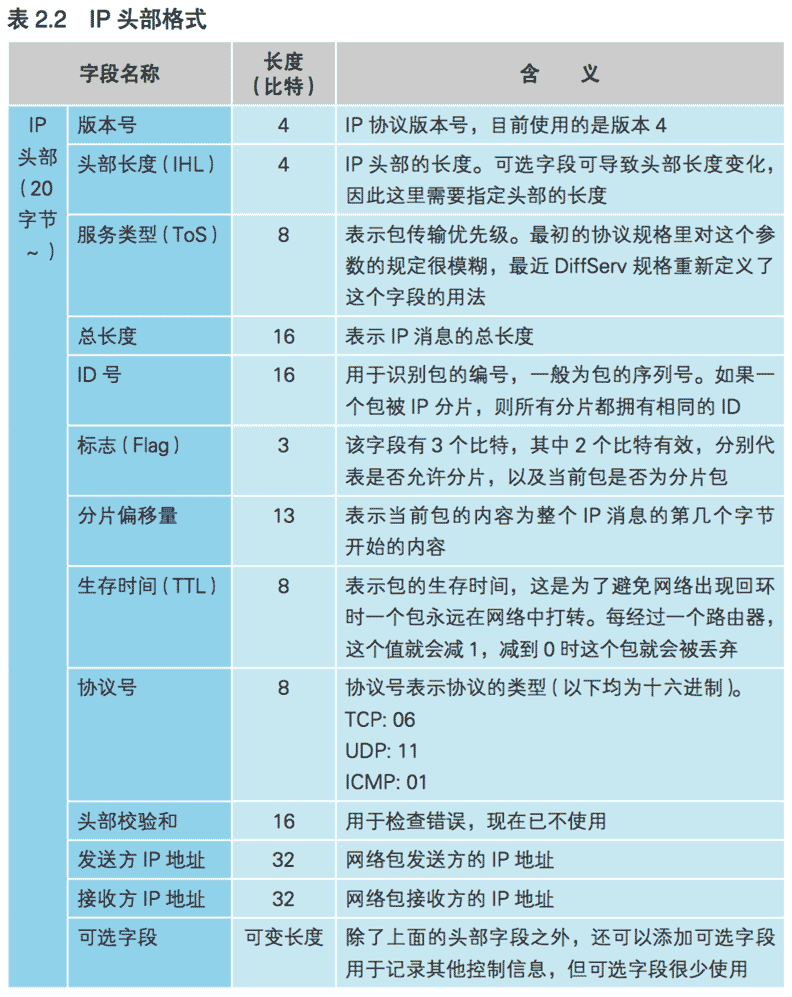

IP 头部中还需要填写发送方的 IP 地址,大家可以认为是发送方计算机的 IP 地址,
实际上“计算机的 IP 地址”这种说法并不准确。

（设置窗口或者配置文件中设置的 IP 地址,或者是由 DHCP 服务器自动分配的 IP 地址。
无论哪种情况,分配的 IP 地址都会保存在计算机中,
一般在计算机启动的操作系统初始化过程中,协议栈会根据这些信息进行配置。）

一般的客户端计算机上只有一块网卡,因此也就只有一个 IP 地址,
这种情况下我们可以认为这个 IP 地址就是计算机的 IP 地址,
但如果计算机上有多个网卡, 情况就没那么简单了。

IP 地址实际上并不是分配给计算机的,而是分配给网卡的,
因此当计算机上存在多块网卡时,每一块网卡都会有自己的 IP 地址。

很多服务器上都会安装多块网卡,这时一台计算机就有多个 IP 地址, 
在填写发送方 IP 地址时就需要判断到底应该填写哪个地址。

这个判断相当于在多块网卡中判断应该使用哪一块网卡来发送这个包,
也就相当于判断应该把包发往哪个路由器,因此只要确定了目标路由器,
也就确定了应该使用哪块网卡,也就确定了发送方的 IP 地址。

    IP 头部的“接收方 IP 地址”填写通信对象的 IP 地址。
    发送方 IP 地址需要判断发送所使用的网卡,并填写该网卡的 IP 地址。

那么,我们应该如何判断应该把包交给哪块网卡呢?

其实和图 2.16 中 路由器使用 IP 表判断下一个路由器位置的操作是一样的。

因为协议栈的 IP 模块与路由器中负责包收发的部分都是根据 IP 协议规则来进行包收发操作的,
所以它们也都用相同的方法来判断把包发送给谁。

这个“IP 表”叫作路由表,我们将在第 3 章探索路由器时详细介绍它的用法,这里先简单讲个大概。

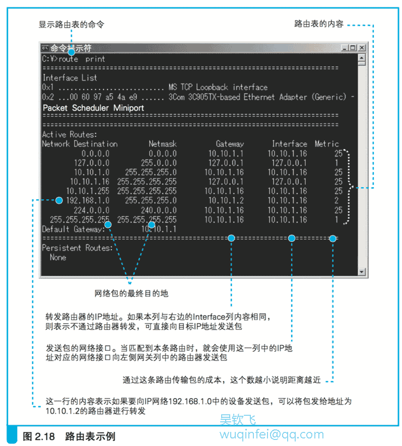

如图2.18所示,我们可以通过 route print 命令来显示路由表,下面来边看边讲。

首先,我们对套接字中记录的目的地IP地址与路由表左侧的Network Destination栏进行比较,找到对应的一行。

例如,TCP 模块告知的目标 IP 地址为 192.168.1.21,
那么就对应 图 2.18 中的第 6 行,因为它和 192.168.1 的部分相匹配。

如果目标 IP 地址 为 10.10.1.166,
那么就和 10.10.1 的部分相匹配,所以对应第 3 行。

以此类推,我们需要找到与 IP 地址左边部分相匹配的条目,找到相应的条目之后,
接下来看从右边数第 2 列和第 3 列的内容。

右起第 2 列,也就是 Interface 列,表示网卡等网络接口,这些网络接口可以将包发送给通信对象。

此外,右起第 3 列,即 Gateway 列表示下一个路由器的 IP 地址,
将包发给这个 IP 地址,该地址对应的路由器就会将包转发到目标地址。

（Gateway(网关)在 TCP/IP 的世界里就是路由器的意思。）

（如果 Gateway 和 Interface 列的 IP 地址相同,
就表示不需要路由器进行转发,可以直接将包发给接收方的 IP 地址。）

路由表的第 1 行中,目标地址和子网掩码都是 0.0.0.0,这表示默认网关,
如果其他所有条目都无法匹配,就会自动匹配这一行。

（子网掩码:用来判断 IP 地址中网络号与主机号分界线的值,我们在 1.2.1 节介绍过。）

## 2.5.4 生成以太网用的 MAC 头部

生成了 IP 头部之后,接下来 IP 模块还需要在 IP 头部的前面加上 MAC 头部(表 2.3)。

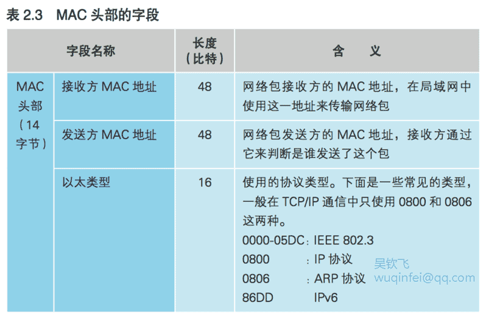

IP 头部中的接收方 IP 地址表示网络包的目的地,通过这个地址我们就可以判断要将包发到哪里,
但在以太网的世界中,TCP/IP 的这个思路是行不通的。

以太网在判断网络包目的地时和 TCP/IP 的方式不同,
因此必须采用相匹配的方式才能在以太网中将包发往目的地,而 MAC 头部就是干这个用的。

IP 模块在生成 IP 头部之后,会在它前面再加上 MAC 头部。
MAC 头部是以太网使用的头部,它包含了接收方和发送方的 MAC 地址等信息。

关于以太网的结构我们稍后会进行介绍,但下面的内容需要一些 MAC 头部的相关知识才能理解,
因此先介绍一些最基础的。

MAC 头部的开头是接收方和发送方的 MAC 地址,
大家可以认为它们和 IP 头部中的接收方和 发送方 IP 地址的功能差不多,
只不过 IP 地址的长度为 32 比特,而 MAC地址为 48 比特。

此外,IP 地址是类似多少栋多少号这种现实中地址的层次化的结构,
而 MAC 地址中的 48 比特可以看作是一个整体。

尽管有上述差异,但从表示接收方和发送方的意义上来说,MAC 地址和 IP 地址是没有区别的,
因此大家可以暂且先把它们当成是一回事。

第 3 个以太类型字段和 IP 头部中的协议号类似。
在 IP 中,协议号表示 IP 头部后面的 包内容 的类型;
而在以太网中,我们可以认为 以太网类型 后面就是 以太网包的内容,而以太类型就表示后面内容的类型。

以太网包的内容可以是 IP、ARP 等协议的包,它们都有对应的值,这也是根据规则来确定的。

在生成 MAC 头部时,只要设置表 2.3 中的 3 个字段就可以了。
方便起见,我们按照从下往上的顺序来对表进行讲解。

首先是“以太类型”,这里填写表示IP协议的值0800(十六进制)。

接下来是发送方MAC地址,这里填写网卡本身的 MAC 地址。
MAC 地址是在网卡生产时写入 ROM 里的,只要将这个值读取出来写入 MAC 头部就可以了。

（实际上,只有在操作系统启动过程中对网卡进行初始化的时候才会读取 MAC 地址,
读取出来之后会存放在内存中,每次执行收发操作时实际上使用的是内存中的值。
此外,读取 MAC 地址的操作是由网卡驱动程序来完成的,
因此网卡驱动程序也可以不从网卡 ROM 中读取地址,
而是将配置文件中设定的 MAC 地址拿出来放到内存中并用于设定 MAC 头部,
或者也可以通过命令输入 MAC 地址。）

对于多块网卡的情况,请大家回想一下设置发送方 IP 地址的方法。

设置发送方 IP 地址时, 我们已经判断出了从哪块网卡发送这个包,
那么现在只要将这块网卡对应的 MAC 地址填进去就好了。

前面这些还比较简单,而接收方 MAC 地址就有点复杂了。
只要告诉 以太网对方的 MAC 的地址,以太网就会帮我们把包发送过去,
那么很显然这里应该填写对方的 MAC 地址。

然而,在这个时间点上,我们还没有把包发送出去,
所以先得搞清楚应该把包发给谁,这个只要查一下路由表就知道了。
在路由表中找到相匹配的条目,然后把包发给 Gateway 列中的 IP 地址就可以了。

既然已经知道了包应该发给谁,那么只要将对方的 MAC 地址填上去 就好了,
但到这里为止根本没有出现对方的 MAC 地址,也就是说我们现在根本不知道对方的 MAC 地址是什么。
因此,我们还需要执行根据 IP 地址查询 MAC 地址的操作。

    IP 模块根据路由表 Gateway 栏的内容判断应该把包发送给谁。

## 2.5.5 通过 ARP 查询目标路由器的 MAC 地址

这里我们需要使用 ARP,它其实非常简单。
ARP:Address Resolution Protocol,地址解析协议。

在以太网中,有一种叫作广播的方法,可以把包发给连接在同一以太网中的所有设备。

ARP 就是利用广播对所有设备提问:“×× 这个 IP 地址是谁的?请把你的 MAC 地址 告诉我。”
然后就会有人回答:“这个IP地址是我的,我的MAC地址是 ××××。”(图 2.19)

不是这个 IP 地址的设备会忽略广播,什么都不回答。

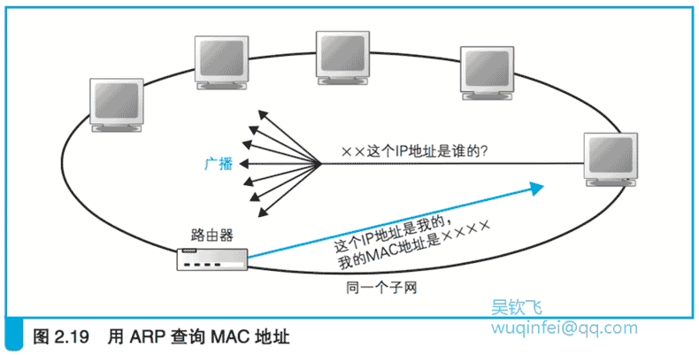

如果对方和自己处于同一个子网中,那么通过上面的操作就可以得到 对方的 MAC 地址。
然后,我们将这个 MAC 地址写入 MAC 头部,MAC 头部就完成了。
(如果路由表的设置正确,那么对方应该在同一子网,
否则对方无法作出ARP 响应,这时只能认为对方不存在,包的发送操作就会失败。)

不过,如果每次发送包都要这样查询一次,网络中就会增加很多 ARP 包,
因此我们会将查询结果放到一块叫作 ARP 缓存的内存空间中留着以后用。

也就是说,在发送包时,先查询一下 ARP 缓存,
如果其中已经保存了对方的 MAC 地址,就不需要发送 ARP 查询,直接使用 ARP 缓存中的地址,
而当 ARP 缓存中不存在对方 MAC 地址时,则发送 ARP 查询。
显示 ARP 缓存的方法和 MAC 地址的写法如图 2.20 和图 2.21 所示,供大家参考。

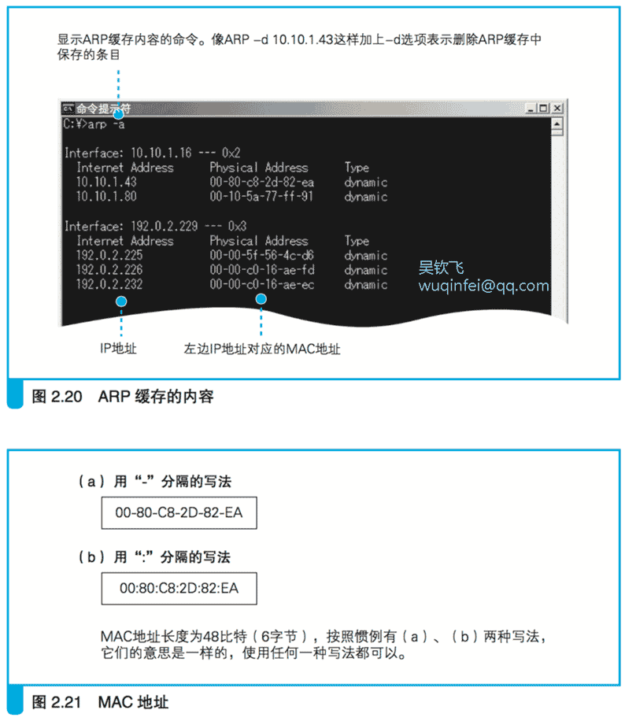

有了 ARP 缓存,我们可以减少 ARP 包的数量,但如果总是使用 ARP 缓存中保存的地址也会产生问题。

例如当 IP 地址发生变化时,ARP 缓存 的内容就会和现实发生差异。
为了防止这种问题的发生,ARP 缓存中的值在经过一段时间后会被删除,一般这个时间在几分钟左右。

这个删除的操作非常简单粗暴,
不管 ARP 缓存中的内容是否有效,只要经过几分钟就全部删掉,这样就不会出问题了。

当地址从 ARP 缓存中删除后,只要重新执行一次 ARP 查询就可以再次获得地址了。

上面这个策略能够在几分钟后消除缓存和现实的差异,
但 IP 地址刚刚发生改变的时候,ARP 缓存中依然会保留老的地址,这时就会发生通信的异常。

    查询 MAC 地址需要使用 ARP。

将 MAC 头部加在 IP 头部的前面,整个包就完成了。
到这里为止,整个打包的工作是由 IP 模块负责的。

有人认为,MAC 头部是以太网需要的内容, 并不属于 IP 的职责范围,
但从现实来看,让 IP 负责整个打包工作是有利的。

如果在交给网卡之前,IP 模块能够完成整个打包工作,
那么网卡只要将打好的包发送出去就可以了。

对于除 IP 以外的其他类型的包也是一样,如果在交给网卡之前完成打包,
那么对于网卡来说,发送的操作和发送 IP 包是完全相同的。

这样一来,同一块网卡就可以支持各种类型的包。

至于接收操作, 我们到后面会讲,
但如果接收的包可以原封不动直接交给 IP 模块来处理,网卡就只要负责接收就可以了。

这样一来,一块网卡也就能支持各种类型的包了。
与其机械地设计模块和设备之间的分工,导致网卡只能支持 IP 包, 
不如将分工设计得现实一些,让网卡能够灵活支持各种类型的包。

## 2.5.6 以太网的基本知识

完成 IP 模块的工作之后,下面就该轮到网卡了,不过在此之前,
我们先来了解一些以太网的基本知识。

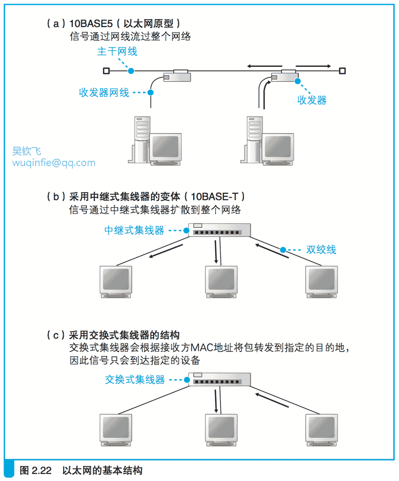

以太网是一种为多台计算机能够彼此自由和廉价地相互通信而设计的通信技术,
它的原型如图 2.22(a)所示。

从图上不难看出,这种网络的本质其实就是一根网线。

图上还有一种叫作收发器的小设备,它的功能只是将不同网线之间的信号连接起来而已。

因此,当一台计算机发送信号时, 信号就会通过网线流过整个网络,最终到达所有的设备。

这就好像所有人待在一个大房间里,任何一个人说话,所有人都能够听到,
同样地,这种网络中任何一台设备发送的信号所有设备都能接收到。

不过,我们无法判断一个信号到底是发给谁的,
因此需要在信号的开头加上接收者的信息, 也就是地址。

这样一来就能够判断信号的接收者了,与接收者地址匹配的设备就接收这个包,
其他的设备则丢弃这个包,这样我们的包就送到指定的目的地了。

为了控制这一操作,我们就需要使用表 2.3 中列出的 MAC 头部。

通过 MAC 头部中的接收方 MAC 地址,就能够知道包是发给谁的;
而通过发送方 MAC 地址,就能够知道包是谁发出的;
此外,通过以太类型就可以判断包里面装了什么类型的内容。
以太网其实就这么简单。

（实际上,多台设备同时发送信号会造成碰撞,当然也有相应的解决方案, 不过这部分比较复杂。
随着交换式集线器的普及,信号已经不会发生碰撞了,因此在实际工作中也不需要在意这个复杂的部分。）

这个原型后来变成了图 2.22(b)中的结构。
这个结构是将主干网线替换成了一个中继式集线器,将收发器网线替换成了双绞线。
不过,虽然网络的结构有所变化,但信号会发送给所有设备这一基本性质并没有改变。

（(a)和(b)中流过的信号不同,因此单纯的替换似乎有点简单粗暴。）

（中继式集线器:在以太网(10BASE-T/100BASE-TX)中简称集线器。
如果需要区分仅对信号进行放大中继的传统集线器和交换式集线器,
则将前者称为中继式集线器,也叫共享式集线器。
我们将在 3.1.4 一节进行介绍。(以下将“中继式集线器”简称为“集线器”——译者注)）

后来,图 2.22(c)这样的使用交换式集线器的结构普及开来,
现在我们说的以太网指的都是这样的结构。

（以下将“交换式集线器”简称为“交换机”。）

这个结构看上去和(b)很像,但其实里面有一个重要的变化,
即信号会发送给所有设备这一性质变了,
现在信号只会流到根据 MAC 地址指定的设备,而不会到达其他设备了。

当然,根据 MAC 地址来传输包这一点并没有变,因此 MAC 头部的设计也得以保留。

尽管以太网经历了数次变迁,但其基本的 3 个性质至今仍未改变,
即 将包发送到 MAC 头部的接收方 MAC 地址代表的目的地,用发送方 MAC 地址识别发送方,用以太类型识别包的内容。
因此,大家可以认为具备这 3 个性质的网络就是以太网。

（这些性质也适用于无线局域网。
也就是说,将包发送到 MAC 头部的接收方 MAC 地址所代表的目的地,用发送方 MAC 地址识别发送方,
在这些方面无线局域网和以太网是一样的。
无线局域网没有以太类型,但有另一个具备同样功能的参数,可以认为它就是以太类型。
因此,我们可以用无线局域网来代替以太网。）

以太网中的各种设备也是基于以太网规格来工作的,
因此下面的内容不仅适用于客户端计算机,同样也适用于服务器、路由器等各种设备。

（路由器等网络设备的网卡是集成在设备内部的,其电路的设计也有所不同,
尽管结构有差异,但功能和行为是没有区别的。）

此外,以太网和 IP 一样,并不关心网络包的实际内容,
因此以太网的收发操作也和 TCP 的工作阶段无关,都是共通的。

## 2.5.7 将 IP 包转换成电或光信号发送出去

下面来看看以太网的包收发操作。
IP 生成的网络包只是存放在内存中的一串数字信息,没有办法直接发送给对方。
因此,我们需要将数字信息转换为电或光信号,才能在网线上传输,也就是说,这才是真正的数据发送过程。

负责执行这一操作的是网卡,但网卡也无法单独工作,要控制网卡还需要网卡驱动程序。

驱动程序不只有网卡才有,键盘、鼠标、显卡、声卡 等各种硬件设备都有。
当然,不同厂商和型号的网卡在结构上有所不同, 因此网卡驱动程序也是厂商开发的专用程序。
（主要厂商的网卡驱动程序已经内置在操作系统中了。）

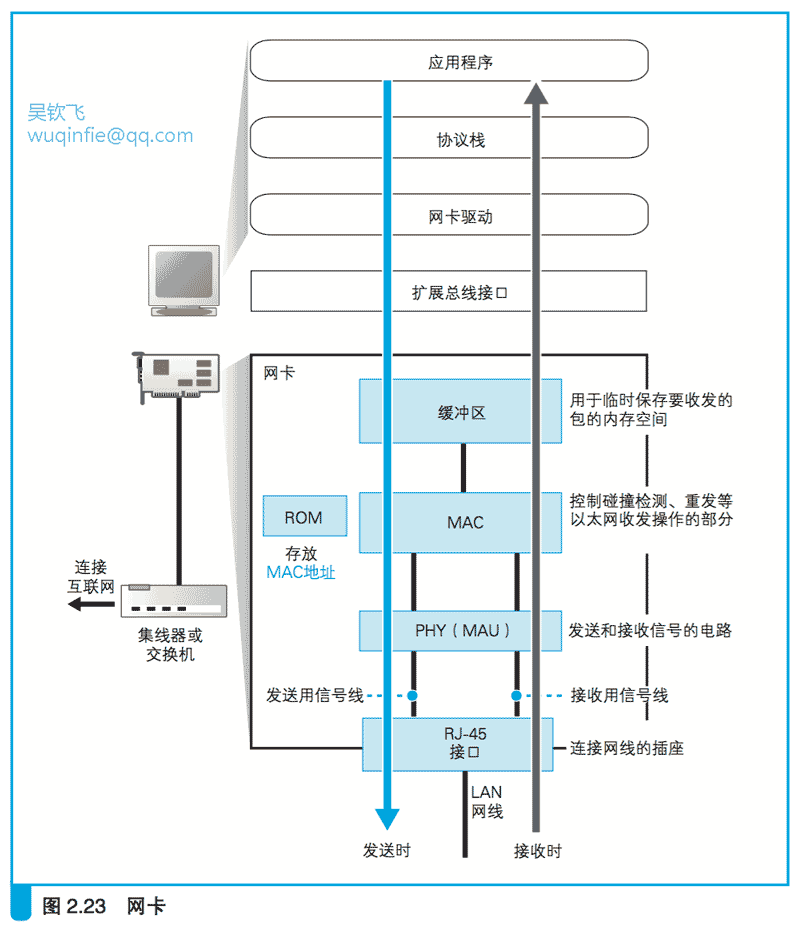

网卡的内部结构如图 2.23 所示,这是一张网卡主要构成要素的概念图,
并不代表硬件的实际结构,但依然可以看清大体的思路。
记住这一内部结构之后,我们再来介绍包收发的操作过程,现在,我们先来讲讲网卡的初始化过程。

网卡并不是通上电之后就可以马上开始工作的,而是和其他硬件一样, 都需要进行初始化。
也就是说,打开计算机启动操作系统的时候,网卡驱动程序会对硬件进行初始化操作,然后硬件才进入可以使用的状态。
这些操作包括硬件错误检查、初始设置等步骤,这些步骤对于很多其他硬件也是共通的,
但也有一些操作是以太网特有的,那就是在控制以太网收发操作的 MAC 模块中设置 MAC 地址。

（MAC:Media Access Control 的缩写。MAC 头部、MAC 地址中的 MAC 也 是这个意思。
也就是说,通过 MAC 模块控制包收发操作时所使用的头部和地址就叫作 MAC 头部和 MAC 地址。）

网卡的 ROM 中保存着全世界唯一的 MAC 地址,这是在生产网卡时写入的,
将这个值读出之后就可以对 MAC 模块进行设置,MAC 模块就知道自己对应的 MAC 地址了。

也有一些特殊的方法,比如从命令或者配置文件中读取 MAC 地址并分配给 MAC 模块。
这种情况下,网卡会忽略 ROM 中的 MAC 地址。

有人认为在网卡通电之后,ROM 中的 MAC 地址 就自动生效了,
其实不然,真正生效的是网卡驱动进行初始化时在 MAC 模块中设置的那个 MAC 地址。

（通过命令或配置文件设置 MAC 地址时,必须注意不能和网络中其他设备的 MAC 地址重复,
否则网络将无法正常工作。）

在操作系统启动并完成这些初始化操作之 后,网卡就可以等待来自 IP 的􏰀托了。

    网卡的 ROM 中保存着全世界唯一的 MAC 地址,这是在生产网卡时写入的。
    网卡中保存的 MAC 地址会由网卡驱动程序读取并分配给 MAC 模块。    

