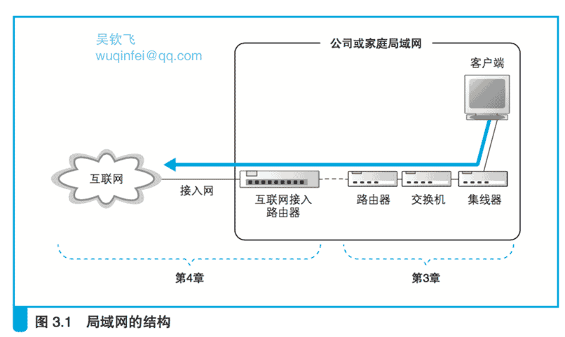

# 3.1 信号在网线和集线器中传输

## 3.1.1 每个包都是独立传输的

从计算机发送出来的网络包会通过集线器、路由器等设备被转发,最终到达目的地。

我们在第 2 章的 2.5.1 节和 2.5.2 节讲过,转发设备会根据包头部中的控制信息,
在转发设备内部一个写有转发规则的表中进行查询, 以此来判断包的目的地,然后将包朝目的地的方向进行转发。

邮递员在送信的时候只看信封,不看里面的内容,同样地,转发设备在进行转发时也不看数据的内容。

因此,无论包里面装的是应用程序的数据或者是 TCP 协议的控制信息,都不会对包的传输操作本身产生影响。

换句话说,HTTP 请求的方法,TCP 的确认响应和序号,客户端和服务器之间的关系,这一切都与包的传输无关。

因此,所有的包在传输到目的地的过程中都是独立的,相互之间没有任何关联。

记住这个概念之后,本章我们来探索一下网络包在进入互联网之前经历的传输过程。

这里我们假设客户端计算机连接的局域网结构是像图 3.1 这样的。

也就是说,网络包从客户端计算机发出之后,要经过集线器、交换机和路由器最终进入互联网。

实际上,我们家里用的路由器已经集成了集线器和交换机的功能,像图上这样使用独立设备的情况很少见。

不过, 把每个功能独立出来更容易理解,而且理解了这种模式之后,也就能理解集成了多种功能的设备了,
因此我们这里将所有功能独立出来,逐个来进行探索。
