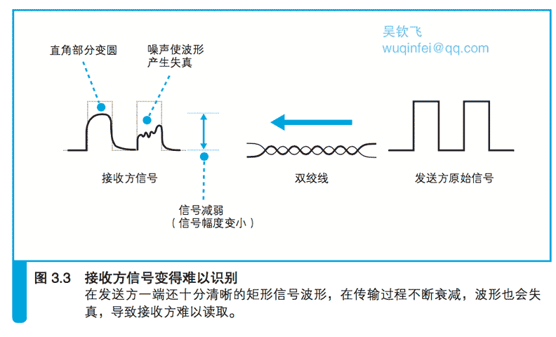
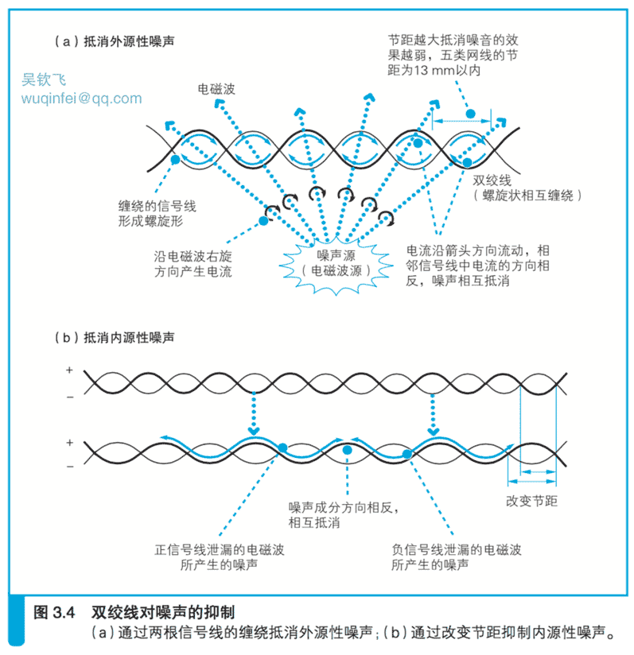
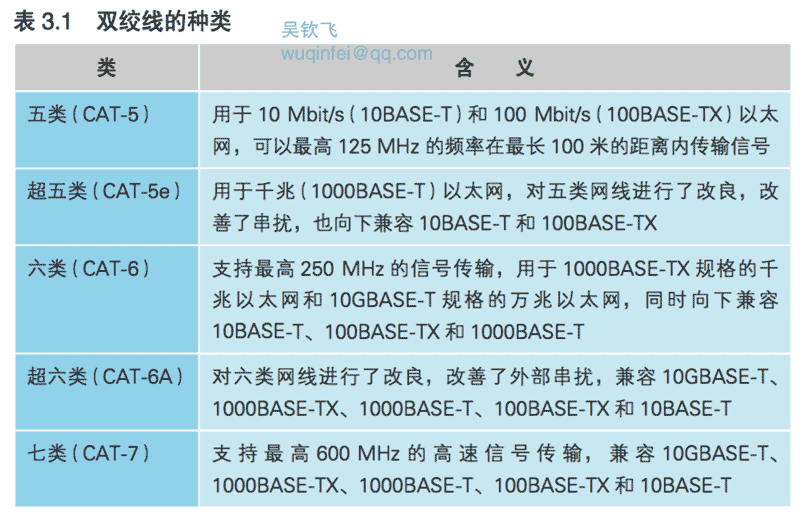

# 3.1 信号在网线和集线器中传输

## 3.1.1 每个包都是独立传输的

从计算机发送出来的网络包会通过集线器、路由器等设备被转发,最终到达目的地。

我们在第 2 章的 2.5.1 节和 2.5.2 节讲过,转发设备会根据包头部中的控制信息,
在转发设备内部一个写有转发规则的表中进行查询, 以此来判断包的目的地,然后将包朝目的地的方向进行转发。

邮递员在送信的时候只看信封,不看里面的内容,同样地,转发设备在进行转发时也不看数据的内容。

因此,无论包里面装的是应用程序的数据或者是 TCP 协议的控制信息,都不会对包的传输操作本身产生影响。

换句话说,HTTP 请求的方法,TCP 的确认响应和序号,客户端和服务器之间的关系,这一切都与包的传输无关。

因此,所有的包在传输到目的地的过程中都是独立的,相互之间没有任何关联。

记住这个概念之后,本章我们来探索一下网络包在进入互联网之前经历的传输过程。

这里我们假设客户端计算机连接的局域网结构是像图 3.1 这样的。

也就是说,网络包从客户端计算机发出之后,要经过集线器、交换机和路由器最终进入互联网。

实际上,我们家里用的路由器已经集成了集线器和交换机的功能,像图上这样使用独立设备的情况很少见。

不过, 把每个功能独立出来更容易理解,而且理解了这种模式之后,也就能理解集成了多种功能的设备了,
因此我们这里将所有功能独立出来,逐个来进行探索。

## 3.1.2 防止网线中的信号衰减很重要

本章的探索从信号流出网卡进入网线开始。

网卡中的 PHY(MAU)模块负责将包转换成电信号,
信号通过 RJ-45 接口进入双绞线,这部分的放大图如图 3.2 的右侧部分所示。
以太网信号的本质是正负变化的电压,大家可以认为网卡的 PHY(MAU)模块就是一个从正负两个信号端子输出信号的电路。

（PHY(MAU):以太网有多重派生方式,每种方式中信号收发模块的名称都不一样。
现在 100 Mbit/s 以上的以太网中叫作 PHY(物理层装置),以前低速方式中则叫作 MAU(介质连接单元)。）

网卡的 PHY(MAU)模块直接连接图 3.2 右侧中的 RJ-45 接口,
信号从这个接口中的 1 号和 2 号针脚流入网线。
然后,信号会通过网线到达集线器的接口,这个过程就是单纯地传输电信号而已。

但是,信号到达集线器的时候并不是跟刚发送出去的时候一模一样。 
集线器收到的信号有时会出现衰减(图 3.3)。
信号在网线的传输过程中, 能量会逐渐损失。网线越长,信号衰减就越严重。

而且,信号损失能量并非只是变弱而已。
在第 2 章的图 2.25、图 2.26、 图 2.27 中我们已经看到,
以太网中的信号波形是方形的,但损失能量会让信号的拐角变圆,这是因为电信号的频率越高,能量的损失率越大。
信号的拐角意味着电压发生剧烈的变化,而剧烈的变化意味着这个部分的信号频率很高。
高频信号更容易损失能量,因此本来剧烈变化的部分就会变成缓慢的变化,拐角也就变圆了。

即便线路条件很好,没有噪声,信号在传输过程中依然会发生失真, 如果再加上噪声的影响,失真就会更厉害。
噪声根据强度和类型会产生不同的影响,无法一概而论,但如果本来就已经衰减的信号再进一步失真, 
就会出现对 0 和 1 的误判,这就是产生通信错误的原因。

## 3.1.3 “双绞”是为了抑制噪声

局域网网线使用的是双绞线,其中“双绞”的意思就是以两根信号线为一组缠绕在一起,
这种拧麻花一样的设计是为了抑制噪声的影响。

**那么双绞线为什么能够抑制噪声呢?**

首先,我们来看看噪声是如何产生的。
产生噪声的原因是网线周围的电磁波,当电磁波接触到金属等导体时,在其中就会产生电流。
因此,如果网线周围存在电磁波,就会在网线中产生和原本的信号不同的电流。

由于信号本身也是一种带有电压变化的电流,其本质和噪声产生的电流是一样的,
所以信号和噪声的电流就会混杂在一起,导致信号的波形发生失真,这就是噪声的影响。

**影响网线的电磁波分为两种。**

一种是由电机、荧光灯、CRT 显示器等设备泄漏出来的电磁波,
这种电磁波来自网线之外的其他设备,我们来看看双绞线如何抑制这种电磁波的影响。

首先,信号线是用金属做成的,当电磁波接触到信号线时,会沿电磁波传播的右旋方向产生电流,
这种电流会导致波形发生失真。

如果我们将信号线缠绕在一起,信号线就变成了螺旋形,
其中两根信号线中产生的噪声电流方向就会相反,
从而使得噪声电流相互抵消,噪声就得到了抑制（图 3.4(a)）。

当然,即便信号线变成螺旋形,里面的信号依然可以原样传输,
也就是说,信号没有变,只是噪声被削弱了。

另一种电磁波是从网线中相邻的信号线泄漏出来的。

由于传输的信号本身就是一种电流,当电流流过时就会向周围发出电磁波,
这些电磁波对于其他信号线来说就成了噪声。
这种内部产生的噪声称为串扰(crosstalk)。

这种噪声的强度其实并不高,但问题是噪声源的距离太近了。
距离发生源越远,电磁波就会因扩散而变得越弱,
但在同一根网线中的信号线之间距离很近,这些电磁波还没怎么衰减就已经接触到了相邻的信号线。
因此,尽管信号线产生的电磁波十分微弱,也能够在相邻的信号线中产生感应电流。

要抑制这种噪声,关键在于双绞线的缠绕方式。
在一根网线中,每一对信号线的扭绞间隔(节距)都有一定的差异,
这使得在某些地方正信号线距离近,另一些地方则是负信号线距离近。
由于正负信号线产生的噪声影响是相反的,所以两者就会相互抵消（图 3.4(b)）。
从网线整体来看,正负的分布保持平衡,自然就会削弱噪声的影响。

通过将信号线缠绕在一起的方式,噪声得到了抑制,从结果来看提升了网线的性能,
除此之外还有其他一些工艺也能够帮助提升性能。

例如在信号线之间加入隔板保持距离,以及在外面包裹可阻挡电磁波的金属屏蔽网等。

有了这些工艺的帮助,我们现在可以买到性能指标不同的各种网线。
网线的性能是以“类”来区分的,现在市面上销售的双绞线的主要种类如表 3.1 所示。

