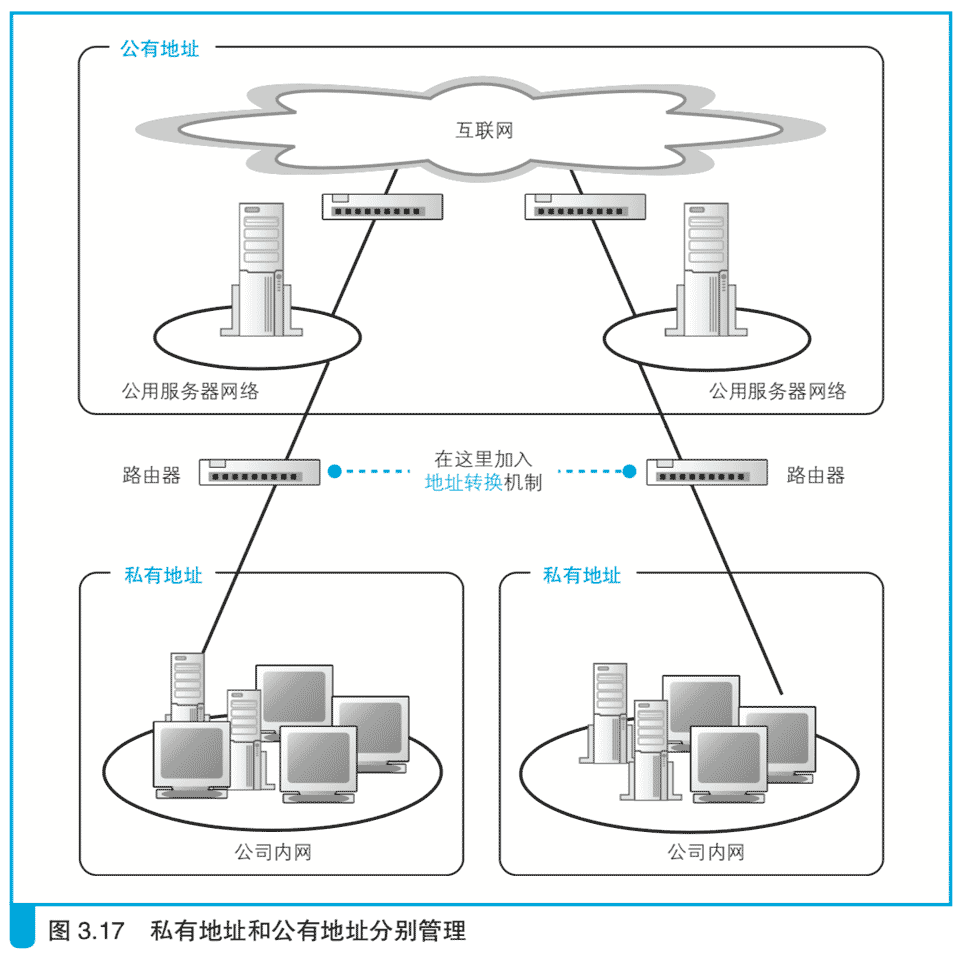
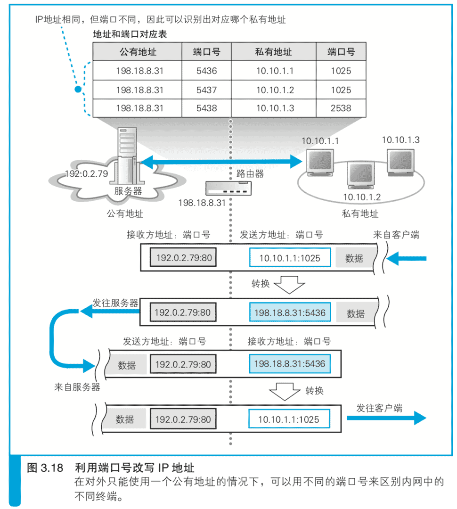

# 3.4 路由器的附加功能

## 3.4.1 通过地址转换有效利用 IP 地址

刚才我们介绍了路由器的基本工作过程，现在的路由器除了这些基本功能之外，还有一些附加功能。
下面来介绍两种最重要的功能——地址转换和包过滤。

首先，我们先了解一下地址转换功能出现的背景。
所谓地址，就是用来识别每一台设备的标志，因此每台设备都应该有一个唯一不重复的地址， 
就好像如果很多人的地址都一样，那么快递员就不知道该把包裹送给谁了。 

网络也是一样，本来互联网中所有的设备都应该有自己的固定地址，而且最早也确实是这样做的。
比如，公司内网需要接入互联网的时候，应该向地址管理机构申请 IP 地址，并将它们分配给公司里的每台设备。
换句话说，那个时候没有内网和外网的区别，所有客户端都是直接连接到互联网的。

尽管互联网原本是这样设计的，但进入 20 世纪 90 年代之后，互联网逐步向公众普及，接入互联网的设备数量也快速增长，如此一来，情况就发生了变化。
如果还用原来的方法接入，过不了多久，可分配的地址就用光了。
如果不能保证每台设备有唯一不重复的地址，就会从根本上影响网络包的传输，这是一个非常严重的问题。
如果任由这样发展下去，不久的将来，一旦固定地址用光，新的设备就无法接入了，互联网也就无法继续发展了。

解决这个问题的关键在于固定地址的分配方式。举个例子，假如有 A、 B 两家公司，它们的内网是完全独立的。
这种情况下，两家公司的内网之间不会有网络包流动，即使 A 公司的某台服务器和 B 公司的某台客户端具有相同的 IP 地址也没关系，因为它们之间不会进行通信。
只要在每家公司自己的范围内，能够明确判断网络包的目的地就可以了，是否和其他公司的内网地址重复无关紧要，只要每个公司的网络是相互独立的，就不会出现问题。

解决地址不足的问题，利用的就是这样的性质，即公司内部设备的地址不一定要和其他公司不重复。
这样一来，公司内部设备就不需要分配固定地址了，从而大幅节省了 IP 地址。
当然，就算是公司内网，也不是可以随便分配地址的，因此需要设置一定的规则，规定某些地址是用于内网的，这些地址叫作私有地址，而原来的固定地址则叫作公有地址（在互联网规格中写作 Globally Unique Address 或者 Public Address）。

私有地址的规则其实并不复杂，在内网中可用作私有地址的范围仅限以下这些。

    10.0.0.0 ~ 10.255.255.255 
    172.16.0.0 ~ 172.31.255.255 
    192.168.0.0 ~ 192.168.255.255

在制定私有地址规则时，这些地址属于公有地址中还没有分配的范围。 
换句话说，私有地址本身并没有什么特别的结构，只不过是将公有地址中没分配的一部分拿出来规定只能在内网使用它们而已。
这个范围中的地址和其他公司重复也没关系，所以对于这些地址不作统一管理，不需要申请，任何人都可以自由使用。
当然，如果在公司内部地址有重复就无法传输网络包了，因此必须避免在内网中出现重复的地址。

尽管这样的确能节省一部分地址，但仅凭这一点还无法完全解决问题。 
公司内网并不是完全独立的，而是需要通过互联网和其他很多公司相连接， 
所以当内网和互联网之间需要传输包的时候，问题就出现了，
因为如果很多地方都出现相同的地址，包就无法正确传输了。

于是，当公司内网和互联网连接的时候，需要采用图 3.17 这样的结构，即将公司内网分成两个部分，一部分是对互联网开放的服务器，另一部分是公司内部设备。其中对互联网开放的部分分配公有地址，可以和互联网直接进行通信，这一部分和之前介绍的内容是一样的。相对地，内网部分则分配私有地址，内网中的设备不能和互联网直接收发网络包，而是通过一种特别的机制进行连接，这个机制就叫地址转换。

## 3.4.2 地址转换的基本原理

地址转换的基本原理是在转发网络包时对 IP 头部中的 IP 地址和（TCP 和 UDP）端口号进行改写。
具体的过程我们来看一个实际的例子，假设现在要访问 Web 服务器，看看包是如何传输的。

首先，TCP 连接操作的第一个包被转发到互联网时，会像图 3.18 这样，将发送方 IP 地址从私有地址改写成公有地址。这里使用的公有地址是地址转换设备的互联网接入端口的地址。与此同时，端口号也需要进行改写，地址转换设备会随机选择一个空闲的端口。然后，改写前的私有地址和端口号，以及改写后的公有地址和端口号，会作为一组相对应的记录保存在地址转换设备内部的一张表中。

（具备地址转换功能的设备不仅有路由器，有些防火墙也有地址转换功能，它的工作方式和路由器是相同的，因此这里我们虽然用了地址转换设备这个词，但在这里的上下文中指的就是路由器。）

改写发送方 IP 地址和端口号之后，包就被发往互联网，最终到达服务器，然后服务器会返回一个包。服务器返回的包的接收包是原始包的发送方，因此返回的包的接收方就是改写后的公有地址和端口号。这个公有地址其实是地址转换设备的地址，因此这个返回包就会到达地址转换设备。

接下来，地址转换设备会从地址对应表中通过公有地址和端口号找到相对应的私有地址和端口号，并改写接收方信息，然后将包发给公司内网， 这样包就能够到达原始的发送方了。

在后面的包收发过程中，地址转换设备需要根据对应表查找私有地址和公有地址的对应关系，再改写地址和端口号之后进行转发。当数据收发结束，进入断开阶段，访问互联网的操作全部完成后，对应表中的记录就会被删除。

通过这样的机制，具有私有地址的设备就也可以访问互联网了。从互联网一端来看，实际的通信对象是地址转换设备(这里指的是路由器)。

上面是以公司内网为例来进行介绍的，家庭网络中的工作过程也是完全相同的，只是规模不同而已。

## 3.4.3 改写端口号的原因

现在我们使用的地址转换机制是同时改写地址和端口号的，但早期的地址转换机制是只改写地址，不改写端口号的。
用这种方法也可以让公司内网和互联网进行通信，而且这种方法更简单。

但是，使用这种方法的前提是私有地址和公有地址必须一一对应，也就是说，有多少台设备要上互联网，就需要多少个公有地址。当然，访问动作结束后可以删除对应表中的记录，这时同一个公有地址可以分配给其他设备使用，因此只要让公有地址的数量等于同时访问互联网的设备数量就可以了。然而公司人数一多，同时访问互联网的人数也会增加。一个几千人的公司里，有几百人同时访问互联网是很正常的，这样就需要几百个公有地址。

改写端口号正是为了解决这个问题。客户端一方的端口号本来就是从空闲端口中随机选择的，因此改写了也不会有问题。端口号是一个 16 比特 的数值，总共可以分配出几万个端口，因此如果用公有地址加上端口的组合对应一个私有地址，一个公有地址就可以对应几万个私有地址，这种方法提高了公有地址的利用率。

（16 比特可以表示 65536 个端口号，但并不是所有这些端口都可以用于地址转换。）