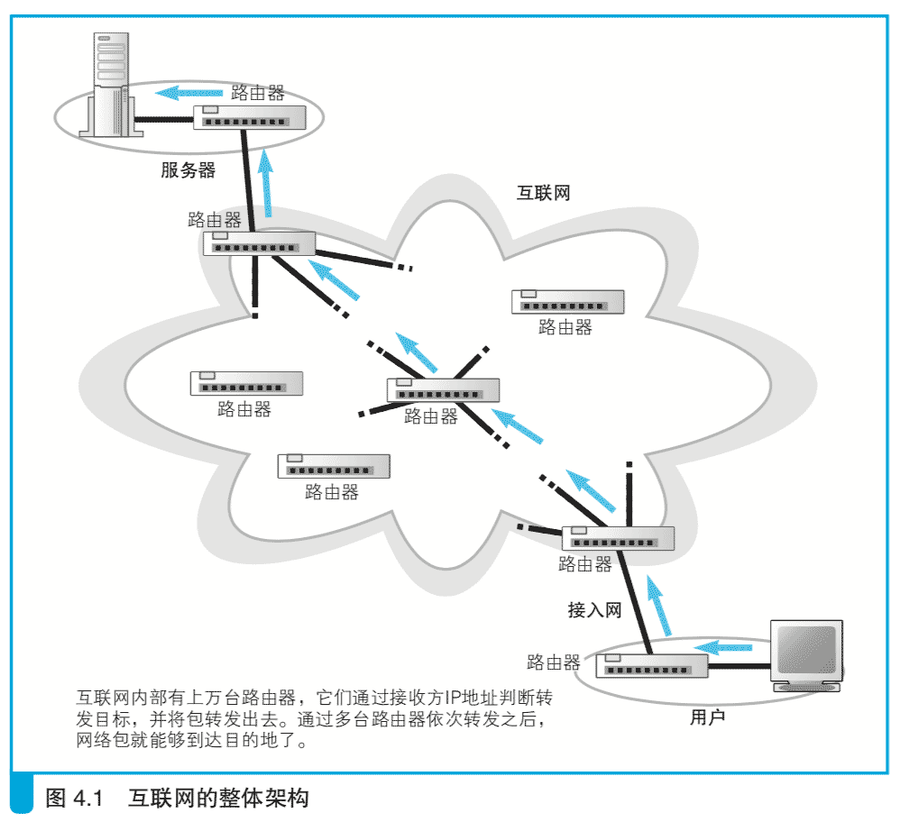

# 4.1  ADSL 接入网的结构和工作方式

## 4.1.1 互联网的基本结构和家庭、公司网络是相同的

互联网是一个遍布世界的巨大而复杂的系统，但其基本工作方式却出奇地简单。和家庭、公司网络一样，互联网也是通过路由器来转发包的，而且路由器的基本结构和工作方式也并没有什么不同(图 4.1)。因此，我们可以将互联网理解为家庭、公司网络的一个放大版。

当然，互联网也有一些和家庭、公司网络不同的地方，其中之一就是与转发设备间的距离。在家庭、公司网络中，与转发设备之间的距离不过几十米到几百米，在这种情况下，只要延长以太网线就可以到达相邻的转发设备了（双绞线的极限距离是 100 米，但光纤的连接距离可以长达几公里。）。

然而，互联网可不能这么搞，因为你家到最近的电话局至少也有几公里的距离，而从日本连接到美国甚至要跨越太平洋，用以太网线是无法实现这种连接的。

除了距离之外，路由器在如何控制包的转发目标上也不一样。尽管从基本原理来看，互联网也是根据路由表中的记录来判断转发目标的，但路由表记录的维护方式不同。

互联网中的路由器上有超过 10 万条路由记录，而且这些记录还在不断变化，当出现线路故障时，或者新的公司加入互联网时，都会引发路由的变化。人工维护这些路由信息是不现实的，必须实现自动化。公司的路由器也有自动维护路由表的机制，但出于各种原因，互联网中采用的机制和公司有所区别。

距离的不同和路由的维护方式，就是互联网与家庭、公司网络之间最主要的两个不同点。

## 4.1.2 连接用户与互联网的接入网

上一章已经讲过，网络包通过交换机和路由器的转发一步一步地接近它的目的地，在通过互联网接入路由器之后，就进入了互联网。本章的探索之旅就从这里开始。

刚才讲过，路由器的转发操作都是相同的，因此互联网接入路由器的包转发操作也和第 3 章讲过的以太网路由器几乎是一样的。

简单来说，就是根据包 IP 头部中的接收方 IP 地址在路由表的目标地址中进行匹配，找到相应的路由记录后将包转发到这条路由的目标网关。

不过，互联网接入路由器发送网络包的操作和以太网路由器有一点不同，互联网接入路由器是按照接入网规则来发送包的。

所谓接入网，就是指连接互联网与家庭、公司网络的通信线路。一般家用的接入网方式包括 ADSL、FTTH、CATV、电话线、ISDN 等，公司则还可能使用专线。接入网的线路有很多种类，我们无法探索所有这些线路，因此下面先介绍一个比较有代表性的例子——ADSL。

（接入网这个词表示的是通信线路的用法，而并不表示通信线路的结构。例如公司里使用的专线，当它用来连接互联网时就叫作接入网，而用来连接总公司和分公司时就不叫接入网。此外，接入网这个词也不仅限于互联网，当使用运营商提供的通信服务时，一般都会将用户与运营商之间的线路叫作接入网。）

（ADSL:Asymmetric Digital Subscriber Line，不对称数字用户线。它是一种利用架设在电线杆上的金属电话线来进行高速通信的技术，它的上行方向(用户到互联网)和下行方向(互联网到用户)的通信速率是不对称的。）

（FTTH:Fiber To The Home，光纤到户。指的是将光纤接入家庭的意思。）