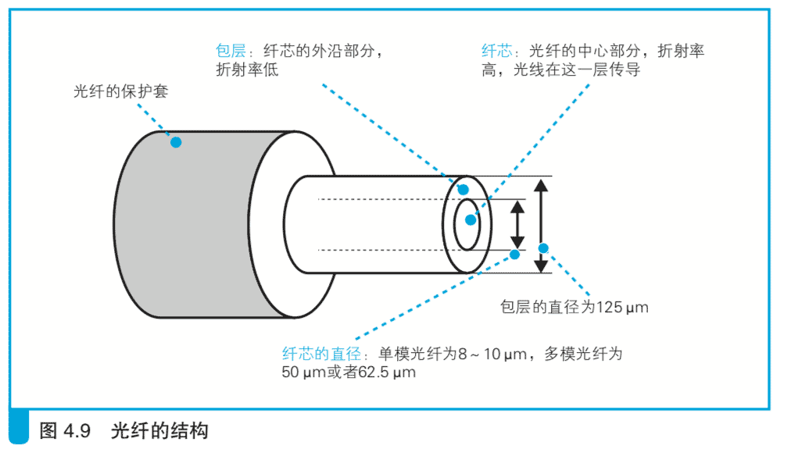

# 4.2  光纤接入网(FTTH)

## 4.2.1 光纤的基本知识

通过 ADSL 接入网和 BAS 之后，网络包就到达了互联网内部，在继续探索之前，我们再来介绍另一种接入网技术，它的名字叫 FTTH，是一种基于光纤的接入网技术。FTTH 的关键点在于对光纤的使用，所以我们先来介绍一些光纤的基本知识。

光纤的结构如图 4.9 所示，它是由一种双层结构的纤维状透明材质(玻璃和塑料)构成的，通过在里面的纤芯中传导光信号来传输数字信息(图 4.10)。ADSL 信号是由多个频段的信号组成的，比较复杂，但光信号却非常简单，亮表示 1，暗表示 0。

不过，数字信息并不能一下子变成光信号，而是需要像图 4.10 所示的 这样，先将数字信息转换成电信号，然后再将电信号转换成光信号。这里的电信号非常简单，1 用高电压表示，0 用低电压表示。将这样的电信号输入 LED、激光二极管等光源后，这些光源就会根据信号电压的变化发光， 高电压发光亮，低电压发光暗。这样的光信号在光纤中传导之后，就可以通过光纤到达接收端。接收端有可以感应光线的光敏元件，光敏元件可以根据光的亮度产生不同的电压。当光信号照射到上面时，光亮的时候就产生高电压，光暗的时候就产生低电压，这样就将光信号转换成了电信号。最后再将电信号转换成数字信息，我们就接收到数据了。

这就是光纤的通信原理。