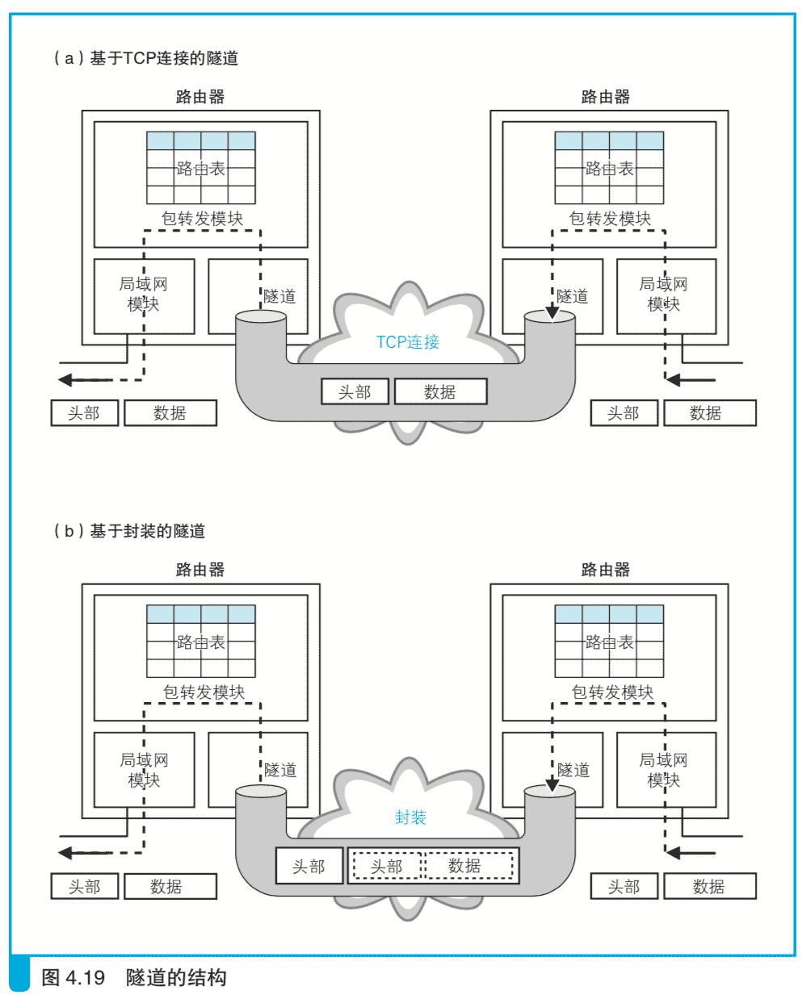
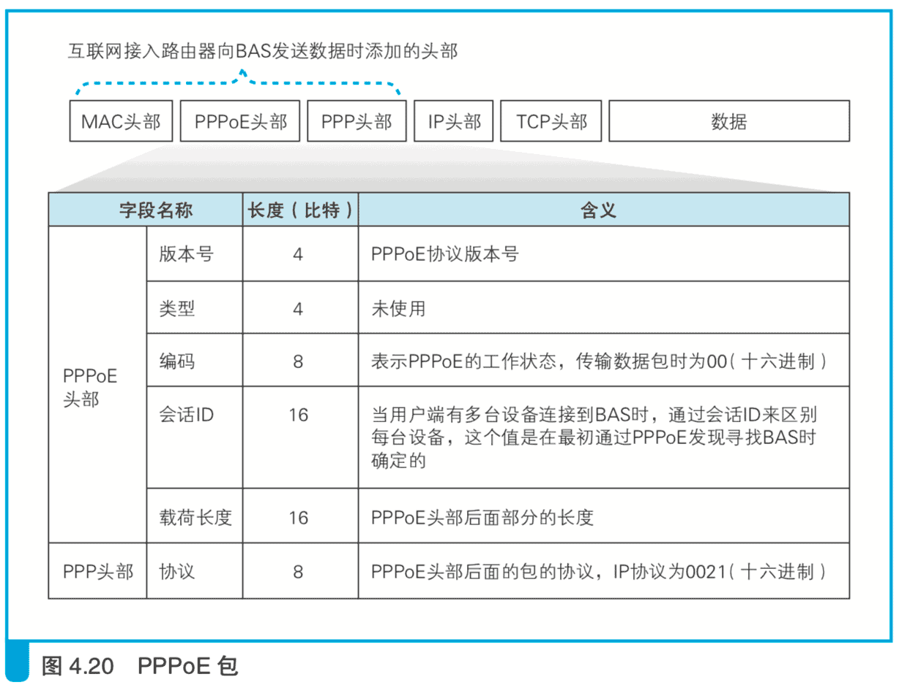

# 4.3 接入网中使用的 PPP 和隧道

## 4.3.1 用户认证和配置下发

刚才已经简单讲过，用户发送的网络包会通过 ADSL 和 FTTH 等接入 网到达运营商的 BAS。

互联网本来就是由很多台路由器相互连接组成的，因此原则上应该是 将接入网连接到路由器上。随着接入网发展到 ADSL 和 FTTH，接入网连接的路由器也跟着演进，而这种进化型的路由器就叫作 BAS。下面我们来具体讲一讲。

首先是用户认证和配置下发功能。ADSL 和 FTTH 接入网中，都需要先输入用户名和密码（这里指的就是和运营商签约时由运营商分配给用户的上网用户名和密码），登录之后才能访问互联网，而 BAS 就是登录操作的窗口。BAS 使用 PPPoE 方式来实现这个功能。PPPoE 是由传统电话拨号上网上使用的 PPP 协议发展而来的，所以我们先来看一看 PPP 拨号上网的工作方式。

（PPPoE:Point-to-Point Protocol over Ethernet，以太网的点对点协议。）

在使用电话线或者 ISDN 拨号上网时，PPP 是如图 4.17 这样工作的。首先，用户向运营商的接入点拨打电话(图 4.17 1 -1)，电话接通后(图 4.17 1 -2) 输入用户名和密码进行登录操作(图 4.17 2 -2)。用户名和密码通过 RADIUS 协议从 RAS 发送到认证服务器，认证服务器校验这些信息是否正确。当确认无误后，认证服务器会返回 IP 地址等配置信息，并将这些信息下发给用户 (图 4.17 2 -3)。用户的计算机根据这些信息配置 IP 地址等参数，完成 TCP/IP 收发网络包的准备工作，接下来就可以发送 TCP/IP 包了(图 4.17 3)。

这个过程的重点在于图 4.17 2 -3 下发 TCP/IP 配置信息的步骤。在接入互联网时，必须为计算机分配一个公有地址，但这个地址并不是事先确定的。因为在拨号连接时，可以根据电话号码来改变接入点，而不同的接入点具有不同的 IP 地址，因此无法事先在计算机上设置这个地址。所以，在连接时运营商会向计算机下发 TCP/IP 配置信息，其中就包括为计算机分配的公有地址。

## 4.3.2 在以太网上传输 PPP 消息

ADSL 和 FTTH 接入方式也需要为计算机分配公有地址才能上网，这一点和拨号上网是相同的。不过，ADSL 和 FTTH 中，用户和 BAS 之间是通过电缆或光纤固定连接在一起的，因此没有必要验证用户身份，所以实际上并不需要 PPP 的所有这些功能。然而，通过用户名和密码登录的步骤可以根据用户名来切换不同的运营商，这很方便。因此，接入运营商在 ADSL 和 FTTH 中一般也会使用 PPP。

（通过输入用户名和密码，可以掌握是谁在访问互联网，从网络管理的角度 来看，这对于运营商来说也是很方便的。）

（也有一些运营商不使用 PPP，而是使用 DHCP 方式来向客户端下发 IP 地址等配置信息。）

不过，拨号上网的 PPP 是无法直接用于 ADSL 和 FTTH 的，要理解这里的原因，我们先来看看 PPP 协议是如何传输消息的。

传输 PPP 消息的思路和将 IP 包装入以太网包中传输是一样的。PPP 协议中没有定义以太网中的报头和 FCS 等元素，也没有定义信号的格式，因此无法直接将 PPP 消息转换成信号来发送。要传输 PPP 消息，必须有另一个包含报头、FCS、信号格式等元素的“容器”，然后将 PPP 消息装在这个容器里才行。于是，在拨号接入中 PPP 借用了 HDLC 协议作为容器，而 HDLC 协议原本是为在专线中传输网络包而设计的，拨号接入方式对这一规格进行了一些修正。最终，PPP 消息就是像图 4.18(a)这样来进行传输的。

（HDLC:High-level Data Link Control，高级数据联接控制。）

对于 ADSL 和 FTTH，如果可以和前面一样借用 HDLC 来作为容器， PPP 协议就可以直接使用了。但是，ADSL 和 FTTH 并不能使用 HDLC，因此需要寻找另一个机制作为替代。于是，如图 4.18(b)3和图 4.18(c) 3所示，我们用以太网包代替 HDLC 来装载 PPP 协议。此外，以太网和 PPP 在设计上有所不同，为了弥补这些问题就重新设计了一个新的规格，这就是 PPPoE。

于是，ADSL 和 FTTH 也可以像拨号上网一样传输 PPP 消息了。图 4.18 只展示了图 4.17 2 -2 部分，其他部分也是一样的。总之，只要将 PPP 消息装入以太网包中进行传输，ADSL 和 FTTH 就也可以像拨号上网一样通信了。

    PPPoE 是将 PPP 消息装入以太网包进行传输的方式。

## 4.3.3 通过隧道将网络包发送给运营商

BAS 除了作为用户认证的窗口之外，还可以使用隧道方式来传输网络包。所谓隧道，就类似于套接字之间建立的 TCP 连接。在 TCP 连接中， 我们从一侧的出口(套接字)放入数据，数据就会原封不动地从另一个出口出来，隧道也是如此。也就是说，我们将包含头部在内的整个包从隧道的一头扔进去，这个包就会原封不动地从隧道的另一头出来，就好像在网络中挖了一条地道，网络包从这个地道里穿过去一样。

像这样，如果在 BAS 和运营商路由器之间的 ADSL/FTTH 接入服务商的网络中建立一条隧道，将用户到 BAS 的接入网连接起来，就形成了一条从用户一直到运营商路由器的通道，网络包通过这条通道，就可以进入互联网内部了，这样的机制就类似于将接入网一直延伸到运营商路由器。

隧道有几种实现方式，刚才提到的 TCP 连接就是其中一种实现方式 (图 4.19(a)。这种方式中，首先需要在网络上的两台隧道路由器(只要具备隧道功能，是不是路由器无所谓，有时也会使用服务器来建立隧道)之间建立 TCP 连接，然后将连接两端的套接字当作是路由器的端口，并从这个端口来收发数据。换句话说，在路由器收发包时，是基于隧道的规则向隧道中放入或取出网络包，这时，TCP 连接就好像变成了一根网线，包从这里穿过到达另一端。

图 4.19(b)中还介绍了另一种基于封装(encapsulation)的隧道实现方式，这种方式是将包含头部在内的整个包装入另一个包中传输到隧道的另一端。在这种方式中，包本身可以原封不动地到达另一端的出口，从结果上看和基于 TCP 连接的方式是一样的，都实现了一个可供包进行穿梭的通道。

通过前面的介绍大家可以发现，无论任何机制，只要能够将包原封不动搬运到另一端，从原理上看就都可以用来建立隧道。

## 4.3.4 接入网的整体工作过程

理解了 PPPoE 和隧道的原理之后，下面来看看接入网的整体工作过程。接入网的工作从用户端的互联网接入路由器进行连接操作开始。首先，接入路由器中需要配置运营商分配的用户名和密码。然后，接入路由器会根据 PPPoE 的发现机制来寻找 BAS。这一机制和 ARP 一样是基于广播来实现的，过程如下，很简单。

（如果不使用路由器而是从计算机直接上网的情况下，需要在计算机中配置用户名和密码，这时计算机会代替路由器完成 PPPoE 操作，实际上这才是最初的原始方式。）

用户询问:“BAS 在不在?在的话请报告 MAC 地址。”

BAS 回答:“我在这里，我的 MAC 地址是 xx:xx:xx:xx:xx:xx。”

这样用户端就知道了 BAS 的 MAC 地址，也就可以和 BAS 进行通信了。大家可以认为前面这个过程相当于拨号上网中拨通电话的动作(图 4.17 1 -1 和1 -2)。

    互联网接入路由器通过 PPPoE 的发现机制查询 BAS 的 MAC 地址。

接下来，如图 4.17 2 -1 到2 -4 中所示，进入用户认证和下发配置的阶段。这里的工作过程有点复杂，我们只说重点。第一个重点是用户名和密码如何发送给 BAS。这里有两种方式，一种是将密码进行加密的 CHAP 方式，另一种是不加密的 PAP 方式，在互联网接入路由器的设置画面中可以选择。进行加密的 CHAP 方式显然安全性更高，一般也推荐使用这种方式，但也并不是说使用不加密的 PAP 方式密码就立刻会被窃取。 由于明文密码只在 BAS 和用户端路由器之间传输，所以如果要窃取密码，要么在路由器和ADSL Modem 中间进行窃听，要么爬到电线杆上安装窃听装置拾取电缆中泄漏的电磁波。不过，光纤是不会泄漏电磁波的，因此无 法通过第二种方式进行窃听。

（CHAP:Challenge Handshake Authentication Protocol，挑战握手认证协议。）

（PAP:Password Authentication Protocol，密码验证协议。）

（从 BAS 向认证服务器发送密码时使用 RADIUS 协议，无论用户拨入使用CHAP 还是 PAP，RADIUS 都是加密的。）

第二个重点是，在校验密码之后 BAS 如何向用户下发 TCP/IP 配置信息。这里下发的配置信息包括分配给上网设备的 IP 地址 、DNS 服务器的 IP 地址以及默认网关的 IP 地址。当使用路由器连接互联网时，路由器会根据这些信息配置自身的参数。这样一来，路由器的 BAS 端的端口就有了公有地址，路由表中也配置好了默认网关，接下来就可以将包转发到互联网中了。

    BAS 下发的 TCP/IP 参数会被配置到互联网接入路由器的 BAS 端的端口上，这样路由器就完成接入互联网的准备了。

接下来，客户端就会开始发送用来访问互联网的网络包，比如有人在浏览器里输入了一个网址，这时网络包就开始发送了。这些包的目的地是互联网中的某个地方，这个地方或许在互联网接入路由器的路由表里是找不到的。这时，路由器会选择默认路由，并将这个包转发给默认路由的网关地址，也就是 BAS 下发的默认路由。这里的操作过程和第 3 章介绍的路由器转发包的过程相同，只不过在通过路由表判断转发目标之后，包不是按照以太网规则转发，而是按照 PPPoE 规则转发，具体的过程如下。首先，如图 4.20，要发送的包会被加上头部信息，并设置相应的字段。第一个 MAC 头部中，接收方 MAC 地址填写通过 PPPoE 发现机制查询到的 BAS 的 MAC 地址，发送方 MAC 地址填写互联网接入路由器的 BAS 端的端口的 MAC 地址，然后以太类型填写代表 PPPoE 的 8864(十六进制)。接下来是 PPPoE 头部和 PPP 头部，它们包含的字段如图 4.20 所示，其中除了载荷长度之外，其他的值都是可以事先确定的，载荷长度就是需要传输的包的长度。再往后的部分就是包含 IP 头部在内的原始网络包。可以说，这里的转发操作中基本上不需要根据头部中的信息进行判断，只要将事先准备好的头部加上去就可以了。然后，网络包会被转换成信号，从相应的端口发送出去。

接下来，网络包会到达 BAS，而 BAS 会将 MAC 头部和 PPPoE 头部去掉，取出 PPP 头部以及后面的部分，然后通过隧道机制将包发送出去。 最后，PPP 包会沿隧道到达另一端的出口，也就是网络运营商的路由器。

    BAS 在收到用户路由器发送的网络包之后，会去掉 MAC 头部和 PPPoE 头部，然后用隧道机制将包发送给网络运营商的路由器。

## 4.3.5 不分配 IP 地址的无编号端口

前面介绍了 PPPoE 的工作过程，这里面有一个有趣的问题，就是互联网接入路由器在发送包的时候为什么要加上那些头部呢?头部里面的值基本上都是事先定好的，跟路由表里面的默认网关地址根本没什么关系。当采用一对一连接，也就是两台路由器的端口用一根线直接连起来的情况下，一端发送的包肯定会到达另一端，那么这种情况下就没有必要按照路由表查询默认网关来判断转发目标地址了。如果没有必要判断转发地址，那么网关的地址也就没什么用了;如果网关地址没用，那么目标路由器的端口也用不着分配 IP 地址了。上面的性质对于所有一对一连接都是适用的。

（PPPoE 是工作在以太网上的协议，可以通过集线器与路由器和 BAS 连接， 因此从物理层面的连接形态来看并不是一对一的。不过，通过发现机制开始和 BAS 通信后，逻辑层面上就是一对一通信，因此这一性质也是适用的。）

以前，即便是在这样的场景中，还是会为每个端口分配 IP 地址，这是因为有一条规则规定所有的端口都必须具有 IP 地址。然而，当公有地址越来越少时，就提出了一个特例，即一对一连接的端口可以不分配 IP 地址。现在，在这种场景中按惯例都是不为端口分配 IP 地址的，这种方式称为无编号(unnumbered)。这种情况下，BAS 下发配置信息时就不会下发默认网关的 IP 地址。

    一对一连接的端口可以不分配 IP 地址，这种方式称为无编号。

