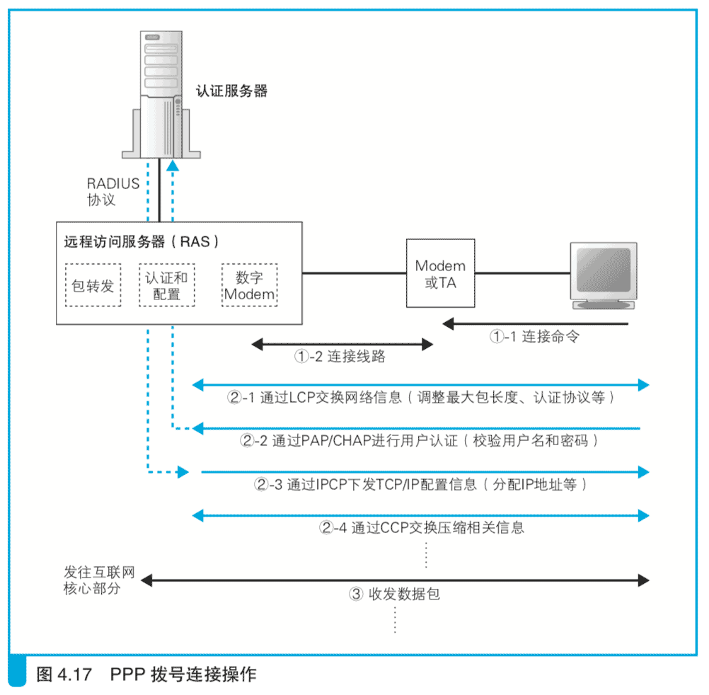

# 4.3 接入网中使用的 PPP 和隧道

## 4.3.1 用户认证和配置下发

刚才已经简单讲过，用户发送的网络包会通过 ADSL 和 FTTH 等接入 网到达运营商的 BAS。

互联网本来就是由很多台路由器相互连接组成的，因此原则上应该是 将接入网连接到路由器上。随着接入网发展到 ADSL 和 FTTH，接入网连接的路由器也跟着演进，而这种进化型的路由器就叫作 BAS。下面我们来具体讲一讲。

首先是用户认证和配置下发功能。ADSL 和 FTTH 接入网中，都需要先输入用户名和密码（这里指的就是和运营商签约时由运营商分配给用户的上网用户名和密码），登录之后才能访问互联网，而 BAS 就是登录操作的窗口。BAS 使用 PPPoE 方式来实现这个功能。PPPoE 是由传统电话拨号上网上使用的 PPP 协议发展而来的，所以我们先来看一看 PPP 拨号上网的工作方式。

（PPPoE:Point-to-Point Protocol over Ethernet，以太网的点对点协议。）

在使用电话线或者 ISDN 拨号上网时，PPP 是如图 4.17 这样工作的。首先，用户向运营商的接入点拨打电话(图 4.17 1 -1)，电话接通后(图 4.17 1 -2) 输入用户名和密码进行登录操作(图 4.17 2 -2)。用户名和密码通过 RADIUS 协议从 RAS 发送到认证服务器，认证服务器校验这些信息是否正确。当确认无误后，认证服务器会返回 IP 地址等配置信息，并将这些信息下发给用户 (图 4.17 2 -3)。用户的计算机根据这些信息配置 IP 地址等参数，完成 TCP/IP 收发网络包的准备工作，接下来就可以发送 TCP/IP 包了(图 4.17 3)。

这个过程的重点在于图 4.17 2 -3 下发 TCP/IP 配置信息的步骤。在接入互联网时，必须为计算机分配一个公有地址，但这个地址并不是事先确定的。因为在拨号连接时，可以根据电话号码来改变接入点，而不同的接入点具有不同的 IP 地址，因此无法事先在计算机上设置这个地址。所以，在连接时运营商会向计算机下发 TCP/IP 配置信息，其中就包括为计算机分配的公有地址。

## 4.3.2 在以太网上传输 PPP 消息

